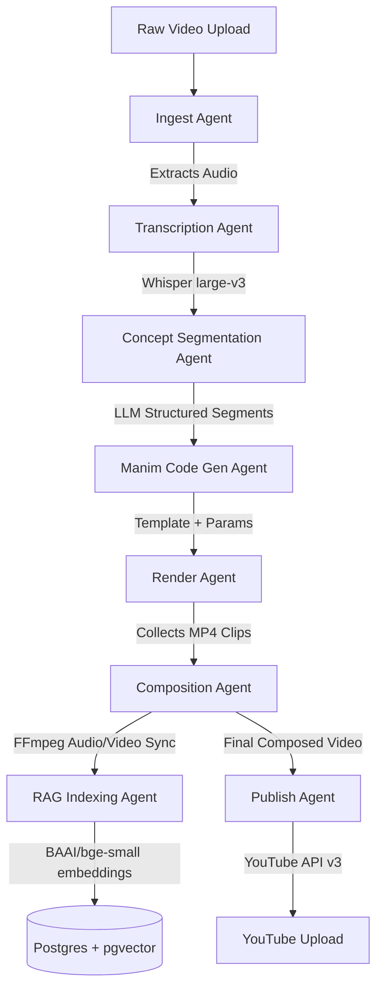

# <p align="center">LectureOS</p>
### <p align="center">Agentic AI Framework for Lecture-to-Animation Transformation</p>

<p align="center">
  
  
  
  
  
  
  
</p>

---

## Overview

LectureOS is an agentic AI SaaS platform designed to automatically transform raw, spoken lecture recordings from professors into high-fidelity, visually rich, 3Blue1Brown-style educational animations. 

By utilizing an advanced pipeline of 8 specialized, autonomous AI agents—covering ingestion, multi-lingual transcription, conceptual segmentation, parameter-based code generation, animation rendering, voice synchronization, RAG indexing, and publishing—the system generates educational videos. The output is complete with synchronized audio, burned subtitles, and matching animated visual elements rendered using Manim.

---

## Demo

Watch the video preview below, or open the [Demo Video file (finalvideo.mp4)](./finalvideo.mp4) directly:

<p align="center">
  <video src="./finalvideo.mp4" width="100%" height="auto" controls autoplay loop muted>
    Your browser does not support the video tag. You can view the video file directly: <a href="./finalvideo.mp4">finalvideo.mp4</a>
  </video>
</p>

---

## Portals and Feature Set

### Professor Dashboard
* **One-Click Video Uploads:** Upload raw lecture footage directly to CDN storage via UploadThing.
* **Real-time Pipeline Tracking:** Monitor the progress of the agentic pipeline using a live Server-Sent Events (SSE) stream.
* **Auto-Publishing:** Connect a YouTube account via OAuth2 for hands-free video deployment complete with auto-generated chapters and SEO tags.
* **Analytics & Management:** Audit history of past runs, retry failed render scenes, and track processing metrics.

### Student Study Hub
* **Concept-Synced Video Player:** Interactive custom-controlled HTML5 media player mapped directly to conceptual chapters.
* **Interactive AI Quizzes:** Dynamically generated multiple-choice tests created by LLMs based on the lecture contents.
* **RAG Study Assistant:** A localized Retrieval-Augmented Generation (RAG) chatbot grounded in the professor's exact words. Provides answers backed by clickable timestamp citations.

---

## System Architecture and Flow

LectureOS is structured as a robust monorepo built for high throughput and long-running GPU/CPU-intensive rendering tasks.

### System Topography
```
                                 +--------------------+
                                 |  Nginx Controller  |
                                 |     (Port 80)      |
                                 +---------+----------+
                                           |
                    +----------------------+----------------------+
                    | (Static & SSR)                              | (API & SSE Requests)
                    v                                             v
        +-----------+-----------+                     +-----------+-----------+
        |  Next.js Frontend     |                     |     FastAPI Server    |
        |  (Port 3000 / Web)    |                     |     (Port 8000 / API) |
        +-----------------------+                     +-----+-----------+-----+
                                                            |           |
                                      +---------------------+           +---------------------+
                                      | (Celery Tasks)                                        |
                                      v                                                       v
                            +---------+---------+                                   +---------+---------+
                            |   Celery Worker   |                                   |  Postgres Database|
                            | (Manim + Whisper) |                                   |    (pgvector)     |
                            +---------+---------+                                   +---------+---------+
                                                      |                                                       ^
                                      +--------------------> [ Redis Cache ] -----------------+
                                                             (Task Broker)
```

### Multi-Agent Orchestration Pipeline


---

## The Multi-Agent Pipeline

Every stage of video generation is managed by an autonomous agent configured with error handling and robust retry logic:

1. **Ingest Agent ([base.py](file:///c:/Users/ahmad/Desktop/agentic-framwork-for-lecture-to-animation/apps/api/agents/base.py)):** Validates raw uploaded video format, extracts the raw audio track using FFmpeg, and prepares the workspace.
2. **Transcription Agent ([transcription_agent.py](file:///c:/Users/ahmad/Desktop/agentic-framwork-for-lecture-to-animation/apps/api/agents/transcription_agent.py)):** Utilizes `faster-whisper` (`large-v3`) with Urdu-English code-switching support (`language=None`) to transcribe multi-lingual academic content, outputting timestamped JSON arrays.
3. **Concept Segmentation Agent ([segmentation_agent.py](file:///c:/Users/ahmad/Desktop/agentic-framwork-for-lecture-to-animation/apps/api/agents/segmentation_agent.py)):** Employs LLMs to segment the transcript into 3-20 conceptual units based on duration, returning JSON structures with start/end timestamps and targeted visual styles.
4. **Manim Code Generation Agent ([codegen_agent.py](file:///c:/Users/ahmad/Desktop/agentic-framwork-for-lecture-to-animation/apps/api/agents/codegen_agent.py)):** Generates Manim Python scripts using specialized templates (graphs, equations, flowcharts, walkthroughs, geometry) and extracts parameters from the transcript via Groq. Features a Planner-Coder-Critic design that falls back to a clean bullet-point list scene on render failures.
5. **Render Agent ([render_agent.py](file:///c:/Users/ahmad/Desktop/agentic-framwork-for-lecture-to-animation/apps/api/agents/render_agent.py)):** Orchestrates the Manim Community rendering engine inside the Celery worker Docker container to export clean conceptual video clips.
6. **Composition Agent ([composition_agent.py](file:///c:/Users/ahmad/Desktop/agentic-framwork-for-lecture-to-animation/apps/api/agents/composition_agent.py)):** Uses FFmpeg to merge clips, synchronize video durations to the spoken lecture narration, build caption cues, and burn synchronized subtitles onto the final video export.
7. **RAG Indexing Agent ([rag_indexing_agent.py](file:///c:/Users/ahmad/Desktop/agentic-framwork-for-lecture-to-animation/apps/api/agents/rag_indexing_agent.py)):** Breaks the transcript down, generates 384-dimensional vector embeddings via `BAAI/bge-small-en-v1.5`, and indexes them in Postgres `pgvector` linked by timestamp metadata.
8. **Publish Agent ([publish_agent.py](file:///c:/Users/ahmad/Desktop/agentic-framwork-for-lecture-to-animation/apps/api/agents/publish_agent.py)):** Authenticates through OAuth2 to upload the final video to YouTube, auto-formatting description text with time-linked chapters and optimized SEO metadata.

---

## Technology Stack

| Layer | Technology | Purpose / Rationale |
|---|---|---|
| **Frontend** | [Next.js 14](https://nextjs.org/) (App Router) | Server-side rendering, SSE streams support, scalable UI architecture. |
| **Styling** | Tailwind CSS + shadcn/ui | Modern, responsive component aesthetics. |
| **Backend** | [FastAPI](https://fastapi.tiangolo.com/) (Python 3.11) | Async-native execution, fast response rates, robust OpenAPI documentation. |
| **Queue** | Celery + Redis | Distributed asynchronous task queue for heavy video processing & rendering jobs. |
| **Database** | PostgreSQL + pgvector | Relational schema combined with semantic vector search in a single engine. |
| **Transcription**| faster-whisper (large-v3) | Fast, local speech-to-text inference with high accuracy for Urdu/English code-switching. |
| **Animations** | Manim Community | Industry-standard math and structural animation rendering. |
| **LLMs** | DeepSeek-V3 / Groq | Code generation and segmentation tasks. |
| **Embeddings** | BAAI/bge-small-en-v1.5 | High quality, low resource local sentence embeddings. |
| **Storage** | UploadThing | Secure, fast client-to-cloud file uploads. |

---

## Repository Structure

```text
├── apps
│   ├── api                 # FastAPI backend server & pipeline orchestrator
│   │   ├── agents          # The 8-agent definitions (Whisper, Manim, RAG, etc.)
│   │   ├── db              # Database schemas, migrations (Alembic), and seeders
│   │   ├── routers         # API endpoints (Auth, Chats, Lectures, SSE, YouTube)
│   │   ├── services        # External service connectors (FFmpeg, LLM, YouTube, UploadThing)
│   │   └── tasks           # Celery task definitions
│   └── web                 # Next.js frontend application (Professor / Student Portals)
│       ├── app             # App router pages (Student hub, Professor dashboard)
│       ├── components      # Shared and role-specific UI components
│       └── store           # Zustand client state managers
├── infra                   # Docker compose and deployment configuration
│   ├── nginx               # Nginx reverse proxy configuration
│   └── scripts             # Development, migration, and health check scripts
├── packages                # Monorepo shared packages
│   └── types               # Shared TypeScript typings
└── docs                    # Comprehensive system design guides and setup files
```

---

## Getting Started

### Prerequisites
* **Git**
* **Docker & Docker Compose** (v2.0 or higher)
* **Node.js 20+** & **pnpm 9+** (if working on local packages/frontend scripts)

> [!WARNING]  
> **Windows Users:** Please execute all `pnpm` and shell script setup commands within a **WSL2 terminal** (Ubuntu/Debian) to ensure script compatibility.

### Quick Installation

1. **Clone the repository:**
   ```bash
   git clone https://github.com/Ahmadhassan30/agentic-framwork-for-lecture-to-animation.git
   cd agentic-framwork-for-lecture-to-animation
   ```

2. **Run the initialization script:**
   This script installs local dependencies, spawns Docker database instances, runs database migrations, and seeds test accounts:
   ```bash
   pnpm setup
   ```

3. **Configure Environment variables:**
   Configure your secrets in the root `.env`, `apps/api/.env`, and `apps/web/.env.local` files:
   ```env
   # Required Keys
   DEEPSEEK_API_KEY="your_api_key"
   UPLOADTHING_TOKEN="your_uploadthing_token"
   JWT_SECRET="your_jwt_secret"
   NEXTAUTH_SECRET="your_nextauth_secret"
   ```

4. **Restart the Stack:**
   ```bash
   docker compose -f infra/docker-compose.yml restart
   ```
   Access http://localhost in your browser to view the application!

### Demo Accounts

Use these pre-seeded accounts to log in:

| Role | Email | Password | Portal Access |
|---|---|---|---|
| **Professor** | `professor@demo.com` | `demo1234` | http://localhost/professor |
| **Student** | `student@demo.com` | `demo1234` | http://localhost/student |

---

## Operational Commands

Manage your application stack using root `pnpm` wrappers:

```bash
# Verify system health
pnpm health

# View overall logs
pnpm logs

# View specific service logs
pnpm logs:api
pnpm logs:worker
pnpm logs:web

# Apply new database migrations
pnpm migrate

# Shutdown the container stack (retaining database volumes)
pnpm stop
```

---

## Troubleshooting

* **Port 80 Conflict (Windows):** Open `services.msc` and stop the "World Wide Web Publishing Service". Alternatively, map Nginx to port `8080:80` inside `infra/docker-compose.yml`.
* **First-Run Whisper Delay:** The `large-v3` transcription model (~3GB) downloads inside the worker container during its first run. You can monitor this progress via `pnpm logs:worker`. For faster local testing, set `WHISPER_MODEL_SIZE=base` in `apps/api/.env`.
* **SSE Dashboards Buffering:** If Server-Sent Events fail to update, verify that Nginx buffering is disabled in your configuration (`proxy_buffering off;`).

---

## License
This project is licensed under the MIT License - see the LICENSE file for details.
