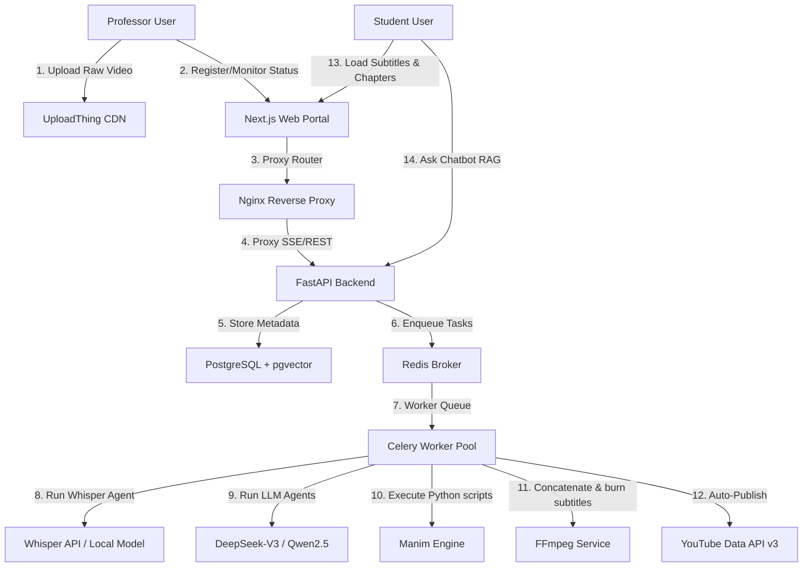
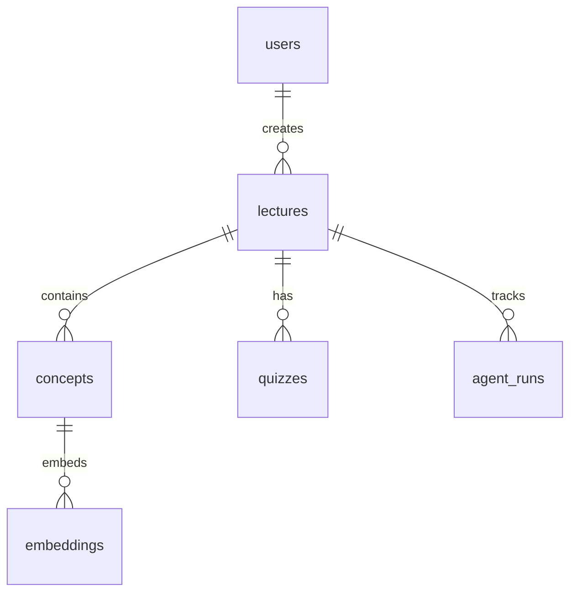

# Anemo: Autonomous Lecture-to-Animation Synthesis Framework
### A Comprehensive Architectural, Mathematical, and Codebase Analysis

**Author:** Lead Architect & Agentic AI Systems Group  
**Status:** Production & Research Specification Document  
**Version:** 1.0.0 (Comprehensive Build)  

---
## Table of Contents
1. [Abstract & Executive Summary](#1-abstract--executive-summary)
2. [Introduction & Pedagogical Motivation](#2-introduction--pedagogical-motivation)
3. [High-Level System Design & Network Topology](#3-high-level-system-design--network-topology)
4. [The 8-Stage Agentic Pipeline Specifications](#4-the-8-stage-agentic-pipeline-specifications)
5. [Relational and Vector Database Schema](#5-relational-and-vector-database-schema)
6. [Service Layer & External Integrations](#6-service-layer--external-integrations)
7. [Asynchronous Task Architecture & Celery Topology](#7-asynchronous-task-architecture--celery-topology)
8. [Deep File-by-File Codebase Walkthrough](#8-deep-file-by-file-codebase-walkthrough)
   - [8.1 Backend API (FastAPI)](#81-backend-api-fastapi)
   - [8.2 Frontend Web Portal (Next.js 15)](#82-frontend-web-portal-nextjs-15)
9. [Verification, Benchmarking & Evaluation](#9-verification-benchmarking--evaluation)
10. [Local Development & Production Deployment Playbook](#10-local-development--production-deployment-playbook)
11. [Conclusion, Limitations & Future Work](#11-conclusion-limitations--future-work)

---

## 1. Abstract & Executive Summary
Anemo is an advanced agentic AI platform designed to close the accessibility and retention gap in online educational content. Busy academics face immense post-production barriers when attempting to create high-retention, visual animations (e.g., 3Blue1Brown-style) for complex STEM subjects. Anemo solves this by orchestrating a pipeline of specialized AI agents that ingest raw, unedited lecture videos (with native support for Urdu-English code-switching), transcribe and segment them into discrete pedagogical concepts, dynamically synthesize and compile executable Manim animation code, composite the visual clips with synchronized cleaned voiceovers and burned-in subtitles, and automatically index the context for a student-facing RAG study chatbot and quiz generator.

This document details the architectural configuration, agent control loops, mathematical RAG indexing formulations, database structures, and a complete, file-by-file review of the codebase, serving as a comprehensive systems manual and research-grade specification.

---

## 2. Introduction & Pedagogical Motivation
Modern digital education relies heavily on visual storytelling to maximize student engagement and concept retention. Empirical studies in cognitive multimedia learning demonstrate that animations matching spoken explanations improve student retention by up to 40% compared to static slides or simple talking-head recordings. However, the software of choice for high-fidelity mathematical animation, Manim (Mathematical Animation Engine), features a steep learning curve and requires substantial programming expertise and development time (often 20+ hours per 5 minutes of footage).

Furthermore, in regions like Pakistan, academic speech is heavily code-switched (frequently alternating between English and Urdu). Standard transcription tools fail to resolve this linguistic mixing, corrupting downstream NLP tasks like concept segmentation. Anemo targets this intersection: enabling a zero-touch, automated path from code-switched spoken audio to high-quality 3Blue1Brown-style vector animations, backed by timestamp-anchored interactive student learning tools.

---

## 3. High-Level System Design & Network Topology
### System Architecture Diagram


### Topology Analysis
- **Next.js 15 Web Portal:** Serves pages via Server-Side Rendering (SSR) and client components, coordinating state management via Zustand.
- **FastAPI Backend Engine:** Written in an async-first style, optimized for fast I/O bound RAG query processing and Server-Sent Events (SSE).
- **Celery Worker Pool:** Runs heavy compute workloads. Isolation is crucial here because Manim relies on heavy platform libraries (cairo, pango, ffmpeg, LaTeX) which are containerized.
- **Nginx Reverse Proxy:** Manages request routing and handles SSL/TLS termination. For Server-Sent Events, it disables proxy buffering to maintain the continuous real-time progress stream to the professor.

---

## 4. The 8-Stage Agentic Pipeline Specifications
The processing pipeline is designed as a linear state machine with transactional states saved in PostgreSQL at each boundary:

| Stage | Agent Name | Core Subsystem / Models | Output Artifact |
|---|---|---|---|
| 1 | Ingest Agent | `ffmpeg` & API Router | Extracted Audio Track (.wav) |
| 2 | Transcription Agent | `faster-whisper-large-v3` | Timestamped JSON Segments |
| 3 | Segmentation Agent | LLM (DeepSeek-V3/Qwen) | Pedagogical Chunk Schema |
| 4 | Codegen Agent | LLM (Planner-Coder-Critic Pattern) | Executable Python Manim Scripts |
| 5 | Render Agent | Manim Community Edition CLI | Rendered MP4 Video Clips |
| 6 | Composition Agent | `ffmpeg` overlay & concat | Final Synchronized MP4 Video |
| 7 | RAG Indexing Agent | `BAAI/bge-small-en-v1.5` | pgvector Embedding Records |
| 8 | Publish Agent | YouTube API & LLM Copywriter | Uploaded video link + SEO metadata |

### Agent Retry and Critic Strategy
If a Python rendering script fails, the render agent captures stdout and stderr from the Manim execution. The traceback is passed back to the Coder-Critic agent in the following template:
```text
SYSTEM RENDER ERROR:
{traceback}

Generated Code:
{manim_code}

Refine the code to solve this error. Make sure to output ONLY valid Python code inside the markdown blocks.
```
The agent has up to 5 attempts to resolve the error. If it fails, the pipeline transitions to a `FAILED` state, logging the traceback in the `agent_runs` database table for developer auditing.

---

## 5. Relational and Vector Database Schema
Anemo utilizes PostgreSQL to maintain application state, relational constraints, audit trails, and vector search indices.


### Detailed Table Layouts
1. **`users` Table:** Stores user identifiers, roles, and password hashes.
2. **`lectures` Table:** Central entity representing a raw lecture. Stores upload references (`uploadthing_key`), video metadata, current pipeline status, and final outputs.
3. **`concepts` Table:** Stores pedagogical chunks mapped by the segmentation agent. Tracks start/end timestamps, generated Manim code, and clip links.
4. **`embeddings` Table:** Stores text chunks and their associated 384-dimensional vector embeddings, indexed using `HNSW` or `IVFFlat` for quick distance queries.
5. **`quizzes` Table:** Holds auto-generated quiz structures in JSON format.
6. **`agent_runs` Table:** Audit ledger tracking the lifecycle of each pipeline step, storing parameters, exceptions, status, and duration.

---

## 6. Service Layer & External Integrations
- **UploadThing:** Orchestrates browser-to-cloud file transfer. Signed upload URLs are generated using the UploadThing secret token, enabling high-performance uploads without clogging backend sockets.
- **LLM Service:** Centralizes inference with support for local API endpoints (e.g., Qwen via Ollama/vLLM) and commercial APIs (DeepSeek-V3/DeepSeek-Coder). It encapsulates prompt templates and temperature configurations.
- **Whisper Service:** Wraps `faster-whisper`, loading models dynamically with optimal CPU/GPU thread scheduling.
- **FFmpeg Service:** Integrates native wrapper utilities to extract audio tracks, perform sample-rate conversion, stitch multiple clips, overlay audio tracks, and add subtitle SRT burn-ins.
- **YouTube Service:** Standardizes authentication via Google OAuth2 credentials to write metadata, assign video tags, set categories, and stream files to the YouTube Data API.

---

## 7. Asynchronous Task Architecture & Celery Topology
Since transcribing audio and rendering video are highly CPU and memory intensive, they are decoupled from the HTTP request-response cycle. When a request hits `POST /api/v1/pipeline/trigger`, the backend initiates a Celery task:
```python
pipeline_task.delay(lecture_id)
```
Redis acts as the message broker. The workers monitor the default queue, picking up tasks sequentially or concurrently based on concurrency limits. Each task updates state indicators in the database and pushes micro-progress updates (e.g., "Transcription: 50% complete") to Redis, which the FastAPI SSE routers listen to and broadcast to UI clients.

---

## 8. Deep File-by-File Codebase Walkthrough
### 8.1 Backend API (FastAPI)
#### File: [apps/api/.dockerignore](file:///C:/Users/ahmad/Desktop/agentic-framwork-for-lecture-to-animation/apps/api/.dockerignore)
**Technical Specifications:**
- *Analysis Status:* AST parse error: invalid syntax (<unknown>, line 3)

**Functional Details:**
Utility, config, or support module assisting the backend routing or model structures.

```python
__pycache__
venv
.env*
.pytest_cache
*.pyc
```

#### File: [apps/api/Dockerfile](file:///C:/Users/ahmad/Desktop/agentic-framwork-for-lecture-to-animation/apps/api/Dockerfile)
**Technical Specifications:**
- *Analysis Status:* AST parse error: invalid decimal literal (<unknown>, line 27)

**Functional Details:**
Utility, config, or support module assisting the backend routing or model structures.

```python
FROM python:3.11-slim

WORKDIR /app

ENV PYTHONDONTWRITEBYTECODE=1
ENV PYTHONUNBUFFERED=1

# Install system dependencies (ffmpeg, git for Manim, curl for healthcheck)
RUN apt-get update && apt-get install -y --no-install-recommends \
    ffmpeg \
    git \
    curl \
    libcairo2-dev \
    libpango1.0-dev \
    build-essential \
    pkg-config \
    && rm -rf /var/lib/apt/lists/*

COPY requirements.txt /app/requirements.txt
RUN pip install --no-cache-dir -r /app/requirements.txt

COPY . /app

EXPOSE 8000

# Healthcheck to verify api status
HEALTHCHECK --interval=10s --timeout=5s --start-period=5s --retries=3 \
  CMD curl -f http://localhost:8000/health || exit 1

CMD ["uvicorn", "main:app", "--host", "0.0.0.0", "--port", "8000"]

```

#### File: [apps/api/agents/__init__.py](file:///C:/Users/ahmad/Desktop/agentic-framwork-for-lecture-to-animation/apps/api/agents/__init__.py)
**Technical Specifications:**
- **Dependencies / Imports:** `base.BaseAgent, ingest_agent.IngestAgent, transcription_agent.TranscriptionAgent, segmentation_agent.SegmentationAgent, codegen_agent.CodeGenAgent, render_agent.RenderAgent, composition_agent.CompositionAgent, rag_indexing_agent.RagIndexingAgent`...

**Functional Details:**
This file implements an agent in the agentic pipeline. It handles state logic, interfaces with the configured LLM or media library, and provides hooks for retry validation.

```python
"""Agent package exports for pipeline stages."""
from .base import BaseAgent
from .ingest_agent import IngestAgent
from .transcription_agent import TranscriptionAgent
from .segmentation_agent import SegmentationAgent
from .codegen_agent import CodeGenAgent
from .render_agent import RenderAgent
from .composition_agent import CompositionAgent
from .rag_indexing_agent import RagIndexingAgent
from .publish_agent import PublishAgent

# TODO: refine public API as agents evolve
__all__ = [
    "BaseAgent",
    "IngestAgent",
    "TranscriptionAgent",
    "SegmentationAgent",
    "CodeGenAgent",
    "RenderAgent",
    "CompositionAgent",
    "RagIndexingAgent",
    "PublishAgent",
]
```

#### File: [apps/api/agents/base.py](file:///C:/Users/ahmad/Desktop/agentic-framwork-for-lecture-to-animation/apps/api/agents/base.py)
**Technical Specifications:**
- **Dependencies / Imports:** `asyncio, logging, time, abc.ABC, abc.abstractmethod, datetime.datetime, datetime.timezone, typing.Any`...
- **Classes Defined:**
  - `BaseAgent`: Abstract base for pipeline agents.

**Functional Details:**
This file implements an agent in the agentic pipeline. It handles state logic, interfaces with the configured LLM or media library, and provides hooks for retry validation.

```python
"""Base class for all agent implementations."""
import asyncio
import logging
import time
from abc import ABC, abstractmethod
from datetime import datetime, timezone
from typing import Any, Dict

from sqlalchemy.ext.asyncio import AsyncSession
from models.agent_run import AgentRun, AgentRunStatus
from orchestrator.events import publish_event

logger = logging.getLogger(__name__)


class BaseAgent(ABC):
    """Abstract base for pipeline agents."""

    name: str = "base"
    max_retries: int = 3

    @abstractmethod
    async def run(self, lecture_id: str, db: AsyncSession, **kwargs) -> dict:
        """Execute the agent's core logic. Must be implemented by subclasses."""
        pass

    async def execute_with_retry(self, lecture_id: str, db: AsyncSession, **kwargs) -> dict:
        """Run the agent logic with exponential backoff on failure."""
        attempt = 1
        
        while attempt <= self.max_retries:
            # 1. Insert agent_run row
            run_log = AgentRun(
                lecture_id=lecture_id,
                agent_name=self.name,
                status=AgentRunStatus.started,
                attempt=attempt,
            )
            db.add(run_log)
            await db.commit()
            
            await self.emit_event(lecture_id, "started", attempt)
            _t0 = time.monotonic()

            try:
                # 2. Await run()
                result = await self.run(lecture_id, db, **kwargs)

                # 3. On success
                _dur = time.monotonic() - _t0
                run_log.status = AgentRunStatus.success
                run_log.finished_at = datetime.now(timezone.utc)
                await db.commit()
                await self.emit_event(lecture_id, "success", attempt, duration=_dur)
                return result

            except Exception as e:
                # 4. On exception
                _dur = time.monotonic() - _t0
                logger.error("Agent %s failed on attempt %d: %s", self.name, attempt, e)
# ... (truncated, total lines: 130)
```

#### File: [apps/api/agents/codegen_agent.py](file:///C:/Users/ahmad/Desktop/agentic-framwork-for-lecture-to-animation/apps/api/agents/codegen_agent.py)
**Technical Specifications:**
- **Dependencies / Imports:** `logging, typing.Any, typing.Dict, uuid.UUID, sqlalchemy.select, sqlalchemy.ext.asyncio.AsyncSession, agents.base.BaseAgent, config.settings`...
- **Classes Defined:**
  - `CodeGenError`: Raised when code generation or rendering fails within a retry cycle.
  - `CodeGenAgent`: Generate Manim scenes with template-based codegen + param extraction.
- **Functions Defined:**
  - `_sanitize_class_name(concept_id)`: Derive a valid Python class name from a concept UUID.
  - `_infer_visual_type(concept)`: Pick a visual_type from the concept text when none/invalid was assigned.

Avoids defaulting everything to the most generic template and keeps the
chosen visual at least topically plausible for the concept.

**Functional Details:**
This file implements an agent in the agentic pipeline. It handles state logic, interfaces with the configured LLM or media library, and provides hooks for retry validation.

```python
"""Code generation agent — template-based Manim code generation.

Uses pre-built Manim templates filled with LLM-extracted parameters.
No heavy LLM calls needed — only small param extraction via Groq chat().
Falls back to text_bullets template on render failure.
"""
import logging
from typing import Any, Dict

from uuid import UUID
from sqlalchemy import select
from sqlalchemy.ext.asyncio import AsyncSession

from agents.base import BaseAgent
from config import settings
from models.concept import Concept, RenderStatus
from services.template_service import template_service
from services.manim_service import render_scene, ManimRenderError

logger = logging.getLogger(__name__)


class CodeGenError(Exception):
    """Raised when code generation or rendering fails within a retry cycle."""
    pass


def _sanitize_class_name(concept_id: str) -> str:
    """Derive a valid Python class name from a concept UUID."""
    hex_part = concept_id.replace("-", "")[:8]
    titled = hex_part.title()
    return f"Concept{titled}Scene"


_VALID_VISUAL_TYPES = {
    "graph_animation", "equation_display", "diagram_flow",
    "text_bullets", "code_walkthrough", "geometric_proof",
}

# (visual_type, keyword triggers) — ordered most-specific first.
_VISUAL_TYPE_RULES = [
    ("code_walkthrough", ("code", "algorithm", "loop", "def ", "syntax", "program", "snippet")),
    ("geometric_proof", ("prove", "theorem", "triangle", "circle", "angle", "geometry", "polygon", "radius")),
    ("equation_display", ("equation", "derive", "formula", "solve", "integral", "derivative", "proof")),
    ("graph_animation", ("plot", "curve", "graph", "function", "growth", "slope", "rate")),
    ("diagram_flow", ("process", "flow", "pipeline", "stage", "step", "cycle", "workflow", "system")),
]


def _infer_visual_type(concept: Dict[str, Any]) -> str:
    """Pick a visual_type from the concept text when none/invalid was assigned.

    Avoids defaulting everything to the most generic template and keeps the
    chosen visual at least topically plausible for the concept.
    """
    text = " ".join(str(concept.get(k, "")) for k in ("concept", "title", "summary")).lower()
    for vt, keys in _VISUAL_TYPE_RULES:
        if any(k in text for k in keys):
            return vt
    return "text_bullets"
# ... (truncated, total lines: 179)
```

#### File: [apps/api/agents/composition_agent.py](file:///C:/Users/ahmad/Desktop/agentic-framwork-for-lecture-to-animation/apps/api/agents/composition_agent.py)
**Technical Specifications:**
- **Dependencies / Imports:** `logging, pathlib.Path, sqlalchemy.ext.asyncio.AsyncSession, sqlalchemy.select, agents.base.BaseAgent, models.lecture.Lecture, models.lecture.LectureStatus, services.ffmpeg_service.concat_clips`...
- **Classes Defined:**
  - `CompositionAgent`: Compose final video with AI narration sync and captions.

**Functional Details:**
This file implements an agent in the agentic pipeline. It handles state logic, interfaces with the configured LLM or media library, and provides hooks for retry validation.

```python
"""Composition agent for concatenation and audio sync."""
import logging
from pathlib import Path

from sqlalchemy.ext.asyncio import AsyncSession
from sqlalchemy import select

from agents.base import BaseAgent
from models.lecture import Lecture, LectureStatus
from services.ffmpeg_service import (
    concat_clips,
    sync_video_to_audio,
    burn_captions,
    get_audio_duration,
    generate_ass_from_segments,
    build_caption_cues,
    normalize_caption_segments,
)

# Safety ceiling (seconds). Output length now TRACKS the input lecture via the
# pipeline's per-concept budgets; this only bounds pathological runaways.
MAX_FINAL_SECONDS = 600.0
from services.uploadthing_service import get_final_video_url, get_final_video_path
import shutil
from utils.audio import cleanup_temp_files

logger = logging.getLogger(__name__)


class CompositionAgent(BaseAgent):
    """Compose final video with AI narration sync and captions."""

    name = "composition_agent"

    async def run(
        self,
        lecture_id: str,
        db: AsyncSession,
        *,
        concepts: list[dict],
        audio_path: str,
        **kwargs,
    ) -> dict:
        """Execute the final media composition pipeline."""
        logger.info("Starting composition for lecture %s", lecture_id)

        ordered_concepts = sorted(concepts, key=lambda c: c.get("ts_start", 0.0))

        tmp_dir = Path("/tmp/lectures") / str(lecture_id)
        tmp_dir.mkdir(parents=True, exist_ok=True)

        composed_clips = []
        caption_segments = []
        files_to_cleanup = []
        timeline_offset = 0.0

        try:
            for c in ordered_concepts:
                clip_url = c.get("clip_url")
                tts_path = c.get("tts_path")
# ... (truncated, total lines: 154)
```

#### File: [apps/api/agents/ingest_agent.py](file:///C:/Users/ahmad/Desktop/agentic-framwork-for-lecture-to-animation/apps/api/agents/ingest_agent.py)
**Technical Specifications:**
- **Dependencies / Imports:** `logging, pathlib.Path, sqlalchemy.select, sqlalchemy.ext.asyncio.AsyncSession, agents.base.BaseAgent, models.lecture.Lecture, services.ffmpeg_service.extract_audio`
- **Classes Defined:**
  - `IngestAgent`: Validate uploads, download raw video, and extract audio track.

**Functional Details:**
This file implements an agent in the agentic pipeline. It handles state logic, interfaces with the configured LLM or media library, and provides hooks for retry validation.

```python
"""Ingest agent for validating uploads and extracting audio."""
import logging
from pathlib import Path

from sqlalchemy import select
from sqlalchemy.ext.asyncio import AsyncSession

from agents.base import BaseAgent
from models.lecture import Lecture
from services.ffmpeg_service import extract_audio

logger = logging.getLogger(__name__)


class IngestAgent(BaseAgent):
    """Validate uploads, download raw video, and extract audio track."""

    name = "ingest_agent"

    async def run(self, lecture_id: str, db: AsyncSession, **kwargs) -> dict:
        """Download the raw video from UploadThing and extract 16kHz mono WAV.

        Returns:
            {"video_url": str, "audio_path": str}
        """
        # Fetch the lecture to get the raw_video_url (UploadThing CDN link)
        result = await db.execute(select(Lecture).where(Lecture.id == lecture_id))
        lecture = result.scalar_one_or_none()
        if not lecture or not lecture.raw_video_url:
            raise RuntimeError(f"Lecture {lecture_id} not found or has no raw_video_url")

        video_url = lecture.raw_video_url
        logger.info("Ingesting lecture %s from %s", lecture_id, video_url)

        # Ensure output directory exists
        output_dir = Path("/tmp/lectures") / str(lecture_id)
        output_dir.mkdir(parents=True, exist_ok=True)
        audio_output = str(output_dir / "audio.wav")

        # Extract audio (downloads video, extracts 16kHz mono WAV)
        audio_path = await extract_audio(video_url, audio_output)

        logger.info("Ingest complete: audio at %s", audio_path)
        return {"video_url": video_url, "audio_path": audio_path}
```

#### File: [apps/api/agents/publish_agent.py](file:///C:/Users/ahmad/Desktop/agentic-framwork-for-lecture-to-animation/apps/api/agents/publish_agent.py)
**Technical Specifications:**
- **Dependencies / Imports:** `logging, os, pathlib.Path, googleapiclient.discovery.build, googleapiclient.errors.HttpError, googleapiclient.http.MediaFileUpload, sqlalchemy.ext.asyncio.AsyncSession, sqlalchemy.select`...
- **Classes Defined:**
  - `PublishError`: No docstring.
  - `PublishAgent`: Publish final video to YouTube with SEO metadata.

**Functional Details:**
This file implements an agent in the agentic pipeline. It handles state logic, interfaces with the configured LLM or media library, and provides hooks for retry validation.

```python
"""Publish agent for YouTube uploads and metadata."""
import logging
import os
from pathlib import Path

from googleapiclient.discovery import build
from googleapiclient.errors import HttpError
from googleapiclient.http import MediaFileUpload
from sqlalchemy.ext.asyncio import AsyncSession
from sqlalchemy import select

from agents.base import BaseAgent
from config import settings
from models.lecture import Lecture
from services.llm_service import llm_service
from services.uploadthing_service import get_final_video_path
from utils.audio import download_to_temp, cleanup_temp_files

logger = logging.getLogger(__name__)


class PublishError(Exception):
    pass


class PublishAgent(BaseAgent):
    """Publish final video to YouTube with SEO metadata."""

    name = "publish_agent"

    async def run(
        self,
        lecture_id: str,
        db: AsyncSession,
        *,
        final_video_url: str,
        lecture_title: str,
        transcript: dict,
        **kwargs,
    ) -> dict:
        """Upload the composed final video to YouTube."""
        logger.info("Starting YouTube publish for lecture %s", lecture_id)

        # 1. Generate SEO metadata via LLM
        segments = transcript.get("segments", [])
        raw_text = " ".join([s.get("text", "") for s in segments])
        context_text = raw_text[:1000]

        system_prompt = (
            "You are an SEO expert for YouTube education channels. "
            "Return JSON matching exactly this schema: "
            '{"title": str (max 70 chars), "description": str (max 400 chars, '
            'include chapter timestamps), "tags": list[str] (max 15 tags)}'
        )
        user_prompt = f"Lecture Title: {lecture_title}\nTranscript snippet:\n{context_text}"

        seo_data = await llm_service.chat_json(
            system=system_prompt,
            user=user_prompt,
        )
# ... (truncated, total lines: 155)
```

#### File: [apps/api/agents/rag_indexing_agent.py](file:///C:/Users/ahmad/Desktop/agentic-framwork-for-lecture-to-animation/apps/api/agents/rag_indexing_agent.py)
**Technical Specifications:**
- **Dependencies / Imports:** `asyncio, logging, typing.Any, typing.Dict, sentence_transformers.SentenceTransformer, sqlalchemy.delete, sqlalchemy.ext.asyncio.AsyncSession, agents.base.BaseAgent`...
- **Classes Defined:**
  - `RagIndexingAgent`: Embed transcript chunks and upsert into pgvector.
    - *Methods:* `__init__(self)`

**Functional Details:**
This file implements an agent in the agentic pipeline. It handles state logic, interfaces with the configured LLM or media library, and provides hooks for retry validation.

```python
"""RAG indexing agent for embeddings and pgvector upserts."""
import asyncio
import logging
from typing import Any, Dict

from sentence_transformers import SentenceTransformer
from sqlalchemy import delete
from sqlalchemy.ext.asyncio import AsyncSession

from agents.base import BaseAgent
from models.embedding import Embedding
from utils.chunking import chunk_text

logger = logging.getLogger(__name__)


class RagIndexingAgent(BaseAgent):
    """Embed transcript chunks and upsert into pgvector."""

    name = "rag_indexing_agent"

    # Class-level singleton loaded once
    _model = None

    def __init__(self):
        super().__init__()
        if RagIndexingAgent._model is None:
            logger.info("Loading SentenceTransformer BAAI/bge-small-en-v1.5 ...")
            RagIndexingAgent._model = SentenceTransformer("BAAI/bge-small-en-v1.5")

    async def run(
        self,
        lecture_id: str,
        db: AsyncSession,
        *,
        transcript: dict,
        concepts: list[dict],
        **kwargs,
    ) -> dict:
        """Embed text chunks per concept and batch insert them to pgvector."""
        logger.info("Starting RAG indexing for lecture %s", lecture_id)

        # Idempotent re-index: drop embeddings from any previous run so retries
        # or Celery re-deliveries don't accumulate duplicate vectors.
        await db.execute(delete(Embedding).where(Embedding.lecture_id == lecture_id))
        await db.commit()

        segments = transcript.get("segments", [])
        embeddings_created = 0
        concepts_indexed = 0
        
        batch = []
        batch_size = 50

        # We will use this model for the thread
        model = RagIndexingAgent._model

        # 1. For each concept, collect its transcript segments
        for concept in concepts:
            ts_start = concept.get("ts_start", 0.0)
# ... (truncated, total lines: 124)
```

#### File: [apps/api/agents/render_agent.py](file:///C:/Users/ahmad/Desktop/agentic-framwork-for-lecture-to-animation/apps/api/agents/render_agent.py)
**Technical Specifications:**
- **Dependencies / Imports:** `agents.base.BaseAgent`
- **Classes Defined:**
  - `RenderAgent`: Render Manim scenes and collect output clips.

**Functional Details:**
This file implements an agent in the agentic pipeline. It handles state logic, interfaces with the configured LLM or media library, and provides hooks for retry validation.

```python
"""Render agent that runs Manim and collects clips."""
from agents.base import BaseAgent


class RenderAgent(BaseAgent):
    """Render Manim scenes and collect output clips."""

    name = "render"

    async def run(self, lecture_id: str) -> None:
        # TODO: invoke Manim render for each scene
        pass
```

#### File: [apps/api/agents/segmentation_agent.py](file:///C:/Users/ahmad/Desktop/agentic-framwork-for-lecture-to-animation/apps/api/agents/segmentation_agent.py)
**Technical Specifications:**
- **Dependencies / Imports:** `logging, typing.Any, typing.Dict, sqlalchemy.ext.asyncio.AsyncSession, agents.base.BaseAgent, models.concept.Concept, models.concept.RenderStatus, services.llm_service.llm_service`...
- **Classes Defined:**
  - `SegmentationAgent`: Segment transcript into structured concept spans.
- **Functions Defined:**
  - `_format_timestamp(seconds)`: Format seconds into MM:SS format.

**Functional Details:**
This file implements an agent in the agentic pipeline. It handles state logic, interfaces with the configured LLM or media library, and provides hooks for retry validation.

```python
"""Segmentation agent for concept extraction."""
import logging
from typing import Any, Dict

from sqlalchemy.ext.asyncio import AsyncSession

from agents.base import BaseAgent
from models.concept import Concept, RenderStatus
from services.llm_service import llm_service, LLMError
from utils.prompts import SEGMENTATION_SYSTEM, SEGMENTATION_USER

logger = logging.getLogger(__name__)


def _format_timestamp(seconds: float) -> str:
    """Format seconds into MM:SS format."""
    minutes = int(seconds // 60)
    secs = int(seconds % 60)
    return f"{minutes:02d}:{secs:02d}"


class SegmentationAgent(BaseAgent):
    """Segment transcript into structured concept spans."""

    name = "segmentation_agent"

    async def run(self, lecture_id: str, db: AsyncSession, **kwargs) -> dict:
        transcript: dict = kwargs.get("transcript", {})
        segments = transcript.get("segments", [])
        duration = transcript.get("duration", 0.0)

        # 1. Format transcript segments into readable text with timestamps
        formatted_lines = []
        for seg in segments:
            start_str = _format_timestamp(seg.get("start", 0))
            end_str = _format_timestamp(seg.get("end", 0))
            text = seg.get("text", "")
            formatted_lines.append(f"[{start_str} - {end_str}] {text}")
        
        formatted_transcript = "\n".join(formatted_lines)

        # 2. Call llm_service.chat_json — scale the requested concept count to
        #    the lecture length (~1 concept per 40s), clamped to a sane range.
        target_concepts = max(4, min(20, round(float(duration or 0.0) / 40.0)))
        user_prompt = SEGMENTATION_USER.format(
            duration=duration,
            transcript=formatted_transcript,
            target_concepts=target_concepts,
        )
        
        logger.info("Calling LLM to extract concepts for lecture %s", lecture_id)
        llm_response = await llm_service.chat_json(
            system=SEGMENTATION_SYSTEM,
            user=user_prompt,
        )

        # 3. Validate response
        # Assuming the LLM returns either a list directly, or a dict with a list inside.
        # DeepSeek might return a dict like {"concepts": [...]}, or just a list if we told it to return JSON array.
        # The prompt says "Return ONLY a valid JSON array", so it should parse as a list.
# ... (truncated, total lines: 139)
```

#### File: [apps/api/agents/transcription_agent.py](file:///C:/Users/ahmad/Desktop/agentic-framwork-for-lecture-to-animation/apps/api/agents/transcription_agent.py)
**Technical Specifications:**
- **Dependencies / Imports:** `asyncio, logging, sqlalchemy.ext.asyncio.AsyncSession, agents.base.BaseAgent, services.whisper_service.whisper_service`
- **Classes Defined:**
  - `TranscriptionAgent`: Transcribe audio with language auto-detection.

**Functional Details:**
This file implements an agent in the agentic pipeline. It handles state logic, interfaces with the configured LLM or media library, and provides hooks for retry validation.

```python
"""Transcription agent using faster-whisper large-v3."""
import asyncio
import logging

from sqlalchemy.ext.asyncio import AsyncSession

from agents.base import BaseAgent
from services.whisper_service import whisper_service

logger = logging.getLogger(__name__)


class TranscriptionAgent(BaseAgent):
    """Transcribe audio with language auto-detection."""

    name = "transcription_agent"

    async def run(self, lecture_id: str, db: AsyncSession, **kwargs) -> dict:
        """Run Whisper transcription on the extracted audio file.

        Args:
            **kwargs: Must include ``audio_path`` (str).

        Returns:
            {"transcript": dict}  — the dict from WhisperService.transcribe().
        """
        audio_path: str = kwargs.get("audio_path", "")
        if not audio_path:
            raise RuntimeError("audio_path not provided to TranscriptionAgent")

        logger.info("Transcribing audio for lecture %s: %s", lecture_id, audio_path)

        # whisper_service.transcribe is synchronous (CPU-bound model inference),
        # so we run it in a thread to avoid blocking the event loop.
        transcript = await asyncio.to_thread(whisper_service.transcribe, audio_path)

        seg_count = len(transcript.get("segments", []))
        lang = transcript.get("language", "unknown")
        duration = transcript.get("duration", 0)
        logger.info(
            "Transcription complete: %d segments, language=%s, duration=%.1fs",
            seg_count, lang, duration,
        )

        return {"transcript": transcript}
```

#### File: [apps/api/alembic.ini](file:///C:/Users/ahmad/Desktop/agentic-framwork-for-lecture-to-animation/apps/api/alembic.ini)
**Technical Specifications:**
- *Analysis Status:* AST parse error: invalid decimal literal (<unknown>, line 35)

**Functional Details:**
Utility, config, or support module assisting the backend routing or model structures.

```python
[alembic]
script_location = db/migrations
sqlalchemy.url = ${DATABASE_URL}

[loggers]
keys = root,sqlalchemy,alembic

[handlers]
keys = console

[formatters]
keys = generic

[logger_root]
level = WARN
handlers = console

[logger_sqlalchemy]
level = WARN
handlers =
qualname = sqlalchemy.engine

[logger_alembic]
level = INFO
handlers =
qualname = alembic

[handler_console]
class = StreamHandler
args = (sys.stderr,)
level = NOTSET
formatter = generic

[formatter_generic]
format = %(levelname)-5.5s [%(name)s] %(message)s
```

#### File: [apps/api/config.py](file:///C:/Users/ahmad/Desktop/agentic-framwork-for-lecture-to-animation/apps/api/config.py)
**Technical Specifications:**
- **Dependencies / Imports:** `pydantic_settings.BaseSettings, pydantic_settings.SettingsConfigDict`
- **Classes Defined:**
  - `Settings`: Typed settings for the Anemo backend.

**Functional Details:**
Utility, config, or support module assisting the backend routing or model structures.

```python
"""Application settings loaded from environment variables."""
from pydantic_settings import BaseSettings, SettingsConfigDict


class Settings(BaseSettings):
    """Typed settings for the Anemo backend."""

    APP_ENV: str = "development"
    DATABASE_URL: str
    REDIS_URL: str
    GROQ_API_KEY: str
    YOUTUBE_CLIENT_ID: str = "your_youtube_client_id"
    YOUTUBE_CLIENT_SECRET: str = "your_youtube_client_secret"
    JWT_SECRET: str
    JWT_ALGORITHM: str = "HS256"
    JWT_EXPIRE_MINUTES: int = 60 * 24
    WHISPER_MODEL_SIZE: str = "large-v3"
    MANIM_OUTPUT_DIR: str = "/tmp/manim_output"
    MAX_RENDER_RETRIES: int = 5
    CORS_ORIGINS: list[str] = ["http://localhost:3000"]

    # ── Timeout / robustness policy (longer videos => more, bigger scenes) ──
    LLM_CALL_TIMEOUT: float = 45.0          # per LLM request, seconds
    TTS_TIMEOUT: float = 60.0               # per narration synthesis, seconds
    MANIM_RENDER_TIMEOUT_BASE: float = 180.0    # floor for any scene render
    MANIM_RENDER_TIMEOUT_MAX: float = 420.0     # ceiling for any scene render
    MANIM_RENDER_TIMEOUT_PER_SEC: float = 8.0   # extra render-budget per output-second
    CELERY_SOFT_TIME_LIMIT: int = 3600          # whole pipeline, soft (s)
    CELERY_HARD_TIME_LIMIT: int = 4200          # whole pipeline, hard (s)

    model_config = SettingsConfigDict(env_file=".env", extra="ignore")


settings = Settings()
```

#### File: [apps/api/db/cleanup_seed_lecture.py](file:///C:/Users/ahmad/Desktop/agentic-framwork-for-lecture-to-animation/apps/api/db/cleanup_seed_lecture.py)
**Technical Specifications:**
- **Dependencies / Imports:** `asyncio, logging, sqlalchemy.delete, sqlalchemy.select, db.session.async_session_maker, db.session.engine, models.Lecture, models.Concept`...

**Functional Details:**
Utility, config, or support module assisting the backend routing or model structures.

```python
"""One-time cleanup: remove the ghost seeded lecture 'Introduction to Machine Learning & Neural Networks'
and its associated enrollments and concepts from the database.

Run this once inside the API container:
    docker compose -f infra/docker-compose.yml exec api python db/cleanup_seed_lecture.py
"""
import asyncio
import logging

from sqlalchemy import delete, select

from db.session import async_session_maker, engine
from models import Lecture, Concept, enrollments

logging.basicConfig(level=logging.INFO)
logger = logging.getLogger(__name__)

GHOST_TITLE = "Introduction to Machine Learning & Neural Networks"


async def cleanup() -> None:
    async with async_session_maker() as db:
        # Find the ghost lecture(s) by title
        result = await db.execute(
            select(Lecture).where(Lecture.title == GHOST_TITLE)
        )
        ghost_lectures = result.scalars().all()

        if not ghost_lectures:
            logger.info("No ghost lecture found — database is already clean.")
            return

        for lec in ghost_lectures:
            logger.info("Deleting ghost lecture: %s (id=%s)", lec.title, lec.id)

            # Delete enrollments
            await db.execute(
                delete(enrollments).where(enrollments.c.lecture_id == lec.id)
            )
            # Delete concepts
            await db.execute(
                delete(Concept).where(Concept.lecture_id == lec.id)
            )
            # Delete the lecture itself
            await db.delete(lec)

        await db.commit()
        logger.info("Cleanup complete — %d ghost lecture(s) removed.", len(ghost_lectures))

    await engine.dispose()


if __name__ == "__main__":
    asyncio.run(cleanup())
```

#### File: [apps/api/db/migrations/env.py](file:///C:/Users/ahmad/Desktop/agentic-framwork-for-lecture-to-animation/apps/api/db/migrations/env.py)
**Technical Specifications:**
- **Dependencies / Imports:** `logging.config.fileConfig, alembic.context, sqlalchemy.engine_from_config, sqlalchemy.pool, sys, os, config.settings, models.Base`
- **Functions Defined:**
  - `_make_sync_url(url)`: No docstring.
  - `run_migrations_offline()`: Run migrations without an engine.
  - `run_migrations_online()`: Run migrations with a live database connection.

**Functional Details:**
Utility, config, or support module assisting the backend routing or model structures.

```python
"""Alembic environment configuration."""
from logging.config import fileConfig

from alembic import context
from sqlalchemy import engine_from_config, pool

import sys
import os
sys.path.insert(0, os.path.dirname(os.path.dirname(os.path.dirname(os.path.abspath(__file__)))))

from config import settings
from models import Base  # noqa: F401 - importing registers model metadata

config = context.config
if config.config_file_name is not None:
    fileConfig(config.config_file_name)

def _make_sync_url(url: str) -> str:
    return url.replace("postgresql+asyncpg://", "postgresql://")


if settings.DATABASE_URL:
    config.set_main_option(
        "sqlalchemy.url", 
        _make_sync_url(settings.DATABASE_URL)
    )

target_metadata = Base.metadata
def run_migrations_offline() -> None:
    """Run migrations without an engine."""

    url = config.get_main_option("sqlalchemy.url")
    context.configure(
        url=url,
        target_metadata=target_metadata,
        literal_binds=True,
        dialect_opts={"paramstyle": "named"},
    )

    with context.begin_transaction():
        context.run_migrations()


def run_migrations_online() -> None:
    """Run migrations with a live database connection."""

    connectable = engine_from_config(
        config.get_section(config.config_ini_section) or {},
        prefix="sqlalchemy.",
        poolclass=pool.NullPool,
    )

    with connectable.connect() as connection:
        context.configure(connection=connection, target_metadata=target_metadata)

        with context.begin_transaction():
            context.run_migrations()


if context.is_offline_mode():
# ... (truncated, total lines: 63)
```

#### File: [apps/api/db/migrations/versions/001_init_schema.py](file:///C:/Users/ahmad/Desktop/agentic-framwork-for-lecture-to-animation/apps/api/db/migrations/versions/001_init_schema.py)
**Technical Specifications:**
- **Dependencies / Imports:** `alembic.op, sqlalchemy`
- **Functions Defined:**
  - `upgrade()`: No docstring.
  - `downgrade()`: No docstring.

**Functional Details:**
Utility, config, or support module assisting the backend routing or model structures.

```python
"""Initial schema migration."""
from alembic import op
import sqlalchemy as sa


revision = "001_init_schema"
down_revision = None
branch_labels = None
depends_on = None


user_role_enum = sa.Enum("professor", "student", name="user_role")
lecture_status_enum = sa.Enum("pending", "processing", "completed", "failed", name="lecture_status")
render_status_enum = sa.Enum("pending", "rendering", "done", "failed", name="render_status")
agent_run_status_enum = sa.Enum("started", "success", "failed", "retrying", name="agent_run_status")


def upgrade() -> None:
    op.create_table(
        "users",
        sa.Column("id", sa.UUID(as_uuid=True), primary_key=True, nullable=False),
        sa.Column("email", sa.String(length=255), nullable=False),
        sa.Column("hashed_password", sa.Text(), nullable=False),
        sa.Column("role", user_role_enum, nullable=False),
        sa.Column("is_active", sa.Boolean(), nullable=False, server_default=sa.text("true")),
        sa.Column("created_at", sa.DateTime(timezone=True), nullable=False, server_default=sa.func.now()),
        sa.Column("updated_at", sa.DateTime(timezone=True), nullable=False, server_default=sa.func.now()),
        sa.PrimaryKeyConstraint("id"),
        sa.UniqueConstraint("email"),
    )
    op.create_index("ix_users_email", "users", ["email"], unique=True)

    op.create_table(
        "lectures",
        sa.Column("id", sa.UUID(as_uuid=True), primary_key=True, nullable=False),
        sa.Column("professor_id", sa.UUID(as_uuid=True), nullable=False),
        sa.Column("title", sa.String(length=255), nullable=False),
        sa.Column("raw_video_url", sa.Text(), nullable=False),
        sa.Column("status", lecture_status_enum, nullable=False, server_default=sa.text("'pending'")),
        sa.Column("youtube_url", sa.Text(), nullable=True),
        sa.Column("created_at", sa.DateTime(timezone=True), nullable=False, server_default=sa.func.now()),
        sa.Column("updated_at", sa.DateTime(timezone=True), nullable=False, server_default=sa.func.now()),
        sa.ForeignKeyConstraint(["professor_id"], ["users.id"], ondelete="CASCADE"),
        sa.PrimaryKeyConstraint("id"),
    )
    op.create_index("ix_lectures_professor_id", "lectures", ["professor_id"])
    op.create_index("ix_lectures_status", "lectures", ["status"])

    op.create_table(
        "enrollments",
        sa.Column("student_id", sa.UUID(as_uuid=True), nullable=False),
        sa.Column("lecture_id", sa.UUID(as_uuid=True), nullable=False),
        sa.ForeignKeyConstraint(["student_id"], ["users.id"], ondelete="CASCADE"),
        sa.ForeignKeyConstraint(["lecture_id"], ["lectures.id"], ondelete="CASCADE"),
        sa.PrimaryKeyConstraint("student_id", "lecture_id"),
    )
    op.create_index("ix_enrollments_student_id", "enrollments", ["student_id"])
    op.create_index("ix_enrollments_lecture_id", "enrollments", ["lecture_id"])

    op.create_table(
# ... (truncated, total lines: 162)
```

#### File: [apps/api/db/migrations/versions/002_add_pgvector.py](file:///C:/Users/ahmad/Desktop/agentic-framwork-for-lecture-to-animation/apps/api/db/migrations/versions/002_add_pgvector.py)
**Technical Specifications:**
- **Dependencies / Imports:** `alembic.op, sqlalchemy, pgvector.sqlalchemy.Vector`
- **Functions Defined:**
  - `upgrade()`: No docstring.
  - `downgrade()`: No docstring.

**Functional Details:**
Utility, config, or support module assisting the backend routing or model structures.

```python
"""Add pgvector support migration."""
from alembic import op
import sqlalchemy as sa
from pgvector.sqlalchemy import Vector


revision = "002_add_pgvector"
down_revision = "001_init_schema"
branch_labels = None
depends_on = None


def upgrade() -> None:
    op.execute("CREATE EXTENSION IF NOT EXISTS vector")
    op.alter_column(
        "embeddings",
        "vector",
        existing_type=sa.Text(),
        type_=Vector(384),
        postgresql_using="vector::vector",
    )
    op.create_index(
        "ix_embeddings_vector_ivfflat",
        "embeddings",
        ["vector"],
        postgresql_using="ivfflat",
        postgresql_ops={"vector": "vector_cosine_ops"},
        postgresql_with={"lists": 100},
    )


def downgrade() -> None:
    op.drop_index("ix_embeddings_vector_ivfflat", table_name="embeddings")
    op.alter_column(
        "embeddings",
        "vector",
        existing_type=Vector(384),
        type_=sa.Text(),
        postgresql_using="vector::text",
    )
```

#### File: [apps/api/db/migrations/versions/003_add_missing_columns.py](file:///C:/Users/ahmad/Desktop/agentic-framwork-for-lecture-to-animation/apps/api/db/migrations/versions/003_add_missing_columns.py)
**Technical Specifications:**
- **Dependencies / Imports:** `alembic.op, sqlalchemy`
- **Functions Defined:**
  - `upgrade()`: No docstring.
  - `downgrade()`: No docstring.

**Functional Details:**
Utility, config, or support module assisting the backend routing or model structures.

```python
from alembic import op
import sqlalchemy as sa

revision = "003_add_missing_columns"
down_revision = "002_add_pgvector"
branch_labels = None
depends_on = None

def upgrade() -> None:
    op.add_column("concepts",
        sa.Column("summary", sa.Text(), nullable=True))
    op.alter_column("lectures", "raw_video_url",
        existing_type=sa.Text(), nullable=True)

def downgrade() -> None:
    op.drop_column("concepts", "summary")
    op.alter_column("lectures", "raw_video_url",
        existing_type=sa.Text(), nullable=False)
```

#### File: [apps/api/db/seed.py](file:///C:/Users/ahmad/Desktop/agentic-framwork-for-lecture-to-animation/apps/api/db/seed.py)
**Technical Specifications:**
- **Dependencies / Imports:** `asyncio, logging, bcrypt, sqlalchemy.select, sqlalchemy.dialects.postgresql.insert, db.session.async_session_maker, models.User, models.UserRole`
- **Functions Defined:**
  - `seed_data()`: Sync wrapper function to trigger the seeding process.

**Functional Details:**
Utility, config, or support module assisting the backend routing or model structures.

```python
"""Database seed helpers for local development.

Only seeds demo user accounts. No lecture data is seeded — lectures must be
created by professors through the real upload flow so students see accurate,
real content on their dashboard.
"""
import asyncio
import logging
import bcrypt
from sqlalchemy import select
from sqlalchemy.dialects.postgresql import insert

from db.session import async_session_maker
from models import User, UserRole

logger = logging.getLogger(__name__)


async def async_seed_data() -> None:
    """Async implementation of the database seeding logic."""
    logger.info("Starting database seed — creating demo user accounts only...")
    hashed_password = bcrypt.hashpw("demo1234".encode("utf-8"), bcrypt.gensalt()).decode("utf-8")

    async with async_session_maker() as db:
        # Create demo professor account
        prof_stmt = insert(User).values(
            email="professor@demo.com",
            hashed_password=hashed_password,
            role=UserRole.professor,
            is_active=True,
        ).on_conflict_do_nothing(index_elements=["email"])
        await db.execute(prof_stmt)

        # Create demo student account
        student_stmt = insert(User).values(
            email="student@demo.com",
            hashed_password=hashed_password,
            role=UserRole.student,
            is_active=True,
        ).on_conflict_do_nothing(index_elements=["email"])
        await db.execute(student_stmt)

        await db.commit()
        logger.info("Seed complete. Demo accounts ready (professor@demo.com / student@demo.com, password: demo1234)")


def seed_data() -> None:
    """Sync wrapper function to trigger the seeding process."""
    logging.basicConfig(level=logging.INFO)
    asyncio.run(async_seed_data())


if __name__ == "__main__":
    seed_data()

```

#### File: [apps/api/db/session.py](file:///C:/Users/ahmad/Desktop/agentic-framwork-for-lecture-to-animation/apps/api/db/session.py)
**Technical Specifications:**
- **Dependencies / Imports:** `collections.abc.AsyncGenerator, sqlalchemy.ext.asyncio.AsyncSession, sqlalchemy.ext.asyncio.async_sessionmaker, sqlalchemy.ext.asyncio.create_async_engine, config.settings, models.Base`

**Functional Details:**
Utility, config, or support module assisting the backend routing or model structures.

```python
"""Database session and engine setup."""
from collections.abc import AsyncGenerator

from sqlalchemy.ext.asyncio import AsyncSession, async_sessionmaker, create_async_engine

from config import settings
from models import Base

engine = create_async_engine(settings.DATABASE_URL, echo=False)
async_session_maker = async_sessionmaker(engine, class_=AsyncSession, expire_on_commit=False)


async def get_db() -> AsyncGenerator[AsyncSession, None]:
    """Yield an async database session with commit/rollback lifecycle handling."""

    session = async_session_maker()
    try:
        yield session
        await session.commit()
    except Exception:
        await session.rollback()
        raise
    finally:
        await session.close()


async def init_db() -> None:
    """Create all tables for local development."""

    async with engine.begin() as connection:
        await connection.run_sync(Base.metadata.create_all)
```

#### File: [apps/api/dummy.mp4](file:///C:/Users/ahmad/Desktop/agentic-framwork-for-lecture-to-animation/apps/api/dummy.mp4)
**Technical Specifications:**
- *Analysis Status:* AST parse error: source code string cannot contain null bytes

**Functional Details:**
Utility, config, or support module assisting the backend routing or model structures.

```python
 ftypisomisomiso2avc1mp41freemdatEH, #x264 - core 164 r3108 31e19f9 - H.264/MPEG-4 AVC codec - Copyleft 2003-2023 - http://www.videolan.org/x264.html - options: cabac=1 ref=3 deblock=1:0:0 analyse=0x3:0x113 me=hex subme=7 psy=1 psy_rd=1.00:0.00 mixed_ref=1 me_range=16 chroma_me=1 trellis=1 8x8dct=1 cqm=0 deadzone=21,11 fast_pskip=1 chroma_qp_offset=-2 threads=22 lookahead_threads=3 sliced_threads=0 nr=0 decimate=1 interlaced=0 bluray_compat=0 constrained_intra=0 bframes=3 b_pyramid=2 b_adapt=1 b_bias=0 direct=1 weightb=1 open_gop=0 weightp=2 keyint=250 keyint_min=25 scenecut=40 intra_refresh=0 rc_lookahead=40 rc=crf mbtree=1 crf=23.0 qcomp=0.60 qpmin=0 qpmax=69 qpstep=4 ip_ratio=1.40 aq=1:1.00e;NT*W
ʤ&YRk
[j(iɽ4uU&
@2@ gLavc61.19.1010@$A$lC0!ABxq !atB& !cjB&*AhIAhLw1 #AE,/q !tB&!jB& *AIAlLw0#AE,/q !tB& !jB&*AIAlLw1 #AE,/q !-tB&!/jB& *A4IAlLw0#ARE,/q !qtB& !sjB&*AxIAlLw1 #AE,/p !tB&!jB& *AIAlLw0#AE,/q !tB& !jB&*AIAlLw1 #AE,/p !=tB&!?jB& *A$IAlLw0#ABE,/q !atB& !cjB&*AhIAlLw1 #AE,/q !tB&!jB& *AIAlLw0#AE,/q !tB& !jB&*AIAlLw1 #AE,/q !-tB&!/jB& *A4IAlLw0#ARE,/q !qtB& !sjB&*AxIAlLw1 #AE,/p !tB&!jB& *AIAlLw0#AE,/q !tB& !jB&*AIAlLw1 #AE,/p !=tB&!?jB& *A$IAlLw0#ABE,/q !atB& !cjB&*AhIAlLw1 #AE,/q !tB&!jB& *AIAlLw0#AE,/q !tB& !jB&*AIAlLw1 #AE,/q !-tB&!/jB& *A4IAlLw0#ARE,/q !qtB& !sjB&*AxIAlLw1 #AE,/p !tB&!jB& *AIAlLw0#AE,/q !tB& !jB&*AIAlLw1 #AE,/p !=tB&!?jB& *A$IAlLw0#ABE,/q !atB& !cjB&*AhIAlLw1 #AE,/q !tB&!jB& *AIAlLw0#AE,/q !tB& !jB&*AIAlLw1 #AE,/q !-tB&!/jB& *A4IAlLw0#ARE,/q !qtB& !sjB&*AxIAlLw1 #AE,/p !tB&!jB& *AIAlLw0#AE,/q !tB& !jB&*AIAlLw1 #AE,/p !=tB&!?jB& *A$IAlLw0#ABE,/q !atB& !cjB&*AhIAlLw1 #AE,/q !tB&!jB& *AIAlLw0#AE,/q !tB& !jB&*AIAlLw1 #AE,/q !-tB&!/jB& *A4IAlLw0#ARE,/q !qtB& !sjB&*AxIAlLw1 #AE,/p !tB&!jB& *AIAlLw0#AE,/q !tB& !jB&*AIAlLw1 #AE,/p !=tB&!?jB& *A$IAlLw0#ABE,/q !atB& !cjB&*AhIAlLw1 #AE,/q !tB&!jB& *AIAlLw0#AE,/q !tB& !jB&*AIAlLw1 #AE,/q !-tB&!/jB& *A4IAlLw0#ARE,/q !qtB& !sjB&*AxIAlLw1 #AE,/p !tB&!jB& *AIAlLw0#AE,/q !tB& !jB&*AIAlLw1 #AE,/p !=tB&!?jB& *A$IAlLw0#ABE,/q !atB& !cjB&*AhIAlLw1 #AE,/q !tB&!jB& *AIAlLw0#AE,/q !tB& !jB&*AIAlLw1 #AE,/q !-tB&!/jB& *A4IAlLw0#ARE,/q !qtB& !sjB&*AxIAlLw1 #AE,/p !tB&!jB& *AIAlLw0#AE,/q !tB& !jB&*AIAlLw1 #AE,/p !=tB&!?jB& *A$IAlLw0#ABE,/q !atB& !cjB&*AhIAlLw1 #AE,/q !tB&!jB& *AIAlLw0#AE,/q !tB& !jB&*AIAlLw1 #AE,/q !-tB&!/jB& *A4IAlLw0#ARE,/q !qtB& !sjB&*AxIAlLw1 #AE,/p !tB&!jB& )AIAlLW8@e2ojr.PFq^ Un::(-}4`X1 $A$lC0 !ABxq!atB& !cjB& *AhIAhLw0#AE,/q !tB&!jB& *AIAlLw0 #AE,/q!tB& !jB& *AIAlLw1#AE,/p !-tB&!/jB& *A4IAlLw0 #ARE,/p!qtB& !sjB& *AxIAlLw1#AE,/p !tB&!jB& *AIAlLw0 #AE,/p!tB& !jB& *AIAlLw1#AE,/q !=tB&!?jB& *A$IAlLw0 #ABE,/q!atB& !cjB& *AhIAlLw0#AE,/q !tB&!jB& *AIAlLw0 #AE,/q!tB& !jB& *AIAlLw1#AE,/p !-tB&!/jB& *A4IAlLw0 #ARE,/p!qtB& !sjB& *AxIAlLw1#AE,/p !tB&!jB& *AIAlLw0 #AE,/p!tB& !jB& *AIAlLw1#AE,/q !=tB&!?jB& *A$IAlLw0 #ABE,/q!atB& !cjB& *AhIAlLw0#AE,/q !tB&!jB& *AIAlLw0 #AE,/q!tB& !jB& *AIAlLw1#AE,/p !-tB&!/jB& *A4IAlLw0 #ARE,/p!qtB& !sjB& *AxIAlLw1#AE,/p !tB&!jB& *AIAlLw0 #AE,/p!tB& !jB& *AIAlLw1#AE,/q !=tB&!?jB& *A$IAlLw0 #ABE,/q!atB& !cjB& *AhIAlLw0#AE,/q !tB&!jB& *AIAlLw0 #AE,/q!tB& !jB& *AIAlLw1#AE,/p !-tB&!/jB& *A4IAlLw0 #ARE,/p!qtB& !sjB& *AxIAlLw1#AE,/p !tB&!jB& *AIAlLw0 #AE,/p!tB& !jB& *AIAlLw1#AE,/q !=tB&!?jB& *A$IAlLw0 #ABE,/q!atB& !cjB& *AhIAlLw0#AE,/q !tB&!jB& *AIAlLw0 #AE,/q!tB& !jB& *AIAlLw1#AE,/p !-tB&!/jB& *A4IAlLw0 #ARE,/p!qtB& !sjB& *AxIAlLw1#AE,/p !tB&!jB& *AIAlLw0 #AE,/p!tB& !jB& *AIAlLw1#AE,/q !=tB&!?jB&Lavc61.19.1010@*A$IAlLw0 #ABE,/q!atB& !cjB& *AhIAlLw0#AE,/q !tB&!jB& *AIAlLw0 #AE,/q!tB& !jB& *AIAlLw1#AE,/p !-tB&!/jB& *A4IAlLw0 #ARE,/p!qtB& !sjB& *AxIAlLw1#AE,/p !tB&!jB& *AIAlLw0 #AE,/p!tB& !jB& *AIAlLw1#AE,/q !=tB&!?jB& *A$IAlLw0 #ABE,/q!atB& !cjB& *AhIAlLw0#AE,/q !tB&!jB& *AIAlLw0 #AE,/q!tB& !jB& *AIAlLw1#AE,/p !-tB&!/jB& *A4IAlLw0 #ARE,/p!qtB& !sjB& *AxIAlLw1#AE,/p !tB&!jB& *AIAlLw0 #AE,/p!tB& !jB& *AIAlLw1#AE,/q !=tB&!?jB& *A$IAlLw0 #ABE,/q!atB& !cjB& *AhIAlLw0#AE,/q !tB&!jB& *AIAlLw0 #AE,/q!tB& !jB& *AIAlLw1#AE,/p !-tB&!/jB& *A4IAlLw0 #ARE,/p!qtB& !sjB& *AxIAlLw1#AE,/p !tB&!jB& )AIAlLW8@ e2ojr.PFq^ Un::(-}4`X0$A$lC1 !ABxp !atB&!cjB& *AhIAhLw0#AE,/q !tB& !jB&*AIAlLw1 #AE,/p !tB&!jB& *AIAlLw0#AE,/q !-tB& !/jB&*A4IAlLw1 #ARE,/q !qtB&!sjB& *AxIAlLw0#AE,/q !tB& !jB&*AIAlLw1 #AE,/q !tB&!jB& *AIAlLw0#AE,/q !=tB& !?jB&*A$IAlLw1 #ABE,/p !atB&!cjB& *AhIAlLw0#AE,/q !tB& !jB&*AIAlLw1 #AE,/p !tB&!jB& *AIAlLw0#AE,/q !-tB& !/jB&*A4IAlLw1 #ARE,/q !qtB&!sjB& *AxIAlLw0#AE,/q !tB& !jB&*AIAlLw1 #AE,/q !tB&!jB& *AIAlLw0#AE,/q !=tB& !?jB&*A$IAlLw1 #ABE,/p !atB&!cjB& *AhIAlLw0#AE,/q !tB& !jB&*AIAlLw1 #AE,/p !tB&!jB& *AIAlLw0#AE,/q !-tB& !/jB&*A4IAlLw1 #ARE,/q !qtB&!sjB& *AxIAlLw0#AE,/q !tB& !jB&*AIAlLw1 #AE,/q !tB&!jB& *AIAlLw0#AE,/q !=tB& !?jB&*A$IAlLw1 #ABE,/p !atB&!cjB& *AhIAlLw0#AE,/q !tB& !jB&*AIAlLw1 #AE,/p !tB&!jB& *AIAlLw0#AE,/q !-tB& !/jB&*A4IAlLw1 #ARE,/q !qtB&!sjB& *AxIAlLw0#AE,/q !tB& !jB&*AIAlLw1 #AE,/q !tB&!jB& *AIAlLw0#AE,/q !=tB& !?jB&*A$IAlLw1 #ABE,/p !atB&!cjB& *AhIAlLw0#AE,/q !tB& !jB&*AIAlLw1 #AE,/p !tB&!jB& *AIAlLw0#AE,/q !-tB& !/jB&*A4IAlLw1 #ARE,/q !qtB&!sjB& *AxIAlLw0#AE,/q !tB& !jB&*AIAlLw1 #AE,/q !tB&!jB& *AIAlLw0#AE,/q !=tB& !?jB&*A$IAlLw1 #ABE,/p !atB&!cjB& *AhIAlLw0#AE,/q !tB& !jB&*AIAlLw1 #AE,/p !tB&!jB& *AIAlLw0#AE,/q !-tB& !/jB&*A4IAlLw1 #ARE,/q !qtB&!sjB& *AxIAlLw0#AE,/q !tB& !jB&*AIAlLw1 #AE,/q !tB&!jB& *AIAlLw0#AE,/q !=tB& !?jB&*A$IAlLw1 #ABE,/p !atB&!cjB& *AhIAlLw0#AE,/q !tB& !jB&*AIAlLw1 #AE,/p !tB&!jB& *AIAlLw0#AE,/q !-tB& !/jB&*A4IAlLw1 #ARE,/q !qtB&!sjB& *AxIAlLw0#AE,/q !tB& !jB&*AIAlLw1 #AE,/q !tB&!jB& *AIAlLw0#AE,/q !=tB& !?jB&*A$IAlLw1 #ABE,/p !atB&!cjB& *AhIAlLw0#AE,/q !tB& !jB&*AIAlLw1 #AE,/p !tB&!jB& *AIAlLo0 #AE,/q !-tB& !/jB&*A4IAlLo0! #ARE,/q !qtB&!sjB& *AxIAlL_#AE,/q !tB& !jB&)AIAlLW8@  P,moovlmvhdu0@>jtrak\tkhdu0@$edtselstu0=mdia mdhd2U-hdlrvideVideoHandler=minfvmhd$dinfdrefurl =Mstblstsdavc1HHLavc61.19.101 libx2647avcCdgd@P `h"paspbtrt Psttsstsspctts
























































# ... (truncated, total lines: 218)
```

#### File: [apps/api/main.py](file:///C:/Users/ahmad/Desktop/agentic-framwork-for-lecture-to-animation/apps/api/main.py)
**Technical Specifications:**
- **Dependencies / Imports:** `logging, contextlib.asynccontextmanager, fastapi.FastAPI, fastapi.Request, fastapi.middleware.cors.CORSMiddleware, fastapi.responses.JSONResponse, os, fastapi.staticfiles.StaticFiles`...

**Functional Details:**
Utility, config, or support module assisting the backend routing or model structures.

```python
"""FastAPI application entrypoint and router registration."""
import logging
from contextlib import asynccontextmanager

from fastapi import FastAPI, Request
from fastapi.middleware.cors import CORSMiddleware
from fastapi.responses import JSONResponse

import os
from fastapi.staticfiles import StaticFiles
from config import settings
from db.session import init_db
from middleware.logging_middleware import LoggingMiddleware
from routers import auth, chat, lectures, pipeline, students, video, youtube

logger = logging.getLogger(__name__)


@asynccontextmanager
async def lifespan(app: FastAPI):
    await init_db()
    yield


app = FastAPI(
    title="Anemo API",
    version="1.0.0",
    lifespan=lifespan,
    docs_url="/api/v1/docs",
    openapi_url="/api/v1/openapi.json"
)

# Ensure the static files directory exists
os.makedirs(settings.MANIM_OUTPUT_DIR, exist_ok=True)
app.mount("/static", StaticFiles(directory=settings.MANIM_OUTPUT_DIR), name="static")

app.add_middleware(
    CORSMiddleware,
    allow_origins=settings.CORS_ORIGINS,
    allow_credentials=True,
    allow_methods=["*"],
    allow_headers=["*"],
)
app.add_middleware(LoggingMiddleware)

app.include_router(auth.router, prefix="/api/v1")
app.include_router(lectures.router, prefix="/api/v1")
app.include_router(video.router, prefix="/api/v1")
app.include_router(pipeline.router, prefix="/api/v1")
app.include_router(students.router, prefix="/api/v1")
app.include_router(chat.router, prefix="/api/v1")
app.include_router(youtube.router, prefix="/api/v1")


@app.get("/health")
@app.get("/api/v1/health")
async def health() -> dict[str, str]:
    return {"status": "ok", "service": "anemo-api"}


# ... (truncated, total lines: 78)
```

#### File: [apps/api/middleware/__init__.py](file:///C:/Users/ahmad/Desktop/agentic-framwork-for-lecture-to-animation/apps/api/middleware/__init__.py)
**Technical Specifications:**
- **Dependencies / Imports:** `logging_middleware.LoggingMiddleware`

**Functional Details:**
Utility, config, or support module assisting the backend routing or model structures.

```python
"""Middleware package exports."""
from .logging_middleware import LoggingMiddleware

# TODO: refine middleware exports
__all__ = ["LoggingMiddleware"]
```

#### File: [apps/api/middleware/auth_middleware.py](file:///C:/Users/ahmad/Desktop/agentic-framwork-for-lecture-to-animation/apps/api/middleware/auth_middleware.py)
**Technical Specifications:**
- **Dependencies / Imports:** `uuid.UUID, fastapi.Depends, fastapi.HTTPException, fastapi.Security, fastapi.status, fastapi.security.HTTPAuthorizationCredentials, fastapi.security.HTTPBearer, jose.JWTError`...

**Functional Details:**
Utility, config, or support module assisting the backend routing or model structures.

```python
"""JWT bearer authentication dependencies."""
from uuid import UUID

from fastapi import Depends, HTTPException, Security, status
from fastapi.security import HTTPAuthorizationCredentials, HTTPBearer
from jose import JWTError, jwt
from jose.exceptions import ExpiredSignatureError
from sqlalchemy import select
from sqlalchemy.ext.asyncio import AsyncSession

from config import settings
from db.session import get_db
from models import User, UserRole

bearer_scheme = HTTPBearer(auto_error=False)


async def get_current_user(
    credentials: HTTPAuthorizationCredentials = Security(bearer_scheme),
    db: AsyncSession = Depends(get_db),
) -> User:
    """Return the authenticated user from the supplied bearer token."""

    if credentials is None or credentials.scheme.lower() != "bearer":
        raise HTTPException(
            status_code=status.HTTP_401_UNAUTHORIZED,
            detail="Missing bearer token",
            headers={"WWW-Authenticate": "Bearer"},
        )

    token = credentials.credentials
    try:
        payload = jwt.decode(token, settings.JWT_SECRET, algorithms=[settings.JWT_ALGORITHM])
    except ExpiredSignatureError as exc:
        raise HTTPException(
            status_code=status.HTTP_401_UNAUTHORIZED,
            detail="Token has expired",
            headers={"WWW-Authenticate": "Bearer"},
        ) from exc
    except JWTError as exc:
        raise HTTPException(
            status_code=status.HTTP_401_UNAUTHORIZED,
            detail="Invalid token",
            headers={"WWW-Authenticate": "Bearer"},
        ) from exc

    subject = payload.get("sub")
    if not subject:
        raise HTTPException(
            status_code=status.HTTP_401_UNAUTHORIZED,
            detail="Invalid token subject",
            headers={"WWW-Authenticate": "Bearer"},
        )

    statement = None
    try:
        user_id = UUID(str(subject))
        statement = select(User).where(User.id == user_id)
    except ValueError:
        statement = select(User).where(User.email == subject)
# ... (truncated, total lines: 86)
```

#### File: [apps/api/middleware/logging_middleware.py](file:///C:/Users/ahmad/Desktop/agentic-framwork-for-lecture-to-animation/apps/api/middleware/logging_middleware.py)
**Technical Specifications:**
- **Dependencies / Imports:** `time.perf_counter, logging, starlette.middleware.base.BaseHTTPMiddleware, starlette.requests.Request, starlette.responses.Response`
- **Classes Defined:**
  - `LoggingMiddleware`: Log incoming requests and outgoing responses.

**Functional Details:**
Utility, config, or support module assisting the backend routing or model structures.

```python
"""Request and response logging middleware."""
from time import perf_counter
import logging

from starlette.middleware.base import BaseHTTPMiddleware
from starlette.requests import Request
from starlette.responses import Response

logger = logging.getLogger("anemo.api")
logger.setLevel(logging.INFO)


class LoggingMiddleware(BaseHTTPMiddleware):
    """Log incoming requests and outgoing responses."""

    async def dispatch(self, request: Request, call_next) -> Response:
        if request.url.path in ("/health", "/api/v1/health"):
            return await call_next(request)

        start_time = perf_counter()
        status_code = 500
        try:
            response = await call_next(request)
            status_code = response.status_code
            return response
        finally:
            process_time_ms = (perf_counter() - start_time) * 1000
            logger.info(
                "%s %s %s %.2fms",
                request.method,
                request.url.path,
                status_code,
                process_time_ms,
            )
```

#### File: [apps/api/models/__init__.py](file:///C:/Users/ahmad/Desktop/agentic-framwork-for-lecture-to-animation/apps/api/models/__init__.py)
**Technical Specifications:**
- **Dependencies / Imports:** `agent_run.AgentRun, agent_run.AgentRunStatus, base.Base, base.TimestampMixin, base.UUIDMixin, concept.Concept, concept.RenderStatus, embedding.Embedding`...

**Functional Details:**
Implements an SQLAlchemy ORM database model. Defines table constraints, indexes, foreign keys, and model serialization schemas.

```python
"""SQLAlchemy model package exports."""
from .agent_run import AgentRun, AgentRunStatus
from .base import Base, TimestampMixin, UUIDMixin
from .concept import Concept, RenderStatus
from .embedding import Embedding
from .lecture import Lecture, LectureStatus, enrollments
from .quiz import Quiz
from .user import User, UserRole
from .chat_message import ChatMessage

__all__ = [
    "Base",
    "TimestampMixin",
    "UUIDMixin",
    "User",
    "UserRole",
    "Lecture",
    "LectureStatus",
    "enrollments",
    "Concept",
    "RenderStatus",
    "Embedding",
    "Quiz",
    "AgentRun",
    "AgentRunStatus",
    "ChatMessage",
]
```

#### File: [apps/api/models/agent_run.py](file:///C:/Users/ahmad/Desktop/agentic-framwork-for-lecture-to-animation/apps/api/models/agent_run.py)
**Technical Specifications:**
- **Dependencies / Imports:** `enum, sqlalchemy.Column, sqlalchemy.DateTime, sqlalchemy.Enum, sqlalchemy.ForeignKey, sqlalchemy.Integer, sqlalchemy.JSON, sqlalchemy.String`...
- **Classes Defined:**
  - `AgentRunStatus`: Execution states for an agent attempt.
  - `AgentRun`: Audit log of agent execution attempts.

**Functional Details:**
Implements an SQLAlchemy ORM database model. Defines table constraints, indexes, foreign keys, and model serialization schemas.

```python
"""AgentRun model for pipeline audit logs."""
import enum

from sqlalchemy import Column, DateTime, Enum as SAEnum, ForeignKey, Integer, JSON, String, Text, func
from sqlalchemy.orm import relationship

from models.base import Base, TimestampMixin, UUIDMixin


class AgentRunStatus(enum.Enum):
    """Execution states for an agent attempt."""

    started = "started"
    success = "success"
    failed = "failed"
    retrying = "retrying"


class AgentRun(UUIDMixin, TimestampMixin, Base):
    """Audit log of agent execution attempts."""
    __allow_unmapped__ = True

    __tablename__ = "agent_runs"

    lecture_id = Column(ForeignKey("lectures.id", ondelete="CASCADE"), nullable=False, index=True)
    agent_name = Column(String(255), nullable=False)
    status = Column(
        SAEnum(AgentRunStatus, name="agent_run_status"),
        nullable=False,
        default=AgentRunStatus.started,
        server_default="started",
        index=True,
    )
    attempt = Column(Integer, nullable=False, default=1, server_default="1")
    error_message = Column(Text, nullable=True)
    started_at = Column(DateTime(timezone=True), nullable=False,
                        default=func.now(), server_default=func.now())
    finished_at = Column(DateTime(timezone=True), nullable=True)
    metadata_ = Column("metadata", JSON, nullable=True)

    lecture = relationship("Lecture")
```

#### File: [apps/api/models/base.py](file:///C:/Users/ahmad/Desktop/agentic-framwork-for-lecture-to-animation/apps/api/models/base.py)
**Technical Specifications:**
- **Dependencies / Imports:** `uuid, datetime.datetime, sqlalchemy.DateTime, sqlalchemy.func, sqlalchemy.dialects.postgresql.UUID, sqlalchemy.orm.DeclarativeBase, sqlalchemy.orm.Mapped, sqlalchemy.orm.mapped_column`
- **Classes Defined:**
  - `Base`: No docstring.
  - `UUIDMixin`: No docstring.
  - `TimestampMixin`: No docstring.

**Functional Details:**
Implements an SQLAlchemy ORM database model. Defines table constraints, indexes, foreign keys, and model serialization schemas.

```python
import uuid
from datetime import datetime

from sqlalchemy import DateTime, func
from sqlalchemy.dialects.postgresql import UUID
from sqlalchemy.orm import DeclarativeBase, Mapped, mapped_column


class Base(DeclarativeBase):
    pass


class UUIDMixin:
    id: Mapped[uuid.UUID] = mapped_column(
        UUID(as_uuid=True),
        primary_key=True,
        default=uuid.uuid4
    )


class TimestampMixin:
    created_at: Mapped[datetime] = mapped_column(
        DateTime(timezone=True),
        nullable=False,
        server_default=func.now()
    )
    updated_at: Mapped[datetime] = mapped_column(
        DateTime(timezone=True),
        nullable=False,
        server_default=func.now(),
        onupdate=func.now(),
    )
```

#### File: [apps/api/models/chat_message.py](file:///C:/Users/ahmad/Desktop/agentic-framwork-for-lecture-to-animation/apps/api/models/chat_message.py)
**Technical Specifications:**
- **Dependencies / Imports:** `sqlalchemy.Column, sqlalchemy.ForeignKey, sqlalchemy.String, sqlalchemy.Text, sqlalchemy.orm.relationship, models.base.Base, models.base.TimestampMixin, models.base.UUIDMixin`
- **Classes Defined:**
  - `ChatMessage`: A single message in a student's conversation with a lecture RAG bot.

**Functional Details:**
Implements an SQLAlchemy ORM database model. Defines table constraints, indexes, foreign keys, and model serialization schemas.

```python
"""Chat message model for RAG conversation history."""

from sqlalchemy import Column, ForeignKey, String, Text
from sqlalchemy.orm import relationship

from models.base import Base, TimestampMixin, UUIDMixin


class ChatMessage(UUIDMixin, TimestampMixin, Base):
    """A single message in a student's conversation with a lecture RAG bot."""
    __allow_unmapped__ = True

    __tablename__ = "chat_messages"

    lecture_id = Column(ForeignKey("lectures.id", ondelete="CASCADE"), nullable=False, index=True)
    student_id = Column(ForeignKey("users.id", ondelete="CASCADE"), nullable=False, index=True)
    role = Column(String(50), nullable=False)  # 'user' or 'assistant'
    content = Column(Text, nullable=False)

    lecture = relationship("Lecture")
    student = relationship("User")
```

#### File: [apps/api/models/concept.py](file:///C:/Users/ahmad/Desktop/agentic-framwork-for-lecture-to-animation/apps/api/models/concept.py)
**Technical Specifications:**
- **Dependencies / Imports:** `enum, sqlalchemy.Column, sqlalchemy.Enum, sqlalchemy.Float, sqlalchemy.ForeignKey, sqlalchemy.String, sqlalchemy.Text, sqlalchemy.orm.relationship`...
- **Classes Defined:**
  - `RenderStatus`: Render status for a concept clip.
  - `Concept`: Concept entity for timestamps and Manim code.

**Functional Details:**
Implements an SQLAlchemy ORM database model. Defines table constraints, indexes, foreign keys, and model serialization schemas.

```python
"""Concept model for segmented lecture units."""
import enum

from sqlalchemy import Column, Enum as SAEnum, Float, ForeignKey, String, Text
from sqlalchemy.orm import relationship

from models.base import Base, TimestampMixin, UUIDMixin


class RenderStatus(enum.Enum):
    """Render status for a concept clip."""

    pending = "pending"
    rendering = "rendering"
    done = "done"
    failed = "failed"


class Concept(UUIDMixin, TimestampMixin, Base):
    """Concept entity for timestamps and Manim code."""
    __allow_unmapped__ = True

    __tablename__ = "concepts"

    lecture_id = Column(ForeignKey("lectures.id", ondelete="CASCADE"), nullable=False, index=True)
    title = Column(String(255), nullable=False)
    ts_start = Column(Float, nullable=False)
    ts_end = Column(Float, nullable=False)
    visual_type = Column(String(100), nullable=False)
    summary = Column(Text, nullable=True)
    manim_code = Column(Text, nullable=True)
    clip_url = Column(Text, nullable=True)
    render_status = Column(
        SAEnum(RenderStatus, name="render_status"),
        nullable=False,
        default=RenderStatus.pending,
        server_default="pending",
        index=True,
    )

    lecture = relationship(
        "Lecture",
        back_populates="concepts",
    )
```

#### File: [apps/api/models/embedding.py](file:///C:/Users/ahmad/Desktop/agentic-framwork-for-lecture-to-animation/apps/api/models/embedding.py)
**Technical Specifications:**
- **Dependencies / Imports:** `pgvector.sqlalchemy.Vector, sqlalchemy.Column, sqlalchemy.ForeignKey, sqlalchemy.Float, sqlalchemy.Text, sqlalchemy.orm.relationship, models.base.Base, models.base.TimestampMixin`...
- **Classes Defined:**
  - `Embedding`: Embedding entity linked to lecture and concept chunks.

**Functional Details:**
Implements an SQLAlchemy ORM database model. Defines table constraints, indexes, foreign keys, and model serialization schemas.

```python
"""Embedding model for pgvector storage."""

from pgvector.sqlalchemy import Vector
from sqlalchemy import Column, ForeignKey, Float, Text
from sqlalchemy.orm import relationship

from models.base import Base, TimestampMixin, UUIDMixin


class Embedding(UUIDMixin, TimestampMixin, Base):
    """Embedding entity linked to lecture and concept chunks."""
    __allow_unmapped__ = True

    __tablename__ = "embeddings"

    lecture_id = Column(ForeignKey("lectures.id", ondelete="CASCADE"), nullable=False, index=True)
    concept_id = Column(ForeignKey("concepts.id", ondelete="CASCADE"), nullable=True, index=True)
    chunk_text = Column(Text, nullable=False)
    vector = Column(Vector(384), nullable=False)
    ts_start = Column(Float, nullable=True)
    ts_end = Column(Float, nullable=True)

    lecture = relationship("Lecture")
    concept = relationship("Concept")
```

#### File: [apps/api/models/lecture.py](file:///C:/Users/ahmad/Desktop/agentic-framwork-for-lecture-to-animation/apps/api/models/lecture.py)
**Technical Specifications:**
- **Dependencies / Imports:** `enum, sqlalchemy.Column, sqlalchemy.Enum, sqlalchemy.ForeignKey, sqlalchemy.String, sqlalchemy.Table, sqlalchemy.Text, sqlalchemy.orm.relationship`...
- **Classes Defined:**
  - `LectureStatus`: Lifecycle states for a lecture pipeline run.
  - `Lecture`: Lecture entity linked to professor uploads.

**Functional Details:**
Implements an SQLAlchemy ORM database model. Defines table constraints, indexes, foreign keys, and model serialization schemas.

```python
"""Lecture model for upload and publishing metadata."""
import enum

from sqlalchemy import Column, Enum as SAEnum, ForeignKey, String, Table, Text
from sqlalchemy.orm import relationship

from models.base import Base, TimestampMixin, UUIDMixin


class LectureStatus(enum.Enum):
    """Lifecycle states for a lecture pipeline run."""

    pending = "pending"
    processing = "processing"
    completed = "completed"
    failed = "failed"


enrollments = Table(
    "enrollments",
    Base.metadata,
    Column("student_id", ForeignKey("users.id", ondelete="CASCADE"), primary_key=True),
    Column("lecture_id", ForeignKey("lectures.id", ondelete="CASCADE"), primary_key=True),
)


class Lecture(UUIDMixin, TimestampMixin, Base):
    """Lecture entity linked to professor uploads."""
    __allow_unmapped__ = True

    __tablename__ = "lectures"

    professor_id = Column(ForeignKey("users.id", ondelete="CASCADE"), nullable=False, index=True)
    title = Column(String(255), nullable=False)
    raw_video_url = Column(Text, nullable=False)
    status = Column(
        SAEnum(LectureStatus, name="lecture_status"),
        nullable=False,
        default=LectureStatus.pending,
        server_default="pending",
        index=True,
    )
    youtube_url = Column(Text, nullable=True)

    professor = relationship(
        "User",
        back_populates="lectures",
    )
    concepts = relationship(
        "Concept",
        back_populates="lecture",
        cascade="all, delete-orphan",
        passive_deletes=True,
    )
    students = relationship(
        "User",
        secondary="enrollments",
        back_populates="enrollments",
    )
```

#### File: [apps/api/models/quiz.py](file:///C:/Users/ahmad/Desktop/agentic-framwork-for-lecture-to-animation/apps/api/models/quiz.py)
**Technical Specifications:**
- **Dependencies / Imports:** `sqlalchemy.Column, sqlalchemy.ForeignKey, sqlalchemy.String, sqlalchemy.Text, sqlalchemy.dialects.postgresql.JSONB, sqlalchemy.orm.relationship, models.base.Base, models.base.TimestampMixin`...
- **Classes Defined:**
  - `Quiz`: Quiz entity with question and answer data.

**Functional Details:**
Implements an SQLAlchemy ORM database model. Defines table constraints, indexes, foreign keys, and model serialization schemas.

```python
"""Quiz model for lecture assessments."""

from sqlalchemy import Column, ForeignKey, String, Text
from sqlalchemy.dialects.postgresql import JSONB
from sqlalchemy.orm import relationship

from models.base import Base, TimestampMixin, UUIDMixin


class Quiz(UUIDMixin, TimestampMixin, Base):
    """Quiz entity with question and answer data."""
    __allow_unmapped__ = True

    __tablename__ = "quizzes"

    lecture_id = Column(ForeignKey("lectures.id", ondelete="CASCADE"), nullable=False, index=True)
    question = Column(Text, nullable=False)
    choices = Column(JSONB, nullable=False)
    answer = Column(String(255), nullable=False)
    explanation = Column(Text, nullable=True)

    lecture = relationship("Lecture")
```

#### File: [apps/api/models/user.py](file:///C:/Users/ahmad/Desktop/agentic-framwork-for-lecture-to-animation/apps/api/models/user.py)
**Technical Specifications:**
- **Dependencies / Imports:** `enum, sqlalchemy.Boolean, sqlalchemy.Column, sqlalchemy.Enum, sqlalchemy.String, sqlalchemy.Text, sqlalchemy.orm.relationship, models.base.Base`...
- **Classes Defined:**
  - `UserRole`: Supported user roles.
  - `User`: User entity for authentication and roles.

**Functional Details:**
Implements an SQLAlchemy ORM database model. Defines table constraints, indexes, foreign keys, and model serialization schemas.

```python
"""User model for professor and student accounts."""
import enum

from sqlalchemy import Boolean, Column, Enum as SAEnum, String, Text
from sqlalchemy.orm import relationship

from models.base import Base, TimestampMixin, UUIDMixin


class UserRole(enum.Enum):
    """Supported user roles."""

    professor = "professor"
    student = "student"


class User(UUIDMixin, TimestampMixin, Base):
    """User entity for authentication and roles."""
    __allow_unmapped__ = True

    __tablename__ = "users"

    email = Column(String(255), unique=True, nullable=False, index=True)
    hashed_password = Column(Text, nullable=False)
    role = Column(SAEnum(UserRole, name="user_role"), nullable=False)
    is_active = Column(Boolean, nullable=False, default=True, server_default="true")

    lectures = relationship(
        "Lecture",
        back_populates="professor",
        cascade="all, delete-orphan",
        passive_deletes=True,
    )
    enrollments = relationship(
        "Lecture",
        secondary="enrollments",
        back_populates="students",
    )
```

#### File: [apps/api/orchestrator/__init__.py](file:///C:/Users/ahmad/Desktop/agentic-framwork-for-lecture-to-animation/apps/api/orchestrator/__init__.py)
**Technical Specifications:**
- **Dependencies / Imports:** `events.PipelineEvent, events.PipelineEventType, events.publish_event, events.subscribe_events, pipeline.AnemoPipeline, retry.RetryPolicy`

**Functional Details:**
Utility, config, or support module assisting the backend routing or model structures.

```python
"""Orchestrator package exports."""
from .events import PipelineEvent, PipelineEventType, publish_event, subscribe_events
from .pipeline import AnemoPipeline
from .retry import RetryPolicy

__all__ = [
    "PipelineEvent",
    "PipelineEventType",
    "publish_event",
    "subscribe_events",
    "AnemoPipeline",
    "RetryPolicy",
]
```

#### File: [apps/api/orchestrator/events.py](file:///C:/Users/ahmad/Desktop/agentic-framwork-for-lecture-to-animation/apps/api/orchestrator/events.py)
**Technical Specifications:**
- **Dependencies / Imports:** `asyncio, enum, json, logging, dataclasses.asdict, dataclasses.dataclass, dataclasses.field, datetime.datetime`...
- **Classes Defined:**
  - `PipelineEventType`: All event types emitted during a pipeline run.
  - `PipelineEvent`: Immutable event emitted at every pipeline status change.
    - *Methods:* `to_dict(self)`, `to_json(self)`, `to_sse(self)`
- **Functions Defined:**
  - `_json_serial(obj)`: JSON serializer for objects not serializable by default.
  - `_channel_name(lecture_id)`: No docstring.

**Functional Details:**
Utility, config, or support module assisting the backend routing or model structures.

```python
"""Event bus: PipelineEvent dataclass, enum, and Redis pub-sub bridge."""
import asyncio
import enum
import json
import logging
from dataclasses import asdict, dataclass, field
from datetime import datetime, timezone
from typing import Any, Dict, Optional

import redis.asyncio as aioredis

from config import settings

logger = logging.getLogger(__name__)

# ---------------------------------------------------------------------------
# Redis connection, keyed by event loop.
# redis.asyncio binds its connection pool to the loop that created it. Each
# Celery task runs in a FRESH event loop (asyncio.new_event_loop), so a single
# cached client would be bound to a closed loop on the 2nd+ task — every
# publish() would then fail silently and the SSE/live terminal would show
# nothing. We therefore (re)create the client whenever the running loop changes.
# ---------------------------------------------------------------------------
_redis: Optional[aioredis.Redis] = None
_redis_loop: Optional[asyncio.AbstractEventLoop] = None


async def _get_redis() -> aioredis.Redis:
    global _redis, _redis_loop
    loop = asyncio.get_running_loop()
    if _redis is None or _redis_loop is not loop:
        _redis = aioredis.from_url(settings.REDIS_URL, decode_responses=True)
        _redis_loop = loop
    return _redis


# ---------------------------------------------------------------------------
# Event types
# ---------------------------------------------------------------------------


class PipelineEventType(str, enum.Enum):
    """All event types emitted during a pipeline run."""

    AGENT_STARTED = "AGENT_STARTED"
    AGENT_COMPLETED = "AGENT_COMPLETED"
    AGENT_FAILED = "AGENT_FAILED"
    AGENT_RETRYING = "AGENT_RETRYING"
    PIPELINE_COMPLETED = "PIPELINE_COMPLETED"
    PIPELINE_FAILED = "PIPELINE_FAILED"
    PROGRESS_UPDATE = "PROGRESS_UPDATE"


# ---------------------------------------------------------------------------
# Event payload
# ---------------------------------------------------------------------------


def _json_serial(obj: Any) -> str:
    """JSON serializer for objects not serializable by default."""
# ... (truncated, total lines: 171)
```

#### File: [apps/api/orchestrator/pipeline.py](file:///C:/Users/ahmad/Desktop/agentic-framwork-for-lecture-to-animation/apps/api/orchestrator/pipeline.py)
**Technical Specifications:**
- **Dependencies / Imports:** `asyncio, logging, typing.Any, typing.Dict, sqlalchemy.select, sqlalchemy.ext.asyncio.AsyncSession, pathlib.Path, agents.ingest_agent.IngestAgent`...
- **Classes Defined:**
  - `AnemoPipeline`: Orchestrates the full lecture → animation → publish pipeline.
    - *Methods:* `__init__(self, lecture_id, db)`, `_make_event(self, event_type, message, progress_pct, agent_name, metadata)`, `_get_segment(self, concept, transcript)`

**Functional Details:**
Utility, config, or support module assisting the backend routing or model structures.

```python
"""Agent orchestration logic for the lecture pipeline."""
import asyncio
import logging
from typing import Any, Dict

from sqlalchemy import select
from sqlalchemy.ext.asyncio import AsyncSession

from pathlib import Path

from agents.ingest_agent import IngestAgent
from agents.transcription_agent import TranscriptionAgent
from agents.segmentation_agent import SegmentationAgent
from agents.codegen_agent import CodeGenAgent
from agents.composition_agent import CompositionAgent
from agents.rag_indexing_agent import RagIndexingAgent
from agents.publish_agent import PublishAgent
from models.lecture import Lecture, LectureStatus
from models.concept import Concept
from orchestrator.events import PipelineEvent, PipelineEventType, publish_event
from services.narration_service import narration_service
from services.tts_service import tts_service
from services.ffmpeg_service import get_audio_duration

logger = logging.getLogger(__name__)

# Output duration SCALES WITH the input lecture, capped for render reliability.
# We pick a duration-proportional number of concepts, split a duration-scaled
# budget across them (weighted by how long each concept is discussed), and pace
# narration/animation to fit. See the concept-selection block in run().
SECONDS_PER_CONCEPT = 40.0       # ~1 animated scene per 40s of lecture
MIN_VIDEO_CONCEPTS = 3
MAX_VIDEO_CONCEPTS = 16          # render ceiling so long lectures stay feasible
DURATION_RATIO = 0.30            # output ≈ 30% of input length…
MIN_TOTAL_BUDGET = 30.0          # …but at least 30s…
MAX_TOTAL_BUDGET = 480.0         # …and at most ~8 minutes.
MIN_CONCEPT_SECONDS = 5.0
MAX_CONCEPT_SECONDS = 20.0


class AnemoPipeline:
    """Orchestrates the full lecture → animation → publish pipeline."""

    def __init__(self, lecture_id: str, db: AsyncSession) -> None:
        self.lecture_id = lecture_id
        self.db = db
        self.event_queue: asyncio.Queue[PipelineEvent] = asyncio.Queue()

        # Instantiate all agents
        self.agents = {
            "ingest": IngestAgent(),
            "transcription": TranscriptionAgent(),
            "segmentation": SegmentationAgent(),
            "codegen": CodeGenAgent(),
            "composition": CompositionAgent(),
            "rag_indexing": RagIndexingAgent(),
            "publish": PublishAgent(),
        }

    # ------------------------------------------------------------------
# ... (truncated, total lines: 471)
```

#### File: [apps/api/orchestrator/retry.py](file:///C:/Users/ahmad/Desktop/agentic-framwork-for-lecture-to-animation/apps/api/orchestrator/retry.py)
**Technical Specifications:**
- **Dependencies / Imports:** `asyncio, logging, dataclasses.dataclass, openai.AuthenticationError`
- **Classes Defined:**
  - `RetryPolicy`: Configurable retry policy with capped exponential backoff.
    - *Methods:* `should_retry(self, attempt, error)`

**Functional Details:**
Utility, config, or support module assisting the backend routing or model structures.

```python
"""Retry helpers with exponential backoff."""
import asyncio
import logging
from dataclasses import dataclass

logger = logging.getLogger(__name__)

# We define a local alias in case openai.AuthenticationError or similar
# isn't installed; fall back to a sentinel.
try:
    from openai import AuthenticationError  # noqa: F811
except ImportError:
    class AuthenticationError(Exception):  # type: ignore[no-redef]
        pass

# Exceptions that indicate programmer errors — never retry these.
_NON_RETRYABLE = (ValueError, TypeError, AuthenticationError)


@dataclass
class RetryPolicy:
    """Configurable retry policy with capped exponential backoff."""

    max_attempts: int
    base_delay: float = 2.0

    async def wait(self, attempt: int) -> None:
        """Sleep with exponential backoff, capped at 60 seconds."""
        delay = min(self.base_delay ** attempt, 60.0)
        logger.debug("Retry backoff: sleeping %.1fs (attempt %d)", delay, attempt)
        await asyncio.sleep(delay)

    def should_retry(self, attempt: int, error: Exception) -> bool:
        """Return True if the operation should be retried.

        Always returns False for non-transient programmer errors
        (ValueError, TypeError, AuthenticationError).
        """
        if isinstance(error, _NON_RETRYABLE):
            return False
        return attempt < self.max_attempts
```

#### File: [apps/api/requirements.txt](file:///C:/Users/ahmad/Desktop/agentic-framwork-for-lecture-to-animation/apps/api/requirements.txt)
**Technical Specifications:**

**Functional Details:**
Utility, config, or support module assisting the backend routing or model structures.

```python
fastapi
uvicorn[standard]
pydantic-settings
email-validator
sqlalchemy[asyncio]
asyncpg
alembic
psycopg2-binary
pgvector
redis
celery[redis]
python-multipart
httpx
python-jose[cryptography]
passlib[bcrypt]
sse-starlette
faster-whisper
openai
ffmpeg-python
manim
google-api-python-client
torch
sentence-transformers
transformers
tiktoken
groq
edge-tts
```

#### File: [apps/api/routers/__init__.py](file:///C:/Users/ahmad/Desktop/agentic-framwork-for-lecture-to-animation/apps/api/routers/__init__.py)
**Technical Specifications:**
- **Dependencies / Imports:** `.auth, .chat, .lectures, .pipeline, .students, .video, .youtube`

**Functional Details:**
Defines FastAPI routing and endpoints. Implements request payload validation via Pydantic schemas and maps endpoints to controller logic or Celery tasks.

```python
"""API router package exports."""
from . import auth, chat, lectures, pipeline, students, video, youtube

# TODO: expose router modules for centralized access
__all__ = ["auth", "chat", "lectures", "pipeline", "students", "video", "youtube"]

```

#### File: [apps/api/routers/auth.py](file:///C:/Users/ahmad/Desktop/agentic-framwork-for-lecture-to-animation/apps/api/routers/auth.py)
**Technical Specifications:**
- **Dependencies / Imports:** `datetime.datetime, datetime.timedelta, datetime.timezone, fastapi.APIRouter, fastapi.Depends, fastapi.HTTPException, fastapi.status, jose.jwt`...
- **Functions Defined:**
  - `hash_password(password)`: No docstring.
  - `verify_password(plain_password, hashed_password)`: No docstring.
  - `_to_user_response(user)`: No docstring.

**Functional Details:**
Defines FastAPI routing and endpoints. Implements request payload validation via Pydantic schemas and maps endpoints to controller logic or Celery tasks.

```python
"""Authentication routes for JWT login and registration."""
from datetime import datetime, timedelta, timezone

from fastapi import APIRouter, Depends, HTTPException, status
from jose import jwt
import bcrypt
from sqlalchemy import select
from sqlalchemy.ext.asyncio import AsyncSession

from config import settings
from db.session import get_db
from middleware.auth_middleware import get_current_user
from models import User, UserRole
from schemas.auth import LoginRequest, RegisterRequest, TokenResponse, UserResponse

router = APIRouter(prefix="/auth", tags=["auth"])
def hash_password(password: str) -> str:
    return bcrypt.hashpw(password.encode("utf-8"), bcrypt.gensalt()).decode("utf-8")

def verify_password(plain_password: str, hashed_password: str) -> bool:
    try:
        return bcrypt.checkpw(plain_password.encode("utf-8"), hashed_password.encode("utf-8"))
    except Exception:
        return False


def _to_user_response(user: User) -> UserResponse:
    return UserResponse(
        id=str(user.id),
        email=user.email,
        role=user.role.value if hasattr(user.role, "value") else str(user.role),
        is_active=user.is_active,
        created_at=user.created_at,
    )


@router.post("/register", response_model=UserResponse, status_code=status.HTTP_201_CREATED)
async def register(payload: RegisterRequest, db: AsyncSession = Depends(get_db)) -> UserResponse:
    existing_user = await db.execute(select(User).where(User.email == payload.email))
    if existing_user.scalar_one_or_none() is not None:
        raise HTTPException(status_code=status.HTTP_409_CONFLICT, detail="Email already registered")

    user = User(
        email=payload.email,
        hashed_password=hash_password(payload.password),
        role=UserRole(payload.role),
        is_active=True,
    )
    db.add(user)
    await db.flush()
    await db.refresh(user)
    return _to_user_response(user)


@router.post("/login", response_model=TokenResponse)
async def login(payload: LoginRequest, db: AsyncSession = Depends(get_db)) -> TokenResponse:
    result = await db.execute(select(User).where(User.email == payload.email))
    user = result.scalar_one_or_none()
    if user is None:
        raise HTTPException(
# ... (truncated, total lines: 93)
```

#### File: [apps/api/routers/chat.py](file:///C:/Users/ahmad/Desktop/agentic-framwork-for-lecture-to-animation/apps/api/routers/chat.py)
**Technical Specifications:**
- **Dependencies / Imports:** `logging, uuid.UUID, fastapi.APIRouter, fastapi.Depends, fastapi.HTTPException, fastapi.status, sqlalchemy.select, sqlalchemy.desc`...

**Functional Details:**
Defines FastAPI routing and endpoints. Implements request payload validation via Pydantic schemas and maps endpoints to controller logic or Celery tasks.

```python
"""RAG chatbot routes for lecture Q and A."""

import logging
from uuid import UUID

from fastapi import APIRouter, Depends, HTTPException, status
from sqlalchemy import select, desc
from sqlalchemy.ext.asyncio import AsyncSession

from db.session import get_db
from middleware.auth_middleware import require_student
from models import Lecture, User, enrollments, ChatMessage
from schemas.chat import ChatRequest, ChatResponse, CitationSchema
from services.rag_service import rag_service

logger = logging.getLogger(__name__)

router = APIRouter(prefix="/chat", tags=["chat"])


@router.post("", response_model=ChatResponse)
async def chat(
    request: ChatRequest,
    db: AsyncSession = Depends(get_db),
    current_user: User = Depends(require_student),
):
    """Ask a question to the lecture's RAG system."""

    # 0. Coerce the body's lecture_id to a UUID so a malformed value is a clean
    #    400, not an unhandled DB cast error (which the browser would otherwise
    #    surface as a misleading CORS failure).
    try:
        lecture_uuid = UUID(str(request.lecture_id))
    except (ValueError, TypeError, AttributeError):
        raise HTTPException(status_code=400, detail="Invalid lecture id")

    # 1. Verify lecture exists
    result = await db.execute(select(Lecture).where(Lecture.id == lecture_uuid))
    lecture = result.scalar_one_or_none()
    if not lecture:
        raise HTTPException(status_code=404, detail="Lecture not found")

    # 2. Verify student is enrolled in the lecture
    enroll_stmt = select(enrollments).where(
        enrollments.c.student_id == current_user.id,
        enrollments.c.lecture_id == lecture.id
    )
    enroll_res = await db.execute(enroll_stmt)
    if not enroll_res.first():
        raise HTTPException(
            status_code=status.HTTP_403_FORBIDDEN,
            detail="You are not enrolled in this lecture."
        )

    # 3. Call RAG service — gracefully handle lectures with no embeddings yet
    try:
        rag_response = await rag_service.answer(request.question, str(lecture_uuid), db)
    except Exception as e:
        logger.warning("RAG service error for lecture %s: %s", lecture_uuid, e)
        rag_response = {
# ... (truncated, total lines: 145)
```

#### File: [apps/api/routers/lectures.py](file:///C:/Users/ahmad/Desktop/agentic-framwork-for-lecture-to-animation/apps/api/routers/lectures.py)
**Technical Specifications:**
- **Dependencies / Imports:** `uuid.UUID, fastapi.APIRouter, fastapi.Depends, fastapi.HTTPException, fastapi.status, sqlalchemy.select, sqlalchemy.ext.asyncio.AsyncSession, sqlalchemy.orm.selectinload`...

**Functional Details:**
Defines FastAPI routing and endpoints. Implements request payload validation via Pydantic schemas and maps endpoints to controller logic or Celery tasks.

```python
"""Lecture CRUD routes and UploadThing confirmation helper."""
from uuid import UUID
from fastapi import APIRouter, Depends, HTTPException, status
from sqlalchemy import select
from sqlalchemy.ext.asyncio import AsyncSession
from sqlalchemy.orm import selectinload

from db.session import get_db
from middleware.auth_middleware import get_current_user, require_professor
from models import Lecture, LectureStatus, User, UserRole
from schemas.lecture import (
    LectureConfirmUpload,
    LectureCreate,
    LectureCreateResponse,
    LectureRead,
)

router = APIRouter(prefix="/lectures", tags=["lectures"])


@router.get("", response_model=list[LectureRead])
async def list_lectures(
    db: AsyncSession = Depends(get_db),
    current_user: User = Depends(get_current_user),
) -> list[Lecture]:
    """List lectures. Professors see only their own, students see all."""
    if current_user.role == UserRole.professor:
        statement = select(Lecture).where(Lecture.professor_id == current_user.id)
    else:
        statement = select(Lecture)
    result = await db.execute(statement)
    return list(result.scalars().all())


@router.post("", response_model=LectureCreateResponse, status_code=status.HTTP_201_CREATED)
async def create_lecture(
    payload: LectureCreate,
    db: AsyncSession = Depends(get_db),
    current_user: User = Depends(require_professor),
) -> LectureCreateResponse:
    """Create a new lecture. Returns the ID to client for direct UploadThing upload."""
    lecture = Lecture(
        professor_id=current_user.id,
        title=payload.title,
        raw_video_url="",  # UploadThing URL will be filled in confirm-upload
        status=LectureStatus.pending,
    )
    db.add(lecture)
    await db.commit()
    await db.refresh(lecture)
    return LectureCreateResponse(lecture_id=lecture.id, title=lecture.title)


@router.get("/{lecture_id}")
async def get_lecture(
    lecture_id: UUID,
    db: AsyncSession = Depends(get_db),
    current_user: User = Depends(get_current_user),
):
    """Fetch a lecture (with its concepts) by its ID.
# ... (truncated, total lines: 150)
```

#### File: [apps/api/routers/pipeline.py](file:///C:/Users/ahmad/Desktop/agentic-framwork-for-lecture-to-animation/apps/api/routers/pipeline.py)
**Technical Specifications:**
- **Dependencies / Imports:** `asyncio, json, logging, uuid.UUID, uuid.UUID, fastapi.APIRouter, fastapi.Depends, fastapi.HTTPException`...

**Functional Details:**
Defines FastAPI routing and endpoints. Implements request payload validation via Pydantic schemas and maps endpoints to controller logic or Celery tasks.

```python
"""Pipeline trigger and SSE stream routes."""
import asyncio
import json
import logging
from uuid import UUID, UUID as PyUUID

from fastapi import APIRouter, Depends, HTTPException, Query, Request, status
from fastapi.responses import StreamingResponse
from jose import jwt as jose_jwt
from sqlalchemy import select
from sqlalchemy.ext.asyncio import AsyncSession

from config import settings
from db.session import get_db
from middleware.auth_middleware import get_current_user, require_professor
from models import Lecture, LectureStatus, User
from models.agent_run import AgentRun
from orchestrator.events import subscribe_events, get_event_log
from tasks.pipeline_tasks import run_pipeline_task

logger = logging.getLogger(__name__)

router = APIRouter(prefix="/pipeline", tags=["pipeline"])


# ---------------------------------------------------------------------------
# POST /pipeline/{lecture_id}/trigger
# ---------------------------------------------------------------------------


@router.post("/{lecture_id}/trigger")
async def trigger_pipeline(
    lecture_id: UUID,
    db: AsyncSession = Depends(get_db),
    current_user: User = Depends(require_professor),
):
    """Kick off the full lecture→animation→publish pipeline."""
    # 1. Verify lecture exists
    result = await db.execute(select(Lecture).where(Lecture.id == lecture_id))
    lecture = result.scalar_one_or_none()
    if not lecture:
        raise HTTPException(
            status_code=status.HTTP_404_NOT_FOUND,
            detail="Lecture not found",
        )

    # 2. Verify ownership
    if lecture.professor_id != current_user.id:
        raise HTTPException(
            status_code=status.HTTP_403_FORBIDDEN,
            detail="You do not have permission to trigger pipeline for this lecture",
        )

    # 3. Verify video was uploaded
    if not lecture.raw_video_url:
        raise HTTPException(
            status_code=status.HTTP_400_BAD_REQUEST,
            detail="Video has not been uploaded yet. Upload a video first.",
        )

# ... (truncated, total lines: 255)
```

#### File: [apps/api/routers/students.py](file:///C:/Users/ahmad/Desktop/agentic-framwork-for-lecture-to-animation/apps/api/routers/students.py)
**Technical Specifications:**
- **Dependencies / Imports:** `logging, typing.Dict, typing.List, typing.Any, uuid.UUID, fastapi.APIRouter, fastapi.Depends, fastapi.HTTPException`...
- **Classes Defined:**
  - `EnrollRequest`: No docstring.
  - `QuizSubmitRequest`: No docstring.

**Functional Details:**
Defines FastAPI routing and endpoints. Implements request payload validation via Pydantic schemas and maps endpoints to controller logic or Celery tasks.

```python
"""Student enrollment, notes, and quiz routes."""
import logging
from typing import Dict, List, Any
from uuid import UUID

from fastapi import APIRouter, Depends, HTTPException, status
from pydantic import BaseModel
from sqlalchemy import select, func
from sqlalchemy.dialects.postgresql import insert
from sqlalchemy.ext.asyncio import AsyncSession
from sqlalchemy.orm import selectinload

from db.session import get_db
from middleware.auth_middleware import require_student
from models import Lecture, User, enrollments, Quiz, Concept
from tasks.quiz_tasks import generate_quiz_task

logger = logging.getLogger(__name__)

router = APIRouter(prefix="/students", tags=["students"])


class EnrollRequest(BaseModel):
    lecture_id: str


class QuizSubmitRequest(BaseModel):
    answers: Dict[str, str]  # quiz_id -> selected choice


@router.get("/lectures")
async def get_enrolled_lectures(
    db: AsyncSession = Depends(get_db),
    current_user: User = Depends(require_student),
):
    """Return all lectures the student is enrolled in."""
    stmt = (
        select(Lecture)
        .join(enrollments, Lecture.id == enrollments.c.lecture_id)
        .where(enrollments.c.student_id == current_user.id)
    )
    result = await db.execute(stmt)
    lectures = result.scalars().all()
    
    return [
        {
            "id": str(lec.id),
            "title": lec.title,
            "status": lec.status.value,
            "youtube_url": lec.youtube_url,
            "created_at": lec.created_at.isoformat() if lec.created_at else None,
        } for lec in lectures
    ]


@router.post("/enroll", status_code=status.HTTP_201_CREATED)
async def enroll_student(
    request: EnrollRequest,
    db: AsyncSession = Depends(get_db),
    current_user: User = Depends(require_student),
# ... (truncated, total lines: 237)
```

#### File: [apps/api/routers/video.py](file:///C:/Users/ahmad/Desktop/agentic-framwork-for-lecture-to-animation/apps/api/routers/video.py)
**Technical Specifications:**
- **Dependencies / Imports:** `logging, pathlib.Path, uuid.UUID, fastapi.APIRouter, fastapi.Depends, fastapi.HTTPException, fastapi.status, fastapi.Query`...
- **Functions Defined:**
  - `_resolve_video(lecture_id)`: Locate the best available rendered video for a lecture.

Search order (most-finished first), then any mp4 as a last resort.

**Functional Details:**
Defines FastAPI routing and endpoints. Implements request payload validation via Pydantic schemas and maps endpoints to controller logic or Celery tasks.

```python
"""Video download / inline-streaming routes.

The pipeline renders and composes the final lecture video inside the worker
container under ``MANIM_OUTPUT_DIR/{lecture_id}/``. With the shared
``manim_output`` volume (see infra/docker-compose.yml) those files are visible
to the API container, so we can serve them directly with ``FileResponse``.
"""
import logging
from pathlib import Path
from uuid import UUID

from fastapi import APIRouter, Depends, HTTPException, status, Query
from fastapi.responses import FileResponse
from fastapi.security import HTTPAuthorizationCredentials, HTTPBearer
from jose import jwt, JWTError
from jose.exceptions import ExpiredSignatureError
from sqlalchemy import select
from sqlalchemy.ext.asyncio import AsyncSession

from config import settings
from db.session import get_db
from models import User, Lecture, UserRole, enrollments

logger = logging.getLogger(__name__)

router = APIRouter(prefix="/lectures", tags=["video"])

_NOT_READY = "Video not ready. Pipeline may still be running."

bearer_scheme = HTTPBearer(auto_error=False)


async def get_video_user(
    token: str | None = Query(None, description="Auth token passed via query parameter"),
    credentials: HTTPAuthorizationCredentials | None = Depends(bearer_scheme),
    db: AsyncSession = Depends(get_db),
) -> User:
    """Retrieve user from bearer header or query parameter JWT token."""
    token_str = None
    if credentials and credentials.scheme.lower() == "bearer":
        token_str = credentials.credentials
    elif token:
        token_str = token

    if not token_str:
        raise HTTPException(
            status_code=status.HTTP_401_UNAUTHORIZED,
            detail="Missing authentication token",
            headers={"WWW-Authenticate": "Bearer"},
        )

    try:
        payload = jwt.decode(token_str, settings.JWT_SECRET, algorithms=[settings.JWT_ALGORITHM])
    except ExpiredSignatureError as exc:
        raise HTTPException(
            status_code=status.HTTP_401_UNAUTHORIZED,
            detail="Token has expired",
            headers={"WWW-Authenticate": "Bearer"},
        ) from exc
    except JWTError as exc:
# ... (truncated, total lines: 167)
```

#### File: [apps/api/routers/youtube.py](file:///C:/Users/ahmad/Desktop/agentic-framwork-for-lecture-to-animation/apps/api/routers/youtube.py)
**Technical Specifications:**
- **Dependencies / Imports:** `fastapi.APIRouter`

**Functional Details:**
Defines FastAPI routing and endpoints. Implements request payload validation via Pydantic schemas and maps endpoints to controller logic or Celery tasks.

```python
"""YouTube OAuth2 callback and channel info routes."""
from fastapi import APIRouter

router = APIRouter(prefix="/youtube", tags=["youtube"])


@router.get("/callback")
async def oauth_callback():
    # TODO: handle OAuth2 callback and token exchange
    pass


@router.get("/channel")
async def channel_info():
    # TODO: fetch connected channel details
    pass
```

#### File: [apps/api/schemas/__init__.py](file:///C:/Users/ahmad/Desktop/agentic-framwork-for-lecture-to-animation/apps/api/schemas/__init__.py)
**Technical Specifications:**
- **Dependencies / Imports:** `auth.LoginRequest, auth.RegisterRequest, auth.TokenResponse, auth.UserResponse, lecture.LectureCreate, lecture.LectureRead, concept.ConceptRead, chat.ChatRequest`...

**Functional Details:**
Utility, config, or support module assisting the backend routing or model structures.

```python
"""Pydantic schema package exports."""
from .auth import LoginRequest, RegisterRequest, TokenResponse, UserResponse
from .lecture import LectureCreate, LectureRead
from .concept import ConceptRead
from .chat import ChatRequest, ChatResponse
from .pipeline import PipelineEvent

# TODO: refine schema exports as API contracts stabilize
__all__ = [
    "LoginRequest",
    "RegisterRequest",
    "TokenResponse",
    "UserResponse",
    "LectureCreate",
    "LectureRead",
    "ConceptRead",
    "ChatRequest",
    "ChatResponse",
    "PipelineEvent",
]
```

#### File: [apps/api/schemas/auth.py](file:///C:/Users/ahmad/Desktop/agentic-framwork-for-lecture-to-animation/apps/api/schemas/auth.py)
**Technical Specifications:**
- **Dependencies / Imports:** `datetime.datetime, typing.Literal, pydantic.BaseModel, pydantic.EmailStr, pydantic.Field, pydantic.ConfigDict`
- **Classes Defined:**
  - `RegisterRequest`: Registration payload schema.
  - `LoginRequest`: Login payload schema.
  - `TokenResponse`: JWT token response schema.
  - `UserResponse`: Public user response schema.

**Functional Details:**
Utility, config, or support module assisting the backend routing or model structures.

```python
"""Auth request and response schemas."""
from datetime import datetime
from typing import Literal

from pydantic import BaseModel, EmailStr, Field, ConfigDict


class RegisterRequest(BaseModel):
    """Registration payload schema."""

    email: EmailStr
    password: str = Field(min_length=8)
    role: Literal["professor", "student"]


class LoginRequest(BaseModel):
    """Login payload schema."""

    email: EmailStr
    password: str


class TokenResponse(BaseModel):
    """JWT token response schema."""

    access_token: str
    token_type: str = "bearer"
    expires_in: int
    user_id: str
    role: str


class UserResponse(BaseModel):
    """Public user response schema."""

    model_config = ConfigDict(from_attributes=True)

    id: str
    email: str
    role: str
    is_active: bool
    created_at: datetime
```

#### File: [apps/api/schemas/chat.py](file:///C:/Users/ahmad/Desktop/agentic-framwork-for-lecture-to-animation/apps/api/schemas/chat.py)
**Technical Specifications:**
- **Dependencies / Imports:** `typing.List, typing.Optional, pydantic.BaseModel, pydantic.Field`
- **Classes Defined:**
  - `ChatRequest`: Payload to send a question to the lecture's RAG system.
  - `CitationSchema`: Citation linking a RAG answer to a specific video segment.
  - `ChatResponse`: Response from the RAG system.

**Functional Details:**
Utility, config, or support module assisting the backend routing or model structures.

```python
"""Schemas for student-facing RAG chat."""

from typing import List, Optional
from pydantic import BaseModel, Field


class ChatRequest(BaseModel):
    """Payload to send a question to the lecture's RAG system."""
    question: str = Field(..., max_length=500)
    lecture_id: str


class CitationSchema(BaseModel):
    """Citation linking a RAG answer to a specific video segment."""
    ts_start: float
    chunk_text: str
    concept_id: Optional[str] = None
    similarity: Optional[float] = None


class ChatResponse(BaseModel):
    """Response from the RAG system."""
    answer: str
    citations: List[CitationSchema]
    lecture_id: str
    question: str
```

#### File: [apps/api/schemas/concept.py](file:///C:/Users/ahmad/Desktop/agentic-framwork-for-lecture-to-animation/apps/api/schemas/concept.py)
**Technical Specifications:**
- **Dependencies / Imports:** `pydantic.BaseModel`
- **Classes Defined:**
  - `ConceptRead`: Concept response schema.

**Functional Details:**
Utility, config, or support module assisting the backend routing or model structures.

```python
"""Concept schemas for segmented lecture units."""
from pydantic import BaseModel


class ConceptRead(BaseModel):
    """Concept response schema."""

    # TODO: add concept fields and timestamps
    pass
```

#### File: [apps/api/schemas/lecture.py](file:///C:/Users/ahmad/Desktop/agentic-framwork-for-lecture-to-animation/apps/api/schemas/lecture.py)
**Technical Specifications:**
- **Dependencies / Imports:** `datetime.datetime, typing.Optional, uuid.UUID, pydantic.BaseModel, pydantic.ConfigDict`
- **Classes Defined:**
  - `LectureCreate`: Create lecture payload.
  - `LectureCreateResponse`: Response payload after creating a lecture record.
  - `LectureConfirmUpload`: Payload to confirm upload of a video to UploadThing.
  - `LectureRead`: Lecture read model.

**Functional Details:**
Utility, config, or support module assisting the backend routing or model structures.

```python
"""Lecture request and response schemas."""
from datetime import datetime
from typing import Optional
from uuid import UUID
from pydantic import BaseModel, ConfigDict


class LectureCreate(BaseModel):
    """Create lecture payload."""
    title: str


class LectureCreateResponse(BaseModel):
    """Response payload after creating a lecture record."""
    lecture_id: UUID
    title: str


class LectureConfirmUpload(BaseModel):
    """Payload to confirm upload of a video to UploadThing."""
    video_url: str


class LectureRead(BaseModel):
    """Lecture read model."""
    model_config = ConfigDict(from_attributes=True)

    id: UUID
    professor_id: UUID
    title: str
    raw_video_url: str
    status: str
    youtube_url: Optional[str] = None
    created_at: Optional[datetime] = None
    updated_at: Optional[datetime] = None

```

#### File: [apps/api/schemas/pipeline.py](file:///C:/Users/ahmad/Desktop/agentic-framwork-for-lecture-to-animation/apps/api/schemas/pipeline.py)
**Technical Specifications:**
- **Dependencies / Imports:** `pydantic.BaseModel`
- **Classes Defined:**
  - `PipelineEvent`: Pipeline SSE event payload.

**Functional Details:**
Utility, config, or support module assisting the backend routing or model structures.

```python
"""Pipeline event schemas for SSE updates."""
from pydantic import BaseModel


class PipelineEvent(BaseModel):
    """Pipeline SSE event payload."""

    # TODO: add agent status fields
    pass
```

#### File: [apps/api/scripts/validate_manim_templates.py](file:///C:/Users/ahmad/Desktop/agentic-framwork-for-lecture-to-animation/apps/api/scripts/validate_manim_templates.py)
**Technical Specifications:**
- **Dependencies / Imports:** `importlib.util, os, sys, types`
- **Functions Defined:**
  - `_load_templates()`: Load manim_studio + manim_templates directly, bypassing services/__init__.

services/__init__.py pulls in sqlalchemy and other heavy deps; the codegen
string layer needs none of them, so we load the two modules by file path
under a stub 'services' package.
  - `_safe_params(vtype, cls)`: No docstring.
  - `main()`: No docstring.

**Functional Details:**
Utility, config, or support module assisting the backend routing or model structures.

```python
"""Offline validation of generated Manim scenes.

Compiles the source produced by ``render_template`` for every visual type —
with clean defaults AND with adversarial params (quotes, LaTeX braces, junk
numerics) — to guarantee the codegen layer never emits invalid Python. Runs
without ``manim`` installed (PREAMBLE/templates are plain strings).

Usage (from apps/api):
    PYTHONPATH=. python3 scripts/validate_manim_templates.py
"""
import importlib.util
import os
import sys
import types


def _load_templates():
    """Load manim_studio + manim_templates directly, bypassing services/__init__.

    services/__init__.py pulls in sqlalchemy and other heavy deps; the codegen
    string layer needs none of them, so we load the two modules by file path
    under a stub 'services' package.
    """
    api_dir = os.path.dirname(os.path.dirname(os.path.abspath(__file__)))
    stub = types.ModuleType("services")
    stub.__path__ = [os.path.join(api_dir, "services")]
    sys.modules.setdefault("services", stub)

    def _load(name):
        spec = importlib.util.spec_from_file_location(
            f"services.{name}", os.path.join(api_dir, "services", f"{name}.py")
        )
        mod = importlib.util.module_from_spec(spec)
        sys.modules[f"services.{name}"] = mod
        spec.loader.exec_module(mod)
        return mod

    _load("manim_studio")
    return _load("manim_templates")


_mt = _load_templates()
VARIANTS = _mt.VARIANTS
DEFAULT_PARAMS = _mt.DEFAULT_PARAMS
render_template = _mt.render_template

ADVERSARIAL = {
    "graph_animation": {
        "x_label": 'velocity "v"', "y_label": "energy",
        "x_range": "bad", "y_range": [0, 10],  # invalid → must fall back
        "formula": "x**2 - 2*x", "highlight_x": "1.5", "formula_at_point": "n/a",
        "point_label": 'peak "max"', "explanation": 'It "spikes" here\nsharply',
    },
    "equation_display": {
        "equation_main": r"\frac{dy}{dx} = 2x",
        "equation_step1": r"\int x^2 \, dx = \frac{x^3}{3}",
        "equation_step2": 'broken " quote', "explanation": "line\nbreak",
    },
    "diagram_flow": {
        "step1": 'a "b"', "step2": "c\nd", "step3": "e", "step4": "f",
# ... (truncated, total lines: 131)
```

#### File: [apps/api/services/__init__.py](file:///C:/Users/ahmad/Desktop/agentic-framwork-for-lecture-to-animation/apps/api/services/__init__.py)
**Technical Specifications:**
- **Dependencies / Imports:** `rag_service.RAGService, rag_service.rag_service, youtube_service.YouTubeService, whisper_service.WhisperService, whisper_service.whisper_service, manim_service.ManimService, manim_service.render_scene, manim_service.ManimRenderError`...

**Functional Details:**
Acts as an abstraction layer for external services (e.g. LLMs, Whisper, FFmpeg, UploadThing, YouTube API). Implements connection pooling, environment checks, and error boundaries.

```python
"""Service layer package exports."""
from .rag_service import RAGService, rag_service
from .youtube_service import YouTubeService
from .whisper_service import WhisperService, whisper_service
from .manim_service import ManimService, render_scene, ManimRenderError
from .ffmpeg_service import (
    FfmpegService,
    extract_audio,
    concat_clips,
    overlay_audio,
    sync_video_to_audio,
    burn_captions,
    get_video_duration,
    get_audio_duration,
    generate_srt_from_segments,
)
from .llm_service import LLMService, LLMError, llm_service

__all__ = [
    # Classes
    "RAGService",
    "YouTubeService",
    "WhisperService",
    "ManimService",
    "FfmpegService",
    "LLMService",
    "LLMError",
    "ManimRenderError",
    # Singletons
    "whisper_service",
    "llm_service",
    "rag_service",
    # Module-level helpers
    "extract_audio",
    "concat_clips",
    "overlay_audio",
    "sync_video_to_audio",
    "burn_captions",
    "get_video_duration",
    "get_audio_duration",
    "generate_srt_from_segments",
    "render_scene",
]

```

#### File: [apps/api/services/ffmpeg_service.py](file:///C:/Users/ahmad/Desktop/agentic-framwork-for-lecture-to-animation/apps/api/services/ffmpeg_service.py)
**Technical Specifications:**
- **Dependencies / Imports:** `asyncio, logging, os, re, tempfile, pathlib.Path, typing.List, ffmpeg`...
- **Classes Defined:**
  - `FfmpegService`: Thin façade exposing module-level helpers as instance methods.
    - *Methods:* `get_video_duration(self, path)`
- **Functions Defined:**
  - `build_caption_cues(text, start, end)`: Split narration into sentence-level cues timed across [start, end].

Replaces the old single-block-per-concept caption with readable, paced
sentences so the screen never shows a wall of text.
  - `_run_ffmpeg_sync(stream)`: Execute an ffmpeg-python stream graph, raising RuntimeError on failure.
  - `get_video_duration(path)`: Return the duration of a local video/audio file in seconds using ffprobe.

Args:
    path: Local filesystem path to the media file.

Returns:
    Duration in seconds as a float.

Raises:
    RuntimeError: If ffprobe fails or the duration cannot be read.
  - `get_audio_duration(path)`: Return the duration of a local audio file in seconds.
  - `generate_srt_from_segments(segments, output_path)`: Write an SRT file from timed text segments.

Each segment dict: {"start": float, "end": float, "text": str}
  - `_ass_time(seconds)`: Format seconds as ASS timestamp H:MM:SS.cc (centiseconds).

Computed in integer centiseconds with proper rollover. The old
``int(round(frac * 100))`` produced ``100`` when the fraction was >= .995
(e.g. 3.999 -> "0:00:03.100"), an out-of-range centisecond field that
libass misparses — making captions overlap/linger on screen.
  - `normalize_caption_segments(segments, min_gap, min_dur, max_end)`: Force caption cues into a strictly sequential, non-overlapping timeline.

Upstream cues are timed per-concept off accumulated TTS durations, so tiny
float drift at concept boundaries can leave two dialogue lines sharing a
window — which renders as captions overwriting each other. This sorts by
start and guarantees ``prev.end + min_gap <= cur.start`` and a minimum
on-screen duration, clamping the final cue to ``max_end`` when given.
  - `_ass_text(text)`: Neutralize characters that have meaning in an ASS Dialogue line.
  - `generate_ass_from_segments(segments, output_path)`: Write a premium-styled ASS subtitle file from timed text segments.

Each segment dict: {"start": float, "end": float, "text": str}

**Functional Details:**
Acts as an abstraction layer for external services (e.g. LLMs, Whisper, FFmpeg, UploadThing, YouTube API). Implements connection pooling, environment checks, and error boundaries.

```python
"""Service for ffmpeg composition, audio extraction, and caption burning."""
import asyncio
import logging
import os
import re
import tempfile
from pathlib import Path
from typing import List

import ffmpeg
import httpx


logger = logging.getLogger(__name__)

# High-quality H.264 encode tuned for flat-color animation. CRF 18 is visually
# lossless; -tune animation favors clean edges; faststart enables web streaming.
_VIDEO_QUALITY = {
    "vcodec": "libx264",
    "pix_fmt": "yuv420p",
    "crf": 18,
    "preset": "medium",
    "tune": "animation",
}
# Loudness normalization to broadcast target (EBU R128) for consistent narration.
_LOUDNORM = "loudnorm=I=-16:TP=-1.5:LRA=11"

# Premium caption styling baked into a generated ASS file (libass). Burning an
# ASS file avoids the fragile comma/space escaping that `force_style=` requires.
# Colours are &HAABBGGRR (alpha-blue-green-red). Light ink on a translucent box.
_ASS_HEADER = """[Script Info]
ScriptType: v4.00+
PlayResX: 1920
PlayResY: 1080
WrapStyle: 0
ScaledBorderAndShadow: yes

[V4+ Styles]
Format: Name, Fontname, Fontsize, PrimaryColour, SecondaryColour, OutlineColour, BackColour, Bold, Italic, Underline, StrikeOut, ScaleX, ScaleY, Spacing, Angle, BorderStyle, Outline, Shadow, Alignment, MarginL, MarginR, MarginV, Encoding
Style: Caption,DejaVu Sans,46,&H00F3EDE6,&H000000FF,&H00120D08,&H99000000,-1,0,0,0,100,100,0,0,3,2,0,2,170,170,80,1

[Events]
Format: Layer, Start, End, Style, Name, MarginL, MarginR, MarginV, Effect, Text
"""


def build_caption_cues(text: str, start: float, end: float) -> List[dict]:
    """Split narration into sentence-level cues timed across [start, end].

    Replaces the old single-block-per-concept caption with readable, paced
    sentences so the screen never shows a wall of text.
    """
    text = (text or "").strip()
    if not text:
        return []
    sentences = [s.strip() for s in re.split(r"(?<=[.!?])\s+", text) if s.strip()]
    if not sentences:
        return []
    span = max(end - start, 0.3)
    total_chars = sum(len(s) for s in sentences) or 1
# ... (truncated, total lines: 529)
```

#### File: [apps/api/services/llm_service.py](file:///C:/Users/ahmad/Desktop/agentic-framwork-for-lecture-to-animation/apps/api/services/llm_service.py)
**Technical Specifications:**
- **Dependencies / Imports:** `asyncio, json, logging, re, openai.AsyncOpenAI, config.settings`
- **Classes Defined:**
  - `LLMError`: No docstring.
  - `LLMService`: No docstring.

**Functional Details:**
Acts as an abstraction layer for external services (e.g. LLMs, Whisper, FFmpeg, UploadThing, YouTube API). Implements connection pooling, environment checks, and error boundaries.

```python
"""LLM service — Groq for all LLM calls."""
import asyncio
import json
import logging
import re

from openai import AsyncOpenAI
from config import settings

logger = logging.getLogger(__name__)

_groq_client = AsyncOpenAI(
    api_key=settings.GROQ_API_KEY,
    base_url="https://api.groq.com/openai/v1",
    # Bound every request so a hung Groq call can't stall the pipeline; on
    # timeout we fall through to the next model in the retry loop below.
    timeout=settings.LLM_CALL_TIMEOUT,
)


class LLMError(Exception):
    pass


DEFAULT_MODELS = [
    "openai/gpt-oss-20b",
    "qwen/qwen3-32b",
    "meta-llama/llama-4-scout-17b-16e-instruct",
    "openai/gpt-oss-120b",
    "llama-3.3-70b-versatile",
    "llama-3.1-8b-instant",
]


class LLMService:

    async def chat(
        self,
        system: str,
        user: str,
        model: str = None,
        temperature: float = 0.2,
        max_tokens: int = 4096,
    ) -> str:
        # Prepare list of models to try in sequence
        models_to_try = []
        if model and model != "mistral-saba-24b":
            models_to_try.append(model)
        for m in DEFAULT_MODELS:
            if m not in models_to_try:
                models_to_try.append(m)

        last_error = None
        for current_model in models_to_try:
            for attempt in range(3):
                try:
                    logger.info(f"Attempting chat with model: {current_model} (attempt {attempt + 1})")
                    response = await _groq_client.chat.completions.create(
                        model=current_model,
                        temperature=temperature,
# ... (truncated, total lines: 131)
```

#### File: [apps/api/services/manim_service.py](file:///C:/Users/ahmad/Desktop/agentic-framwork-for-lecture-to-animation/apps/api/services/manim_service.py)
**Technical Specifications:**
- **Dependencies / Imports:** `asyncio, glob, logging, pathlib.Path, config.settings`
- **Classes Defined:**
  - `ManimRenderError`: Raised when a Manim render subprocess fails.
  - `ManimService`: Thin façade kept for backwards-compat with services/__init__.py.
- **Functions Defined:**
  - `_render_timeout(target_duration)`: Scale the render timeout with the scene's output length.

Longer scenes legitimately take longer to render, so a flat 300s broke for
longer videos. Clamp to [BASE, MAX].

**Functional Details:**
Acts as an abstraction layer for external services (e.g. LLMs, Whisper, FFmpeg, UploadThing, YouTube API). Implements connection pooling, environment checks, and error boundaries.

```python
"""Service for executing Manim renders as subprocesses."""
import asyncio
import glob
import logging
from pathlib import Path

from config import settings

logger = logging.getLogger(__name__)


class ManimRenderError(Exception):
    """Raised when a Manim render subprocess fails."""
    pass


def _render_timeout(target_duration: float | None) -> float:
    """Scale the render timeout with the scene's output length.

    Longer scenes legitimately take longer to render, so a flat 300s broke for
    longer videos. Clamp to [BASE, MAX].
    """
    base = float(settings.MANIM_RENDER_TIMEOUT_BASE)
    if not target_duration or target_duration <= 0:
        return base
    scaled = base + float(target_duration) * float(settings.MANIM_RENDER_TIMEOUT_PER_SEC)
    return max(base, min(scaled, float(settings.MANIM_RENDER_TIMEOUT_MAX)))


async def render_scene(
    manim_code: str,
    class_name: str,
    output_dir: str,
    concept_id: str,
    target_duration: float | None = None,
) -> str:
    """Write Manim code to a file and render it, returning the output MP4 path.

    Args:
        manim_code: Full Python source code containing a Scene subclass.
        class_name: The exact Scene class name to render.
        output_dir: Root directory for Manim outputs.
        concept_id: Unique identifier used for the source file name.

    Returns:
        Absolute path to the rendered MP4 file.

    Raises:
        ManimRenderError: If the Manim subprocess exits with a non-zero code
            or the expected output MP4 cannot be found.
    """
    out = Path(output_dir)
    out.mkdir(parents=True, exist_ok=True)

    # 1. Write manim code to a temp .py file
    scene_file = out / f"{concept_id}.py"
    scene_file.write_text(manim_code, encoding="utf-8")
    logger.debug("Wrote Manim source to %s", scene_file)

    # 2. Run Manim render (-qh = high quality 1080p60)
# ... (truncated, total lines: 138)
```

#### File: [apps/api/services/manim_studio.py](file:///C:/Users/ahmad/Desktop/agentic-framwork-for-lecture-to-animation/apps/api/services/manim_studio.py)
**Technical Specifications:**

**Functional Details:**
Acts as an abstraction layer for external services (e.g. LLMs, Whisper, FFmpeg, UploadThing, YouTube API). Implements connection pooling, environment checks, and error boundaries.

```python
"""Anemo Studio Kit.

Exports a single string, ``PREAMBLE``, prepended to every generated Manim scene.
It defines a cohesive-but-varied visual system: a set of curated palettes, several
backdrop styles, palette-aware layout/element helpers, and a ``StudioScene`` base
whose look is driven by per-scene class attributes (``PAL_INDEX``/``BG_STYLE``/
``INTRO``). Combined with multiple per-type template variants, this makes every
rendered clip look distinct while remaining 100% template-based (no LLM-written
code) and using only well-established Manim CE 0.18 APIs.

The preamble is *inlined* into each generated ``.py`` file (not imported), so the
render env only needs ``manim``. This module imports nothing heavy.
"""

PREAMBLE = '''from manim import *
import numpy as np

# ============================================================================
# Anemo Studio Kit — varied, self-contained visual system
# ============================================================================

# Curated palettes. Each: deep/bg/surf backgrounds, ink/muted text, grid line,
# and a list of 5 accent colours. A per-scene seed picks one.
PALETTES = [
    dict(name="aurora", deep="#080b11", bg="#0d1117", surf="#161d29", ink="#E6EDF3",
         muted="#8b97a7", grid="#1b2330", acc=["#5aa2ff", "#2bd9c4", "#46d27f", "#ecc457", "#b98cff"]),
    dict(name="nebula", deep="#0a0613", bg="#140b22", surf="#241636", ink="#f4ecff",
         muted="#9a8bb5", grid="#241a3a", acc=["#b98cff", "#ff84d8", "#7c6cff", "#ffd166", "#67d8ff"]),
    dict(name="reef", deep="#04100f", bg="#08191b", surf="#103030", ink="#e6fffb",
         muted="#7fa7a3", grid="#123433", acc=["#2bd9c4", "#46d27f", "#5aa2ff", "#b6e85b", "#ffd166"]),
    dict(name="ember", deep="#120a06", bg="#1c0f08", surf="#2f1c10", ink="#fff1e6",
         muted="#bd9a82", grid="#2c1c12", acc=["#ff8c5a", "#ff5a7b", "#ffc14d", "#b98cff", "#5ad1c4"]),
    dict(name="graphite", deep="#0a0a0c", bg="#111114", surf="#1d1d22", ink="#f2f2f5",
         muted="#8a8a93", grid="#20202a", acc=["#7aa2ff", "#c0c4cc", "#ffd166", "#ff7b72", "#46d27f"]),
    dict(name="indigo", deep="#070a14", bg="#0c1020", surf="#161c34", ink="#eaf0ff",
         muted="#8893b5", grid="#18203a", acc=["#7c8cff", "#3fe0b0", "#ff9ad5", "#ffd166", "#6fb1ff"]),
    dict(name="sunset", deep="#140a07", bg="#1f0f0a", surf="#33201a", ink="#fff0e8",
         muted="#c79a86", grid="#341f17", acc=["#ff7a4d", "#ffb24d", "#ff5a8a", "#ffd36b", "#7ad1ff"]),
    dict(name="cyan", deep="#040f14", bg="#071a22", surf="#0e2e3a", ink="#e7fbff",
         muted="#7fb3c0", grid="#0f3340", acc=["#22d3ee", "#38bdf8", "#5eead4", "#a3e635", "#fcd34d"]),
    dict(name="neon", deep="#0a0410", bg="#120821", surf="#221038", ink="#f6ecff",
         muted="#a18bc4", grid="#251243", acc=["#f72585", "#9d4edd", "#4cc9f0", "#4361ee", "#ff8fab"]),
]

config.background_color = PALETTES[0]["bg"]

SAFE_W = 12.6
SAFE_H = 4.6


def make_backdrop(pal, style=0):
    """Build one of several depth backgrounds in the given palette."""
    fw, fh = config.frame_width, config.frame_height
    deep, bg, grid_c = pal["deep"], pal["bg"], pal["grid"]

    strips = VGroup()
    n = 28
    sh = (fh + 0.6) / n
    for i in range(n):
        s = Rectangle(width=fw + 0.6, height=sh + 0.04, stroke_width=0)
# ... (truncated, total lines: 237)
```

#### File: [apps/api/services/manim_templates.py](file:///C:/Users/ahmad/Desktop/agentic-framwork-for-lecture-to-animation/apps/api/services/manim_templates.py)
**Technical Specifications:**
- **Dependencies / Imports:** `__future__.annotations, re, services.manim_studio.PREAMBLE`
- **Functions Defined:**
  - `_clean_text(value, maxlen)`: No docstring.
  - `_clean_math(value)`: No docstring.
  - `_coerce_float(value, fallback)`: No docstring.
  - `_sanitize(visual_type, merged, defaults)`: No docstring.
  - `_hold_for(target_duration)`: No docstring.
  - `_seed_int(seed)`: No docstring.
  - `render_template(visual_type, params, class_name, title, target_duration, seed, variety_index)`: Assemble a complete, syntactically-valid Manim scene file.

Picks the compositional variant + palette + backdrop + intro motion so
different concepts look distinct while re-renders stay stable.

When the orchestrator supplies a 0-based ``variety_index`` (the concept's
position in the lecture), selection is SPREAD by index so consecutive
concepts never collide on the same look — the old ``si//7``/``si//13``/
``si//17`` cycles collided badly within a 4-16 concept lecture, which is
why every video looked the same. Falls back to a well-distributed hash.

**Functional Details:**
Acts as an abstraction layer for external services (e.g. LLMs, Whisper, FFmpeg, UploadThing, YouTube API). Implements connection pooling, environment checks, and error boundaries.

```python
"""Premium, varied Manim scene templates + safe code assembly.

Each visual type has SEVERAL compositional variants. A deterministic per-concept
seed selects the variant plus a palette / backdrop / intro-motion, so two
concepts (even of the same type) look clearly different, while re-renders of the
same concept stay stable. All variants subclass ``StudioScene`` (from the inlined
``PREAMBLE``) and use only well-established Manim CE 0.18 APIs.

``render_template`` is a pure function and sanitizes every interpolated value, so
the generated source is always valid Python regardless of upstream LLM output.
Imports only ``PREAMBLE`` (a string) — safe for offline AST validation.
"""
from __future__ import annotations

import re

from services.manim_studio import PREAMBLE

_NUM_PALETTES = 9   # keep in sync with PALETTES in manim_studio
_NUM_BG_STYLES = 4  # keep in sync with make_backdrop styles in manim_studio
_NUM_INTROS = 3     # keep in sync with title_block intro motions in manim_studio
_HEADER = (
    "\nclass {class_name}(StudioScene):\n"
    "    PAL_INDEX = {pal_index}\n"
    "    BG_STYLE = {bg_style}\n"
    "    INTRO = {intro}\n\n"
    "    def construct(self):\n"
    "        p = self.pal\n"
    '        self.title_block("{kicker}", "{title}")\n'
)

# ---------------------------------------------------------------------------
# GRAPH — variant A: curve + shaded area under the curve
# ---------------------------------------------------------------------------
GRAPH_AREA = _HEADER + '''
        axes, labels = studio_axes(p, {x_range}, {y_range}, "{x_label}", "{y_label}")
        plot = VGroup(axes, labels)
        fit(plot, w=11.4, h=4.3, center=DOWN * 0.45)
        self.play(Create(axes), FadeIn(labels), run_time=1.6)

        f = lambda x: max(min(float({formula}), {y_max}), {y_min})
        curve = axes.plot(f, color=self.acc(0), stroke_width=5)
        self.play(Create(curve), run_time=2.3, rate_func=smooth)
        try:
            lo, hi = sorted((float({x_min}), float({highlight_x})))
            if hi - lo > 0.05:
                area = axes.get_area(curve, x_range=(lo, hi), color=self.acc(0), opacity=0.28)
                self.play(FadeIn(area), run_time=1.0)
        except Exception:
            pass

        dot = Dot(axes.c2p({highlight_x}, {formula_at_point}), color=self.acc(3), radius=0.13)
        lbl = caption("{point_label}", self.acc(3)).scale(0.8)
        lbl.next_to(dot, UR, buff=0.16)
        self.play(GrowFromCenter(dot), Write(lbl), run_time=1.2)

        self.lower_third("{explanation}", self.acc(2))
        self.outro(focus=curve, hold={hold})
'''

# ... (truncated, total lines: 630)
```

#### File: [apps/api/services/narration_service.py](file:///C:/Users/ahmad/Desktop/agentic-framwork-for-lecture-to-animation/apps/api/services/narration_service.py)
**Technical Specifications:**
- **Dependencies / Imports:** `logging, services.llm_service.llm_service, utils.prompts.NARRATION_SYSTEM, utils.prompts.NARRATION_USER`
- **Classes Defined:**
  - `NarrationService`: Create spoken narration tailored to each concept's animation.

**Functional Details:**
Acts as an abstraction layer for external services (e.g. LLMs, Whisper, FFmpeg, UploadThing, YouTube API). Implements connection pooling, environment checks, and error boundaries.

```python
"""Generate professional narration scripts for animated concept segments."""
import logging

from services.llm_service import llm_service
from utils.prompts import NARRATION_SYSTEM, NARRATION_USER

logger = logging.getLogger(__name__)

DEFAULT_TARGET_SECONDS = 12
WORDS_PER_SECOND = 2.5  # ~150 wpm spoken pace


class NarrationService:
    """Create spoken narration tailored to each concept's animation."""

    async def generate_script(
        self,
        concept: dict,
        transcript_segment: str,
        *,
        target_seconds: int = DEFAULT_TARGET_SECONDS,
    ) -> str:
        title = concept.get("concept") or concept.get("title") or "this concept"
        summary = concept.get("summary", "")
        visual_type = concept.get("visual_type", "text_bullets")
        word_budget = max(int(target_seconds * WORDS_PER_SECOND), 12)

        user_prompt = NARRATION_USER.format(
            title=title,
            summary=summary,
            visual_type=visual_type,
            transcript_segment=transcript_segment or summary,
            target_seconds=target_seconds,
            word_budget=word_budget,
        )

        try:
            result = await llm_service.chat_json(
                system=NARRATION_SYSTEM,
                user=user_prompt,
            )
            script = (result.get("narration") or result.get("script") or "").strip()
            if script:
                # Trim to the budget so the spoken clip stays within its slot.
                words = script.split()
                if len(words) > word_budget * 1.3:
                    script = " ".join(words[: int(word_budget * 1.3)]).rstrip(",;: ") + "."
                logger.info("Narration generated for '%s' (%d words)", title, len(script.split()))
                return script
        except Exception as exc:
            logger.warning("Narration LLM failed for '%s': %s", title, exc)

        # Concise fallback sized to the budget.
        base = (transcript_segment or summary or title).strip()
        words = base.split()
        trimmed = " ".join(words[:word_budget]) if words else str(title)
        return f"Let's look at {title}. {trimmed}".strip()


narration_service = NarrationService()
```

#### File: [apps/api/services/rag_service.py](file:///C:/Users/ahmad/Desktop/agentic-framwork-for-lecture-to-animation/apps/api/services/rag_service.py)
**Technical Specifications:**
- **Dependencies / Imports:** `typing.List, sqlalchemy.text, sqlalchemy.ext.asyncio.AsyncSession, sentence_transformers.SentenceTransformer, asyncio, logging, services.llm_service.llm_service`
- **Classes Defined:**
  - `RAGService`: Embed transcript chunks and retrieve citations.
- **Functions Defined:**
  - `_get_embedder()`: No docstring.

**Functional Details:**
Acts as an abstraction layer for external services (e.g. LLMs, Whisper, FFmpeg, UploadThing, YouTube API). Implements connection pooling, environment checks, and error boundaries.

```python
"""RAG service for embeddings and retrieval."""
from typing import List
from sqlalchemy import text
from sqlalchemy.ext.asyncio import AsyncSession
from sentence_transformers import SentenceTransformer
import asyncio
import logging
from services.llm_service import llm_service

logger = logging.getLogger(__name__)

# Single instance to prevent reloading model on every request
_embedder = None

def _get_embedder() -> SentenceTransformer:
    global _embedder
    if _embedder is None:
        logger.info("Loading BAAI/bge-small-en-v1.5 sentence transformer...")
        _embedder = SentenceTransformer("BAAI/bge-small-en-v1.5")
    return _embedder

class RAGService:
    """Embed transcript chunks and retrieve citations."""

    async def retrieve(
        self, query: str, lecture_id: str, db: AsyncSession, top_k: int = 5
    ) -> List[dict]:
        """Retrieve top-k chunks from the embedding store for a query."""
        embedder = _get_embedder()
        
        # 1. Encode query
        # We run it in a thread to not block the event loop
        query_vector = await asyncio.to_thread(embedder.encode, query)

        # pgvector over raw asyncpg needs the vector as its TEXT literal
        # ("[0.1,0.2,...]"), not a Python list — binding a list raises an
        # asyncpg encoding error because no vector codec is registered. Build
        # the literal explicitly and cast it with ::vector.
        vector_literal = "[" + ",".join(f"{float(x):.8f}" for x in query_vector.tolist()) + "]"

        # 2. Run pgvector cosine similarity search. Cast :lecture_id::uuid so a
        #    string id compares correctly against the uuid column.
        stmt = text("""
            SELECT chunk_text, ts_start, concept_id,
                   1 - (vector <=> :query_vector::vector) AS similarity
            FROM embeddings
            WHERE lecture_id = :lecture_id::uuid
            ORDER BY vector <=> :query_vector::vector
            LIMIT :top_k
        """)

        result = await db.execute(
            stmt,
            {
                "query_vector": vector_literal,
                "lecture_id": str(lecture_id),
                "top_k": top_k
            }
        )
        
# ... (truncated, total lines: 114)
```

#### File: [apps/api/services/template_service.py](file:///C:/Users/ahmad/Desktop/agentic-framwork-for-lecture-to-animation/apps/api/services/template_service.py)
**Technical Specifications:**
- **Dependencies / Imports:** `asyncio, logging, re, services.llm_service.llm_service, services.manim_templates.PARAM_PROMPTS, services.manim_templates.BULLETS_PARAMS_PROMPT, services.manim_templates.render_template`
- **Classes Defined:**
  - `TemplateService`: No docstring.
- **Functions Defined:**
  - `_topic_aware_fallback(visual_type, title, summary)`: Build TEXT params from the concept's own title/summary.

Used as a base under any extracted params so a failed/partial extraction
never injects unrelated canonical content (the old generic defaults like
'x**2', 'E = mc^2', 'First key idea from the lecture'). Structural/math
fields (formula, equation, shape) still fall back to the engine's neutral
DEFAULT_PARAMS downstream — best-effort grounding, never a hard stop.

**Functional Details:**
Acts as an abstraction layer for external services (e.g. LLMs, Whisper, FFmpeg, UploadThing, YouTube API). Implements connection pooling, environment checks, and error boundaries.

```python
"""Template-based Manim code generation.

A tiny LLM call extracts per-concept parameters (title-relevant labels,
formulas, bullet text…); the heavy lifting — the actual animation source — is a
premium hand-authored template assembled by ``manim_templates.render_template``.
No LLM ever writes Manim code, so there is no rate-limit pressure and the output
is consistently styled and renderable.
"""
import asyncio
import logging
import re

from services.llm_service import llm_service
from services.manim_templates import (
    PARAM_PROMPTS,
    BULLETS_PARAMS_PROMPT,
    render_template,
)

logger = logging.getLogger(__name__)

_EXTRACT_ATTEMPTS = 3  # one initial try + retries before falling back


def _topic_aware_fallback(visual_type: str, title: str, summary: str) -> dict:
    """Build TEXT params from the concept's own title/summary.

    Used as a base under any extracted params so a failed/partial extraction
    never injects unrelated canonical content (the old generic defaults like
    'x**2', 'E = mc^2', 'First key idea from the lecture'). Structural/math
    fields (formula, equation, shape) still fall back to the engine's neutral
    DEFAULT_PARAMS downstream — best-effort grounding, never a hard stop.
    """
    text = (summary or "").strip()
    phrases = [p.strip() for p in re.split(r"[.;\n]+", text) if len(p.strip()) > 2]
    t = (title or "Key concept").strip()

    def phrase(i: int, n: int) -> str:
        src = phrases[i] if i < len(phrases) else t
        return " ".join(str(src).split()[:n])

    if visual_type == "diagram_flow":
        return {
            "step1": phrase(0, 3), "step2": phrase(1, 3),
            "step3": phrase(2, 3), "step4": phrase(3, 3),
            "description": " ".join((text or t).split()[:12]),
        }
    if visual_type == "graph_animation":
        return {"point_label": " ".join(t.split()[:4]), "explanation": phrase(0, 9)}
    if visual_type == "equation_display":
        return {"explanation": phrase(0, 9)}
    if visual_type == "code_walkthrough":
        return {"annotation": " ".join(t.split()[:8])}
    if visual_type == "geometric_proof":
        return {"shape_label": " ".join(t.split()[:3]), "proof_step": phrase(0, 10)}
    # text_bullets (and any unknown type) → bullet list from the summary
    return {
        "bullet1": phrase(0, 8), "bullet2": phrase(1, 8),
        "bullet3": phrase(2, 8), "bullet4": phrase(3, 8),
        "summary": " ".join(t.split()[:12]),
# ... (truncated, total lines: 144)
```

#### File: [apps/api/services/tts_service.py](file:///C:/Users/ahmad/Desktop/agentic-framwork-for-lecture-to-animation/apps/api/services/tts_service.py)
**Technical Specifications:**
- **Dependencies / Imports:** `asyncio, logging, pathlib.Path, edge_tts, config.settings, ffmpeg`
- **Classes Defined:**
  - `TTSService`: No docstring.
- **Functions Defined:**
  - `_write_silence(out, seconds)`: Write a short silent MP3 placeholder via ffmpeg.

Used when TTS times out/fails so the pipeline can still proceed. RAISES if a
valid (non-empty) file can't be produced — callers must never treat a broken
placeholder as success (a 0-byte mp3 crashes the downstream ffprobe).

**Functional Details:**
Acts as an abstraction layer for external services (e.g. LLMs, Whisper, FFmpeg, UploadThing, YouTube API). Implements connection pooling, environment checks, and error boundaries.

```python
"""Text-to-speech for professional narration audio."""
import asyncio
import logging
from pathlib import Path

import edge_tts

from config import settings

logger = logging.getLogger(__name__)

DEFAULT_VOICE = "en-US-GuyNeural"


def _write_silence(out: Path, seconds: float = 2.0) -> None:
    """Write a short silent MP3 placeholder via ffmpeg.

    Used when TTS times out/fails so the pipeline can still proceed. RAISES if a
    valid (non-empty) file can't be produced — callers must never treat a broken
    placeholder as success (a 0-byte mp3 crashes the downstream ffprobe).
    """
    import ffmpeg  # ffmpeg-python is already a dependency
    (
        ffmpeg
        .input("anullsrc=r=24000:cl=mono", f="lavfi", t=seconds)
        .output(str(out), acodec="libmp3lame", **{"qscale:a": 9})
        .overwrite_output()
        .run(quiet=True)
    )
    if not out.exists() or out.stat().st_size == 0:
        raise RuntimeError("silent-placeholder generation produced an empty file")


async def synthesize_speech(
    text: str,
    output_path: str,
    *,
    voice: str = DEFAULT_VOICE,
) -> str:
    """Synthesize narration audio and return the output MP3 path.

    Bounded by ``settings.TTS_TIMEOUT``; on timeout/failure we drop in a short
    silent placeholder so one stuck synthesis can't hang the whole pipeline.
    """
    if not text.strip():
        raise ValueError("Cannot synthesize empty narration text")

    out = Path(output_path)
    out.parent.mkdir(parents=True, exist_ok=True)

    # edge-tts writes MP3; we keep .mp3 extension for ffmpeg compatibility
    if out.suffix.lower() != ".mp3":
        out = out.with_suffix(".mp3")

    communicate = edge_tts.Communicate(text=text.strip(), voice=voice)
    try:
        await asyncio.wait_for(communicate.save(str(out)), timeout=settings.TTS_TIMEOUT)
    except Exception as e:
        logger.warning("TTS failed/timed out (%s); writing silent placeholder for %s", e, out)
        _write_silence(out)  # raises if it cannot produce a valid file
# ... (truncated, total lines: 74)
```

#### File: [apps/api/services/uploadthing_service.py](file:///C:/Users/ahmad/Desktop/agentic-framwork-for-lecture-to-animation/apps/api/services/uploadthing_service.py)
**Technical Specifications:**
- **Dependencies / Imports:** `shutil, pathlib.Path, config.settings`
- **Classes Defined:**
  - `UploadthingService`: No docstring.
- **Functions Defined:**
  - `get_final_video_url(lecture_id)`: No docstring.
  - `get_final_video_path(lecture_id)`: No docstring.

**Functional Details:**
Acts as an abstraction layer for external services (e.g. LLMs, Whisper, FFmpeg, UploadThing, YouTube API). Implements connection pooling, environment checks, and error boundaries.

```python
import shutil
from pathlib import Path
from config import settings


def get_final_video_url(lecture_id: str) -> str:
    return f"/static/{lecture_id}/final.mp4"


def get_final_video_path(lecture_id: str) -> Path:
    return Path(settings.MANIM_OUTPUT_DIR) / lecture_id / "final.mp4"


async def upload_file(file_path: str) -> str:
    """
    Dev mode: copies final video to static serving directory.
    TODO: Replace with real cloud upload in production.
    """
    src = Path(file_path)
    lecture_id = src.parent.name
    dest_dir = Path(settings.MANIM_OUTPUT_DIR) / lecture_id
    dest_dir.mkdir(parents=True, exist_ok=True)
    dest = dest_dir / "final.mp4"
    shutil.copy2(str(src), str(dest))
    return f"/static/{lecture_id}/final.mp4"


class UploadthingService:
    async def upload_file(self, file_path: str) -> str:
        return await upload_file(file_path)


uploadthing_service = UploadthingService()
```

#### File: [apps/api/services/whisper_service.py](file:///C:/Users/ahmad/Desktop/agentic-framwork-for-lecture-to-animation/apps/api/services/whisper_service.py)
**Technical Specifications:**
- **Dependencies / Imports:** `__future__.annotations, logging, os, threading, pathlib.Path, typing.TYPE_CHECKING, typing.Any, typing.Dict`...
- **Classes Defined:**
  - `WhisperService`: Run transcription using faster-whisper.

Designed as a singleton – see module-level ``whisper_service`` below.
The underlying WhisperModel is **not** created at import time; it is
initialised on the first call to :meth:`transcribe` or :meth:`load`.
    - *Methods:* `__init__(self)`, `load(self)`, `transcribe(self, audio_path)`, `generate_srt(self, segments, output_path)`, `_build_model()`
- **Functions Defined:**
  - `_format_srt_timestamp(seconds)`: Convert a float seconds value to SRT timestamp format (HH:MM:SS,mmm).

**Functional Details:**
Acts as an abstraction layer for external services (e.g. LLMs, Whisper, FFmpeg, UploadThing, YouTube API). Implements connection pooling, environment checks, and error boundaries.

```python
"""Wrapper around faster-whisper for transcription and SRT generation.

The WhisperService is intentionally initialised lazily – calling
whisper_service.load() on first use – to avoid importing a 3 GB model
at Python startup / import time.  Call whisper_service.load() explicitly
at worker startup if you want eager loading.
"""
from __future__ import annotations

import logging
import os
import threading
from pathlib import Path
from typing import TYPE_CHECKING, Any, Dict, List, Optional

import torch

from config import settings

if TYPE_CHECKING:
    from faster_whisper import WhisperModel

logger = logging.getLogger(__name__)


def _format_srt_timestamp(seconds: float) -> str:
    """Convert a float seconds value to SRT timestamp format (HH:MM:SS,mmm)."""
    hours = int(seconds // 3600)
    minutes = int((seconds % 3600) // 60)
    secs = int(seconds % 60)
    millis = int(round((seconds - int(seconds)) * 1000))
    return f"{hours:02d}:{minutes:02d}:{secs:02d},{millis:03d}"


class WhisperService:
    """Run transcription using faster-whisper.

    Designed as a singleton – see module-level ``whisper_service`` below.
    The underlying WhisperModel is **not** created at import time; it is
    initialised on the first call to :meth:`transcribe` or :meth:`load`.
    """

    def __init__(self) -> None:
        self._model: Optional["WhisperModel"] = None
        self._lock = threading.Lock()

    # ------------------------------------------------------------------
    # Public API
    # ------------------------------------------------------------------

    def load(self) -> None:
        """Eagerly load the model.  Safe to call multiple times (no-op after first load)."""
        if self._model is not None:
            return
        with self._lock:
            if self._model is not None:
                return
            self._model = self._build_model()

    def transcribe(self, audio_path: str) -> Dict[str, Any]:
# ... (truncated, total lines: 179)
```

#### File: [apps/api/services/youtube_service.py](file:///C:/Users/ahmad/Desktop/agentic-framwork-for-lecture-to-animation/apps/api/services/youtube_service.py)
**Technical Specifications:**
- **Dependencies / Imports:** `typing.Dict`
- **Classes Defined:**
  - `YouTubeService`: Handle YouTube OAuth2 and publishing.
    - *Methods:* `get_auth_url(self)`, `exchange_code(self, code)`, `upload_video(self, file_path, metadata)`

**Functional Details:**
Acts as an abstraction layer for external services (e.g. LLMs, Whisper, FFmpeg, UploadThing, YouTube API). Implements connection pooling, environment checks, and error boundaries.

```python
"""YouTube OAuth2 and upload service."""
from typing import Dict

class YouTubeService:
    """Handle YouTube OAuth2 and publishing."""

    def get_auth_url(self) -> str:
        # TODO: return OAuth2 authorization URL
        pass

    def exchange_code(self, code: str) -> dict:
        # TODO: exchange auth code for tokens
        pass

    def upload_video(self, file_path: str, metadata: dict) -> str:
        # TODO: upload video and return YouTube ID
        pass
```

#### File: [apps/api/tasks/__init__.py](file:///C:/Users/ahmad/Desktop/agentic-framwork-for-lecture-to-animation/apps/api/tasks/__init__.py)
**Technical Specifications:**
- **Dependencies / Imports:** `celery_app.celery_app`

**Functional Details:**
Declares background tasks triggered via Celery. Integrates with the database session manager and monitors processing progress.

```python
"""Celery task package exports."""
from .celery_app import celery_app

# TODO: expose task modules
__all__ = ["celery_app"]
```

#### File: [apps/api/tasks/celery_app.py](file:///C:/Users/ahmad/Desktop/agentic-framwork-for-lecture-to-animation/apps/api/tasks/celery_app.py)
**Technical Specifications:**
- **Dependencies / Imports:** `celery.Celery, config.settings, celery.signals.worker_process_init, db.session.engine, logging, logging`
- **Functions Defined:**
  - `setup_periodic_tasks(sender)`: No docstring.
  - `on_worker_init()`: Dispose SQLAlchemy engine pool on Celery worker fork.

**Functional Details:**
Declares background tasks triggered via Celery. Integrates with the database session manager and monitors processing progress.

```python
"""Celery application initialization."""
from celery import Celery

from config import settings

celery_app = Celery(
    "anemo",
    broker=settings.REDIS_URL,
    backend=settings.REDIS_URL,
    include=[
        "tasks.pipeline_tasks",
        "tasks.quiz_tasks"
    ]
)

celery_app.conf.update(
    task_serializer="json",
    accept_content=["json"],
    result_serializer="json",
    timezone="UTC",
    enable_utc=True,
    task_track_started=True,
    task_acks_late=True,
    worker_prefetch_multiplier=1,  # one task at a time per worker
    # Whole-pipeline time limits so a stuck render can't pin a worker forever.
    # Scaled for longer (input-matched) videos with more scenes.
    task_soft_time_limit=settings.CELERY_SOFT_TIME_LIMIT,
    task_time_limit=settings.CELERY_HARD_TIME_LIMIT,
)


@celery_app.on_after_configure.connect
def setup_periodic_tasks(sender, **kwargs):
    pass


from celery.signals import worker_process_init

@worker_process_init.connect
def on_worker_init(**kwargs):
    """Dispose SQLAlchemy engine pool on Celery worker fork."""
    try:
        from db.session import engine
        # Dispose the sync engine (which underlies the AsyncEngine)
        engine.sync_engine.dispose()
        import logging
        logging.getLogger("celery").info("Disposed SQLAlchemy engine connection pool on worker process start.")
    except Exception as e:
        import logging
        logging.getLogger("celery").exception("Failed to dispose engine connection pool: %s", e)

```

#### File: [apps/api/tasks/pipeline_tasks.py](file:///C:/Users/ahmad/Desktop/agentic-framwork-for-lecture-to-animation/apps/api/tasks/pipeline_tasks.py)
**Technical Specifications:**
- **Dependencies / Imports:** `asyncio, logging, sqlalchemy.select, tasks.celery_app.celery_app, db.session.async_session_maker, models.lecture.Lecture, models.lecture.LectureStatus, orchestrator.pipeline.AnemoPipeline`...
- **Functions Defined:**
  - `run_pipeline_task(self, lecture_id)`: Celery entry point — bridges sync Celery into async pipeline.

Creates a fresh asyncio event loop, opens its own DB session, and
runs ``AnemoPipeline.run()`` synchronously to completion.

**Functional Details:**
Declares background tasks triggered via Celery. Integrates with the database session manager and monitors processing progress.

```python
"""Celery tasks for pipeline execution."""
import asyncio
import logging

from sqlalchemy import select

from tasks.celery_app import celery_app
from db.session import async_session_maker
from models.lecture import Lecture, LectureStatus
from orchestrator.pipeline import AnemoPipeline

logger = logging.getLogger(__name__)


@celery_app.task(bind=True, max_retries=0, name="tasks.run_pipeline")
def run_pipeline_task(self, lecture_id: str) -> None:
    """Celery entry point — bridges sync Celery into async pipeline.

    Creates a fresh asyncio event loop, opens its own DB session, and
    runs ``AnemoPipeline.run()`` synchronously to completion.
    """
    logger.info("Celery task started for lecture %s", lecture_id)

    loop = asyncio.new_event_loop()
    asyncio.set_event_loop(loop)

    try:
        loop.run_until_complete(_run_async(lecture_id))
    except Exception as exc:
        logger.exception("Pipeline task failed for lecture %s", lecture_id)
        # Mark lecture as failed in a new sync event loop call
        loop.run_until_complete(_mark_failed(lecture_id))
        raise
    finally:
        try:
            from db.session import engine
            loop.run_until_complete(engine.dispose())
        except Exception:
            logger.exception("Failed to dispose database engine")
        loop.close()


async def _run_async(lecture_id: str) -> None:
    """Async wrapper that creates a DB session and runs the pipeline."""
    async with async_session_maker() as db:
        pipeline = AnemoPipeline(lecture_id, db)
        await pipeline.run()


async def _mark_failed(lecture_id: str) -> None:
    """Mark a lecture as failed when the pipeline raises."""
    try:
        async with async_session_maker() as db:
            result = await db.execute(
                select(Lecture).where(Lecture.id == lecture_id)
            )
            lecture = result.scalar_one_or_none()
            if lecture and lecture.status != LectureStatus.failed:
                lecture.status = LectureStatus.failed
                await db.commit()
# ... (truncated, total lines: 62)
```

#### File: [apps/api/tasks/quiz_tasks.py](file:///C:/Users/ahmad/Desktop/agentic-framwork-for-lecture-to-animation/apps/api/tasks/quiz_tasks.py)
**Technical Specifications:**
- **Dependencies / Imports:** `asyncio, logging, sqlalchemy.select, db.session.async_session_maker, models.Concept, models.Quiz, services.llm_service.llm_service, tasks.celery_app.celery_app`...
- **Functions Defined:**
  - `generate_quiz_task(lecture_id)`: Synchronous Celery entry point for quiz generation.

**Functional Details:**
Declares background tasks triggered via Celery. Integrates with the database session manager and monitors processing progress.

```python
"""Celery tasks for quiz generation."""
import asyncio
import logging

from sqlalchemy import select

from db.session import async_session_maker
from models import Concept, Quiz
from services.llm_service import llm_service
from tasks.celery_app import celery_app

logger = logging.getLogger(__name__)


@celery_app.task(name="tasks.generate_quiz")
def generate_quiz_task(lecture_id: str) -> int:
    """Synchronous Celery entry point for quiz generation."""
    logger.info("Generating quiz for lecture %s", lecture_id)

    loop = asyncio.new_event_loop()
    asyncio.set_event_loop(loop)

    try:
        return loop.run_until_complete(_generate_quiz_async(lecture_id))
    except Exception:
        logger.exception("Quiz generation failed for lecture %s", lecture_id)
        raise
    finally:
        try:
            from db.session import engine
            loop.run_until_complete(engine.dispose())
        except Exception:
            logger.exception("Failed to dispose database engine")
        loop.close()


async def _generate_quiz_async(lecture_id: str) -> int:
    system_prompt = (
        "Generate 2 multiple-choice questions testing understanding of this concept. "
        "Return a JSON array where each item matches EXACTLY this schema: "
        "{\"question\": str, \"choices\": [\"A. ...\",\"B. ...\",\"C. ...\",\"D. ...\"], "
        "\"answer\": \"A\" | \"B\" | \"C\" | \"D\", \"explanation\": str}"
    )

    total_generated = 0

    async with async_session_maker() as db:
        # 1. Fetch all concepts
        stmt = select(Concept).where(Concept.lecture_id == lecture_id)
        result = await db.execute(stmt)
        concepts = result.scalars().all()

        if not concepts:
            logger.warning("No concepts found for lecture %s", lecture_id)
            return 0

        # 2. For each concept, prompt DeepSeek
        for concept in concepts:
            user_prompt = f"Concept: {concept.title}\n\nSummary:\n{concept.summary or concept.title}"
            
# ... (truncated, total lines: 98)
```

#### File: [apps/api/test_gemini.py](file:///C:/Users/ahmad/Desktop/agentic-framwork-for-lecture-to-animation/apps/api/test_gemini.py)
**Technical Specifications:**
- **Dependencies / Imports:** `asyncio, sys, os, config.settings, google.generativeai, services.llm_service.llm_service, utils.prompts.MANIM_CODER_SYSTEM`

**Functional Details:**
Utility, config, or support module assisting the backend routing or model structures.

```python
import asyncio
import sys
import os
sys.path.insert(0, os.path.dirname(__file__))

async def main():
    print("Testing Gemini integration...")
    
    # Test 1: config loads
    from config import settings
    assert settings.GEMINI_API_KEY and settings.GEMINI_API_KEY != "your_gemini_key_here", \
        "GEMINI_API_KEY is not set in .env"
    print(f"  ✓ GEMINI_API_KEY loaded ({settings.GEMINI_API_KEY[:8]}...)")
    
    # Test 2: SDK initializes
    import google.generativeai as genai
    genai.configure(api_key=settings.GEMINI_API_KEY)
    print("  ✓ Gemini SDK initialized")
    
    # Test 3: basic text response
    from services.llm_service import llm_service
    result = await llm_service.chat_strong(
        system="You are a helpful assistant.",
        user="Reply with exactly: GEMINI_WORKS"
    )
    assert "GEMINI_WORKS" in result, f"Unexpected response: {result}"
    print(f"  ✓ chat_strong() works: {result.strip()}")
    
    # Test 4: JSON response
    result_json = await llm_service.chat_json_strong(
        system="You are a JSON generator.",
        user='Return this exact JSON: {"status": "ok", "model": "gemini"}'
    )
    assert result_json.get("status") == "ok", f"Bad JSON: {result_json}"
    print(f"  ✓ chat_json_strong() works: {result_json}")
    
    # Test 5: Manim code generation (real test)
    from utils.prompts import MANIM_CODER_SYSTEM
    test_plan = """
    Animation plan: Show a simple sine wave being drawn on axes.
    Draw x and y axes, then animate a sine curve being traced from 
    left to right using a moving dot.
    """
    code = await llm_service.chat_strong(
        system=MANIM_CODER_SYSTEM.format(
            class_name="TestSineScene",
            duration=15
        ),
        user=test_plan
    )
    assert "class TestSineScene" in code, "Class name missing from generated code"
    assert "from manim import" in code, "Manim import missing"
    assert "self.play" in code, "No animations in generated code"
    print(f"  ✓ Manim code generation works ({len(code)} chars)")
    print()
    print("━━━━━━━━━━━━━━━━━━━━━━━━━━━━━━━━━━━━━━━━")
    print("  All Gemini tests passed!")
    print("━━━━━━━━━━━━━━━━━━━━━━━━━━━━━━━━━━━━━━━━")

if __name__ == "__main__":
# ... (truncated, total lines: 61)
```

#### File: [apps/api/test_lecture.mp4](file:///C:/Users/ahmad/Desktop/agentic-framwork-for-lecture-to-animation/apps/api/test_lecture.mp4)
**Technical Specifications:**
- *Analysis Status:* AST parse error: source code string cannot contain null bytes

**Functional Details:**
Utility, config, or support module assisting the backend routing or model structures.

```python
 ftypisomisomiso2avc1mp41freemdatEH, #x264 - core 164 r3108 31e19f9 - H.264/MPEG-4 AVC codec - Copyleft 2003-2023 - http://www.videolan.org/x264.html - options: cabac=1 ref=3 deblock=1:0:0 analyse=0x3:0x113 me=hex subme=7 psy=1 psy_rd=1.00:0.00 mixed_ref=1 me_range=16 chroma_me=1 trellis=1 8x8dct=1 cqm=0 deadzone=21,11 fast_pskip=1 chroma_qp_offset=-2 threads=11 lookahead_threads=1 sliced_threads=0 nr=0 decimate=1 interlaced=0 bluray_compat=0 constrained_intra=0 bframes=3 b_pyramid=2 b_adapt=1 b_bias=0 direct=1 weightb=1 open_gop=0 weightp=2 keyint=250 keyint_min=25 scenecut=40 intra_refresh=0 rc_lookahead=40 rc=crf mbtree=1 crf=23.0 qcomp=0.60 qpmin=0 qpmax=69 qpstep=4 ip_ratio=1.40 aq=1:1.00Ze;NT*W
ʤ&YRkqk=f/`2aAXBHLavc61.19.1010@A$lCABx atBw cjBwAhIAhLw AE,/ tBwjBw AIAlLwAE,/ tBw jBwAIAlLw AE,/ -tBw/jBw A4IAlLwARE,/ qtBw sjBwAxIAlLw AE,/ tBwjBw AIAlLwAE,/ tBw jBwAIAlLw AE,/ =tBw?jBw A$IAlLwABE,/ atBw cjBwAhIAlLw AE,/ tBwjBw AIAlLwAE,/ tBw jBwAIAlLw AE,/ -tBw/jBw A4IAlLwARE,/ qtBw sjBwAxIAlLw AE,/ tBwjBw AIAlLwAE,/ tBw jBwAIAlLw AE,/ =tBw?jBw A$IAlLwABE,/ atBw cjBwAhIAlLw AE,/ tBwjBw AIAlLwAE,/ tBw jBwAIAlLw AE,/ -tBw/jBw A4IAlLwARE,/ qtBw sjBwAxIAlLw AE,/ tBwjBw AIAlLwAE,/ tBw jBwAIAlLw AE,/ =tBw?jBw A$IAlLwABE,/ atBw cjBwAhIAlLw AE,/ tBwjBw AIAlLwAE,/ tBw jBwAIAlLw AE,/ -tBw/jBw A4IAlLoARE,/ qtBw sjBwAxIAlLg AE,/ tBwjBw AIAlLW8@0AE,/ tBw jBw  moovlmvhd@btrak\tkhd@h$edtselstmdia mdhd2U-hdlrvideVideoHandlerminfvmhd$dinfdrefurl Estblstsdavc1hHHLavc61.19.101 libx2647avcCdgd@/p2-h"paspbtrtstts}stssctts}






























stsc?	

!"#$&'()+,-.01235678:;<=?@ABDEFGIJKLNstsz}LstcoO0V
>TBZ>r.Dv2Jr		.	b	x			

4
f
~


":bRh

$
V
n


'Otrak\tkhd@$edtselst5mdia mdhd><U-hdlrsounSoundHandlerminfsmhd$dinfdrefurl stbl~stsdnmp4a>6esds%@
Vbtrt
 sttsO(stscOTstszPLstcoOA~:P>V~:n*@r.Fn		*	^	t			

0
b
z


6^Nd

# ... (truncated, total lines: 66)
```

#### File: [apps/api/tests/conftest.py](file:///C:/Users/ahmad/Desktop/agentic-framwork-for-lecture-to-animation/apps/api/tests/conftest.py)
**Technical Specifications:**
- **Dependencies / Imports:** `pytest`
- **Functions Defined:**
  - `sample_fixture()`: No docstring.

**Functional Details:**
Utility, config, or support module assisting the backend routing or model structures.

```python
"""Pytest configuration and shared fixtures."""
import pytest


@pytest.fixture
def sample_fixture():
    # TODO: add shared fixtures for tests
    return None
```

#### File: [apps/api/tests/test_agents/test_codegen.py](file:///C:/Users/ahmad/Desktop/agentic-framwork-for-lecture-to-animation/apps/api/tests/test_agents/test_codegen.py)
**Technical Specifications:**
- **Functions Defined:**
  - `test_codegen_agent_placeholder()`: No docstring.

**Functional Details:**
This file implements an agent in the agentic pipeline. It handles state logic, interfaces with the configured LLM or media library, and provides hooks for retry validation.

```python
"""Tests for the code generation agent."""


def test_codegen_agent_placeholder():
    # TODO: implement codegen agent test
    pass
```

#### File: [apps/api/tests/test_agents/test_render.py](file:///C:/Users/ahmad/Desktop/agentic-framwork-for-lecture-to-animation/apps/api/tests/test_agents/test_render.py)
**Technical Specifications:**
- **Functions Defined:**
  - `test_render_agent_placeholder()`: No docstring.

**Functional Details:**
This file implements an agent in the agentic pipeline. It handles state logic, interfaces with the configured LLM or media library, and provides hooks for retry validation.

```python
"""Tests for the render agent."""


def test_render_agent_placeholder():
    # TODO: implement render agent test
    pass
```

#### File: [apps/api/tests/test_agents/test_segmentation.py](file:///C:/Users/ahmad/Desktop/agentic-framwork-for-lecture-to-animation/apps/api/tests/test_agents/test_segmentation.py)
**Technical Specifications:**
- **Functions Defined:**
  - `test_segmentation_agent_placeholder()`: No docstring.

**Functional Details:**
This file implements an agent in the agentic pipeline. It handles state logic, interfaces with the configured LLM or media library, and provides hooks for retry validation.

```python
"""Tests for the segmentation agent."""


def test_segmentation_agent_placeholder():
    # TODO: implement segmentation agent test
    pass
```

#### File: [apps/api/tests/test_agents/test_transcription.py](file:///C:/Users/ahmad/Desktop/agentic-framwork-for-lecture-to-animation/apps/api/tests/test_agents/test_transcription.py)
**Technical Specifications:**
- **Functions Defined:**
  - `test_transcription_agent_placeholder()`: No docstring.

**Functional Details:**
This file implements an agent in the agentic pipeline. It handles state logic, interfaces with the configured LLM or media library, and provides hooks for retry validation.

```python
"""Tests for the transcription agent."""


def test_transcription_agent_placeholder():
    # TODO: implement transcription agent test
    pass
```

#### File: [apps/api/tests/test_routers/test_auth.py](file:///C:/Users/ahmad/Desktop/agentic-framwork-for-lecture-to-animation/apps/api/tests/test_routers/test_auth.py)
**Technical Specifications:**
- **Functions Defined:**
  - `test_auth_routes_stub()`: No docstring.

**Functional Details:**
Defines FastAPI routing and endpoints. Implements request payload validation via Pydantic schemas and maps endpoints to controller logic or Celery tasks.

```python
"""Tests for auth routes."""


def test_auth_routes_stub():
    # TODO: implement auth route tests
    pass
```

#### File: [apps/api/tests/test_routers/test_chat.py](file:///C:/Users/ahmad/Desktop/agentic-framwork-for-lecture-to-animation/apps/api/tests/test_routers/test_chat.py)
**Technical Specifications:**
- **Functions Defined:**
  - `test_chat_routes_stub()`: No docstring.

**Functional Details:**
Defines FastAPI routing and endpoints. Implements request payload validation via Pydantic schemas and maps endpoints to controller logic or Celery tasks.

```python
"""Tests for chat routes."""


def test_chat_routes_stub():
    # TODO: implement chat route tests
    pass
```

#### File: [apps/api/tests/test_routers/test_lectures.py](file:///C:/Users/ahmad/Desktop/agentic-framwork-for-lecture-to-animation/apps/api/tests/test_routers/test_lectures.py)
**Technical Specifications:**
- **Functions Defined:**
  - `test_lecture_routes_stub()`: No docstring.

**Functional Details:**
Defines FastAPI routing and endpoints. Implements request payload validation via Pydantic schemas and maps endpoints to controller logic or Celery tasks.

```python
"""Tests for lecture routes."""


def test_lecture_routes_stub():
    # TODO: implement lecture route tests
    pass
```

#### File: [apps/api/tests/test_services/test_rag.py](file:///C:/Users/ahmad/Desktop/agentic-framwork-for-lecture-to-animation/apps/api/tests/test_services/test_rag.py)
**Technical Specifications:**
- **Functions Defined:**
  - `test_rag_service_stub()`: No docstring.

**Functional Details:**
Acts as an abstraction layer for external services (e.g. LLMs, Whisper, FFmpeg, UploadThing, YouTube API). Implements connection pooling, environment checks, and error boundaries.

```python
"""Tests for the RAG service."""


def test_rag_service_stub():
    # TODO: implement RAG service tests
    pass
```

#### File: [apps/api/trigger_pipeline.py](file:///C:/Users/ahmad/Desktop/agentic-framwork-for-lecture-to-animation/apps/api/trigger_pipeline.py)
**Technical Specifications:**
- **Dependencies / Imports:** `asyncio, sys, os, db.session.async_session_maker, db.session.engine, models.User, models.Lecture, models.LectureStatus`...

**Functional Details:**
Utility, config, or support module assisting the backend routing or model structures.

```python
import asyncio
import sys
import os

sys.path.insert(0, os.path.dirname(__file__))

from db.session import async_session_maker, engine
from models import User, Lecture, LectureStatus, Concept, RenderStatus
from tasks.pipeline_tasks import run_pipeline_task
from sqlalchemy import select

async def main():
    print("Connecting to database...")
    async with async_session_maker() as db:
        print("Finding professor@demo.com...")
        prof_res = await db.execute(select(User).where(User.email == "professor@demo.com"))
        prof = prof_res.scalar_one_or_none()
        if not prof:
            print("Error: professor@demo.com not found. Seed database first.")
            return
        
        print(f"Professor ID: {prof.id}")
        
        # 1. Create the Lecture
        lecture = Lecture(
            professor_id=prof.id,
            title="Anemo Animation System Test Run",
            raw_video_url="http://api:8080/dummy.mp4",
            status=LectureStatus.pending
        )
        db.add(lecture)
        await db.commit()
        await db.refresh(lecture)
        
        print(f"Created lecture ID: {lecture.id}")
        
        # 2. Add 4 Concept rows of different visual types to test them sequentially
        concepts = [
            Concept(
                lecture_id=lecture.id,
                title="1. Process Flow Diagram",
                ts_start=0.0,
                ts_end=5.0,
                visual_type="diagram_flow",
                render_status=RenderStatus.pending
            ),
            Concept(
                lecture_id=lecture.id,
                title="2. Reduction Equation",
                ts_start=5.0,
                ts_end=10.0,
                visual_type="equation_display",
                render_status=RenderStatus.pending
            ),
            Concept(
                lecture_id=lecture.id,
                title="3. Midpoint Calculation Code",
                ts_start=10.0,
                ts_end=15.0,
                visual_type="code_walkthrough",
# ... (truncated, total lines: 88)
```

#### File: [apps/api/utils/__init__.py](file:///C:/Users/ahmad/Desktop/agentic-framwork-for-lecture-to-animation/apps/api/utils/__init__.py)
**Technical Specifications:**
- **Dependencies / Imports:** `audio.extract_audio, chunking.chunk_text, prompts.get_prompt, validators.validate_upload`

**Functional Details:**
Utility, config, or support module assisting the backend routing or model structures.

```python
"""Utility helpers for the backend."""
from .audio import extract_audio
from .chunking import chunk_text
from .prompts import get_prompt
from .validators import validate_upload

# TODO: refine utility exports
__all__ = ["extract_audio", "chunk_text", "get_prompt", "validate_upload"]
```

#### File: [apps/api/utils/audio.py](file:///C:/Users/ahmad/Desktop/agentic-framwork-for-lecture-to-animation/apps/api/utils/audio.py)
**Technical Specifications:**
- **Dependencies / Imports:** `__future__.annotations, logging, os, tempfile, pathlib.Path, httpx, services.ffmpeg_service.extract_audio`
- **Functions Defined:**
  - `cleanup_temp_files()`: Delete local temporary files, silently ignoring any that are missing.

Args:
    *paths: One or more file paths to delete.

**Functional Details:**
Utility, config, or support module assisting the backend routing or model structures.

```python
"""Audio utilities: temp-file download helpers used by pipeline agents."""
from __future__ import annotations

import logging
import os
import tempfile
from pathlib import Path

import httpx

# Re-export the primary audio-extraction function so callers can do:
#   from utils.audio import extract_audio
from services.ffmpeg_service import extract_audio as extract_audio  # noqa: F401

logger = logging.getLogger(__name__)


async def download_to_temp(url: str) -> str:
    """Stream-download a remote file to a named temporary file.

    The caller is responsible for deleting the file when finished
    (e.g. by calling :func:`cleanup_temp_files`).

    Args:
        url: HTTPS URL of the file to download (S3, UploadThing CDN, etc.).

    Returns:
        Absolute local path to the temporary file.

    Raises:
        httpx.HTTPStatusError: If the server returns a 4xx / 5xx response.
    """
    # Derive a suffix from the URL so ffmpeg/whisper can detect the format
    url_stem = url.split("?")[0].split("/")[-1]
    suffix = Path(url_stem).suffix or ".bin"

    fd, tmp_path = tempfile.mkstemp(suffix=suffix)
    os.close(fd)  # close immediately; open again for writing below
    tmp = Path(tmp_path)

    logger.info("Downloading %s → %s", url, tmp)
    async with httpx.AsyncClient(timeout=600, follow_redirects=True) as client:
        async with client.stream("GET", url) as response:
            response.raise_for_status()
            with tmp.open("wb") as f:
                async for chunk in response.aiter_bytes(chunk_size=65536):
                    f.write(chunk)

    logger.info("Download complete: %s (%d bytes)", tmp, tmp.stat().st_size)
    return str(tmp.resolve())


def cleanup_temp_files(*paths: str) -> None:
    """Delete local temporary files, silently ignoring any that are missing.

    Args:
        *paths: One or more file paths to delete.
    """
    for raw_path in paths:
        p = Path(raw_path)
# ... (truncated, total lines: 66)
```

#### File: [apps/api/utils/chunking.py](file:///C:/Users/ahmad/Desktop/agentic-framwork-for-lecture-to-animation/apps/api/utils/chunking.py)
**Technical Specifications:**
- **Dependencies / Imports:** `typing.List, tiktoken`
- **Functions Defined:**
  - `chunk_text(text, max_tokens, overlap)`: Split text into chunks of at most `max_tokens` with `overlap` using tiktoken.

Args:
    text: The source text to chunk.
    max_tokens: Maximum number of tokens per chunk.
    overlap: Number of overlapping tokens between consecutive chunks.

Returns:
    A list of text chunks. Each chunk will have at least 20 tokens unless 
    the source text itself is shorter than 20 tokens.

**Functional Details:**
Utility, config, or support module assisting the backend routing or model structures.

```python
"""Chunking utilities for transcript segmentation."""
from typing import List
import tiktoken


def chunk_text(text: str, max_tokens: int = 200, overlap: int = 20) -> List[str]:
    """Split text into chunks of at most `max_tokens` with `overlap` using tiktoken.

    Args:
        text: The source text to chunk.
        max_tokens: Maximum number of tokens per chunk.
        overlap: Number of overlapping tokens between consecutive chunks.

    Returns:
        A list of text chunks. Each chunk will have at least 20 tokens unless 
        the source text itself is shorter than 20 tokens.
    """
    if not text.strip():
        return []

    enc = tiktoken.get_encoding("cl100k_base")
    tokens = enc.encode(text)

    # If the text is shorter than max_tokens, return it as a single chunk
    if len(tokens) <= max_tokens:
        return [text]

    chunks = []
    step = max_tokens - overlap

    for i in range(0, len(tokens), step):
        # Slice tokens for this chunk
        chunk_tokens = tokens[i : i + max_tokens]
        
        # Enforce minimum of 20 tokens for the last chunk, if possible
        if i > 0 and len(chunk_tokens) < 20:
            # If the remainder is too small, extend it backwards to grab 20 tokens
            # assuming we have at least 20 tokens total (which we checked above)
            chunk_tokens = tokens[max(0, len(tokens) - 20) : len(tokens)]
            if chunk_tokens in [enc.encode(c) for c in chunks]:
                # already covered or duplicate remainder
                break

        chunks.append(enc.decode(chunk_tokens))

    return chunks
```

#### File: [apps/api/utils/prompts.py](file:///C:/Users/ahmad/Desktop/agentic-framwork-for-lecture-to-animation/apps/api/utils/prompts.py)
**Technical Specifications:**
- **Functions Defined:**
  - `get_prompt(name)`: Get a prompt template by name and optionally format it.

**Functional Details:**
Utility, config, or support module assisting the backend routing or model structures.

```python
"""LLM prompt templates for pipeline agents."""

SEGMENTATION_SYSTEM = """
You are an expert instructional designer. Given a lecture transcript with
timestamps, segment it into discrete teachable concepts. Each concept should
cover one clear idea.

GROUND every concept in the transcript: the title and summary must reflect what
is actually said. Do NOT invent topics, examples, or formulas that are not
present in the transcript.

Choose visual_type by what the transcript ACTUALLY CONTAINS, using this rubric:
- "graph_animation": a function, curve, trend, or quantitative relationship is described
- "equation_display": an explicit equation or a step-by-step derivation appears
- "diagram_flow": a process, sequence, pipeline, or system of stages is described
- "code_walkthrough": real code, an algorithm, or pseudocode is shown
- "geometric_proof": shapes, geometry, or spatial relationships are central
- "text_bullets": definitions, lists, or qualitative ideas (use as the DEFAULT)
Only pick graph/equation/code/geometry when the transcript genuinely contains
that kind of content; otherwise prefer diagram_flow or text_bullets.

Return ONLY a valid JSON array. No explanation, no markdown, no preamble.
Schema for each item:
{
  "concept": "Short descriptive title (max 8 words)",
  "ts_start": <float seconds>,
  "ts_end": <float seconds>,
  "visual_type": <one of: "graph_animation", "equation_display",
                  "diagram_flow", "text_bullets", "code_walkthrough",
                  "geometric_proof">,
  "summary": "2-3 sentence description of what this concept covers"
}
"""

SEGMENTATION_USER = """
Lecture duration: {duration} seconds
Transcript:
{transcript}

Return about {target_concepts} concept segments in chronological order, covering
the FULL lecture (use more concepts for longer lectures, fewer for short ones).
Each concept = ONE clear idea grounded in the transcript, non-overlapping in
time. We expand each with dedicated narration and animation.
"""

# ---------------------------------------------------------------------------
# Narration script generation (TTS voice-over per concept)
# ---------------------------------------------------------------------------

NARRATION_SYSTEM = """
You are a professional educational narrator in the style of 3Blue1Brown or Khan Academy.
Write a clear, engaging spoken script for an animated explainer video segment.

Rules:
- Write ONLY what the narrator speaks — no stage directions, no markdown
- Use conversational but precise language
- Explain the concept step by step as if guiding a student
- Reference what the viewer will see in the animation
- Target the requested duration when read aloud at a natural pace (~150 words/min)
- Do NOT repeat the title verbatim more than once
# ... (truncated, total lines: 188)
```

#### File: [apps/api/utils/validators.py](file:///C:/Users/ahmad/Desktop/agentic-framwork-for-lecture-to-animation/apps/api/utils/validators.py)
**Technical Specifications:**
- **Dependencies / Imports:** `pathlib.Path`
- **Functions Defined:**
  - `validate_upload(filename, size_bytes)`: No docstring.

**Functional Details:**
Utility, config, or support module assisting the backend routing or model structures.

```python
"""Validation helpers for file uploads."""
from pathlib import Path

def validate_upload(filename: str, size_bytes: int) -> None:
    # TODO: validate file extension and size
    pass
```

### 8.2 Frontend Web Portal (Next.js 15)
#### File: [apps/web/.dockerignore](file:///C:/Users/ahmad/Desktop/agentic-framwork-for-lecture-to-animation/apps/web/.dockerignore)
**Technical Specifications:**

**Functional Details:**
Frontend utility, API client handler, or configuration script.

```text
node_modules
.next
.git
.env*
npm-debug.log*
yarn-debug.log*
yarn-error.log*
pnpm-debug.log*
```

#### File: [apps/web/.env.local.example](file:///C:/Users/ahmad/Desktop/agentic-framwork-for-lecture-to-animation/apps/web/.env.local.example)
**Technical Specifications:**

**Functional Details:**
Frontend utility, API client handler, or configuration script.

```text
# ==============================================================================
# LectureOS Frontend — Environment Variables
# ==============================================================================

NEXT_PUBLIC_API_URL=http://localhost/api/v1
NEXTAUTH_URL=http://localhost:3000
NEXTAUTH_SECRET=change_this_to_a_random_32_char_string
UPLOADTHING_TOKEN=your_uploadthing_token_here
NEXTAUTH_BACKEND_URL=http://api:8000
UPLOADTHING_TOKEN='eyJhcGlLZXkiOiJza19saXZlX2I4YmZkMGFjMDExMjgxYTA4NTQ2OTNkMTE2NDA3ZDUwNTQwNmE5MDRhOTlhNjM1MmM1M2QxOThiYmM5OWNhYTkiLCJhcHBJZCI6InByY25xaTdsZHQiLCJyZWdpb25zIjpbInNlYTEiXX0='
```

#### File: [apps/web/Dockerfile](file:///C:/Users/ahmad/Desktop/agentic-framwork-for-lecture-to-animation/apps/web/Dockerfile)
**Technical Specifications:**

**Functional Details:**
Frontend utility, API client handler, or configuration script.

```text
# Stage 1: Build the Next.js application
FROM node:20-alpine AS builder

WORKDIR /app

# Install pnpm
RUN npm install -g pnpm

# Copy package.json and lockfile
COPY package.json pnpm-lock.yaml ./

# Install dependencies
RUN pnpm install

# Copy the rest of the application
COPY . .

# Ensure public folder exists so COPY won't fail
RUN mkdir -p public

# Build the Next.js application
RUN pnpm build

# Stage 2: Runner stage
FROM node:20-alpine AS runner

WORKDIR /app

ENV NODE_ENV=production

# Don't run production as root
RUN addgroup --system --gid 1001 nodejs
RUN adduser --system --uid 1001 nextjs

# Copy built standalone folder, public static, and static folder
# Standalone mode puts the compiled output in .next/standalone
COPY --from=builder /app/public ./public
COPY --from=builder --chown=nextjs:nodejs /app/.next/standalone ./
COPY --from=builder --chown=nextjs:nodejs /app/.next/static ./.next/static

USER nextjs

EXPOSE 3000

ENV PORT=3000
ENV HOSTNAME="0.0.0.0"

# Add a healthcheck to verify web service status
HEALTHCHECK --interval=10s --timeout=5s --start-period=5s --retries=3 \
  CMD wget --no-verbose --tries=1 --spider http://127.0.0.1:3000/ || exit 1

CMD ["node", "server.js"]
```

#### File: [apps/web/app/(auth)/login/page.tsx](file:///C:/Users/ahmad/Desktop/agentic-framwork-for-lecture-to-animation/apps/web/app/(auth)/login/page.tsx)
**Technical Specifications:**
- **Key Imports:** `react, navigation, react, link, terminal`
- **Components/Functions:** `LoginPage`

**Functional Details:**
Serves as a routing page/endpoint within the Next.js App Router topology.

```tsx
"use client";

import React, { useState } from "react";
import { signIn } from "next-auth/react";
import { useRouter } from "next/navigation";
import Link from "next/link";
import { Terminal, AnimatedSpan, TypingAnimation } from "@/components/magicui/terminal";

export default function LoginPage() {
  const [email, setEmail] = useState("");
  const [password, setPassword] = useState("");
  const [error, setError] = useState<string | null>(null);
  const [loading, setLoading] = useState(false);
  const router = useRouter();

  const handleSubmit = async (e: React.FormEvent) => {
    e.preventDefault();
    setError(null);
    setLoading(true);

    try {
      const res = await signIn("credentials", {
        email,
        password,
        redirect: false,
      });

      if (res?.error) {
        setError("Invalid email or password");
        setLoading(false);
      } else {
        if (email.toLowerCase().includes("professor")) {
          router.push("/professor/dashboard");
        } else {
          router.push("/student/dashboard");
        }
        router.refresh();
      }
    } catch (err) {
      setError("An unexpected error occurred. Please try again.");
      setLoading(false);
    }
  };

  return (
    <div className="grid min-h-screen lg:grid-cols-2">
      {/* Left — brand + live demo */}
      <div className="relative hidden flex-col justify-between overflow-hidden bg-gradient-to-br from-[#f5f7fb] via-canvas to-[#eef1f6] p-12 lg:flex">
        <Link href="/" className="flex items-center gap-2 text-[15px] font-semibold tracking-tight">
          
          Anemo
        </Link>

        <div className="max-w-md">
          <h2 className="text-3xl font-semibold leading-tight tracking-tight text-ink">
            Turn any lecture into an animated course.
          </h2>
          <p className="mt-3 text-[15px] leading-relaxed text-subtle">
            Upload a recording. Watch the pipeline transcribe, segment, animate and narrate it —
            live, in your terminal.
// ... (truncated, total lines: 143)
```

#### File: [apps/web/app/(auth)/register/page.tsx](file:///C:/Users/ahmad/Desktop/agentic-framwork-for-lecture-to-animation/apps/web/app/(auth)/register/page.tsx)
**Technical Specifications:**
- **Key Imports:** `react, link, navigation, terminal`
- **Components/Functions:** `RegisterPage`

**Functional Details:**
Serves as a routing page/endpoint within the Next.js App Router topology.

```tsx
"use client";

import React, { useState } from "react";
import { useRouter } from "next/navigation";
import Link from "next/link";
import { Terminal, AnimatedSpan, TypingAnimation } from "@/components/magicui/terminal";

export default function RegisterPage() {
  const [email, setEmail] = useState("");
  const [password, setPassword] = useState("");
  const [role, setRole] = useState<"professor" | "student">("professor");
  const [error, setError] = useState<string | null>(null);
  const [success, setSuccess] = useState(false);
  const [loading, setLoading] = useState(false);
  const router = useRouter();

  const handleSubmit = async (e: React.FormEvent) => {
    e.preventDefault();
    setError(null);
    setLoading(true);

    try {
      const res = await fetch("/api/v1/auth/register", {
        method: "POST",
        headers: { "Content-Type": "application/json" },
        body: JSON.stringify({ email, password, role }),
      });

      if (!res.ok) {
        const data = await res.json();
        let errMsg = "Registration failed. Try again.";
        if (typeof data.detail === "string") {
          errMsg = data.detail;
        } else if (Array.isArray(data.detail)) {
          errMsg = data.detail.map((err: any) => `${err.loc.join('.')}: ${err.msg}`).join(', ');
        } else if (data.detail && typeof data.detail === "object") {
          errMsg = JSON.stringify(data.detail);
        }
        setError(errMsg);
        setLoading(false);
      } else {
        setSuccess(true);
        setLoading(false);
        setTimeout(() => {
          router.push("/login");
        }, 1500);
      }
    } catch (err) {
      setError("An unexpected error occurred. Please try again.");
      setLoading(false);
    }
  };

  return (
    <div className="grid min-h-screen lg:grid-cols-2">
      {/* Left — brand + live demo */}
      <div className="relative hidden flex-col justify-between overflow-hidden bg-gradient-to-br from-[#f5f7fb] via-canvas to-[#eef1f6] p-12 lg:flex">
        <Link href="/" className="flex items-center gap-2 text-[15px] font-semibold tracking-tight">
          
          Anemo
// ... (truncated, total lines: 187)
```

#### File: [apps/web/app/api/auth/[...nextauth]/route.ts](file:///C:/Users/ahmad/Desktop/agentic-framwork-for-lecture-to-animation/apps/web/app/api/auth/[...nextauth]/route.ts)
**Technical Specifications:**
- **Key Imports:** `auth, next-auth`

**Functional Details:**
Serves as a routing page/endpoint within the Next.js App Router topology.

```typescript
/*
 * Purpose: NextAuth route handlers for authentication.
 */
import NextAuth from "next-auth";
import { authOptions } from "@/lib/auth";

const handler = NextAuth(authOptions);

export { handler as GET, handler as POST };
```

#### File: [apps/web/app/api/uploadthing/core.ts](file:///C:/Users/ahmad/Desktop/agentic-framwork-for-lecture-to-animation/apps/web/app/api/uploadthing/core.ts)
**Technical Specifications:**
- **Key Imports:** `auth, next-auth, next`
- **Interfaces/Types:** `OurFileRouter, FileRouter`

**Functional Details:**
Layout, CSS, or provider configuring global styles or Next-Auth context.

```typescript
import { createUploadthing, type FileRouter } from "uploadthing/next";
import { getServerSession } from "next-auth";
import { authOptions } from "@/lib/auth";

const f = createUploadthing();

export const ourFileRouter = {
  lectureVideoUploader: f({ video: { maxFileSize: "2GB", maxFileCount: 1 } })
    .middleware(async () => {
      const session = await getServerSession(authOptions);
      if (!session || !session.user || (session.user as any).role !== "professor") {
        throw new Error("Unauthorized");
      }
      return { userId: (session.user as any).id };
    })
    .onUploadComplete(async ({ metadata, file }) => {
      // file.url is the public CDN URL of the uploaded video
      // Return it so the client can save it
      return { uploadedBy: metadata.userId, url: file.url };
    }),
} satisfies FileRouter;

export type OurFileRouter = typeof ourFileRouter;
```

#### File: [apps/web/app/api/uploadthing/route.ts](file:///C:/Users/ahmad/Desktop/agentic-framwork-for-lecture-to-animation/apps/web/app/api/uploadthing/route.ts)
**Technical Specifications:**
- **Key Imports:** `core, next`

**Functional Details:**
Serves as a routing page/endpoint within the Next.js App Router topology.

```typescript
import { createRouteHandler } from "uploadthing/next";
import { ourFileRouter } from "./core";

export const { GET, POST } = createRouteHandler({
  router: ourFileRouter,
  config: {
    callbackUrl: "http://localhost:3000/api/uploadthing",
  },
});
```

#### File: [apps/web/app/globals.css](file:///C:/Users/ahmad/Desktop/agentic-framwork-for-lecture-to-animation/apps/web/app/globals.css)
**Technical Specifications:**

**Functional Details:**
Layout, CSS, or provider configuring global styles or Next-Auth context.

```css
@tailwind base;
@tailwind components;
@tailwind utilities;

/* ==========================================================================
   Anemo — Apple-minimal design system
   Light, airy surfaces · SF-style type · one blue accent · soft depth.
   The pipeline terminal is the one intentionally-dark surface.
   ========================================================================== */

@layer base {
  html {
    -webkit-font-smoothing: antialiased;
    -moz-osx-font-smoothing: grayscale;
    text-rendering: optimizeLegibility;
  }

  body {
    @apply min-h-screen bg-canvas text-ink;
    letter-spacing: -0.011em;
  }

  ::selection {
    background: rgba(0, 113, 227, 0.18);
  }

  /* Light, unobtrusive scrollbars */
  ::-webkit-scrollbar { width: 11px; height: 11px; }
  ::-webkit-scrollbar-track { background: transparent; }
  ::-webkit-scrollbar-thumb {
    background: #d2d2d7;
    border: 3px solid transparent;
    background-clip: content-box;
    border-radius: 9999px;
  }
  ::-webkit-scrollbar-thumb:hover { background: #b0b0b8; background-clip: content-box; }

  /* Dark scrollbars inside the terminal */
  .term-scroll::-webkit-scrollbar-thumb { background: #3a3b40; background-clip: content-box; }
}

@layer components {
  /* Status pill */
  .pill {
    @apply inline-flex items-center gap-1.5 rounded-full px-2.5 py-1 text-xs font-medium;
  }

  /* Frosted top nav */
  .glass {
    @apply border-b border-line bg-white/70 backdrop-blur-xl backdrop-saturate-150;
  }

  /* Blinking terminal caret */
  .term-caret {
    @apply inline-block h-[1.05em] w-[7px] translate-y-[2px] rounded-[1px] bg-term-green;
    animation: blink 1.05s steps(1) infinite;
  }
}

@keyframes blink {
// ... (truncated, total lines: 63)
```

#### File: [apps/web/app/layout.tsx](file:///C:/Users/ahmad/Desktop/agentic-framwork-for-lecture-to-animation/apps/web/app/layout.tsx)
**Technical Specifications:**
- **Key Imports:** `react, providers`
- **Components/Functions:** `RootLayout`

**Functional Details:**
Layout, CSS, or provider configuring global styles or Next-Auth context.

```tsx
/*
 * Purpose: Root layout for the Anemo web application.
 */
import React from "react";
import { Providers } from "./providers";
import "./globals.css";

export const metadata = {
  title: "Anemo — lecture to animation",
  description: "Turn any lecture into a beautifully animated, narrated course.",
};

export default function RootLayout({
  children,
}: {
  children: React.ReactNode;
}) {
  return (
    <html lang="en">
      <body className="font-sans antialiased">
        <Providers>{children}</Providers>
      </body>
    </html>
  );
}
```

#### File: [apps/web/app/page.tsx](file:///C:/Users/ahmad/Desktop/agentic-framwork-for-lecture-to-animation/apps/web/app/page.tsx)
**Technical Specifications:**
- **Key Imports:** `react, link, terminal`
- **Components/Functions:** `LandingPage`

**Functional Details:**
Serves as a routing page/endpoint within the Next.js App Router topology.

```tsx
import React from "react";
import Link from "next/link";
import { Terminal, AnimatedSpan, TypingAnimation } from "@/components/magicui/terminal";

const FEATURES = [
  {
    title: "Watch it build, live",
    body: "Every stage — ingest, transcribe, segment, render, narrate — streams to a real terminal as it runs. No spinners, no guessing.",
  },
  {
    title: "3Blue1Brown-style scenes",
    body: "A template engine renders premium Manim animations with synchronized narration and captions — capped to a tight one-minute cut.",
  },
  {
    title: "A study companion",
    body: "Students get a player with chapters, a transcript-grounded chat tutor with citations, quizzes and notes — all in one place.",
  },
];

export default function LandingPage() {
  return (
    <div className="flex min-h-screen flex-col">
      {/* Nav */}
      <header className="glass sticky top-0 z-50">
        <div className="mx-auto flex h-14 max-w-6xl items-center justify-between px-6">
          <Link href="/" className="flex items-center gap-2 text-[15px] font-semibold tracking-tight">
            
            Anemo
          </Link>
          <div className="flex items-center gap-2">
            <Link href="/login" className="rounded-full px-4 py-2 text-sm font-medium text-subtle transition-colors hover:text-ink">
              Sign in
            </Link>
            <Link href="/register" className="rounded-full bg-accent px-5 py-2 text-sm font-medium text-white shadow-sm transition-colors hover:bg-accent-hover">
              Get started
            </Link>
          </div>
        </div>
      </header>

      {/* Hero */}
      <main className="mx-auto w-full max-w-6xl flex-1 px-6">
        <section className="flex flex-col items-center pt-20 pb-10 text-center">
          <span className="pill bg-fill text-subtle">Agentic lecture → animation</span>
          <h1 className="mt-6 max-w-3xl text-5xl font-semibold leading-[1.05] tracking-tight text-ink md:text-6xl">
            Turn any lecture into an
            <span className="text-accent"> animated course.</span>
          </h1>
          <p className="mt-5 max-w-xl text-lg leading-relaxed text-subtle">
            Upload a recording and watch a pipeline of AI agents transcribe, segment, animate and
            narrate it — into a captioned, downloadable video.
          </p>
          <div className="mt-9 flex items-center gap-3">
            <Link href="/register" className="flex h-12 items-center rounded-full bg-accent px-7 text-[15px] font-medium text-white shadow-sm transition-all hover:bg-accent-hover active:scale-[0.99]">
              Get started
            </Link>
            <Link href="/login" className="flex h-12 items-center rounded-full border border-line bg-surface px-7 text-[15px] font-medium text-ink transition-colors hover:bg-fill">
              Sign in
            </Link>
          </div>
// ... (truncated, total lines: 96)
```

#### File: [apps/web/app/professor/dashboard/page.tsx](file:///C:/Users/ahmad/Desktop/agentic-framwork-for-lecture-to-animation/apps/web/app/professor/dashboard/page.tsx)
**Technical Specifications:**
- **Key Imports:** `api-client, react, card, react, button, link`
- **Components/Functions:** `ProfessorDashboardPage`

**Functional Details:**
Serves as a routing page/endpoint within the Next.js App Router topology.

```tsx
"use client";

import { useEffect, useState } from "react";
import Link from "next/link";
import { useSession } from "next-auth/react";
import { api, LectureResponse } from "@/lib/api-client";
import { Button } from "@/components/ui/button";
import { Card } from "@/components/ui/card";

const STATUS_STYLES: Record<string, { label: string; dot: string; pill: string }> = {
  pending:    { label: "Pending",    dot: "bg-faint",    pill: "bg-fill text-subtle" },
  processing: { label: "Processing", dot: "bg-accent animate-pulse", pill: "bg-accent/10 text-accent" },
  completed:  { label: "Completed",  dot: "bg-positive", pill: "bg-positive/10 text-positive" },
  failed:     { label: "Failed",     dot: "bg-danger",   pill: "bg-danger/10 text-danger" },
};

export default function ProfessorDashboardPage() {
  const { data: session } = useSession();
  const [lectures, setLectures] = useState<LectureResponse[]>([]);
  const [loading, setLoading] = useState(true);

  useEffect(() => {
    if (session) {
      api.lectures.list()
        .then(setLectures)
        .catch(console.error)
        .finally(() => setLoading(false));
    }
  }, [session]);

  const statusStyle = (status: string) =>
    STATUS_STYLES[status] ?? STATUS_STYLES.pending;

  if (loading) {
    return (
      <main className="min-h-screen bg-canvas">
        <div className="flex h-[60vh] items-center justify-center">
          <div className="flex items-center gap-3 text-sm text-subtle">
            <span className="h-2 w-2 rounded-full bg-accent animate-pulse" />
            Loading lectures…
          </div>
        </div>
      </main>
    );
  }

  return (
    <main className="min-h-screen bg-canvas">
      <header className="mx-auto max-w-5xl px-8 pb-8 pt-16">
        <h1 className="text-3xl font-semibold tracking-tight text-ink">Your lectures</h1>
        <p className="mt-2 text-subtle">
          {lectures.length === 0
            ? "Upload your first lecture to get started."
            : `${lectures.length} lecture${lectures.length !== 1 ? "s" : ""} uploaded`}
        </p>
      </header>

      <div className="mx-auto max-w-5xl px-8 pb-24">
        {lectures.length === 0 ? (
          <Card className="flex flex-col items-center justify-center gap-6 px-8 py-20 text-center">
// ... (truncated, total lines: 125)
```

#### File: [apps/web/app/professor/layout.tsx](file:///C:/Users/ahmad/Desktop/agentic-framwork-for-lecture-to-animation/apps/web/app/professor/layout.tsx)
**Technical Specifications:**
- **Key Imports:** `react`
- **Components/Functions:** `ProfessorLayout`

**Functional Details:**
Layout, CSS, or provider configuring global styles or Next-Auth context.

```tsx
/*
 * Purpose: Layout wrapper for professor portal pages.
 * Minimal chrome — each page owns its own header per the design system.
 */
import React from "react";

export default function ProfessorLayout({
  children,
}: {
  children: React.ReactNode;
}) {
  return <div className="min-h-screen bg-canvas text-ink">{children}</div>;
}
```

#### File: [apps/web/app/professor/lectures/[lectureId]/page.tsx](file:///C:/Users/ahmad/Desktop/agentic-framwork-for-lecture-to-animation/apps/web/app/professor/lectures/[lectureId]/page.tsx)
**Technical Specifications:**
- **Key Imports:** `PipelineMonitor, navigation, DownloadButton, next-auth, auth`
- **Interfaces/Types:** `PageProps`

**Functional Details:**
Serves as a routing page/endpoint within the Next.js App Router topology.

```tsx
import { notFound } from "next/navigation";
import { getServerSession } from "next-auth";
import { authOptions } from "@/lib/auth";
import { PipelineMonitor } from "@/components/professor/PipelineMonitor";
import { DownloadButton } from "@/components/professor/DownloadButton";

interface PageProps {
  params: Promise<{
    lectureId: string;
  }>;
}

async function getLecture(lectureId: string) {
  const session = await getServerSession(authOptions);
  const token = session ? (session as any).accessToken : "";

  const backendBase = process.env.NEXTAUTH_BACKEND_URL || "http://localhost:8000";
  const API_BASE_URL = `${backendBase}/api/v1`;

  const res = await fetch(`${API_BASE_URL}/lectures/${lectureId}`, {
    headers: {
      "Authorization": `Bearer ${token}`
    },
    cache: "no-store"
  });

  if (!res.ok) {
    if (res.status === 404) return null;
    throw new Error("Failed to fetch lecture");
  }

  return res.json();
}

export default async function LectureDetailPage(props: PageProps) {
  const params = await props.params;
  const lecture = await getLecture(params.lectureId);

  if (!lecture) {
    notFound();
  }

  const isCompleted = lecture.status === "completed";

  const statusPill =
    lecture.status === "completed"
      ? "pill bg-positive/10 text-positive"
      : lecture.status === "running" || lecture.status === "processing"
      ? "pill bg-accent/10 text-accent"
      : lecture.status === "failed"
      ? "pill bg-danger/10 text-danger"
      : "pill bg-fill text-subtle";

  const conceptStatusColor = (status: string) =>
    status === "completed"
      ? "text-positive"
      : status === "running" || status === "processing"
      ? "text-accent"
      : status === "failed"
      ? "text-danger"
// ... (truncated, total lines: 193)
```

#### File: [apps/web/app/professor/lectures/[lectureId]/review/page.tsx](file:///C:/Users/ahmad/Desktop/agentic-framwork-for-lecture-to-animation/apps/web/app/professor/lectures/[lectureId]/review/page.tsx)
**Technical Specifications:**
- **Key Imports:** `react`
- **Components/Functions:** `LectureReviewPage`

**Functional Details:**
Serves as a routing page/endpoint within the Next.js App Router topology.

```tsx
/*
 * Purpose: Review generated lecture assets before publishing.
 */
import React from "react";

export default function LectureReviewPage() {
  return (
    <main className="mx-auto flex w-full max-w-2xl flex-col items-center px-6 py-24 text-center">
      <span className="pill bg-fill text-subtle">Review</span>

      <h1 className="mt-6 text-4xl font-semibold tracking-tight text-ink md:text-5xl">
        Review
      </h1>

      <p className="mt-4 max-w-md text-lg leading-relaxed text-subtle">
        Inspect animations, notes, and quiz content before publishing.
      </p>
    </main>
  );
}
```

#### File: [apps/web/app/professor/settings/page.tsx](file:///C:/Users/ahmad/Desktop/agentic-framwork-for-lecture-to-animation/apps/web/app/professor/settings/page.tsx)
**Technical Specifications:**
- **Key Imports:** `react`
- **Components/Functions:** `ProfessorSettingsPage`

**Functional Details:**
Serves as a routing page/endpoint within the Next.js App Router topology.

```tsx
/*
 * Purpose: Professor settings and YouTube OAuth connection.
 */
import React from "react";

export default function ProfessorSettingsPage() {
  return (
    <main className="mx-auto w-full max-w-xl px-8 py-14">
      <h1 className="mb-10 text-3xl font-semibold tracking-tight text-ink">Settings</h1>

      <section className="mb-10">
        <p className="mb-3 text-xs font-medium uppercase tracking-widest text-faint">
          YouTube Connection
        </p>
        <div className="overflow-hidden rounded-2xl border border-line bg-surface shadow-sm">
          <div className="flex items-center justify-between border-b border-line px-5 py-4 last:border-0">
            <span className="text-sm text-ink">Status</span>
            <span className="pill bg-fill text-subtle">○ not_connected</span>
          </div>
          <div className="flex items-center justify-between border-b border-line px-5 py-4 last:border-0">
            <span className="text-sm text-ink">OAuth</span>
            <span className="text-sm text-subtle">link to publish rendered cuts</span>
          </div>
        </div>
      </section>

      <section className="mb-10">
        <p className="mb-3 text-xs font-medium uppercase tracking-widest text-faint">
          Profile
        </p>
        <div className="overflow-hidden rounded-2xl border border-line bg-surface shadow-sm">
          <div className="flex items-center justify-between border-b border-line px-5 py-4 last:border-0">
            <span className="text-sm text-ink">Role</span>
            <span className="text-sm text-subtle">professor</span>
          </div>
          <div className="flex items-center justify-between border-b border-line px-5 py-4 last:border-0">
            <span className="text-sm text-ink">Preferences</span>
            <span className="text-sm text-subtle">default</span>
          </div>
        </div>
      </section>
    </main>
  );
}
```

#### File: [apps/web/app/professor/upload/page.tsx](file:///C:/Users/ahmad/Desktop/agentic-framwork-for-lecture-to-animation/apps/web/app/professor/upload/page.tsx)
**Technical Specifications:**
- **Key Imports:** `api-client, navigation, separator, card, input, core, react, button`...
- **Components/Functions:** `UploadWizard`

**Functional Details:**
Serves as a routing page/endpoint within the Next.js App Router topology.

```tsx
"use client";

import { useState } from "react";
import { useRouter } from "next/navigation";
import { api } from "@/lib/api-client";
import { Card, CardHeader, CardTitle, CardContent, CardDescription, CardFooter } from "@/components/ui/card";
import { Button } from "@/components/ui/button";
import { Input } from "@/components/ui/input";
import { Separator } from "@/components/ui/separator";
import { UploadDropzone } from "@uploadthing/react";
import type { OurFileRouter } from "@/app/api/uploadthing/core";

export default function UploadWizard() {
  const router = useRouter();

  const [step, setStep] = useState<1 | 2 | 3>(1);
  const [title, setTitle] = useState("");
  const [lectureId, setLectureId] = useState<string | null>(null);
  const [error, setError] = useState<string | null>(null);
  const [mockUrl, setMockUrl] = useState("http://api:8080/dummy.mp4");

  // Step 1
  const handleCreate = async () => {
    if (!title.trim()) {
      setError("Please enter a title.");
      return;
    }
    setError(null);
    try {
      const res = await api.lectures.create(title);
      setLectureId(res.lecture_id);
      setStep(2);
    } catch (e: any) {
      setError(e.message);
    }
  };

  const handleBypassUpload = async () => {
    if (!lectureId) return;
    if (!mockUrl.trim()) {
      setError("Please enter a valid mock video URL.");
      return;
    }
    setError(null);
    try {
      await api.lectures.confirmUpload(lectureId, mockUrl.trim());
      setStep(3);
    } catch (e: any) {
      setError("Failed to bypass upload: " + e.message);
    }
  };

  // Step 3
  const handleTrigger = async () => {
    if (!lectureId) return;
    try {
      await api.pipeline.trigger(lectureId);
      router.push(`/professor/lectures/${lectureId}`);
    } catch (e: any) {
      setError(e.message);
// ... (truncated, total lines: 248)
```

#### File: [apps/web/app/providers.tsx](file:///C:/Users/ahmad/Desktop/agentic-framwork-for-lecture-to-animation/apps/web/app/providers.tsx)
**Technical Specifications:**
- **Key Imports:** `react`
- **Components/Functions:** `Providers`

**Functional Details:**
Layout, CSS, or provider configuring global styles or Next-Auth context.

```tsx
"use client";

import { SessionProvider } from "next-auth/react";

export function Providers({ children }: { children: React.ReactNode }) {
  return <SessionProvider>{children}</SessionProvider>;
}
```

#### File: [apps/web/app/static/[...path]/Logo.png](file:///C:/Users/ahmad/Desktop/agentic-framwork-for-lecture-to-animation/apps/web/app/static/[...path]/Logo.png)
**Technical Specifications:**

**Functional Details:**
Layout, CSS, or provider configuring global styles or Next-Auth context.

```text
PNG


IHDRQ#IDATx`FG2!0:)3iyqimp87̜q$OۻܗҾk{kWxFڙgf~Ү̬-@ @ @ @ @ @ @ @ @ @?F  c@`/@ @ @ @ @I  =.@|_|@:@ @ @ @ @ @ @ @@  U	z   &}@@@@@@_9f5_<z p?@:@ @ @ @ @ @H  Uz  '~
         "!WHu	_z  #q@@@@@NB	nO  Hw0 p?@:@ @ @ @ @ @ @  @@@@@@ :	|z        'h^@@=8@ @ @ @ @ @ @G У? @{n=@        !hF@@@@W?&?&	؃!?tM
7       EO"8         ;j	4?@Ozb
$: /B~C
@         *c-?	
4/@ @ @ @ @ @ @ @E  \@<)&o>@ @ @ @	     #/}XV܏5E6qA}#u'

1;ZXOkBز;pݾ ӆ
只+Gȉ
43@AV~95.x{mm཯:{ۘo?fy>o}lz*'~ej;f}cN;C޺s֕v
Ӓ>x&|y\§F}~
Y7~|v޻kYh۟`n?2+S?n϶
Oo;<Gy>,̋4MCp| xr M0Dp"*!B`őgC(Uڰ'9c}į/Xeܸ/J_|9n;!q_նVk$~CLGfh[@	y0[Nl?Y.~38u'~~z!Q)f(\,I
d^%{˨WfоӾѽ׽ӭ3KC4JoP)*EQ):,_RՊ:|J&^WH_(RR4iIrH^DR$xaG?85Í?g&.Th>?@C	/
+|ڧe_lW>-'?鮩/}UP!#fD:-hT-]5DK>}1}hpZH2Q;?ڨ*8+:4VϵuDԣ!GFD<**zJȨ#x8",А
~2h|>hf7"(!=ʠ!487Z*W)+$*%.WL+Sc$,ظ+1ssu&$^'۲NkZg|#,MTk[@@@!NCe/7g}Sʗ,p9}lʗ[juRdEFq^{3Bgx3LYhFEgD>:1<4|Zx."1Rd0RDJ\$!)&2 ,#ycQL&He\Hdb$D,8	EAAAzv{8ب>h&"bVvAjuAZ"Hz]PiJRE.*fۓ
3|9oM|kJ_zzƽaϯ?ox]>e4,8ЪUAƕCv	5vNcD؜А"BBe#j]T&Bja}0jtn S[Qf7J4)PYeu]XrTU㱓U
߬yv7Z͚7ˎޭuN힫
o5V[ךL]<BAIF8!\̈J((JjIRJ*U%
+AJ\Js2IQ/Y!b.J)rNʷۦaR}7nU\t`?@ @_B)'@7 f|.kKGe|̵;2X\+W5!
mIд  f^l4F:TJg9pb|}vk;3[7;[o۝kꭎ5Vzzmeű7=9f7f[Tvדq68vuuf[ZެnjzX]oPexyO(z\88B0mTdx`(hnVV:Ę&",?D]kdJbD.]ɥݾ`ץ1<=?575
?[Nhn<6cfm8>lƺ@<cۙ)#[+dA1X}F%?hF3ڶ8fzmJm#tN;oT:xʾ;wެ۶J庵n}R;^KooV;ﭷvZyM/C+*in
jYcE|CV1tWsPV=!4U<XBwrki>h6sRa+̋['#NZRkUh!h	ҶUۡa	:I5(3T&/އKr2s?<6o.9wD9l7h?sG%iK`8CNHJtkHDZNlӿnԎjz5RTDKcszs]wݮܭ2ݬO0<nOovئ;	h.I˟1i߇F<2<xJlVa9yO]9q=nCL4) EJ.~lLRɓ㓖<3)A&L-6gzxnb*e]eᅛw^k\}˷nYyx]CЍ<JAmfRr63R] JBŨϜozyF-tS׿{mneÞvS~cO|&ɋiKL
YfZSM
LC2EWF|lU][%=s8~86 +
˵
Z.W7_mW޶8=0T$KAbAJ	;ɞeHOFگZ60L!
Vhja|B!?IUTѳrR!%	,a zQ05q51~緐(%IG
~vͭwܶ]ifkYy+ujZ,-IDAT4O+ABB!!aN
#hO%A>diFrFTAL&}] g5)/|sz *5	>ܠLrS1.﫲8LgT(WE^mR1:*cFbRVarUZ]49=83nf<=N(=QYO]S/%7}sGF^3=[mz&N-Oo2={XE8ezxı/xxGolEO.aY_S}yHj1VZ̯;55nA.-}VOqzvmۇ$/=܍sחOZ_-˝SWi9u)K[Nya˩Om9NDIZ9j y^9	Ir$!
N^o
 ޼n5<!bHZ
!!PCu6vvDޝkգMV=Fw&vnjȰvl5r`Ǩؾ"Gn>W">#Dd`ӭm3m3mԒ:ke/ԩft('8(H	|>&GT'ov:wxde!HpV@^yݷ	DH!a{!dN;nWmuf7849[va{q^-꾡#gN֨
bQ	M0
6xhwV6}Q\lzmik2?neMI)j`ЮiUDDzhH3Z~AH1 W[6ܮmXsݒ5uN;CϤ l>Tũb_O5y7TSȖUrhόyOQOR,,`XO9|:;fmsA5M
-;.P+jդ[ό
4Kex36ذov0}[]e3c	m['6zaT)rTR"RFhTqqAHcD#6`4s`p#0nڂ`!t:vur(T* ɅrcgT74_~ݣݮ8xƞ.?uq[;܅/^xG,=yN]窪v-TSBu5Uo6ԝkilv;8:@($\ʃ
E0W\:$HB>bqL$"'D![bH+y!0G&8f!z!}FXBĮ^7
z>nXw-O18d#&4]YWkW\qK_aX&id6s6Z딚%($eXreӅآm	7Ȁ@@+yk}mGF|c>΋MrbA!{5ؠˎ
VSiu1Tvl9v٥W+U--.dz⸜̧><GGI<bRb_
ߛnn{#{G/|(bY]lE=,dw$W[V4\_},A08P%jݓjmZD0Ŝ]o7w2}^WGu#^r-'|JprlJ"HbrYgDJ"x݄ppH%@'X"H@
^X]huM-ҵ`ҝ5pșKwt.}w=..;r}G]sݦ=Xޝu.NpNmuC
v ܧN{1oY}̚fZVzx@?aֳ83YؤzɬrًX-n45{,Nk4NCkUrA&
׫_igFtsTʤ,O'B|+s3t٨gBNBjĺ}Hg1 8I:Hw:km4ոL* A*UJ+96)yv4}=250#m?I4G/|WƗh#ZxUVU$ȱj梨3wu2yC^6EBxf?:'Ff?1զ'ƚx=c-OZԨ˅ȟ23Wxx6Wkf\k\taYv_ ńǨt*e?RQKhD5,I4)m3?w^|6o
	$MyFOFiT:mw1(0)-m;K6VԷX*pep)ppEp5P[[BF)I`Z+dbZj.ͨ:ֹNm0UᭂnxyPfZ?敾A}ڸ
i\G% J".":F(g4:>"/)WEkJH)dY-:}Z5fsܳw&u[ܨp@ScMuQHjۨqtS:qAUS9Kvpx#mU1`DcbJFx nWmn}6jm&erW)S%B"V)sJ`"-O#C~  	gH	dmiLWpbqAVxԡMKB;NKCyz%M#(OIC-2ؿ.ѵű7=k]hluCC.-{`_G؝xYbw>0$n	!7hUaƈhrTFg}1;ڧ+j?G?,ʌT)TcP+Rx2%F!\Z88 @r	Pn5456KC#66T	"#AHУC;лkGУc[!:
tn
Cөg;EDCcTX,2<H.:BFk5mCtamSZ5B,&m'U=AygPc=o+U?FxD>TS\ґU:^WE^WLojqnԣGQL(HGi ,]HƐ;rb{|7JRF8aq(aduSyMMo2zq=vg
@>RjP+ja*
=ҔblA䴲|DZlZFP_*dLͿ)!S5TQiTuZG,e|ow0[BSYkK~]tK
ٛw(@#O*1Mfsԝ/T'f#rr&Yž5yָAWM~/=UѿIjG? sc{"<_63za*im}S%vkfde$ϽH~'[fe}Y6@+u@܆돶c%$‹iIAZ,
3l%i8`8L.x=(8p	6h,[pz-k@TD}de{shߵծk׮O;|GVx7=wa3Nn񓛿8ztgGO~乍NvӅ_lt
Wo{]`ߍO4~zeõFˎ;fVǞ+5
/ީ:j2ם˰/ŰQ	Fsm5څ'x{΃IDATR~OK<*yQ>_Sv|,c>'[0eҐ6뭸ᝎav"//tbt;
ͪ\s5'_{vm+<ùXFEݴ>J9=\&/ī<82h++NGv`^4׍q1fy\3QcpaAݾP)ϩQ(5a#"^nc07qZŖ;F+v  W"3M .{TF3KNK]nۻ(2GLX>iG6ۍ	ďR7߹	LxEr0Pq+Z-{. vhP!
I
ohnEڲyoebwo쟠^hfq|r2dN+Ҫ0N/@/܂  8,MB$,!!37[7ݻwA۠PW._9:|Pׇ/]vG/^u+o>NͩcU_<rNu#Z'ڼZhAXCz 8vŰ0a|(co)fBǹ13ftAgZٙ&,jLM4nsabx,M ImKB`EUsV:UJ\I@̻v--ulgF/{ǒ'Zv
// ... (truncated, total lines: 5615)
```

#### File: [apps/web/app/static/[...path]/route.ts](file:///C:/Users/ahmad/Desktop/agentic-framwork-for-lecture-to-animation/apps/web/app/static/[...path]/route.ts)
**Technical Specifications:**
- **Key Imports:** `server, backend-url`

**Functional Details:**
Serves as a routing page/endpoint within the Next.js App Router topology.

```typescript
import { NextRequest, NextResponse } from "next/server";
import { getBackendBaseUrl } from "@/lib/backend-url";

// Proxies /static/* to the backend, forwarding Range requests so <video>
// seeking works and large files stream (instead of buffering the whole body).
export async function GET(
  request: NextRequest,
  { params }: { params: Promise<{ path: string[] }> },
) {
  const { path } = await params;
  const backendBase = getBackendBaseUrl();
  const filePath = path.join("/");
  const url = `${backendBase}/static/${filePath}`;

  const range = request.headers.get("range");
  const res = await fetch(url, {
    headers: range ? { range } : undefined,
    // Avoid Next.js caching large media responses.
    cache: "no-store",
  });

  // 200 (full) and 206 (partial/range) are both success.
  if (!res.ok && res.status !== 206) {
    return NextResponse.json({ detail: "File not found" }, { status: res.status });
  }

  const headers = new Headers();
  for (const name of [
    "content-type",
    "content-length",
    "content-range",
    "accept-ranges",
    "content-disposition",
    "etag",
    "last-modified",
    "cache-control",
  ]) {
    const value = res.headers.get(name);
    if (value) headers.set(name, value);
  }

  return new NextResponse(res.body, { status: res.status, headers });
}
```

#### File: [apps/web/app/student/dashboard/page.tsx](file:///C:/Users/ahmad/Desktop/agentic-framwork-for-lecture-to-animation/apps/web/app/student/dashboard/page.tsx)
**Technical Specifications:**
- **Key Imports:** `api-client, react, react, button, link`
- **Components/Functions:** `StudentDashboard`

**Functional Details:**
Serves as a routing page/endpoint within the Next.js App Router topology.

```tsx
"use client";

import { useEffect, useState, useCallback } from "react";
import { useSession } from "next-auth/react";
import Link from "next/link";
import { api } from "@/lib/api-client";
import { Button } from "@/components/ui/button";

export default function StudentDashboard() {
  const { data: session } = useSession();
  const [lectures, setLectures] = useState<any[]>([]);
  const [loading, setLoading] = useState(true);

  const loadLectures = useCallback(() => {
    if (!session) return;
    api.students.getEnrolledLectures()
      .then(setLectures)
      .catch(console.error)
      .finally(() => setLoading(false));
  }, [session]);

  useEffect(() => {
    loadLectures();
  }, [loadLectures]);

  const getStatusStyle = (status: string) => {
    switch (status) {
      case "completed":
        return { pill: "bg-positive/10 text-positive", dot: "bg-positive", label: "Ready to watch" };
      case "processing":
        return { pill: "bg-accent/10 text-accent", dot: "bg-accent animate-pulse", label: "Processing…" };
      case "pending":
        return { pill: "bg-fill text-subtle", dot: "bg-faint", label: "Pending" };
      case "failed":
        return { pill: "bg-danger/10 text-danger", dot: "bg-danger", label: "Failed" };
      default:
        return { pill: "bg-fill text-subtle", dot: "bg-faint", label: status };
    }
  };

  if (loading) {
    return (
      <div className="flex min-h-[60vh] items-center justify-center bg-canvas">
        <div className="flex items-center gap-3 text-sm text-subtle">
          <span className="h-2 w-2 animate-pulse rounded-full bg-accent" aria-hidden />
          Loading your lectures…
        </div>
      </div>
    );
  }

  return (
    <div className="min-h-screen bg-canvas">
      <div className="mx-auto w-full max-w-6xl px-6">
        <header className="flex items-center justify-between pt-16 pb-10">
          <div>
            <h1 className="text-4xl font-semibold tracking-tight text-ink">Your lectures</h1>
            <p className="mt-2 text-[15px] text-subtle">
              {lectures.length === 0
                ? "You haven't enrolled in any lectures yet."
// ... (truncated, total lines: 112)
```

#### File: [apps/web/app/student/enroll/page.tsx](file:///C:/Users/ahmad/Desktop/agentic-framwork-for-lecture-to-animation/apps/web/app/student/enroll/page.tsx)
**Technical Specifications:**
- **Key Imports:** `api-client, navigation, card, input, react, button`
- **Components/Functions:** `EnrollPage`

**Functional Details:**
Serves as a routing page/endpoint within the Next.js App Router topology.

```tsx
"use client";

import { useEffect, useState, useCallback } from "react";
import { useRouter } from "next/navigation";
import { api, LectureResponse } from "@/lib/api-client";
import { Card, CardHeader, CardTitle, CardContent, CardFooter } from "@/components/ui/card";
import { Button } from "@/components/ui/button";
import { Input } from "@/components/ui/input";

export default function EnrollPage() {
  const router = useRouter();
  const [availableLectures, setAvailableLectures] = useState<LectureResponse[]>([]);
  const [enrolledIds, setEnrolledIds] = useState<Set<string>>(new Set());
  const [search, setSearch] = useState("");
  const [loading, setLoading] = useState(true);
  const [enrolling, setEnrolling] = useState<string | null>(null);
  const [lastRefreshed, setLastRefreshed] = useState<Date>(new Date());

  const loadCatalog = useCallback(() => {
    Promise.all([
      api.lectures.list(),
      api.students.getEnrolledLectures().catch(() => [] as any[]),
    ])
    .then(([allLecs, enrolled]) => {
      // Show all lectures that are not failed, sorted: completed first, then processing, then pending
      const statusOrder: Record<string, number> = { completed: 0, processing: 1, pending: 2 };
      const available = allLecs
        .filter(l => l.status !== "failed")
        .sort((a, b) => (statusOrder[a.status] ?? 9) - (statusOrder[b.status] ?? 9));
      setAvailableLectures(available);

      const eIds = new Set<string>(enrolled.map((e: any) => e.id as string));
      setEnrolledIds(eIds);
      setLastRefreshed(new Date());
    })
    .catch(console.error)
    .finally(() => setLoading(false));
  }, []);

  // Initial load
  useEffect(() => {
    loadCatalog();
  }, [loadCatalog]);

  // Auto-refresh every 30 seconds so newly generated lectures appear automatically
  useEffect(() => {
    const interval = setInterval(() => {
      loadCatalog();
    }, 30_000);
    return () => clearInterval(interval);
  }, [loadCatalog]);

  const handleEnroll = async (lectureId: string) => {
    setEnrolling(lectureId);
    try {
      await api.students.enroll(lectureId);
      setEnrolledIds(prev => new Set(prev).add(lectureId));
      router.push(`/student/lectures/${lectureId}`);
    } catch (e: any) {
      alert("Enrollment failed: " + e.message);
// ... (truncated, total lines: 206)
```

#### File: [apps/web/app/student/layout.tsx](file:///C:/Users/ahmad/Desktop/agentic-framwork-for-lecture-to-animation/apps/web/app/student/layout.tsx)
**Technical Specifications:**
- **Key Imports:** `react`
- **Components/Functions:** `StudentLayout`

**Functional Details:**
Layout, CSS, or provider configuring global styles or Next-Auth context.

```tsx
/*
 * Purpose: Layout wrapper for student portal pages.
 * Minimal chrome — each page owns its own layout per the design system.
 */
import React from "react";

export default function StudentLayout({
  children
}: {
  children: React.ReactNode;
}) {
  return <div className="min-h-screen bg-canvas text-ink">{children}</div>;
}
```

#### File: [apps/web/app/student/lectures/[lectureId]/chat/page.tsx](file:///C:/Users/ahmad/Desktop/agentic-framwork-for-lecture-to-animation/apps/web/app/student/lectures/[lectureId]/chat/page.tsx)
**Technical Specifications:**
- **Key Imports:** `react`
- **Components/Functions:** `StudentChatPage`

**Functional Details:**
Serves as a routing page/endpoint within the Next.js App Router topology.

```tsx
/*
 * Purpose: RAG chatbot for a lecture.
 */
import React from "react";

export default function StudentChatPage() {
  return (
    <main className="mx-auto flex min-h-screen w-full max-w-4xl flex-col items-center justify-center px-4 py-12 sm:px-6">
      <div className="w-full max-w-md rounded-2xl border border-line bg-surface p-8 shadow-sm">
        <span className="pill bg-positive/10 text-positive">
          <span className="h-1.5 w-1.5 rounded-full bg-positive" />
          rag · grounded in transcript
        </span>

        <h1 className="mt-4 text-2xl font-semibold tracking-tight text-ink">
          Lecture chat
        </h1>

        <p className="mt-3 text-sm leading-relaxed text-subtle">
          Ask questions about this lecture and get answers with timestamped
          citations, grounded in the transcript.
        </p>

        <p className="mt-6 font-mono text-sm text-faint">
          → open a lecture to chat
        </p>
      </div>
    </main>
  );
}
```

#### File: [apps/web/app/student/lectures/[lectureId]/page.tsx](file:///C:/Users/ahmad/Desktop/agentic-framwork-for-lecture-to-animation/apps/web/app/student/lectures/[lectureId]/page.tsx)
**Technical Specifications:**
- **Key Imports:** `api-client, lecture.store, VideoPlayer, react, navigation, ChatInterface, react, QuizWidget`...
- **Components/Functions:** `StudentLectureView`

**Functional Details:**
Serves as a routing page/endpoint within the Next.js App Router topology.

```tsx
"use client";

import { useEffect, useState } from "react";
import { useParams } from "next/navigation";
import { useSession } from "next-auth/react";
import { api, LectureResponse } from "@/lib/api-client";
import { useLectureStore } from "@/store/lecture.store";
import { VideoPlayer } from "@/components/student/VideoPlayer";
import { NotesPanel } from "@/components/student/NotesPanel";
import { ChatInterface } from "@/components/student/ChatInterface";
import { QuizWidget } from "@/components/student/QuizWidget";

export default function StudentLectureView() {
  const params = useParams();
  const lectureId = params.lectureId as string;
  const { data: session } = useSession();

  const [lecture, setLecture] = useState<LectureResponse | null>(null);
  const [loading, setLoading] = useState(true);
  const [activeTab, setActiveTab] = useState<"chat" | "quiz">("chat");
  const [mobileView, setMobileView] = useState<"video" | "notes" | "interactive">("video");

  const setConcepts = useLectureStore(s => s.setConcepts);
  const resetStore = useLectureStore(s => s.reset);

  useEffect(() => {
    let active = true;

    async function loadData() {
      try {
        const lec = await api.lectures.get(lectureId);
        if (!active) return;
        setLecture(lec);

        // Pass concepts to store
        // We know backend returns `concepts` array inside the lecture object
        if ((lec as any).concepts) {
          setConcepts((lec as any).concepts);
        }
      } catch (e) {
        console.error(e);
      } finally {
        if (active) setLoading(false);
      }
    }

    if (session) {
      loadData();
    }

    return () => {
      active = false;
      resetStore();
    };
  }, [lectureId, session, setConcepts, resetStore]);

  if (loading) {
    return (
      <div className="flex h-screen flex-col items-center justify-center gap-3 bg-canvas">
        <div className="h-8 w-8 animate-spin rounded-full border-2 border-line border-t-accent" aria-hidden />
// ... (truncated, total lines: 182)
```

#### File: [apps/web/app/student/lectures/[lectureId]/quiz/page.tsx](file:///C:/Users/ahmad/Desktop/agentic-framwork-for-lecture-to-animation/apps/web/app/student/lectures/[lectureId]/quiz/page.tsx)
**Technical Specifications:**
- **Key Imports:** `react`
- **Components/Functions:** `StudentQuizPage`

**Functional Details:**
Serves as a routing page/endpoint within the Next.js App Router topology.

```tsx
/*
 * Purpose: Quiz page for a lecture.
 */
import React from "react";

export default function StudentQuizPage() {
  return (
    <main className="flex min-h-screen w-full items-center justify-center bg-canvas px-4 py-12 sm:px-6">
      <section className="w-full max-w-md rounded-2xl border border-line bg-surface p-8 text-center shadow-sm">
        <span className="pill bg-fill text-subtle">Knowledge check</span>
        <h1 className="mt-4 text-2xl font-semibold tracking-tight text-ink">
          Quiz
        </h1>
        <p className="mt-2 text-sm leading-relaxed text-subtle">
          Test your understanding of the lecture.
        </p>
        <p className="mt-6 text-sm text-faint">
          Your quiz will appear here.
        </p>
      </section>
    </main>
  );
}
```

#### File: [apps/web/components/magicui/terminal.tsx](file:///C:/Users/ahmad/Desktop/agentic-framwork-for-lecture-to-animation/apps/web/components/magicui/terminal.tsx)
**Technical Specifications:**
- **Key Imports:** `react, utils`
- **Components/Functions:** `AnimatedSpan, Terminal, TypingAnimation`

**Functional Details:**
A reusable UI component. Adheres to modern styles using Radix/Shadcn primitives and Tailwind CSS.

```tsx
"use client";

/*
 * A macOS-style terminal window with two animated primitives:
 *   - <AnimatedSpan>     a line that fades/slides in (optionally after `delay` ms)
 *   - <TypingAnimation>  a line whose text types out character-by-character
 *
 * Pure CSS/JS (no animation library) so it builds with zero extra deps. Used
 * both for scripted marketing demos and — fed real SSE events — for the live
 * pipeline log view.
 */
import React, { useEffect, useRef, useState } from "react";
import { cn } from "@/lib/utils";

export function Terminal({
  children,
  className,
  title = "anemo — zsh",
}: {
  children: React.ReactNode;
  className?: string;
  title?: string;
}) {
  return (
    <div
      className={cn(
        "w-full overflow-hidden rounded-xl border border-black/5 bg-term-bg shadow-lg",
        className
      )}
    >
      <div className="flex items-center gap-2 border-b border-white/10 px-4 py-3">
        <span className="h-3 w-3 rounded-full bg-[#ff5f57]" />
        <span className="h-3 w-3 rounded-full bg-[#febc2e]" />
        <span className="h-3 w-3 rounded-full bg-[#28c840]" />
        <span className="ml-2 truncate font-mono text-xs text-term-muted">{title}</span>
      </div>
      <div className="term-scroll max-h-[440px] overflow-y-auto p-4 font-mono text-[13px] leading-relaxed text-term-fg">
        {children}
      </div>
    </div>
  );
}

export function AnimatedSpan({
  children,
  delay = 0,
  className,
}: {
  children: React.ReactNode;
  delay?: number;
  className?: string;
}) {
  const [shown, setShown] = useState(delay === 0);

  useEffect(() => {
    if (delay === 0) return;
    const t = setTimeout(() => setShown(true), delay);
    return () => clearTimeout(t);
  }, [delay]);

// ... (truncated, total lines: 109)
```

#### File: [apps/web/components/professor/AgentStatusBadge.tsx](file:///C:/Users/ahmad/Desktop/agentic-framwork-for-lecture-to-animation/apps/web/components/professor/AgentStatusBadge.tsx)
**Technical Specifications:**
- **Key Imports:** `utils`
- **Interfaces/Types:** `AgentStatusBadgeProps, AgentStatus`
- **Components/Functions:** `AgentStatusBadge`

**Functional Details:**
A reusable UI component. Adheres to modern styles using Radix/Shadcn primitives and Tailwind CSS.

```tsx
import { cn } from "@/lib/utils";

export type AgentStatus = "pending" | "started" | "running" | "success" | "done" | "failed" | "retrying";

interface AgentStatusBadgeProps {
  status: AgentStatus;
  className?: string;
}

export function AgentStatusBadge({ status, className }: AgentStatusBadgeProps) {
  // Normalize backend enum variations to our visual states.
  let visualStatus = status.toLowerCase();
  if (visualStatus === "started") visualStatus = "running";
  if (visualStatus === "success") visualStatus = "done";

  const styles: Record<string, string> = {
    pending: "bg-fill text-subtle",
    running: "bg-accent/10 text-accent",
    retrying: "bg-warning/10 text-warning",
    done: "bg-positive/10 text-positive",
    failed: "bg-danger/10 text-danger",
  };

  const labels: Record<string, string> = {
    pending: "pending",
    running: "running",
    retrying: "retrying",
    done: "completed",
    failed: "failed",
  };

  const style = styles[visualStatus] || styles.pending;
  const label = labels[visualStatus] || visualStatus;

  return (
    <span className={cn("pill", style, className)}>
      {visualStatus === "running" && (
        <span className="h-1.5 w-1.5 rounded-full bg-accent animate-pulse" />
      )}
      {label}
    </span>
  );
}
```

#### File: [apps/web/components/professor/DownloadButton.tsx](file:///C:/Users/ahmad/Desktop/agentic-framwork-for-lecture-to-animation/apps/web/components/professor/DownloadButton.tsx)
**Technical Specifications:**
- **Key Imports:** `react, react`
- **Components/Functions:** `DownloadButton`

**Functional Details:**
A reusable UI component. Adheres to modern styles using Radix/Shadcn primitives and Tailwind CSS.

```tsx
"use client";

import { useState } from "react";
import { getSession } from "next-auth/react";

const API_BASE = process.env.NEXT_PUBLIC_API_URL || "http://localhost:8000/api/v1";

/**
 * Downloads the final rendered video via the authenticated
 * GET /lectures/{id}/download endpoint (which sets Content-Disposition:
 * attachment). Uses a blob so the bearer token travels in the Authorization
 * header — never in the URL — and the browser saves a real file regardless of
 * how /static is proxied.
 */
export function DownloadButton({
  lectureId,
  className = "",
  label = "⬇ download",
}: {
  lectureId: string;
  className?: string;
  label?: string;
}) {
  const [state, setState] = useState<"idle" | "loading" | "error">("idle");
  const [message, setMessage] = useState<string>("");

  const handleDownload = async () => {
    setState("loading");
    setMessage("");
    try {
      const session = await getSession();
      const token = (session as any)?.accessToken;
      const res = await fetch(`${API_BASE}/lectures/${lectureId}/download`, {
        headers: token ? { Authorization: `Bearer ${token}` } : {},
      });
      if (!res.ok) {
        let detail = `Download failed (HTTP ${res.status})`;
        try {
          detail = (await res.json()).detail || detail;
        } catch {}
        throw new Error(detail);
      }
      const blob = await res.blob();
      const url = URL.createObjectURL(blob);
      const a = document.createElement("a");
      a.href = url;
      a.download = `lecture-${lectureId.slice(0, 8)}.mp4`;
      document.body.appendChild(a);
      a.click();
      a.remove();
      URL.revokeObjectURL(url);
      setState("idle");
    } catch (e: any) {
      console.error("Video download failed:", e);
      setMessage(e?.message || "Download failed");
      setState("error");
      setTimeout(() => setState("idle"), 5000);
    }
  };

// ... (truncated, total lines: 71)
```

#### File: [apps/web/components/professor/LectureCard.tsx](file:///C:/Users/ahmad/Desktop/agentic-framwork-for-lecture-to-animation/apps/web/components/professor/LectureCard.tsx)
**Technical Specifications:**
- **Key Imports:** `react`
- **Interfaces/Types:** `LectureCardProps`
- **Components/Functions:** `LectureCard`

**Functional Details:**
A reusable UI component. Adheres to modern styles using Radix/Shadcn primitives and Tailwind CSS.

```tsx
/*
 * Purpose: Summary card for a lecture item.
 */
import React from "react";

export type LectureCardProps = {
  title: string;
  status?: string;
};

export function LectureCard({ title, status }: LectureCardProps) {
  const pill =
    status === "completed"
      ? "bg-positive/10 text-positive"
      : status === "running"
        ? "bg-accent/10 text-accent"
        : status === "failed"
          ? "bg-danger/10 text-danger"
          : "bg-fill text-subtle";

  return (
    <article className="cursor-pointer rounded-2xl border border-line bg-surface p-5 shadow-sm transition-all duration-200 hover:shadow">
      <div className="flex items-start justify-between gap-3">
        <h3 className="truncate font-medium text-ink">{title}</h3>
        <span className={`pill ${pill}`}>
          {status === "running" && (
            <span className="h-1.5 w-1.5 rounded-full bg-accent animate-pulse" />
          )}
          {status ?? "unknown"}
        </span>
      </div>
      <p className="mt-3 text-[10px] uppercase tracking-widest text-faint">lecture</p>
    </article>
  );
}
```

#### File: [apps/web/components/professor/PipelineMonitor.tsx](file:///C:/Users/ahmad/Desktop/agentic-framwork-for-lecture-to-animation/apps/web/components/professor/PipelineMonitor.tsx)
**Technical Specifications:**
- **Key Imports:** `api-client, DownloadButton, sse-client, react, pipeline.store, terminal`
- **Interfaces/Types:** `PipelineMonitorProps, StepStatus, AgentRunRecord, PipelineEvent`
- **Components/Functions:** `PipelineMonitor`

**Functional Details:**
A reusable UI component. Adheres to modern styles using Radix/Shadcn primitives and Tailwind CSS.

```tsx
"use client";

import { useEffect, useRef, useState } from "react";
import { usePipelineStore } from "@/store/pipeline.store";
import { subscribeToPipeline, type PipelineEvent } from "@/lib/sse-client";
import { api, type AgentRunRecord } from "@/lib/api-client";
import { Terminal, AnimatedSpan } from "@/components/magicui/terminal";
import { DownloadButton } from "@/components/professor/DownloadButton";

const AGENT_ORDER = [
  "ingest_agent",
  "transcription_agent",
  "segmentation_agent",
  "codegen_agent",
  "composition_agent",
  "rag_indexing_agent",
  "publish_agent",
];

const AGENT_LABELS: Record<string, string> = {
  ingest_agent: "Ingest & extract audio",
  transcription_agent: "Transcribe (Whisper)",
  segmentation_agent: "Extract concepts",
  codegen_agent: "Generate & render (Manim)",
  composition_agent: "Compose final video",
  rag_indexing_agent: "Index transcript (BGE)",
  publish_agent: "Publish to YouTube",
};

type StepStatus = "pending" | "running" | "retrying" | "done" | "failed";

// Map the backend lecture status to the in-memory pipeline status.
function mapStatus(s: string): "idle" | "running" | "completed" | "failed" {
  if (s === "completed") return "completed";
  if (s === "failed") return "failed";
  if (s === "processing" || s === "pending") return "running";
  return "idle";
}

// Convert a persisted AgentRun row into a replayable terminal log line.
function runToEvent(r: AgentRunRecord, lectureId: string): PipelineEvent {
  const etype: PipelineEvent["event_type"] =
    r.status === "started" ? "AGENT_STARTED" :
    r.status === "success" ? "AGENT_COMPLETED" :
    r.status === "failed" ? "AGENT_FAILED" : "AGENT_RETRYING";
  const icon = r.status === "success" ? "✓" : r.status === "failed" ? "✗" : r.status === "retrying" ? "⟳" : "▸";
  const verb = r.status === "success" ? "completed" : r.status;
  const dur = r.duration_s != null ? ` in ${r.duration_s.toFixed(1)}s` : "";
  let message = `${icon} ${r.agent_name} ${verb}${dur}`;
  if (r.error_message) message += ` — ${r.error_message}`;
  return {
    event_type: etype,
    lecture_id: lectureId,
    agent_name: r.agent_name,
    message,
    progress_pct: 0,
    timestamp: r.finished_at || r.started_at || new Date().toISOString(),
    metadata: {},
  };
}
// ... (truncated, total lines: 320)
```

#### File: [apps/web/components/professor/UploadDropzone.tsx](file:///C:/Users/ahmad/Desktop/agentic-framwork-for-lecture-to-animation/apps/web/components/professor/UploadDropzone.tsx)
**Technical Specifications:**
- **Key Imports:** `react, button, card`
- **Interfaces/Types:** `UploadDropzoneProps`
- **Components/Functions:** `UploadDropzone`

**Functional Details:**
A reusable UI component. Adheres to modern styles using Radix/Shadcn primitives and Tailwind CSS.

```tsx
"use client";

import { useCallback, useState } from "react";
import { Card } from "@/components/ui/card";
import { Button } from "@/components/ui/button";

interface UploadDropzoneProps {
  onFileSelect: (file: File | null) => void;
}

export function UploadDropzone({ onFileSelect }: UploadDropzoneProps) {
  const [dragActive, setDragActive] = useState(false);
  const [selectedFile, setSelectedFile] = useState<File | null>(null);
  const [error, setError] = useState<string | null>(null);

  const handleDrag = useCallback((e: React.DragEvent) => {
    e.preventDefault();
    e.stopPropagation();
    if (e.type === "dragenter" || e.type === "dragover") {
      setDragActive(true);
    } else if (e.type === "dragleave") {
      setDragActive(false);
    }
  }, []);

  const processFile = (file: File) => {
    setError(null);
    if (!file.type.startsWith("video/")) {
      setError("invalid_format — expected video/* (mp4, mov, webm).");
      return;
    }

    // 2GB limit
    if (file.size > 2 * 1024 * 1024 * 1024) {
      setError("file_too_large — exceeds 2GB maximum size limit.");
      return;
    }

    setSelectedFile(file);
    onFileSelect(file);
  };

  const handleDrop = useCallback((e: React.DragEvent) => {
    e.preventDefault();
    e.stopPropagation();
    setDragActive(false);

    if (e.dataTransfer.files && e.dataTransfer.files[0]) {
      processFile(e.dataTransfer.files[0]);
    }
  }, []);

  const handleChange = (e: React.ChangeEvent<HTMLInputElement>) => {
    e.preventDefault();
    if (e.target.files && e.target.files[0]) {
      processFile(e.target.files[0]);
    }
  };

  const removeFile = () => {
// ... (truncated, total lines: 132)
```

#### File: [apps/web/components/shared/LoadingSpinner.tsx](file:///C:/Users/ahmad/Desktop/agentic-framwork-for-lecture-to-animation/apps/web/components/shared/LoadingSpinner.tsx)
**Technical Specifications:**
- **Key Imports:** `react, utils`
- **Components/Functions:** `LoadingSpinner`

**Functional Details:**
A reusable UI component. Adheres to modern styles using Radix/Shadcn primitives and Tailwind CSS.

```tsx
/*
 * Purpose: Loading indicator for async states.
 */
import React from "react";
import { cn } from "@/lib/utils";

export function LoadingSpinner({
  message,
  className,
}: {
  message?: string;
  className?: string;
}) {
  return (
    <div className={cn("flex items-center gap-3 text-sm text-subtle", className)}>
      <span className="h-4 w-4 shrink-0 animate-spin rounded-full border-2 border-line border-t-accent" />
      {message && <span>{message}</span>}
    </div>
  );
}
```

#### File: [apps/web/components/shared/Navbar.tsx](file:///C:/Users/ahmad/Desktop/agentic-framwork-for-lecture-to-animation/apps/web/components/shared/Navbar.tsx)
**Technical Specifications:**
- **Key Imports:** `react, react, link`
- **Components/Functions:** `Navbar`

**Functional Details:**
A reusable UI component. Adheres to modern styles using Radix/Shadcn primitives and Tailwind CSS.

```tsx
/*
 * Purpose: Top navigation bar for the web app.
 */
"use client";

import React from "react";
import Link from "next/link";
import { signOut, useSession } from "next-auth/react";

export function Navbar() {
  const { data: session } = useSession();
  const email = session?.user?.email ?? "";

  return (
    <nav className="glass sticky top-0 z-50">
      <div className="mx-auto flex h-14 max-w-6xl items-center justify-between px-6">
        <Link href="/" className="flex items-center gap-2 text-[15px] font-semibold tracking-tight text-ink">
          
          Anemo
        </Link>
        <div className="flex items-center gap-4">
          {email && <span className="text-sm text-subtle">{email}</span>}
          <button
            onClick={() => signOut({ callbackUrl: "/login" })}
            className="text-sm font-medium text-subtle transition-colors hover:text-ink"
          >
            Sign out
          </button>
        </div>
      </div>
    </nav>
  );
}
```

#### File: [apps/web/components/shared/Sidebar.tsx](file:///C:/Users/ahmad/Desktop/agentic-framwork-for-lecture-to-animation/apps/web/components/shared/Sidebar.tsx)
**Technical Specifications:**
- **Key Imports:** `react, link, navigation, utils`
- **Interfaces/Types:** `SidebarItem`
- **Components/Functions:** `Sidebar`

**Functional Details:**
A reusable UI component. Adheres to modern styles using Radix/Shadcn primitives and Tailwind CSS.

```tsx
/*
 * Purpose: Sidebar navigation for portal views.
 */
"use client";

import React from "react";
import Link from "next/link";
import { usePathname } from "next/navigation";
import { cn } from "@/lib/utils";

export interface SidebarItem {
  label: string;
  href: string;
}

export function Sidebar({ items = [] }: { items?: SidebarItem[] }) {
  const pathname = usePathname();

  return (
    <aside className="flex w-60 shrink-0 flex-col border-r border-line bg-surface/60 p-3">
      <nav className="flex flex-1 flex-col gap-1">
        {items.map((item) => {
          const active = pathname === item.href || pathname?.startsWith(item.href + "/");
          return (
            <Link
              key={item.href}
              href={item.href}
              className={cn(
                "rounded-xl px-3.5 py-2.5 text-sm font-medium transition-colors",
                active ? "bg-accent/10 text-accent" : "text-subtle hover:bg-fill hover:text-ink"
              )}
            >
              {item.label}
            </Link>
          );
        })}
      </nav>
      <div className="px-3.5 py-2 text-xs text-faint">v0.1.0</div>
    </aside>
  );
}
```

#### File: [apps/web/components/student/ChatInterface.tsx](file:///C:/Users/ahmad/Desktop/agentic-framwork-for-lecture-to-animation/apps/web/components/student/ChatInterface.tsx)
**Technical Specifications:**
- **Key Imports:** `api-client, CitationCard, card, input, react, button`
- **Interfaces/Types:** `ChatInterfaceProps, ChatMessage`
- **Components/Functions:** `ChatInterface`

**Functional Details:**
A reusable UI component. Adheres to modern styles using Radix/Shadcn primitives and Tailwind CSS.

```tsx
"use client";

import { useState, useEffect, useRef } from "react";
import { api } from "@/lib/api-client";
import { CitationCard } from "./CitationCard";
import { Card } from "@/components/ui/card";
import { Input } from "@/components/ui/input";
import { Button } from "@/components/ui/button";

interface ChatMessage {
  id?: string;
  role: "user" | "assistant";
  content: string;
  citations?: any[];
}

interface ChatInterfaceProps {
  lectureId: string;
}

export function ChatInterface({ lectureId }: ChatInterfaceProps) {
  const [messages, setMessages] = useState<ChatMessage[]>([]);
  const [input, setInput] = useState("");
  const [loading, setLoading] = useState(false);
  const [historyLoading, setHistoryLoading] = useState(true);
  const [enrollError, setEnrollError] = useState(false);
  const scrollRef = useRef<HTMLDivElement>(null);

  useEffect(() => {
    setHistoryLoading(true);
    setEnrollError(false);
    api.chat.history(lectureId)
      .then((data) => {
        setMessages(data);
      })
      .catch((e: any) => {
        if (
          e?.message?.includes("403") ||
          e?.message?.toLowerCase().includes("not enrolled") ||
          e?.message?.toLowerCase().includes("forbidden")
        ) {
          setEnrollError(true);
        }
        console.error(e);
      })
      .finally(() => setHistoryLoading(false));
  }, [lectureId]);

  useEffect(() => {
    if (scrollRef.current) {
      scrollRef.current.scrollTop = scrollRef.current.scrollHeight;
    }
  }, [messages, loading]);

  const handleSend = async () => {
    if (!input.trim() || loading) return;

    const userMsg: ChatMessage = { role: "user", content: input };
    setMessages((prev) => [...prev, userMsg]);
    setInput("");
// ... (truncated, total lines: 194)
```

#### File: [apps/web/components/student/CitationCard.tsx](file:///C:/Users/ahmad/Desktop/agentic-framwork-for-lecture-to-animation/apps/web/components/student/CitationCard.tsx)
**Technical Specifications:**
- **Key Imports:** `card, lecture.store`
- **Interfaces/Types:** `CitationCardProps`
- **Components/Functions:** `CitationCard`

**Functional Details:**
A reusable UI component. Adheres to modern styles using Radix/Shadcn primitives and Tailwind CSS.

```tsx
"use client";

import { useLectureStore } from "@/store/lecture.store";
import { Card } from "@/components/ui/card";

interface CitationCardProps {
  ts_start: number;
  chunk_text: string;
  concept_id: string;
}

export function CitationCard({ ts_start, chunk_text, concept_id }: CitationCardProps) {
  const seekTo = useLectureStore((s) => s.seekTo);

  const formatTime = (seconds: number) => {
    const m = Math.floor(seconds / 60);
    const s = Math.floor(seconds % 60);
    return `${m.toString().padStart(2, "0")}:${s.toString().padStart(2, "0")}`;
  };

  return (
    <Card
      onClick={() => seekTo(ts_start)}
      className="group mt-2 flex cursor-pointer flex-col gap-2 rounded-xl border border-line bg-surface p-3 shadow-sm transition-colors duration-200 hover:bg-fill"
    >
      <div className="flex items-center justify-between gap-2">
        <span className="flex items-center gap-1.5 font-mono text-xs text-accent">
          <span aria-hidden>▸</span>
          {formatTime(ts_start)}
        </span>
        <span className="text-[10px] uppercase tracking-widest text-faint transition-colors duration-200 group-hover:text-accent">
          seek →
        </span>
      </div>
      <p className="line-clamp-2 text-xs leading-relaxed text-subtle">
        {chunk_text}
      </p>
    </Card>
  );
}
```

#### File: [apps/web/components/student/NotesPanel.tsx](file:///C:/Users/ahmad/Desktop/agentic-framwork-for-lecture-to-animation/apps/web/components/student/NotesPanel.tsx)
**Technical Specifications:**
- **Key Imports:** `lecture.store, scroll-area`
- **Components/Functions:** `NotesPanel`

**Functional Details:**
A reusable UI component. Adheres to modern styles using Radix/Shadcn primitives and Tailwind CSS.

```tsx
"use client";

import { useLectureStore } from "@/store/lecture.store";
import { ScrollArea } from "@/components/ui/scroll-area";

export function NotesPanel() {
  const { concepts, activeConcept, seekTo } = useLectureStore();

  const formatTime = (seconds: number) => {
    const m = Math.floor(seconds / 60);
    const s = Math.floor(seconds % 60);
    return `${m}:${s.toString().padStart(2, "0")}`;
  };

  return (
    <div className="flex h-full flex-col border-r border-line bg-surface">
      <div className="border-b border-line px-5 py-4">
        <h3 className="text-sm font-semibold tracking-tight text-ink">Concepts</h3>
        <p className="mt-1 text-xs text-faint">
          {concepts.length} key topics extracted
        </p>
      </div>

      <ScrollArea className="flex-1">
        <div className="space-y-1.5 p-3">
          {concepts.map((c, i) => {
            const isActive = activeConcept === c.id;

            return (
              <button
                key={c.id}
                onClick={() => seekTo(c.ts_start)}
                className={`group w-full rounded-xl border px-3.5 py-3 text-left transition-all duration-200 ${
                  isActive
                    ? "border-accent/30 bg-accent/[0.06] text-ink"
                    : "border-line bg-surface text-subtle hover:bg-fill"
                }`}
              >
                <div className="mb-1.5 flex items-center gap-1.5 text-xs">
                  <span
                    className={`font-mono tabular-nums ${isActive ? "font-semibold text-accent" : "text-faint"}`}
                  >
                    {formatTime(c.ts_start)}
                  </span>
                  {isActive && (
                    <span className="pill ml-auto bg-positive/10 text-positive">
                      <span className="h-1.5 w-1.5 rounded-full bg-positive animate-pulse" />
                      active
                    </span>
                  )}
                </div>
                <p
                  className={`text-sm font-medium leading-relaxed ${isActive ? "text-ink" : "text-subtle"}`}
                >
                  {i + 1}. {c.concept}
                </p>
              </button>
            );
          })}
          {concepts.length === 0 && (
// ... (truncated, total lines: 69)
```

#### File: [apps/web/components/student/QuizWidget.tsx](file:///C:/Users/ahmad/Desktop/agentic-framwork-for-lecture-to-animation/apps/web/components/student/QuizWidget.tsx)
**Technical Specifications:**
- **Key Imports:** `react, api-client, card, button`
- **Interfaces/Types:** `QuizResult, QuizQuestion, QuizWidgetProps, QuizSubmissionResult`
- **Components/Functions:** `QuizWidget`

**Functional Details:**
A reusable UI component. Adheres to modern styles using Radix/Shadcn primitives and Tailwind CSS.

```tsx
"use client";

import { useState, useEffect } from "react";
import { api } from "@/lib/api-client";
import { Card, CardHeader, CardTitle, CardContent } from "@/components/ui/card";
import { Button } from "@/components/ui/button";

interface QuizQuestion {
  id: string;
  question: string;
  choices: string[];
}

interface QuizResult {
  quiz_id: string;
  correct: boolean;
  explanation: string;
}

interface QuizSubmissionResult {
  score: number;
  total: number;
  results: QuizResult[];
}

interface QuizWidgetProps {
  lectureId: string;
}

export function QuizWidget({ lectureId }: QuizWidgetProps) {
  const [questions, setQuestions] = useState<QuizQuestion[]>([]);
  const [loading, setLoading] = useState(true);
  const [generating, setGenerating] = useState(false);
  const [unavailable, setUnavailable] = useState(false);
  const [unavailableMsg, setUnavailableMsg] = useState("");
  const [answers, setAnswers] = useState<Record<string, string>>({});
  const [results, setResults] = useState<QuizSubmissionResult | null>(null);

  useEffect(() => {
    let cancelled = false;
    let attempts = 0;
    let timer: ReturnType<typeof setTimeout> | null = null;
    const MAX_ATTEMPTS = 18; // ~90s, then give up gracefully

    const fetchQuiz = async () => {
      try {
        const res = await api.students.getQuiz(lectureId);
        if (cancelled) return;
        const resStatus = (res as any)?.status;
        if (resStatus === "generating") {
          attempts += 1;
          setGenerating(true);
          setLoading(false);
          if (attempts >= MAX_ATTEMPTS) {
            setGenerating(false);
            setQuestions([]);
            return;
          }
          timer = setTimeout(fetchQuiz, 5000);
        } else if (resStatus === "unavailable") {
// ... (truncated, total lines: 237)
```

#### File: [apps/web/components/student/VideoPlayer.tsx](file:///C:/Users/ahmad/Desktop/agentic-framwork-for-lecture-to-animation/apps/web/components/student/VideoPlayer.tsx)
**Technical Specifications:**
- **Key Imports:** `react, lecture.store, dropdown-menu`
- **Interfaces/Types:** `VideoPlayerProps`
- **Components/Functions:** `VideoPlayer`

**Functional Details:**
A reusable UI component. Adheres to modern styles using Radix/Shadcn primitives and Tailwind CSS.

```tsx
"use client";

import { useEffect, useRef, useState } from "react";
import { useLectureStore } from "@/store/lecture.store";
import { DropdownMenu, DropdownMenuContent, DropdownMenuItem, DropdownMenuTrigger } from "@/components/ui/dropdown-menu";

interface VideoPlayerProps {
  src: string;
}

export function VideoPlayer({ src }: VideoPlayerProps) {
  const videoRef = useRef<HTMLVideoElement>(null);
  const containerRef = useRef<HTMLDivElement>(null);
  const [isPlaying, setIsPlaying] = useState(false);
  const [volume, setVolume] = useState(1);
  const [isMuted, setIsMuted] = useState(false);
  const [duration, setDuration] = useState(0);
  const [playbackRate, setPlaybackRate] = useState(1);
  const [loadError, setLoadError] = useState(false);

  const { currentTime, setCurrentTime, seekTarget, clearSeek, concepts } = useLectureStore();

  // Handle Play/Pause. play() returns a promise that REJECTS (e.g. with
  // NotSupportedError) when the source can't be played — always catch it,
  // otherwise it surfaces as an uncaught promise rejection in the console.
  const togglePlay = () => {
    const v = videoRef.current;
    if (!v) return;
    if (isPlaying) {
      v.pause();
      setIsPlaying(false);
    } else {
      v.play()
        .then(() => setIsPlaying(true))
        .catch(() => {
          setIsPlaying(false);
          setLoadError(true);
        });
    }
  };

  // Sync state every 500ms per requirements
  useEffect(() => {
    const interval = setInterval(() => {
      if (videoRef.current && !videoRef.current.paused) {
        setCurrentTime(videoRef.current.currentTime);
      }
    }, 500);
    return () => clearInterval(interval);
  }, [setCurrentTime]);

  // Watch for external seeks (e.g. from CitationCard or NotesPanel)
  useEffect(() => {
    if (seekTarget !== null && videoRef.current) {
      videoRef.current.currentTime = seekTarget;
      setCurrentTime(seekTarget); // force update active concept immediately
      if (!isPlaying) {
        videoRef.current.play().then(() => setIsPlaying(true)).catch(console.error);
      }
      clearSeek();
// ... (truncated, total lines: 221)
```

#### File: [apps/web/components/ui/badge.tsx](file:///C:/Users/ahmad/Desktop/agentic-framwork-for-lecture-to-animation/apps/web/components/ui/badge.tsx)
**Technical Specifications:**
- **Key Imports:** `react, utils`
- **Interfaces/Types:** `BadgeProps`
- **Components/Functions:** `Badge`

**Functional Details:**
A reusable UI component. Adheres to modern styles using Radix/Shadcn primitives and Tailwind CSS.

```tsx
import * as React from "react";
import { cn } from "@/lib/utils";

export interface BadgeProps extends React.HTMLAttributes<HTMLDivElement> {
  variant?: "default" | "secondary" | "destructive" | "outline";
}

const VARIANTS: Record<NonNullable<BadgeProps["variant"]>, string> = {
  default: "bg-accent/10 text-accent",
  secondary: "bg-fill text-subtle",
  destructive: "bg-danger/10 text-danger",
  outline: "border border-line text-subtle",
};

export function Badge({ className, variant = "default", ...props }: BadgeProps) {
  return (
    <div
      className={cn(
        "inline-flex items-center gap-1.5 rounded-full px-2.5 py-1 text-xs font-medium",
        VARIANTS[variant],
        className
      )}
      {...props}
    />
  );
}
```

#### File: [apps/web/components/ui/button.tsx](file:///C:/Users/ahmad/Desktop/agentic-framwork-for-lecture-to-animation/apps/web/components/ui/button.tsx)
**Technical Specifications:**
- **Key Imports:** `react, react-slot, utils`
- **Interfaces/Types:** `ButtonProps`

**Functional Details:**
A reusable UI component. Adheres to modern styles using Radix/Shadcn primitives and Tailwind CSS.

```tsx
import React from "react";
import { Slot } from "@radix-ui/react-slot";
import { cn } from "@/lib/utils";

export interface ButtonProps extends React.ButtonHTMLAttributes<HTMLButtonElement> {
  asChild?: boolean;
  variant?: "default" | "destructive" | "outline" | "secondary" | "ghost" | "link";
  size?: "default" | "sm" | "lg" | "icon";
}

const BASE =
  "inline-flex items-center justify-center gap-2 whitespace-nowrap rounded-full font-medium transition-all duration-200 focus-visible:outline-none focus-visible:ring-2 focus-visible:ring-accent/40 focus-visible:ring-offset-1 disabled:pointer-events-none disabled:opacity-50 active:scale-[0.98]";

const VARIANTS: Record<NonNullable<ButtonProps["variant"]>, string> = {
  default: "bg-accent text-white shadow-sm hover:bg-accent-hover",
  destructive: "bg-danger text-white shadow-sm hover:brightness-105",
  outline: "border border-line bg-surface text-ink hover:bg-fill",
  secondary: "bg-fill text-ink hover:bg-line",
  ghost: "text-subtle hover:bg-fill hover:text-ink",
  link: "text-accent underline-offset-4 hover:underline",
};

const SIZES: Record<NonNullable<ButtonProps["size"]>, string> = {
  default: "h-11 px-5 text-sm",
  sm: "h-9 px-4 text-sm",
  lg: "h-12 px-7 text-base",
  icon: "h-11 w-11",
};

export const Button = React.forwardRef<HTMLButtonElement, ButtonProps>(
  ({ className, variant = "default", size = "default", asChild = false, ...props }, ref) => {
    const Comp = asChild ? Slot : "button";
    return (
      <Comp className={cn(BASE, VARIANTS[variant], SIZES[size], className)} ref={ref} {...props} />
    );
  }
);
Button.displayName = "Button";
```

#### File: [apps/web/components/ui/card.tsx](file:///C:/Users/ahmad/Desktop/agentic-framwork-for-lecture-to-animation/apps/web/components/ui/card.tsx)
**Technical Specifications:**
- **Key Imports:** `react, utils`
- **Interfaces/Types:** `CardProps`
- **Components/Functions:** `CardFooter, CardTitle, CardContent, Card, CardHeader, CardDescription`

**Functional Details:**
A reusable UI component. Adheres to modern styles using Radix/Shadcn primitives and Tailwind CSS.

```tsx
import React from "react";
import { cn } from "@/lib/utils";

export type CardProps = React.HTMLAttributes<HTMLDivElement>;

export function Card({ children, className, ...props }: CardProps) {
  return (
    <div
      className={cn("rounded-2xl border border-line bg-surface text-ink shadow-sm", className)}
      {...props}
    >
      {children}
    </div>
  );
}

export function CardHeader({ children, className, ...props }: CardProps) {
  return (
    <div className={cn("flex flex-col space-y-1.5 p-6", className)} {...props}>
      {children}
    </div>
  );
}

export function CardTitle({ children, className, ...props }: CardProps) {
  return (
    <h3 className={cn("text-lg font-semibold tracking-tight text-ink", className)} {...props}>
      {children}
    </h3>
  );
}

export function CardDescription({ children, className, ...props }: CardProps) {
  return (
    <p className={cn("text-sm text-subtle", className)} {...props}>
      {children}
    </p>
  );
}

export function CardContent({ children, className, ...props }: CardProps) {
  return (
    <div className={cn("p-6 pt-0", className)} {...props}>
      {children}
    </div>
  );
}

export function CardFooter({ children, className, ...props }: CardProps) {
  return (
    <div className={cn("flex items-center p-6 pt-0", className)} {...props}>
      {children}
    </div>
  );
}
```

#### File: [apps/web/components/ui/dialog.tsx](file:///C:/Users/ahmad/Desktop/agentic-framwork-for-lecture-to-animation/apps/web/components/ui/dialog.tsx)
**Technical Specifications:**
- **Key Imports:** `react`
- **Interfaces/Types:** `DialogProps`
- **Components/Functions:** `Dialog`

**Functional Details:**
A reusable UI component. Adheres to modern styles using Radix/Shadcn primitives and Tailwind CSS.

```tsx
/*
 * Purpose: Dialog wrapper component placeholder.
 */
import React from "react";

export type DialogProps = React.HTMLAttributes<HTMLDivElement> & {
  open?: boolean;
};

export function Dialog({ children, className, ...props }: DialogProps) {
  return (
    <div
      role="dialog"
      className={`rounded-2xl border border-line bg-surface p-6 text-ink shadow-lg ${className ?? ""}`}
      {...props}
    >
      {children}
    </div>
  );
}
```

#### File: [apps/web/components/ui/dropdown-menu.tsx](file:///C:/Users/ahmad/Desktop/agentic-framwork-for-lecture-to-animation/apps/web/components/ui/dropdown-menu.tsx)
**Technical Specifications:**
- **Key Imports:** `react, react-dropdown-menu`

**Functional Details:**
A reusable UI component. Adheres to modern styles using Radix/Shadcn primitives and Tailwind CSS.

```tsx
import * as React from "react"
import * as DropdownMenuPrimitive from "@radix-ui/react-dropdown-menu"

export const DropdownMenu = DropdownMenuPrimitive.Root
export const DropdownMenuTrigger = DropdownMenuPrimitive.Trigger
export const DropdownMenuGroup = DropdownMenuPrimitive.Group
export const DropdownMenuPortal = DropdownMenuPrimitive.Portal
export const DropdownMenuSub = DropdownMenuPrimitive.Sub
export const DropdownMenuRadioGroup = DropdownMenuPrimitive.RadioGroup

export const DropdownMenuContent = React.forwardRef<
  React.ElementRef<typeof DropdownMenuPrimitive.Content>,
  React.ComponentPropsWithoutRef<typeof DropdownMenuPrimitive.Content>
>(({ className, sideOffset = 6, ...props }, ref) => (
  <DropdownMenuPrimitive.Portal>
    <DropdownMenuPrimitive.Content
      ref={ref}
      sideOffset={sideOffset}
      className={`z-50 min-w-[9rem] overflow-hidden rounded-xl border border-line bg-surface p-1 text-sm text-ink shadow-lg ${className || ""}`}
      {...props}
    />
  </DropdownMenuPrimitive.Portal>
))
DropdownMenuContent.displayName = DropdownMenuPrimitive.Content.displayName

export const DropdownMenuItem = React.forwardRef<
  React.ElementRef<typeof DropdownMenuPrimitive.Item>,
  React.ComponentPropsWithoutRef<typeof DropdownMenuPrimitive.Item>
>(({ className, ...props }, ref) => (
  <DropdownMenuPrimitive.Item
    ref={ref}
    className={`relative flex cursor-default select-none items-center gap-2 rounded-lg px-2.5 py-2 text-sm text-ink outline-none transition-colors duration-200 focus:bg-fill hover:bg-fill data-[disabled]:pointer-events-none data-[disabled]:opacity-50 ${className || ""}`}
    {...props}
  />
))
DropdownMenuItem.displayName = DropdownMenuPrimitive.Item.displayName
```

#### File: [apps/web/components/ui/input.tsx](file:///C:/Users/ahmad/Desktop/agentic-framwork-for-lecture-to-animation/apps/web/components/ui/input.tsx)
**Technical Specifications:**
- **Key Imports:** `react, utils`
- **Interfaces/Types:** `InputProps`

**Functional Details:**
A reusable UI component. Adheres to modern styles using Radix/Shadcn primitives and Tailwind CSS.

```tsx
/*
 * Purpose: Input component wrapper — Apple-minimal field.
 */
import React from "react";
import { cn } from "@/lib/utils";

export type InputProps = React.InputHTMLAttributes<HTMLInputElement>;

export const Input = React.forwardRef<HTMLInputElement, InputProps>(
  ({ className, ...props }, ref) => {
    return (
      <input
        ref={ref}
        className={cn(
          "w-full rounded-xl border border-line bg-surface px-4 py-3 text-[15px] text-ink",
          "placeholder:text-faint transition-shadow duration-200",
          "focus:border-accent focus:outline-none focus:ring-4 focus:ring-accent/12",
          className
        )}
        {...props}
      />
    );
  }
);
Input.displayName = "Input";
```

#### File: [apps/web/components/ui/progress.tsx](file:///C:/Users/ahmad/Desktop/agentic-framwork-for-lecture-to-animation/apps/web/components/ui/progress.tsx)
**Technical Specifications:**
- **Key Imports:** `react, react-progress, utils`

**Functional Details:**
A reusable UI component. Adheres to modern styles using Radix/Shadcn primitives and Tailwind CSS.

```tsx
"use client"

import * as React from "react"
import * as ProgressPrimitive from "@radix-ui/react-progress"
import { cn } from "@/lib/utils"

export const Progress = React.forwardRef<
  React.ElementRef<typeof ProgressPrimitive.Root>,
  React.ComponentPropsWithoutRef<typeof ProgressPrimitive.Root>
>(({ className, value, ...props }, ref) => (
  <ProgressPrimitive.Root
    ref={ref}
    className={cn("relative h-1.5 w-full overflow-hidden rounded-full bg-fill", className)}
    {...props}
  >
    <ProgressPrimitive.Indicator
      className="h-full w-full flex-1 rounded-full bg-accent transition-all duration-500"
      style={{ transform: `translateX(-${100 - (value || 0)}%)` }}
    />
  </ProgressPrimitive.Root>
))
Progress.displayName = ProgressPrimitive.Root.displayName
```

#### File: [apps/web/components/ui/scroll-area.tsx](file:///C:/Users/ahmad/Desktop/agentic-framwork-for-lecture-to-animation/apps/web/components/ui/scroll-area.tsx)
**Technical Specifications:**
- **Key Imports:** `react`
- **Interfaces/Types:** `ScrollAreaProps`

**Functional Details:**
A reusable UI component. Adheres to modern styles using Radix/Shadcn primitives and Tailwind CSS.

```tsx
import * as React from "react"

export interface ScrollAreaProps extends React.HTMLAttributes<HTMLDivElement> {}

export const ScrollArea = React.forwardRef<HTMLDivElement, ScrollAreaProps>(
  ({ className, children, ...props }, ref) => (
    <div
      ref={ref}
      className={`relative overflow-y-auto rounded-2xl scroll-smooth [scrollbar-width:thin] [scrollbar-color:theme(colors.line-strong)_transparent] ${className || ""}`}
      {...props}
    >
      {children}
    </div>
  )
)
ScrollArea.displayName = "ScrollArea"
```

#### File: [apps/web/components/ui/separator.tsx](file:///C:/Users/ahmad/Desktop/agentic-framwork-for-lecture-to-animation/apps/web/components/ui/separator.tsx)
**Technical Specifications:**
- **Key Imports:** `react, react-separator`

**Functional Details:**
A reusable UI component. Adheres to modern styles using Radix/Shadcn primitives and Tailwind CSS.

```tsx
"use client"

import * as React from "react"
import * as SeparatorPrimitive from "@radix-ui/react-separator"

export const Separator = React.forwardRef<
  React.ElementRef<typeof SeparatorPrimitive.Root>,
  React.ComponentPropsWithoutRef<typeof SeparatorPrimitive.Root>
>(
  (
    { className, orientation = "horizontal", decorative = true, ...props },
    ref
  ) => (
    <SeparatorPrimitive.Root
      ref={ref}
      decorative={decorative}
      orientation={orientation}
      className={`shrink-0 bg-line ${
        orientation === "horizontal" ? "h-px w-full" : "h-full w-px"
      } ${className || ""}`}
      {...props}
    />
  )
)
Separator.displayName = SeparatorPrimitive.Root.displayName
```

#### File: [apps/web/lib/api-client.ts](file:///C:/Users/ahmad/Desktop/agentic-framwork-for-lecture-to-animation/apps/web/lib/api-client.ts)
**Technical Specifications:**
- **Key Imports:** `react`
- **Interfaces/Types:** `TokenResponse, for, LectureListResponse, AgentRunRecord, UserResponse, PipelineStateResponse, LectureResponse, CreateLectureResponse`

**Functional Details:**
Frontend utility, API client handler, or configuration script.

```typescript
import { getSession } from "next-auth/react";

const API_BASE_URL = process.env.NEXT_PUBLIC_API_URL || "http://localhost:8000/api/v1";

async function fetchAPI<T>(endpoint: string, options: RequestInit = {}): Promise<T> {
  const session = await getSession();
  const headers = new Headers(options.headers);
  headers.set("Content-Type", "application/json");

  // In our JWT-based next-auth setup, the token is kept in the session
  if (session && (session as any).accessToken) {
    headers.set("Authorization", `Bearer ${(session as any).accessToken}`);
  }

  const response = await fetch(`${API_BASE_URL}${endpoint}`, {
    ...options,
    headers,
  });

  if (!response.ok) {
    let errorMsg = `HTTP Error ${response.status}`;
    try {
      const errorData = await response.json();
      errorMsg = errorData.detail || errorData.message || errorMsg;
    } catch (e) {}
    throw new Error(errorMsg);
  }

  // Handle empty responses
  const text = await response.text();
  return text ? JSON.parse(text) : {};
}

// ---------------------------------------------------------------------------
// Typed Interfaces
// ---------------------------------------------------------------------------

export interface TokenResponse {
  access_token: string;
  token_type: string;
}

export interface UserResponse {
  id: string;
  email: string;
  role: string;
}

export interface LectureResponse {
  id: string;
  title: string;
  status: string;
  raw_video_url?: string;
  youtube_url?: string;
  created_at: string;
}

// The backend /lectures endpoint returns a plain array, NOT a paginated wrapper.
// We keep the LectureListResponse type for reference but use the actual array.
export interface LectureListResponse {
// ... (truncated, total lines: 185)
```

#### File: [apps/web/lib/auth.ts](file:///C:/Users/ahmad/Desktop/agentic-framwork-for-lecture-to-animation/apps/web/lib/auth.ts)
**Technical Specifications:**
- **Key Imports:** `credentials, next-auth`

**Functional Details:**
Frontend utility, API client handler, or configuration script.

```typescript
import type { NextAuthOptions } from "next-auth";
import CredentialsProvider from "next-auth/providers/credentials";

export const authOptions: NextAuthOptions = {
  providers: [
    CredentialsProvider({
      name: "Credentials",
      credentials: {
        email: { label: "Email", type: "text" },
        password: { label: "Password", type: "password" }
      },
      async authorize(credentials) {
        if (!credentials?.email || !credentials?.password) return null;
        try {
          const backendUrl = process.env.NEXTAUTH_BACKEND_URL 
            || "http://api:8000";
          const res = await fetch(
            `${backendUrl}/api/v1/auth/login`,
            {
              method: "POST",
              headers: { "Content-Type": "application/json" },
              body: JSON.stringify({
                email: credentials.email,
                password: credentials.password,
              }),
            }
          );
          if (!res.ok) return null;
          const data = await res.json();
          return {
            id: data.user_id,
            email: credentials.email,
            role: data.role,
            accessToken: data.access_token,
          };
        } catch { return null; }
      }
    })
  ],
  callbacks: {
    jwt: async ({ token, user }) => {
      if (user) {
        token.id = user.id;
        token.role = (user as any).role;
        token.accessToken = (user as any).accessToken;
      }
      return token;
    },
    session: async ({ session, token }) => {
      (session.user as any).id = token.id;
      (session.user as any).role = token.role;
      (session as any).accessToken = token.accessToken;
      return session;
    }
  },
  secret: process.env.NEXTAUTH_SECRET,
  session: {
    strategy: "jwt",
    // Match the backend JWT lifetime (JWT_EXPIRE_MINUTES = 1 day) so the
    // next-auth session and the API access token expire together — avoids a
// ... (truncated, total lines: 68)
```

#### File: [apps/web/lib/backend-url.ts](file:///C:/Users/ahmad/Desktop/agentic-framwork-for-lecture-to-animation/apps/web/lib/backend-url.ts)
**Technical Specifications:**
- **Components/Functions:** `getBackendBaseUrl`

**Functional Details:**
Frontend utility, API client handler, or configuration script.

```typescript
export function getBackendBaseUrl(): string {
  return (
    process.env.NEXTAUTH_BACKEND_URL ||
    process.env.NEXT_PUBLIC_API_URL?.replace(/\/api\/v1\/?$/, "") ||
    "http://localhost:8000"
  );
}
```

#### File: [apps/web/lib/sse-client.ts](file:///C:/Users/ahmad/Desktop/agentic-framwork-for-lecture-to-animation/apps/web/lib/sse-client.ts)
**Technical Specifications:**
- **Key Imports:** `react, api-client`
- **Interfaces/Types:** `PipelineEvent, SubscribeHandlers`

**Functional Details:**
Frontend utility, API client handler, or configuration script.

```typescript
import { getSession } from "next-auth/react";
import { api } from "./api-client";

export interface PipelineEvent {
  event_type: "AGENT_STARTED" | "AGENT_COMPLETED" | "AGENT_FAILED" | "AGENT_RETRYING" | "PIPELINE_COMPLETED" | "PIPELINE_FAILED" | "PROGRESS_UPDATE";
  lecture_id: string;
  agent_name: string | null;
  message: string;
  progress_pct: number;
  timestamp: string;
  metadata: Record<string, any>;
}

interface SubscribeHandlers {
  onAgentStarted: (event: PipelineEvent) => void;
  onAgentCompleted: (event: PipelineEvent) => void;
  onAgentFailed: (event: PipelineEvent) => void;
  onPipelineCompleted: (event: PipelineEvent) => void;
  onPipelineFailed: (event: PipelineEvent) => void;
  onProgressUpdate?: (event: PipelineEvent) => void;
}

export async function subscribeToPipeline(
  lectureId: string,
  handlers: SubscribeHandlers
): Promise<() => void> {
  const session = await getSession();
  const token = session ? (session as any).accessToken : "";
  
  // NOTE: Native EventSource doesn't support custom headers (like Authorization: Bearer).
  // In a real app, we'd either append ?token=... to the URL or use a polyfill (e.g. @microsoft/fetch-event-source).
  // Since we require JWT headers, we will use a small fetch-based EventSource wrapper if needed, 
  // but for standard EventSource we must attach a token query param and update the backend, 
  // or use `fetch-event-source` polyfill. 
  // For standard compatibility per instruction, we use native EventSource but add ?token=
  const url = new URL(api.pipeline.getSseUrl(lectureId));
  if (token) {
    url.searchParams.append("token", token); // backend would need to parse this if auth is strictly required
  }

  let eventSource: EventSource | null = null;
  let reconnectAttempts = 0;
  const maxAttempts = 5;

  const connect = () => {
    if (reconnectAttempts >= maxAttempts) {
      console.error("Max SSE reconnect attempts reached.");
      return;
    }

    eventSource = new EventSource(url.toString());

    // Register typed event listeners
    eventSource.addEventListener("AGENT_STARTED", (e) => {
      handlers.onAgentStarted(JSON.parse((e as MessageEvent).data));
    });

    eventSource.addEventListener("AGENT_COMPLETED", (e) => {
      handlers.onAgentCompleted(JSON.parse((e as MessageEvent).data));
    });
// ... (truncated, total lines: 101)
```

#### File: [apps/web/lib/utils.ts](file:///C:/Users/ahmad/Desktop/agentic-framwork-for-lecture-to-animation/apps/web/lib/utils.ts)
**Technical Specifications:**
- **Key Imports:** `tailwind-merge, clsx`
- **Interfaces/Types:** `ClassValue`
- **Components/Functions:** `cn`

**Functional Details:**
Frontend utility, API client handler, or configuration script.

```typescript
import { clsx, type ClassValue } from "clsx"
import { twMerge } from "tailwind-merge"

export function cn(...inputs: ClassValue[]) {
  return twMerge(clsx(inputs))
}
```

#### File: [apps/web/middleware.ts](file:///C:/Users/ahmad/Desktop/agentic-framwork-for-lecture-to-animation/apps/web/middleware.ts)
**Technical Specifications:**
- **Key Imports:** `middleware`

**Functional Details:**
Frontend utility, API client handler, or configuration script.

```typescript
import { withAuth } from "next-auth/middleware";

export default withAuth({
  callbacks: {
    authorized: ({ req, token }) => {
      const path = req.nextUrl.pathname;

      // Protect /student routes
      if (path.startsWith("/student")) {
        return !!token && token.role === "student";
      }

      // Protect /professor routes (assuming from previous task)
      if (path.startsWith("/professor")) {
        return !!token && token.role === "professor";
      }

      return true; // Allow other routes (like login, signup)
    },
  },
  pages: {
    signIn: "/login",
  },
});

export const config = {
  matcher: [
    "/student/:path*",
    "/professor/:path*",
  ],
};
```

#### File: [apps/web/next-env.d.ts](file:///C:/Users/ahmad/Desktop/agentic-framwork-for-lecture-to-animation/apps/web/next-env.d.ts)
**Technical Specifications:**

**Functional Details:**
Frontend utility, API client handler, or configuration script.

```typescript
/// <reference types="next" />
/// <reference types="next/image-types/global" />

// NOTE: This file should not be edited
// see https://nextjs.org/docs/app/building-your-application/configuring/typescript for more information.
```

#### File: [apps/web/next.config.mjs](file:///C:/Users/ahmad/Desktop/agentic-framwork-for-lecture-to-animation/apps/web/next.config.mjs)
**Technical Specifications:**

**Functional Details:**
Frontend utility, API client handler, or configuration script.

```text
/** @type {import('next').NextConfig} */
const apiBase =
  process.env.NEXTAUTH_BACKEND_URL ||
  process.env.NEXT_PUBLIC_API_URL?.replace(/\/api\/v1\/?$/, "") ||
  "http://localhost:8000";

const nextConfig = {
  reactStrictMode: true,
  output: "standalone",
  async rewrites() {
    return [
      {
        source: "/static/:path*",
        destination: `${apiBase}/static/:path*`,
      },
    ];
  },
};

export default nextConfig;
```

#### File: [apps/web/package.json](file:///C:/Users/ahmad/Desktop/agentic-framwork-for-lecture-to-animation/apps/web/package.json)
**Technical Specifications:**

**Functional Details:**
Frontend utility, API client handler, or configuration script.

```text
{
  "name": "@anemo/web",
  "private": true,
  "version": "0.0.0",
  "scripts": {
    "dev": "next dev",
    "build": "next build",
    "start": "next start",
    "lint": "next lint"
  },
  "dependencies": {
    "@radix-ui/react-dropdown-menu": "^2.1.17",
    "@radix-ui/react-progress": "^1.1.9",
    "@radix-ui/react-separator": "^1.1.9",
    "@radix-ui/react-slot": "^1.2.5",
    "@uploadthing/react": "^7.3.3",
    "clsx": "2.1.0",
    "lucide-react": "^1.18.0",
    "next": "14.2.15",
    "next-auth": "4.24.7",
    "react": "18.3.0",
    "react-dom": "18.3.0",
    "tailwind-merge": "^3.6.0",
    "uploadthing": "^7.7.4",
    "zustand": "4.5.0"
  },
  "devDependencies": {
    "@types/node": "25.9.2",
    "@types/react": "19.2.17",
    "autoprefixer": "10.4.0",
    "eslint": "9.0.0",
    "eslint-config-next": "14.2.15",
    "postcss": "8.4.0",
    "tailwindcss": "3.4.0",
    "typescript": "5.4.4"
  }
}
```

#### File: [apps/web/postcss.config.js](file:///C:/Users/ahmad/Desktop/agentic-framwork-for-lecture-to-animation/apps/web/postcss.config.js)
**Technical Specifications:**

**Functional Details:**
Frontend utility, API client handler, or configuration script.

```text
/*
 * PostCSS config — registers Tailwind + Autoprefixer so Next.js actually
 * processes the @tailwind directives in app/globals.css. Without this file,
 * Next ships the raw @tailwind/@apply rules and the app renders unstyled.
 */
module.exports = {
  plugins: {
    tailwindcss: {},
    autoprefixer: {},
  },
};
```

#### File: [apps/web/public/Logo.png](file:///C:/Users/ahmad/Desktop/agentic-framwork-for-lecture-to-animation/apps/web/public/Logo.png)
**Technical Specifications:**

**Functional Details:**
Frontend utility, API client handler, or configuration script.

```text
PNG


IHDRQ#IDATx`FG2!0:)3iyqimp87̜q$OۻܗҾk{kWxFڙgf~Ү̬-@ @ @ @ @ @ @ @ @ @?F  c@`/@ @ @ @ @I  =.@|_|@:@ @ @ @ @ @ @ @@  U	z   &}@@@@@@_9f5_<z p?@:@ @ @ @ @ @H  Uz  '~
         "!WHu	_z  #q@@@@@NB	nO  Hw0 p?@:@ @ @ @ @ @ @  @@@@@@ :	|z        'h^@@=8@ @ @ @ @ @ @G У? @{n=@        !hF@@@@W?&?&	؃!?tM
7       EO"8         ;j	4?@Ozb
$: /B~C
@         *c-?	
4/@ @ @ @ @ @ @ @E  \@<)&o>@ @ @ @	     #/}XV܏5E6qA}#u'

1;ZXOkBز;pݾ ӆ
只+Gȉ
43@AV~95.x{mm཯:{ۘo?fy>o}lz*'~ej;f}cN;C޺s֕v
Ӓ>x&|y\§F}~
Y7~|v޻kYh۟`n?2+S?n϶
Oo;<Gy>,̋4MCp| xr M0Dp"*!B`őgC(Uڰ'9c}į/Xeܸ/J_|9n;!q_նVk$~CLGfh[@	y0[Nl?Y.~38u'~~z!Q)f(\,I
d^%{˨WfоӾѽ׽ӭ3KC4JoP)*EQ):,_RՊ:|J&^WH_(RR4iIrH^DR$xaG?85Í?g&.Th>?@C	/
+|ڧe_lW>-'?鮩/}UP!#fD:-hT-]5DK>}1}hpZH2Q;?ڨ*8+:4VϵuDԣ!GFD<**zJȨ#x8",А
~2h|>hf7"(!=ʠ!487Z*W)+$*%.WL+Sc$,ظ+1ssu&$^'۲NkZg|#,MTk[@@@!NCe/7g}Sʗ,p9}lʗ[juRdEFq^{3Bgx3LYhFEgD>:1<4|Zx."1Rd0RDJ\$!)&2 ,#ycQL&He\Hdb$D,8	EAAAzv{8ب>h&"bVvAjuAZ"Hz]PiJRE.*fۓ
3|9oM|kJ_zzƽaϯ?ox]>e4,8ЪUAƕCv	5vNcD؜А"BBe#j]T&Bja}0jtn S[Qf7J4)PYeu]XrTU㱓U
߬yv7Z͚7ˎޭuN힫
o5V[ךL]<BAIF8!\̈J((JjIRJ*U%
+AJ\Js2IQ/Y!b.J)rNʷۦaR}7nU\t`?@ @_B)'@7 f|.kKGe|̵;2X\+W5!
mIд  f^l4F:TJg9pb|}vk;3[7;[o۝kꭎ5Vzzmeű7=9f7f[Tvדq68vuuf[ZެnjzX]oPexyO(z\88B0mTdx`(hnVV:Ę&",?D]kdJbD.]ɥݾ`ץ1<=?575
?[Nhn<6cfm8>lƺ@<cۙ)#[+dA1X}F%?hF3ڶ8fzmJm#tN;oT:xʾ;wެ۶J庵n}R;^KooV;ﭷvZyM/C+*in
jYcE|CV1tWsPV=!4U<XBwrki>h6sRa+̋['#NZRkUh!h	ҶUۡa	:I5(3T&/އKr2s?<6o.9wD9l7h?sG%iK`8CNHJtkHDZNlӿnԎjz5RTDKcszs]wݮܭ2ݬO0<nOovئ;	h.I˟1i߇F<2<xJlVa9yO]9q=nCL4) EJ.~lLRɓ㓖<3)A&L-6gzxnb*e]eᅛw^k\}˷nYyx]CЍ<JAmfRr63R] JBŨϜozyF-tS׿{mneÞvS~cO|&ɋiKL
YfZSM
LC2EWF|lU][%=s8~86 +
˵
Z.W7_mW޶8=0T$KAbAJ	;ɞeHOFگZ60L!
Vhja|B!?IUTѳrR!%	,a zQ05q51~緐(%IG
~vͭwܶ]ifkYy+ujZ,-IDAT4O+ABB!!aN
#hO%A>diFrFTAL&}] g5)/|sz *5	>ܠLrS1.﫲8LgT(WE^mR1:*cFbRVarUZ]49=83nf<=N(=QYO]S/%7}sGF^3=[mz&N-Oo2={XE8ezxı/xxGolEO.aY_S}yHj1VZ̯;55nA.-}VOqzvmۇ$/=܍sחOZ_-˝SWi9u)K[Nya˩Om9NDIZ9j y^9	Ir$!
N^o
 ޼n5<!bHZ
!!PCu6vvDޝkգMV=Fw&vnjȰvl5r`Ǩؾ"Gn>W">#Dd`ӭm3m3mԒ:ke/ԩft('8(H	|>&GT'ov:wxde!HpV@^yݷ	DH!a{!dN;nWmuf7849[va{q^-꾡#gN֨
bQ	M0
6xhwV6}Q\lzmik2?neMI)j`ЮiUDDzhH3Z~AH1 W[6ܮmXsݒ5uN;CϤ l>Tũb_O5y7TSȖUrhόyOQOR,,`XO9|:;fmsA5M
-;.P+jդ[ό
4Kex36ذov0}[]e3c	m['6zaT)rTR"RFhTqqAHcD#6`4s`p#0nڂ`!t:vur(T* ɅrcgT74_~ݣݮ8xƞ.?uq[;܅/^xG,=yN]窪v-TSBu5Uo6ԝkilv;8:@($\ʃ
E0W\:$HB>bqL$"'D![bH+y!0G&8f!z!}FXBĮ^7
z>nXw-O18d#&4]YWkW\qK_aX&id6s6Z딚%($eXreӅآm	7Ȁ@@+yk}mGF|c>΋MrbA!{5ؠˎ
VSiu1Tvl9v٥W+U--.dz⸜̧><GGI<bRb_
ߛnn{#{G/|(bY]lE=,dw$W[V4\_},A08P%jݓjmZD0Ŝ]o7w2}^WGu#^r-'|JprlJ"HbrYgDJ"x݄ppH%@'X"H@
^X]huM-ҵ`ҝ5pșKwt.}w=..;r}G]sݦ=Xޝu.NpNmuC
v ܧN{1oY}̚fZVzx@?aֳ83YؤzɬrًX-n45{,Nk4NCkUrA&
׫_igFtsTʤ,O'B|+s3t٨gBNBjĺ}Hg1 8I:Hw:km4ոL* A*UJ+96)yv4}=250#m?I4G/|WƗh#ZxUVU$ȱj梨3wu2yC^6EBxf?:'Ff?1զ'ƚx=c-OZԨ˅ȟ23Wxx6Wkf\k\taYv_ ńǨt*e?RQKhD5,I4)m3?w^|6o
	$MyFOFiT:mw1(0)-m;K6VԷX*pep)ppEp5P[[BF)I`Z+dbZj.ͨ:ֹNm0UᭂnxyPfZ?敾A}ڸ
i\G% J".":F(g4:>"/)WEkJH)dY-:}Z5fsܳw&u[ܨp@ScMuQHjۨqtS:qAUS9Kvpx#mU1`DcbJFx nWmn}6jm&erW)S%B"V)sJ`"-O#C~  	gH	dmiLWpbqAVxԡMKB;NKCyz%M#(OIC-2ؿ.ѵű7=k]hluCC.-{`_G؝xYbw>0$n	!7hUaƈhrTFg}1;ڧ+j?G?,ʌT)TcP+Rx2%F!\Z88 @r	Pn5456KC#66T	"#AHУC;лkGУc[!:
tn
Cөg;EDCcTX,2<H.:BFk5mCtamSZ5B,&m'U=AygPc=o+U?FxD>TS\ґU:^WE^WLojqnԣGQL(HGi ,]HƐ;rb{|7JRF8aq(aduSyMMo2zq=vg
@>RjP+ja*
=ҔblA䴲|DZlZFP_*dLͿ)!S5TQiTuZG,e|ow0[BSYkK~]tK
ٛw(@#O*1Mfsԝ/T'f#rr&Yž5yָAWM~/=UѿIjG? sc{"<_63za*im}S%vkfde$ϽH~'[fe}Y6@+u@܆돶c%$‹iIAZ,
3l%i8`8L.x=(8p	6h,[pz-k@TD}de{shߵծk׮O;|GVx7=wa3Nn񓛿8ztgGO~乍NvӅ_lt
Wo{]`ߍO4~zeõFˎ;fVǞ+5
/ީ:j2ם˰/ŰQ	Fsm5څ'x{΃IDATR~OK<*yQ>_Sv|,c>'[0eҐ6뭸ᝎav"//tbt;
ͪ\s5'_{vm+<ùXFEݴ>J9=\&/ī<82h++NGv`^4׍q1fy\3QcpaAݾP)ϩQ(5a#"^nc07qZŖ;F+v  W"3M .{TF3KNK]nۻ(2GLX>iG6ۍ	ďR7߹	LxEr0Pq+Z-{. vhP!
I
ohnEڲyoebwo쟠^hfq|r2dN+Ҫ0N/@/܂  8,MB$,!!37[7ݻwA۠PW._9:|Pׇ/]vG/^u+o>NͩcU_<rNu#Z'ڼZhAXCz 8vŰ0a|(co)fBǹ13ftAgZٙ&,jLM4nsabx,M ImKB`EUsV:UJ\I@̻v--ulgF/{ǒ'Zv
// ... (truncated, total lines: 5615)
```

#### File: [apps/web/store/chat.store.ts](file:///C:/Users/ahmad/Desktop/agentic-framwork-for-lecture-to-animation/apps/web/store/chat.store.ts)
**Technical Specifications:**
- **Key Imports:** `zustand, api`
- **Interfaces/Types:** `ChatState`
- **Zustand Stores / Custom Hooks:** `useChatStore`

**Functional Details:**
A client-side Zustand store managing pipeline status, chat history, or UI state across page refreshes.

```typescript
/*
 * Purpose: Zustand store for chatbot state.
 */
import { create } from "zustand";
import type { ChatMessage } from "@/types/api";

export type ChatState = {
  messages: ChatMessage[];
};

export const useChatStore = create<ChatState>(() => ({
  // TODO: implement chat message state
  messages: []
}));
```

#### File: [apps/web/store/lecture.store.ts](file:///C:/Users/ahmad/Desktop/agentic-framwork-for-lecture-to-animation/apps/web/store/lecture.store.ts)
**Technical Specifications:**
- **Key Imports:** `zustand`
- **Interfaces/Types:** `Concept, LectureState`
- **Zustand Stores / Custom Hooks:** `useLectureStore`

**Functional Details:**
A client-side Zustand store managing pipeline status, chat history, or UI state across page refreshes.

```typescript
import { create } from "zustand";

export interface Concept {
  id: string;
  concept: string;
  ts_start: number;
  ts_end: number;
  render_status?: string;
  clip_url?: string;
}

interface LectureState {
  currentTime: number;
  seekTarget: number | null;
  activeConcept: string | null;
  concepts: Concept[];

  setConcepts: (concepts: Concept[]) => void;
  setCurrentTime: (t: number) => void;
  seekTo: (t: number) => void;
  clearSeek: () => void;
  reset: () => void;
}

export const useLectureStore = create<LectureState>((set, get) => ({
  currentTime: 0,
  seekTarget: null,
  activeConcept: null,
  concepts: [],

  setConcepts: (concepts) => set({ concepts }),

  setCurrentTime: (t) => {
    const { concepts } = get();
    // Find the active concept
    const active = concepts.find(c => t >= c.ts_start && t < c.ts_end);
    set({
      currentTime: t,
      activeConcept: active ? active.id : null
    });
  },

  seekTo: (t) => set({ seekTarget: t }),

  clearSeek: () => set({ seekTarget: null }),

  reset: () => set({
    currentTime: 0,
    seekTarget: null,
    activeConcept: null,
    concepts: []
  })
}));
```

#### File: [apps/web/store/pipeline.store.ts](file:///C:/Users/ahmad/Desktop/agentic-framwork-for-lecture-to-animation/apps/web/store/pipeline.store.ts)
**Technical Specifications:**
- **Key Imports:** `zustand, sse-client`
- **Interfaces/Types:** `PipelineState`
- **Zustand Stores / Custom Hooks:** `usePipelineStore`

**Functional Details:**
A client-side Zustand store managing pipeline status, chat history, or UI state across page refreshes.

```typescript
import { create } from "zustand";
import { PipelineEvent } from "@/lib/sse-client";

interface PipelineState {
  status: "idle" | "running" | "completed" | "failed";
  currentAgent: string | null;
  progress: number; // 0-100
  events: PipelineEvent[];
  lectureId: string | null;
  youtubeUrl: string | null;

  startMonitoring: (lectureId: string) => void;
  updateFromEvent: (event: PipelineEvent) => void;
  hydrate: (snapshot: Partial<PipelineState>) => void;
  reset: () => void;
}

export const usePipelineStore = create<PipelineState>((set) => ({
  status: "idle",
  currentAgent: null,
  progress: 0,
  events: [],
  lectureId: null,
  youtubeUrl: null,

  startMonitoring: (lectureId) =>
    set({
      lectureId,
      status: "running",
      progress: 0,
      events: [],
      currentAgent: null,
      youtubeUrl: null,
    }),

  updateFromEvent: (event) =>
    set((state) => {
      let nextStatus = state.status;
      let nextYoutubeUrl = state.youtubeUrl;

      if (event.event_type === "PIPELINE_COMPLETED") {
        nextStatus = "completed";
        if (event.metadata?.youtube_url) {
          nextYoutubeUrl = event.metadata.youtube_url;
        }
      } else if (event.event_type === "PIPELINE_FAILED") {
        nextStatus = "failed";
      }

      return {
        events: [...state.events, event],
        progress: event.progress_pct ?? state.progress,
        currentAgent: event.agent_name ?? state.currentAgent,
        status: nextStatus,
        youtubeUrl: nextYoutubeUrl,
      };
    }),

  // Seed the store from a persisted snapshot (replay) WITHOUT resetting to
  // "running" — used on page load so a finished run isn't shown as restarting.
// ... (truncated, total lines: 72)
```

#### File: [apps/web/tailwind.config.ts](file:///C:/Users/ahmad/Desktop/agentic-framwork-for-lecture-to-animation/apps/web/tailwind.config.ts)
**Technical Specifications:**
- **Key Imports:** `tailwindcss`

**Functional Details:**
Frontend utility, API client handler, or configuration script.

```typescript
/*
 * Purpose: TailwindCSS configuration — Anemo "Apple-minimal" design system.
 * Clean light surfaces, SF-style type, a single blue accent, generous radii and
 * soft shadows. A dedicated `term-*` palette powers the dark live-logs terminal.
 */
import type { Config } from "tailwindcss";

const config: Config = {
  content: ["./app/**/*.{ts,tsx}", "./components/**/*.{ts,tsx}"],
  theme: {
    extend: {
      colors: {
        // Light app surfaces
        canvas: "#fbfbfd",
        surface: "#ffffff",
        ink: "#1d1d1f",
        subtle: "#6e6e73",
        faint: "#86868b",
        line: "#e5e5ea",
        "line-strong": "#d2d2d7",
        fill: "#f5f5f7",
        accent: "#0071e3",
        "accent-hover": "#0077ed",
        positive: "#34c759",
        warning: "#ff9f0a",
        danger: "#ff3b30",
        // Dark terminal palette
        term: {
          bg: "#0b0c0e",
          panel: "#141518",
          line: "#26272b",
          fg: "#e6e6e6",
          muted: "#8e8e93",
          green: "#30d158",
          amber: "#ffd60a",
          red: "#ff453a",
          blue: "#0a84ff",
          purple: "#bf5af2",
        },
      },
      fontFamily: {
        sans: [
          "-apple-system", "BlinkMacSystemFont", "SF Pro Display", "SF Pro Text",
          "Inter", "Segoe UI", "system-ui", "Helvetica Neue", "Arial", "sans-serif",
        ],
        mono: [
          "SF Mono", "ui-monospace", "SFMono-Regular", "Menlo", "Cascadia Code",
          "JetBrains Mono", "Consolas", "monospace",
        ],
      },
      borderRadius: {
        sm: "8px",
        md: "10px",
        lg: "14px",
        xl: "18px",
        "2xl": "22px",
        "3xl": "28px",
      },
      boxShadow: {
        xs: "0 1px 2px rgba(0,0,0,0.04)",
// ... (truncated, total lines: 90)
```

#### File: [apps/web/tsconfig.json](file:///C:/Users/ahmad/Desktop/agentic-framwork-for-lecture-to-animation/apps/web/tsconfig.json)
**Technical Specifications:**

**Functional Details:**
Frontend utility, API client handler, or configuration script.

```text
{
  "compilerOptions": {
    "target": "ES2020",
    "lib": [
      "dom",
      "dom.iterable",
      "esnext"
    ],
    "allowJs": false,
    "skipLibCheck": true,
    "strict": true,
    "noEmit": true,
    "esModuleInterop": true,
    "module": "esnext",
    "moduleResolution": "bundler",
    "resolveJsonModule": true,
    "isolatedModules": true,
    "jsx": "preserve",
    "incremental": true,
    "baseUrl": ".",
    "paths": {
      "@/*": [
        "./*"
      ]
    },
    "plugins": [
      {
        "name": "next"
      }
    ]
  },
  "include": [
    "**/*.ts",
    "**/*.tsx",
    "next-env.d.ts",
    ".next/types/**/*.ts"
  ],
  "exclude": [
    "node_modules"
  ]
}
```

#### File: [apps/web/tsconfig.tsbuildinfo](file:///C:/Users/ahmad/Desktop/agentic-framwork-for-lecture-to-animation/apps/web/tsconfig.tsbuildinfo)
**Technical Specifications:**

**Functional Details:**
Frontend utility, API client handler, or configuration script.

```text
{"program":{"fileNames":["./node_modules/.pnpm/typescript@5.4.4/node_modules/typescript/lib/lib.es5.d.ts","./node_modules/.pnpm/typescript@5.4.4/node_modules/typescript/lib/lib.es2015.d.ts","./node_modules/.pnpm/typescript@5.4.4/node_modules/typescript/lib/lib.es2016.d.ts","./node_modules/.pnpm/typescript@5.4.4/node_modules/typescript/lib/lib.es2017.d.ts","./node_modules/.pnpm/typescript@5.4.4/node_modules/typescript/lib/lib.es2018.d.ts","./node_modules/.pnpm/typescript@5.4.4/node_modules/typescript/lib/lib.es2019.d.ts","./node_modules/.pnpm/typescript@5.4.4/node_modules/typescript/lib/lib.es2020.d.ts","./node_modules/.pnpm/typescript@5.4.4/node_modules/typescript/lib/lib.es2021.d.ts","./node_modules/.pnpm/typescript@5.4.4/node_modules/typescript/lib/lib.es2022.d.ts","./node_modules/.pnpm/typescript@5.4.4/node_modules/typescript/lib/lib.es2023.d.ts","./node_modules/.pnpm/typescript@5.4.4/node_modules/typescript/lib/lib.esnext.d.ts","./node_modules/.pnpm/typescript@5.4.4/node_modules/typescript/lib/lib.dom.d.ts","./node_modules/.pnpm/typescript@5.4.4/node_modules/typescript/lib/lib.dom.iterable.d.ts","./node_modules/.pnpm/typescript@5.4.4/node_modules/typescript/lib/lib.es2015.core.d.ts","./node_modules/.pnpm/typescript@5.4.4/node_modules/typescript/lib/lib.es2015.collection.d.ts","./node_modules/.pnpm/typescript@5.4.4/node_modules/typescript/lib/lib.es2015.generator.d.ts","./node_modules/.pnpm/typescript@5.4.4/node_modules/typescript/lib/lib.es2015.iterable.d.ts","./node_modules/.pnpm/typescript@5.4.4/node_modules/typescript/lib/lib.es2015.promise.d.ts","./node_modules/.pnpm/typescript@5.4.4/node_modules/typescript/lib/lib.es2015.proxy.d.ts","./node_modules/.pnpm/typescript@5.4.4/node_modules/typescript/lib/lib.es2015.reflect.d.ts","./node_modules/.pnpm/typescript@5.4.4/node_modules/typescript/lib/lib.es2015.symbol.d.ts","./node_modules/.pnpm/typescript@5.4.4/node_modules/typescript/lib/lib.es2015.symbol.wellknown.d.ts","./node_modules/.pnpm/typescript@5.4.4/node_modules/typescript/lib/lib.es2016.array.include.d.ts","./node_modules/.pnpm/typescript@5.4.4/node_modules/typescript/lib/lib.es2016.intl.d.ts","./node_modules/.pnpm/typescript@5.4.4/node_modules/typescript/lib/lib.es2017.date.d.ts","./node_modules/.pnpm/typescript@5.4.4/node_modules/typescript/lib/lib.es2017.object.d.ts","./node_modules/.pnpm/typescript@5.4.4/node_modules/typescript/lib/lib.es2017.sharedmemory.d.ts","./node_modules/.pnpm/typescript@5.4.4/node_modules/typescript/lib/lib.es2017.string.d.ts","./node_modules/.pnpm/typescript@5.4.4/node_modules/typescript/lib/lib.es2017.intl.d.ts","./node_modules/.pnpm/typescript@5.4.4/node_modules/typescript/lib/lib.es2017.typedarrays.d.ts","./node_modules/.pnpm/typescript@5.4.4/node_modules/typescript/lib/lib.es2018.asyncgenerator.d.ts","./node_modules/.pnpm/typescript@5.4.4/node_modules/typescript/lib/lib.es2018.asynciterable.d.ts","./node_modules/.pnpm/typescript@5.4.4/node_modules/typescript/lib/lib.es2018.intl.d.ts","./node_modules/.pnpm/typescript@5.4.4/node_modules/typescript/lib/lib.es2018.promise.d.ts","./node_modules/.pnpm/typescript@5.4.4/node_modules/typescript/lib/lib.es2018.regexp.d.ts","./node_modules/.pnpm/typescript@5.4.4/node_modules/typescript/lib/lib.es2019.array.d.ts","./node_modules/.pnpm/typescript@5.4.4/node_modules/typescript/lib/lib.es2019.object.d.ts","./node_modules/.pnpm/typescript@5.4.4/node_modules/typescript/lib/lib.es2019.string.d.ts","./node_modules/.pnpm/typescript@5.4.4/node_modules/typescript/lib/lib.es2019.symbol.d.ts","./node_modules/.pnpm/typescript@5.4.4/node_modules/typescript/lib/lib.es2019.intl.d.ts","./node_modules/.pnpm/typescript@5.4.4/node_modules/typescript/lib/lib.es2020.bigint.d.ts","./node_modules/.pnpm/typescript@5.4.4/node_modules/typescript/lib/lib.es2020.date.d.ts","./node_modules/.pnpm/typescript@5.4.4/node_modules/typescript/lib/lib.es2020.promise.d.ts","./node_modules/.pnpm/typescript@5.4.4/node_modules/typescript/lib/lib.es2020.sharedmemory.d.ts","./node_modules/.pnpm/typescript@5.4.4/node_modules/typescript/lib/lib.es2020.string.d.ts","./node_modules/.pnpm/typescript@5.4.4/node_modules/typescript/lib/lib.es2020.symbol.wellknown.d.ts","./node_modules/.pnpm/typescript@5.4.4/node_modules/typescript/lib/lib.es2020.intl.d.ts","./node_modules/.pnpm/typescript@5.4.4/node_modules/typescript/lib/lib.es2020.number.d.ts","./node_modules/.pnpm/typescript@5.4.4/node_modules/typescript/lib/lib.es2021.promise.d.ts","./node_modules/.pnpm/typescript@5.4.4/node_modules/typescript/lib/lib.es2021.string.d.ts","./node_modules/.pnpm/typescript@5.4.4/node_modules/typescript/lib/lib.es2021.weakref.d.ts","./node_modules/.pnpm/typescript@5.4.4/node_modules/typescript/lib/lib.es2021.intl.d.ts","./node_modules/.pnpm/typescript@5.4.4/node_modules/typescript/lib/lib.es2022.array.d.ts","./node_modules/.pnpm/typescript@5.4.4/node_modules/typescript/lib/lib.es2022.error.d.ts","./node_modules/.pnpm/typescript@5.4.4/node_modules/typescript/lib/lib.es2022.intl.d.ts","./node_modules/.pnpm/typescript@5.4.4/node_modules/typescript/lib/lib.es2022.object.d.ts","./node_modules/.pnpm/typescript@5.4.4/node_modules/typescript/lib/lib.es2022.sharedmemory.d.ts","./node_modules/.pnpm/typescript@5.4.4/node_modules/typescript/lib/lib.es2022.string.d.ts","./node_modules/.pnpm/typescript@5.4.4/node_modules/typescript/lib/lib.es2022.regexp.d.ts","./node_modules/.pnpm/typescript@5.4.4/node_modules/typescript/lib/lib.es2023.array.d.ts","./node_modules/.pnpm/typescript@5.4.4/node_modules/typescript/lib/lib.es2023.collection.d.ts","./node_modules/.pnpm/typescript@5.4.4/node_modules/typescript/lib/lib.esnext.collection.d.ts","./node_modules/.pnpm/typescript@5.4.4/node_modules/typescript/lib/lib.esnext.intl.d.ts","./node_modules/.pnpm/typescript@5.4.4/node_modules/typescript/lib/lib.esnext.disposable.d.ts","./node_modules/.pnpm/typescript@5.4.4/node_modules/typescript/lib/lib.esnext.promise.d.ts","./node_modules/.pnpm/typescript@5.4.4/node_modules/typescript/lib/lib.esnext.decorators.d.ts","./node_modules/.pnpm/typescript@5.4.4/node_modules/typescript/lib/lib.esnext.object.d.ts","./node_modules/.pnpm/typescript@5.4.4/node_modules/typescript/lib/lib.decorators.d.ts","./node_modules/.pnpm/typescript@5.4.4/node_modules/typescript/lib/lib.decorators.legacy.d.ts","./node_modules/.pnpm/next@15.0.0_react-dom@18.3.0_react@18.3.0__react@18.3.0/node_modules/next/dist/server/after/builtin-request-context.d.ts","./node_modules/.pnpm/next@15.0.0_react-dom@18.3.0_react@18.3.0__react@18.3.0/node_modules/next/dist/compiled/webpack/webpack.d.ts","./node_modules/.pnpm/next@15.0.0_react-dom@18.3.0_react@18.3.0__react@18.3.0/node_modules/next/dist/server/config.d.ts","./node_modules/.pnpm/next@15.0.0_react-dom@18.3.0_react@18.3.0__react@18.3.0/node_modules/next/dist/lib/load-custom-routes.d.ts","./node_modules/.pnpm/next@15.0.0_react-dom@18.3.0_react@18.3.0__react@18.3.0/node_modules/next/dist/shared/lib/image-config.d.ts","./node_modules/.pnpm/next@15.0.0_react-dom@18.3.0_react@18.3.0__react@18.3.0/node_modules/next/dist/build/webpack/plugins/subresource-integrity-plugin.d.ts","./node_modules/.pnpm/next@15.0.0_react-dom@18.3.0_react@18.3.0__react@18.3.0/node_modules/next/dist/server/get-page-files.d.ts","./node_modules/.pnpm/@types+node@25.9.2/node_modules/@types/node/ts5.6/compatibility/float16array.d.ts","./node_modules/.pnpm/@types+node@25.9.2/node_modules/@types/node/compatibility/iterators.d.ts","./node_modules/.pnpm/@types+node@25.9.2/node_modules/@types/node/ts5.6/globals.typedarray.d.ts","./node_modules/.pnpm/@types+node@25.9.2/node_modules/@types/node/ts5.6/buffer.buffer.d.ts","./node_modules/.pnpm/@types+node@25.9.2/node_modules/@types/node/globals.d.ts","./node_modules/.pnpm/@types+node@25.9.2/node_modules/@types/node/web-globals/abortcontroller.d.ts","./node_modules/.pnpm/@types+node@25.9.2/node_modules/@types/node/web-globals/blob.d.ts","./node_modules/.pnpm/@types+node@25.9.2/node_modules/@types/node/web-globals/console.d.ts","./node_modules/.pnpm/@types+node@25.9.2/node_modules/@types/node/web-globals/crypto.d.ts","./node_modules/.pnpm/@types+node@25.9.2/node_modules/@types/node/web-globals/domexception.d.ts","./node_modules/.pnpm/@types+node@25.9.2/node_modules/@types/node/web-globals/encoding.d.ts","./node_modules/.pnpm/@types+node@25.9.2/node_modules/@types/node/web-globals/events.d.ts","./node_modules/.pnpm/undici-types@7.24.6/node_modules/undici-types/utility.d.ts","./node_modules/.pnpm/undici-types@7.24.6/node_modules/undici-types/header.d.ts","./node_modules/.pnpm/undici-types@7.24.6/node_modules/undici-types/readable.d.ts","./node_modules/.pnpm/undici-types@7.24.6/node_modules/undici-types/fetch.d.ts","./node_modules/.pnpm/undici-types@7.24.6/node_modules/undici-types/formdata.d.ts","./node_modules/.pnpm/undici-types@7.24.6/node_modules/undici-types/connector.d.ts","./node_modules/.pnpm/undici-types@7.24.6/node_modules/undici-types/client-stats.d.ts","./node_modules/.pnpm/undici-types@7.24.6/node_modules/undici-types/client.d.ts","./node_modules/.pnpm/undici-types@7.24.6/node_modules/undici-types/errors.d.ts","./node_modules/.pnpm/undici-types@7.24.6/node_modules/undici-types/dispatcher.d.ts","./node_modules/.pnpm/undici-types@7.24.6/node_modules/undici-types/global-dispatcher.d.ts","./node_modules/.pnpm/undici-types@7.24.6/node_modules/undici-types/global-origin.d.ts","./node_modules/.pnpm/undici-types@7.24.6/node_modules/undici-types/pool-stats.d.ts","./node_modules/.pnpm/undici-types@7.24.6/node_modules/undici-types/pool.d.ts","./node_modules/.pnpm/undici-types@7.24.6/node_modules/undici-types/handlers.d.ts","./node_modules/.pnpm/undici-types@7.24.6/node_modules/undici-types/balanced-pool.d.ts","./node_modules/.pnpm/undici-types@7.24.6/node_modules/undici-types/round-robin-pool.d.ts","./node_modules/.pnpm/undici-types@7.24.6/node_modules/undici-types/h2c-client.d.ts","./node_modules/.pnpm/undici-types@7.24.6/node_modules/undici-types/agent.d.ts","./node_modules/.pnpm/undici-types@7.24.6/node_modules/undici-types/mock-interceptor.d.ts","./node_modules/.pnpm/undici-types@7.24.6/node_modules/undici-types/mock-call-history.d.ts","./node_modules/.pnpm/undici-types@7.24.6/node_modules/undici-types/mock-agent.d.ts","./node_modules/.pnpm/undici-types@7.24.6/node_modules/undici-types/mock-client.d.ts","./node_modules/.pnpm/undici-types@7.24.6/node_modules/undici-types/mock-pool.d.ts","./node_modules/.pnpm/undici-types@7.24.6/node_modules/undici-types/snapshot-agent.d.ts","./node_modules/.pnpm/undici-types@7.24.6/node_modules/undici-types/mock-errors.d.ts","./node_modules/.pnpm/undici-types@7.24.6/node_modules/undici-types/proxy-agent.d.ts","./node_modules/.pnpm/undici-types@7.24.6/node_modules/undici-types/socks5-proxy-agent.d.ts","./node_modules/.pnpm/undici-types@7.24.6/node_modules/undici-types/env-http-proxy-agent.d.ts","./node_modules/.pnpm/undici-types@7.24.6/node_modules/undici-types/retry-handler.d.ts","./node_modules/.pnpm/undici-types@7.24.6/node_modules/undici-types/retry-agent.d.ts","./node_modules/.pnpm/undici-types@7.24.6/node_modules/undici-types/api.d.ts","./node_modules/.pnpm/undici-types@7.24.6/node_modules/undici-types/cache-interceptor.d.ts","./node_modules/.pnpm/undici-types@7.24.6/node_modules/undici-types/interceptors.d.ts","./node_modules/.pnpm/undici-types@7.24.6/node_modules/undici-types/util.d.ts","./node_modules/.pnpm/undici-types@7.24.6/node_modules/undici-types/cookies.d.ts","./node_modules/.pnpm/undici-types@7.24.6/node_modules/undici-types/patch.d.ts","./node_modules/.pnpm/undici-types@7.24.6/node_modules/undici-types/websocket.d.ts","./node_modules/.pnpm/undici-types@7.24.6/node_modules/undici-types/eventsource.d.ts","./node_modules/.pnpm/undici-types@7.24.6/node_modules/undici-types/diagnostics-channel.d.ts","./node_modules/.pnpm/undici-types@7.24.6/node_modules/undici-types/content-type.d.ts","./node_modules/.pnpm/undici-types@7.24.6/node_modules/undici-types/cache.d.ts","./node_modules/.pnpm/undici-types@7.24.6/node_modules/undici-types/index.d.ts","./node_modules/.pnpm/@types+node@25.9.2/node_modules/@types/node/web-globals/fetch.d.ts","./node_modules/.pnpm/@types+node@25.9.2/node_modules/@types/node/web-globals/importmeta.d.ts","./node_modules/.pnpm/@types+node@25.9.2/node_modules/@types/node/web-globals/messaging.d.ts","./node_modules/.pnpm/@types+node@25.9.2/node_modules/@types/node/web-globals/navigator.d.ts","./node_modules/.pnpm/@types+node@25.9.2/node_modules/@types/node/web-globals/performance.d.ts","./node_modules/.pnpm/@types+node@25.9.2/node_modules/@types/node/web-globals/storage.d.ts","./node_modules/.pnpm/@types+node@25.9.2/node_modules/@types/node/web-globals/streams.d.ts","./node_modules/.pnpm/@types+node@25.9.2/node_modules/@types/node/web-globals/timers.d.ts","./node_modules/.pnpm/@types+node@25.9.2/node_modules/@types/node/web-globals/url.d.ts","./node_modules/.pnpm/@types+node@25.9.2/node_modules/@types/node/assert.d.ts","./node_modules/.pnpm/@types+node@25.9.2/node_modules/@types/node/assert/strict.d.ts","./node_modules/.pnpm/@types+node@25.9.2/node_modules/@types/node/async_hooks.d.ts","./node_modules/.pnpm/@types+node@25.9.2/node_modules/@types/node/buffer.d.ts","./node_modules/.pnpm/@types+node@25.9.2/node_modules/@types/node/child_process.d.ts","./node_modules/.pnpm/@types+node@25.9.2/node_modules/@types/node/cluster.d.ts","./node_modules/.pnpm/@types+node@25.9.2/node_modules/@types/node/console.d.ts","./node_modules/.pnpm/@types+node@25.9.2/node_modules/@types/node/constants.d.ts","./node_modules/.pnpm/@types+node@25.9.2/node_modules/@types/node/crypto.d.ts","./node_modules/.pnpm/@types+node@25.9.2/node_modules/@types/node/dgram.d.ts","./node_modules/.pnpm/@types+node@25.9.2/node_modules/@types/node/diagnostics_channel.d.ts","./node_modules/.pnpm/@types+node@25.9.2/node_modules/@types/node/dns.d.ts","./node_modules/.pnpm/@types+node@25.9.2/node_modules/@types/node/dns/promises.d.ts","./node_modules/.pnpm/@types+node@25.9.2/node_modules/@types/node/domain.d.ts","./node_modules/.pnpm/@types+node@25.9.2/node_modules/@types/node/events.d.ts","./node_modules/.pnpm/@types+node@25.9.2/node_modules/@types/node/fs.d.ts","./node_modules/.pnpm/@types+node@25.9.2/node_modules/@types/node/fs/promises.d.ts","./node_modules/.pnpm/@types+node@25.9.2/node_modules/@types/node/http.d.ts","./node_modules/.pnpm/@types+node@25.9.2/node_modules/@types/node/http2.d.ts","./node_modules/.pnpm/@types+node@25.9.2/node_modules/@types/node/https.d.ts","./node_modules/.pnpm/@types+node@25.9.2/node_modules/@types/node/inspector.d.ts","./node_modules/.pnpm/@types+node@25.9.2/node_modules/@types/node/inspector.generated.d.ts","./node_modules/.pnpm/@types+node@25.9.2/node_modules/@types/node/inspector/promises.d.ts","./node_modules/.pnpm/@types+node@25.9.2/node_modules/@types/node/module.d.ts","./node_modules/.pnpm/@types+node@25.9.2/node_modules/@types/node/net.d.ts","./node_modules/.pnpm/@types+node@25.9.2/node_modules/@types/node/os.d.ts","./node_modules/.pnpm/@types+node@25.9.2/node_modules/@types/node/path.d.ts","./node_modules/.pnpm/@types+node@25.9.2/node_modules/@types/node/path/posix.d.ts","./node_modules/.pnpm/@types+node@25.9.2/node_modules/@types/node/path/win32.d.ts","./node_modules/.pnpm/@types+node@25.9.2/node_modules/@types/node/perf_hooks.d.ts","./node_modules/.pnpm/@types+node@25.9.2/node_modules/@types/node/process.d.ts","./node_modules/.pnpm/@types+node@25.9.2/node_modules/@types/node/punycode.d.ts","./node_modules/.pnpm/@types+node@25.9.2/node_modules/@types/node/querystring.d.ts","./node_modules/.pnpm/@types+node@25.9.2/node_modules/@types/node/quic.d.ts","./node_modules/.pnpm/@types+node@25.9.2/node_modules/@types/node/readline.d.ts","./node_modules/.pnpm/@types+node@25.9.2/node_modules/@types/node/readline/promises.d.ts","./node_modules/.pnpm/@types+node@25.9.2/node_modules/@types/node/repl.d.ts","./node_modules/.pnpm/@types+node@25.9.2/node_modules/@types/node/sea.d.ts","./node_modules/.pnpm/@types+node@25.9.2/node_modules/@types/node/sqlite.d.ts","./node_modules/.pnpm/@types+node@25.9.2/node_modules/@types/node/stream.d.ts","./node_modules/.pnpm/@types+node@25.9.2/node_modules/@types/node/stream/consumers.d.ts","./node_modules/.pnpm/@types+node@25.9.2/node_modules/@types/node/stream/iter.d.ts","./node_modules/.pnpm/@types+node@25.9.2/node_modules/@types/node/stream/promises.d.ts","./node_modules/.pnpm/@types+node@25.9.2/node_modules/@types/node/stream/web.d.ts","./node_modules/.pnpm/@types+node@25.9.2/node_modules/@types/node/string_decoder.d.ts","./node_modules/.pnpm/@types+node@25.9.2/node_modules/@types/node/test.d.ts","./node_modules/.pnpm/@types+node@25.9.2/node_modules/@types/node/test/reporters.d.ts","./node_modules/.pnpm/@types+node@25.9.2/node_modules/@types/node/timers.d.ts","./node_modules/.pnpm/@types+node@25.9.2/node_modules/@types/node/timers/promises.d.ts","./node_modules/.pnpm/@types+node@25.9.2/node_modules/@types/node/tls.d.ts","./node_modules/.pnpm/@types+node@25.9.2/node_modules/@types/node/trace_events.d.ts","./node_modules/.pnpm/@types+node@25.9.2/node_modules/@types/node/tty.d.ts","./node_modules/.pnpm/@types+node@25.9.2/node_modules/@types/node/url.d.ts","./node_modules/.pnpm/@types+node@25.9.2/node_modules/@types/node/util.d.ts","./node_modules/.pnpm/@types+node@25.9.2/node_modules/@types/node/util/types.d.ts","./node_modules/.pnpm/@types+node@25.9.2/node_modules/@types/node/v8.d.ts","./node_modules/.pnpm/@types+node@25.9.2/node_modules/@types/node/vm.d.ts","./node_modules/.pnpm/@types+node@25.9.2/node_modules/@types/node/wasi.d.ts","./node_modules/.pnpm/@types+node@25.9.2/node_modules/@types/node/worker_threads.d.ts","./node_modules/.pnpm/@types+node@25.9.2/node_modules/@types/node/zlib.d.ts","./node_modules/.pnpm/@types+node@25.9.2/node_modules/@types/node/zlib/iter.d.ts","./node_modules/.pnpm/@types+node@25.9.2/node_modules/@types/node/ts5.6/index.d.ts","./node_modules/.pnpm/@types+react@19.2.17/node_modules/@types/react/global.d.ts","./node_modules/.pnpm/csstype@3.2.3/node_modules/csstype/index.d.ts","./node_modules/.pnpm/@types+react@19.2.17/node_modules/@types/react/index.d.ts","./node_modules/.pnpm/@types+react@19.2.17/node_modules/@types/react/canary.d.ts","./node_modules/.pnpm/@types+react@19.2.17/node_modules/@types/react/experimental.d.ts","./node_modules/.pnpm/next@15.0.0_react-dom@18.3.0_react@18.3.0__react@18.3.0/node_modules/next/dist/lib/fallback.d.ts","./node_modules/.pnpm/next@15.0.0_react-dom@18.3.0_react@18.3.0__react@18.3.0/node_modules/next/dist/server/base-http/index.d.ts","./node_modules/.pnpm/next@15.0.0_react-dom@18.3.0_react@18.3.0__react@18.3.0/node_modules/next/dist/server/api-utils/index.d.ts","./node_modules/.pnpm/next@15.0.0_react-dom@18.3.0_react@18.3.0__react@18.3.0/node_modules/next/dist/server/node-environment-baseline.d.ts","./node_modules/.pnpm/next@15.0.0_react-dom@18.3.0_react@18.3.0__react@18.3.0/node_modules/next/dist/server/node-environment-extensions/random.d.ts","./node_modules/.pnpm/next@15.0.0_react-dom@18.3.0_react@18.3.0__react@18.3.0/node_modules/next/dist/server/node-environment-extensions/date.d.ts","./node_modules/.pnpm/next@15.0.0_react-dom@18.3.0_react@18.3.0__react@18.3.0/node_modules/next/dist/server/node-environment-extensions/web-crypto.d.ts","./node_modules/.pnpm/next@15.0.0_react-dom@18.3.0_react@18.3.0__react@18.3.0/node_modules/next/dist/server/node-environment-extensions/node-crypto.d.ts","./node_modules/.pnpm/next@15.0.0_react-dom@18.3.0_react@18.3.0__react@18.3.0/node_modules/next/dist/server/node-environment.d.ts","./node_modules/.pnpm/next@15.0.0_react-dom@18.3.0_react@18.3.0__react@18.3.0/node_modules/next/dist/server/require-hook.d.ts","./node_modules/.pnpm/next@15.0.0_react-dom@18.3.0_react@18.3.0__react@18.3.0/node_modules/next/dist/server/node-polyfill-crypto.d.ts","./node_modules/.pnpm/next@15.0.0_react-dom@18.3.0_react@18.3.0__react@18.3.0/node_modules/next/dist/lib/page-types.d.ts","./node_modules/.pnpm/next@15.0.0_react-dom@18.3.0_react@18.3.0__react@18.3.0/node_modules/next/dist/build/segment-config/app/app-segment-config.d.ts","./node_modules/.pnpm/next@15.0.0_react-dom@18.3.0_react@18.3.0__react@18.3.0/node_modules/next/dist/build/segment-config/pages/pages-segment-config.d.ts","./node_modules/.pnpm/next@15.0.0_react-dom@18.3.0_react@18.3.0__react@18.3.0/node_modules/next/dist/build/analysis/get-page-static-info.d.ts","./node_modules/.pnpm/next@15.0.0_react-dom@18.3.0_react@18.3.0__react@18.3.0/node_modules/next/dist/build/webpack/loaders/get-module-build-info.d.ts","./node_modules/.pnpm/next@15.0.0_react-dom@18.3.0_react@18.3.0__react@18.3.0/node_modules/next/dist/build/webpack/plugins/middleware-plugin.d.ts","./node_modules/.pnpm/next@15.0.0_react-dom@18.3.0_react@18.3.0__react@18.3.0/node_modules/next/dist/server/lib/revalidate.d.ts","./node_modules/.pnpm/next@15.0.0_react-dom@18.3.0_react@18.3.0__react@18.3.0/node_modules/next/dist/server/render-result.d.ts","./node_modules/.pnpm/next@15.0.0_react-dom@18.3.0_react@18.3.0__react@18.3.0/node_modules/next/dist/server/body-streams.d.ts","./node_modules/.pnpm/next@15.0.0_react-dom@18.3.0_react@18.3.0__react@18.3.0/node_modules/next/dist/lib/setup-exception-listeners.d.ts","./node_modules/.pnpm/next@15.0.0_react-dom@18.3.0_react@18.3.0__react@18.3.0/node_modules/next/dist/lib/worker.d.ts","./node_modules/.pnpm/next@15.0.0_react-dom@18.3.0_react@18.3.0__react@18.3.0/node_modules/next/dist/lib/constants.d.ts","./node_modules/.pnpm/next@15.0.0_react-dom@18.3.0_react@18.3.0__react@18.3.0/node_modules/next/dist/client/components/app-router-headers.d.ts","./node_modules/.pnpm/next@15.0.0_react-dom@18.3.0_react@18.3.0__react@18.3.0/node_modules/next/dist/build/rendering-mode.d.ts","./node_modules/.pnpm/next@15.0.0_react-dom@18.3.0_react@18.3.0__react@18.3.0/node_modules/next/dist/server/lib/experimental/ppr.d.ts","./node_modules/.pnpm/next@15.0.0_react-dom@18.3.0_react@18.3.0__react@18.3.0/node_modules/next/dist/build/webpack/plugins/app-build-manifest-plugin.d.ts","./node_modules/.pnpm/next@15.0.0_react-dom@18.3.0_react@18.3.0__react@18.3.0/node_modules/next/dist/server/route-kind.d.ts","./node_modules/.pnpm/next@15.0.0_react-dom@18.3.0_react@18.3.0__react@18.3.0/node_modules/next/dist/server/route-definitions/route-definition.d.ts","./node_modules/.pnpm/next@15.0.0_react-dom@18.3.0_react@18.3.0__react@18.3.0/node_modules/next/dist/server/route-definitions/app-page-route-definition.d.ts","./node_modules/.pnpm/next@15.0.0_react-dom@18.3.0_react@18.3.0__react@18.3.0/node_modules/next/dist/build/webpack/plugins/flight-manifest-plugin.d.ts","./node_modules/.pnpm/next@15.0.0_react-dom@18.3.0_react@18.3.0__react@18.3.0/node_modules/next/dist/server/route-modules/route-module.d.ts","./node_modules/.pnpm/next@15.0.0_react-dom@18.3.0_react@18.3.0__react@18.3.0/node_modules/next/dist/shared/lib/deep-readonly.d.ts","./node_modules/.pnpm/next@15.0.0_react-dom@18.3.0_react@18.3.0__react@18.3.0/node_modules/next/dist/server/load-components.d.ts","./node_modules/.pnpm/next@15.0.0_react-dom@18.3.0_react@18.3.0__react@18.3.0/node_modules/next/dist/build/webpack/plugins/next-font-manifest-plugin.d.ts","./node_modules/.pnpm/next@15.0.0_react-dom@18.3.0_react@18.3.0__react@18.3.0/node_modules/next/dist/client/components/router-reducer/router-reducer-types.d.ts","./node_modules/.pnpm/next@15.0.0_react-dom@18.3.0_react@18.3.0__react@18.3.0/node_modules/next/dist/client/flight-data-helpers.d.ts","./node_modules/.pnpm/next@15.0.0_react-dom@18.3.0_react@18.3.0__react@18.3.0/node_modules/next/dist/client/components/router-reducer/fetch-server-response.d.ts","./node_modules/.pnpm/next@15.0.0_react-dom@18.3.0_react@18.3.0__react@18.3.0/node_modules/next/dist/shared/lib/app-router-context.shared-runtime.d.ts","./node_modules/.pnpm/next@15.0.0_react-dom@18.3.0_react@18.3.0__react@18.3.0/node_modules/next/dist/shared/lib/router/utils/middleware-route-matcher.d.ts","./node_modules/.pnpm/next@15.0.0_react-dom@18.3.0_react@18.3.0__react@18.3.0/node_modules/next/dist/server/route-definitions/locale-route-definition.d.ts","./node_modules/.pnpm/next@15.0.0_react-dom@18.3.0_react@18.3.0__react@18.3.0/node_modules/next/dist/server/route-definitions/pages-route-definition.d.ts","./node_modules/.pnpm/next@15.0.0_react-dom@18.3.0_react@18.3.0__react@18.3.0/node_modules/next/dist/shared/lib/mitt.d.ts","./node_modules/.pnpm/next@15.0.0_react-dom@18.3.0_react@18.3.0__react@18.3.0/node_modules/next/dist/client/with-router.d.ts","./node_modules/.pnpm/next@15.0.0_react-dom@18.3.0_react@18.3.0__react@18.3.0/node_modules/next/dist/client/router.d.ts","./node_modules/.pnpm/next@15.0.0_react-dom@18.3.0_react@18.3.0__react@18.3.0/node_modules/next/dist/client/route-loader.d.ts","./node_modules/.pnpm/next@15.0.0_react-dom@18.3.0_react@18.3.0__react@18.3.0/node_modules/next/dist/client/page-loader.d.ts","./node_modules/.pnpm/next@15.0.0_react-dom@18.3.0_react@18.3.0__react@18.3.0/node_modules/next/dist/shared/lib/bloom-filter.d.ts","./node_modules/.pnpm/next@15.0.0_react-dom@18.3.0_react@18.3.0__react@18.3.0/node_modules/next/dist/shared/lib/router/router.d.ts","./node_modules/.pnpm/next@15.0.0_react-dom@18.3.0_react@18.3.0__react@18.3.0/node_modules/next/dist/shared/lib/router-context.shared-runtime.d.ts","./node_modules/.pnpm/next@15.0.0_react-dom@18.3.0_react@18.3.0__react@18.3.0/node_modules/next/dist/shared/lib/loadable-context.shared-runtime.d.ts","./node_modules/.pnpm/next@15.0.0_react-dom@18.3.0_react@18.3.0__react@18.3.0/node_modules/next/dist/shared/lib/loadable.shared-runtime.d.ts","./node_modules/.pnpm/next@15.0.0_react-dom@18.3.0_react@18.3.0__react@18.3.0/node_modules/next/dist/shared/lib/image-config-context.shared-runtime.d.ts","./node_modules/.pnpm/next@15.0.0_react-dom@18.3.0_react@18.3.0__react@18.3.0/node_modules/next/dist/shared/lib/hooks-client-context.shared-runtime.d.ts","./node_modules/.pnpm/next@15.0.0_react-dom@18.3.0_react@18.3.0__react@18.3.0/node_modules/next/dist/shared/lib/head-manager-context.shared-runtime.d.ts","./node_modules/.pnpm/next@15.0.0_react-dom@18.3.0_react@18.3.0__react@18.3.0/node_modules/next/dist/shared/lib/amp-context.shared-runtime.d.ts","./node_modules/.pnpm/next@15.0.0_react-dom@18.3.0_react@18.3.0__react@18.3.0/node_modules/next/dist/shared/lib/server-inserted-html.shared-runtime.d.ts","./node_modules/.pnpm/next@15.0.0_react-dom@18.3.0_react@18.3.0__react@18.3.0/node_modules/next/dist/server/route-modules/pages/vendored/contexts/entrypoints.d.ts","./node_modules/.pnpm/next@15.0.0_react-dom@18.3.0_react@18.3.0__react@18.3.0/node_modules/next/dist/server/route-modules/pages/module.compiled.d.ts","./node_modules/.pnpm/next@15.0.0_react-dom@18.3.0_react@18.3.0__react@18.3.0/node_modules/next/dist/build/templates/pages.d.ts","./node_modules/.pnpm/next@15.0.0_react-dom@18.3.0_react@18.3.0__react@18.3.0/node_modules/next/dist/server/route-modules/pages/module.d.ts","./node_modules/.pnpm/next@15.0.0_react-dom@18.3.0_react@18.3.0__react@18.3.0/node_modules/next/dist/server/render.d.ts","./node_modules/.pnpm/next@15.0.0_react-dom@18.3.0_react@18.3.0__react@18.3.0/node_modules/next/dist/server/response-cache/types.d.ts","./node_modules/.pnpm/next@15.0.0_react-dom@18.3.0_react@18.3.0__react@18.3.0/node_modules/next/dist/server/response-cache/index.d.ts","./node_modules/.pnpm/next@15.0.0_react-dom@18.3.0_react@18.3.0__react@18.3.0/node_modules/next/dist/build/webpack/plugins/pages-manifest-plugin.d.ts","./node_modules/.pnpm/next@15.0.0_react-dom@18.3.0_react@18.3.0__react@18.3.0/node_modules/next/dist/server/route-definitions/pages-api-route-definition.d.ts","./node_modules/.pnpm/next@15.0.0_react-dom@18.3.0_react@18.3.0__react@18.3.0/node_modules/next/dist/server/route-matches/pages-api-route-match.d.ts","./node_modules/.pnpm/next@15.0.0_react-dom@18.3.0_react@18.3.0__react@18.3.0/node_modules/next/dist/server/instrumentation/types.d.ts","./node_modules/.pnpm/next@15.0.0_react-dom@18.3.0_react@18.3.0__react@18.3.0/node_modules/next/dist/server/route-matchers/route-matcher.d.ts","./node_modules/.pnpm/next@15.0.0_react-dom@18.3.0_react@18.3.0__react@18.3.0/node_modules/next/dist/server/route-matcher-providers/route-matcher-provider.d.ts","./node_modules/.pnpm/next@15.0.0_react-dom@18.3.0_react@18.3.0__react@18.3.0/node_modules/next/dist/server/route-matcher-managers/route-matcher-manager.d.ts","./node_modules/.pnpm/next@15.0.0_react-dom@18.3.0_react@18.3.0__react@18.3.0/node_modules/next/dist/server/normalizers/normalizer.d.ts","./node_modules/.pnpm/next@15.0.0_react-dom@18.3.0_react@18.3.0__react@18.3.0/node_modules/next/dist/server/normalizers/locale-route-normalizer.d.ts","./node_modules/.pnpm/next@15.0.0_react-dom@18.3.0_react@18.3.0__react@18.3.0/node_modules/next/dist/server/normalizers/request/pathname-normalizer.d.ts","./node_modules/.pnpm/next@15.0.0_react-dom@18.3.0_react@18.3.0__react@18.3.0/node_modules/next/dist/server/normalizers/request/suffix.d.ts","./node_modules/.pnpm/next@15.0.0_react-dom@18.3.0_react@18.3.0__react@18.3.0/node_modules/next/dist/server/normalizers/request/rsc.d.ts","./node_modules/.pnpm/next@15.0.0_react-dom@18.3.0_react@18.3.0__react@18.3.0/node_modules/next/dist/server/normalizers/request/prefix.d.ts","./node_modules/.pnpm/next@15.0.0_react-dom@18.3.0_react@18.3.0__react@18.3.0/node_modules/next/dist/server/normalizers/request/postponed.d.ts","./node_modules/.pnpm/next@15.0.0_react-dom@18.3.0_react@18.3.0__react@18.3.0/node_modules/next/dist/server/normalizers/request/prefetch-rsc.d.ts","./node_modules/.pnpm/next@15.0.0_react-dom@18.3.0_react@18.3.0__react@18.3.0/node_modules/next/dist/server/normalizers/request/next-data.d.ts","./node_modules/.pnpm/next@15.0.0_react-dom@18.3.0_react@18.3.0__react@18.3.0/node_modules/next/dist/server/base-server.d.ts","./node_modules/.pnpm/next@15.0.0_react-dom@18.3.0_react@18.3.0__react@18.3.0/node_modules/next/dist/server/web/adapter.d.ts","./node_modules/.pnpm/next@15.0.0_react-dom@18.3.0_react@18.3.0__react@18.3.0/node_modules/next/dist/server/use-cache/cache-life.d.ts","./node_modules/.pnpm/next@15.0.0_react-dom@18.3.0_react@18.3.0__react@18.3.0/node_modules/next/dist/server/app-render/types.d.ts","./node_modules/.pnpm/next@15.0.0_react-dom@18.3.0_react@18.3.0__react@18.3.0/node_modules/next/dist/shared/lib/modern-browserslist-target.d.ts","./node_modules/.pnpm/next@15.0.0_react-dom@18.3.0_react@18.3.0__react@18.3.0/node_modules/next/dist/shared/lib/constants.d.ts","./node_modules/.pnpm/next@15.0.0_react-dom@18.3.0_react@18.3.0__react@18.3.0/node_modules/next/dist/build/webpack/loaders/metadata/types.d.ts","./node_modules/.pnpm/next@15.0.0_react-dom@18.3.0_react@18.3.0__react@18.3.0/node_modules/next/dist/build/page-extensions-type.d.ts","./node_modules/.pnpm/next@15.0.0_react-dom@18.3.0_react@18.3.0__react@18.3.0/node_modules/next/dist/build/webpack/loaders/next-app-loader/index.d.ts","./node_modules/.pnpm/next@15.0.0_react-dom@18.3.0_react@18.3.0__react@18.3.0/node_modules/next/dist/server/lib/app-dir-module.d.ts","./node_modules/.pnpm/next@15.0.0_react-dom@18.3.0_react@18.3.0__react@18.3.0/node_modules/next/dist/compiled/@edge-runtime/cookies/index.d.ts","./node_modules/.pnpm/next@15.0.0_react-dom@18.3.0_react@18.3.0__react@18.3.0/node_modules/next/dist/server/web/spec-extension/cookies.d.ts","./node_modules/.pnpm/next@15.0.0_react-dom@18.3.0_react@18.3.0__react@18.3.0/node_modules/next/dist/server/web/spec-extension/adapters/request-cookies.d.ts","./node_modules/.pnpm/next@15.0.0_react-dom@18.3.0_react@18.3.0__react@18.3.0/node_modules/next/dist/server/async-storage/draft-mode-provider.d.ts","./node_modules/.pnpm/next@15.0.0_react-dom@18.3.0_react@18.3.0__react@18.3.0/node_modules/next/dist/server/web/spec-extension/adapters/headers.d.ts","./node_modules/.pnpm/next@15.0.0_react-dom@18.3.0_react@18.3.0__react@18.3.0/node_modules/next/dist/server/app-render/cache-signal.d.ts","./node_modules/.pnpm/next@15.0.0_react-dom@18.3.0_react@18.3.0__react@18.3.0/node_modules/next/dist/server/app-render/dynamic-rendering.d.ts","./node_modules/.pnpm/next@15.0.0_react-dom@18.3.0_react@18.3.0__react@18.3.0/node_modules/next/dist/server/app-render/work-unit-async-storage-instance.d.ts","./node_modules/.pnpm/next@15.0.0_react-dom@18.3.0_react@18.3.0__react@18.3.0/node_modules/next/dist/server/app-render/work-unit-async-storage.external.d.ts","./node_modules/.pnpm/next@15.0.0_react-dom@18.3.0_react@18.3.0__react@18.3.0/node_modules/next/dist/server/request/fallback-params.d.ts","./node_modules/.pnpm/next@15.0.0_react-dom@18.3.0_react@18.3.0__react@18.3.0/node_modules/next/dist/server/app-render/clean-async-snapshot-instance.d.ts","./node_modules/.pnpm/next@15.0.0_react-dom@18.3.0_react@18.3.0__react@18.3.0/node_modules/next/dist/server/app-render/clean-async-snapshot.external.d.ts","./node_modules/.pnpm/next@15.0.0_react-dom@18.3.0_react@18.3.0__react@18.3.0/node_modules/next/dist/server/app-render/app-render.d.ts","./node_modules/.pnpm/next@15.0.0_react-dom@18.3.0_react@18.3.0__react@18.3.0/node_modules/next/dist/server/route-modules/app-page/vendored/contexts/entrypoints.d.ts","./node_modules/.pnpm/next@15.0.0_react-dom@18.3.0_react@18.3.0__react@18.3.0/node_modules/next/dist/server/route-modules/app-page/module.compiled.d.ts","./node_modules/.pnpm/@types+react@19.2.17/node_modules/@types/react/jsx-runtime.d.ts","./node_modules/.pnpm/next@15.0.0_react-dom@18.3.0_react@18.3.0__react@18.3.0/node_modules/next/dist/client/components/error-boundary.d.ts","./node_modules/.pnpm/next@15.0.0_react-dom@18.3.0_react@18.3.0__react@18.3.0/node_modules/next/dist/client/components/layout-router.d.ts","./node_modules/.pnpm/next@15.0.0_react-dom@18.3.0_react@18.3.0__react@18.3.0/node_modules/next/dist/client/components/render-from-template-context.d.ts","./node_modules/.pnpm/next@15.0.0_react-dom@18.3.0_react@18.3.0__react@18.3.0/node_modules/next/dist/server/app-render/action-async-storage-instance.d.ts","./node_modules/.pnpm/next@15.0.0_react-dom@18.3.0_react@18.3.0__react@18.3.0/node_modules/next/dist/server/app-render/action-async-storage.external.d.ts","./node_modules/.pnpm/next@15.0.0_react-dom@18.3.0_react@18.3.0__react@18.3.0/node_modules/next/dist/client/components/client-page.d.ts","./node_modules/.pnpm/next@15.0.0_react-dom@18.3.0_react@18.3.0__react@18.3.0/node_modules/next/dist/client/components/client-segment.d.ts","./node_modules/.pnpm/next@15.0.0_react-dom@18.3.0_react@18.3.0__react@18.3.0/node_modules/next/dist/server/request/search-params.d.ts","./node_modules/.pnpm/next@15.0.0_react-dom@18.3.0_react@18.3.0__react@18.3.0/node_modules/next/dist/client/components/hooks-server-context.d.ts","./node_modules/.pnpm/next@15.0.0_react-dom@18.3.0_react@18.3.0__react@18.3.0/node_modules/next/dist/client/components/not-found-boundary.d.ts","./node_modules/.pnpm/next@15.0.0_react-dom@18.3.0_react@18.3.0__react@18.3.0/node_modules/next/dist/lib/metadata/types/alternative-urls-types.d.ts","./node_modules/.pnpm/next@15.0.0_react-dom@18.3.0_react@18.3.0__react@18.3.0/node_modules/next/dist/lib/metadata/types/extra-types.d.ts","./node_modules/.pnpm/next@15.0.0_react-dom@18.3.0_react@18.3.0__react@18.3.0/node_modules/next/dist/lib/metadata/types/metadata-types.d.ts","./node_modules/.pnpm/next@15.0.0_react-dom@18.3.0_react@18.3.0__react@18.3.0/node_modules/next/dist/lib/metadata/types/manifest-types.d.ts","./node_modules/.pnpm/next@15.0.0_react-dom@18.3.0_react@18.3.0__react@18.3.0/node_modules/next/dist/lib/metadata/types/opengraph-types.d.ts","./node_modules/.pnpm/next@15.0.0_react-dom@18.3.0_react@18.3.0__react@18.3.0/node_modules/next/dist/lib/metadata/types/twitter-types.d.ts","./node_modules/.pnpm/next@15.0.0_react-dom@18.3.0_react@18.3.0__react@18.3.0/node_modules/next/dist/lib/metadata/types/metadata-interface.d.ts","./node_modules/.pnpm/next@15.0.0_react-dom@18.3.0_react@18.3.0__react@18.3.0/node_modules/next/dist/lib/metadata/types/resolvers.d.ts","./node_modules/.pnpm/next@15.0.0_react-dom@18.3.0_react@18.3.0__react@18.3.0/node_modules/next/dist/lib/metadata/metadata.d.ts","./node_modules/.pnpm/next@15.0.0_react-dom@18.3.0_react@18.3.0__react@18.3.0/node_modules/next/dist/lib/metadata/metadata-boundary.d.ts","./node_modules/.pnpm/next@15.0.0_react-dom@18.3.0_react@18.3.0__react@18.3.0/node_modules/next/dist/server/app-render/rsc/preloads.d.ts","./node_modules/.pnpm/next@15.0.0_react-dom@18.3.0_react@18.3.0__react@18.3.0/node_modules/next/dist/server/app-render/rsc/postpone.d.ts","./node_modules/.pnpm/next@15.0.0_react-dom@18.3.0_react@18.3.0__react@18.3.0/node_modules/next/dist/server/app-render/rsc/taint.d.ts","./node_modules/.pnpm/next@15.0.0_react-dom@18.3.0_react@18.3.0__react@18.3.0/node_modules/next/dist/server/app-render/entry-base.d.ts","./node_modules/.pnpm/next@15.0.0_react-dom@18.3.0_react@18.3.0__react@18.3.0/node_modules/next/dist/build/templates/app-page.d.ts","./node_modules/.pnpm/next@15.0.0_react-dom@18.3.0_react@18.3.0__react@18.3.0/node_modules/next/dist/server/route-modules/app-page/module.d.ts","./node_modules/.pnpm/next@15.0.0_react-dom@18.3.0_react@18.3.0__react@18.3.0/node_modules/next/dist/server/route-definitions/app-route-route-definition.d.ts","./node_modules/.pnpm/next@15.0.0_react-dom@18.3.0_react@18.3.0__react@18.3.0/node_modules/next/dist/server/async-storage/with-store.d.ts","./node_modules/.pnpm/next@15.0.0_react-dom@18.3.0_react@18.3.0__react@18.3.0/node_modules/next/dist/server/async-storage/with-work-store.d.ts","./node_modules/.pnpm/next@15.0.0_react-dom@18.3.0_react@18.3.0__react@18.3.0/node_modules/next/dist/server/web/http.d.ts","./node_modules/.pnpm/next@15.0.0_react-dom@18.3.0_react@18.3.0__react@18.3.0/node_modules/next/dist/server/route-modules/app-route/shared-modules.d.ts","./node_modules/.pnpm/next@15.0.0_react-dom@18.3.0_react@18.3.0__react@18.3.0/node_modules/next/dist/client/components/redirect-status-code.d.ts","./node_modules/.pnpm/next@15.0.0_react-dom@18.3.0_react@18.3.0__react@18.3.0/node_modules/next/dist/client/components/redirect.d.ts","./node_modules/.pnpm/next@15.0.0_react-dom@18.3.0_react@18.3.0__react@18.3.0/node_modules/next/dist/build/templates/app-route.d.ts","./node_modules/.pnpm/next@15.0.0_react-dom@18.3.0_react@18.3.0__react@18.3.0/node_modules/next/dist/server/route-modules/app-route/module.d.ts","./node_modules/.pnpm/next@15.0.0_react-dom@18.3.0_react@18.3.0__react@18.3.0/node_modules/next/dist/server/route-modules/app-route/module.compiled.d.ts","./node_modules/.pnpm/next@15.0.0_react-dom@18.3.0_react@18.3.0__react@18.3.0/node_modules/next/dist/build/segment-config/app/app-segments.d.ts","./node_modules/.pnpm/next@15.0.0_react-dom@18.3.0_react@18.3.0__react@18.3.0/node_modules/next/dist/build/utils.d.ts","./node_modules/.pnpm/next@15.0.0_react-dom@18.3.0_react@18.3.0__react@18.3.0/node_modules/next/dist/build/turborepo-access-trace/types.d.ts","./node_modules/.pnpm/next@15.0.0_react-dom@18.3.0_react@18.3.0__react@18.3.0/node_modules/next/dist/build/turborepo-access-trace/result.d.ts","./node_modules/.pnpm/next@15.0.0_react-dom@18.3.0_react@18.3.0__react@18.3.0/node_modules/next/dist/build/turborepo-access-trace/helpers.d.ts","./node_modules/.pnpm/next@15.0.0_react-dom@18.3.0_react@18.3.0__react@18.3.0/node_modules/next/dist/build/turborepo-access-trace/index.d.ts","./node_modules/.pnpm/next@15.0.0_react-dom@18.3.0_react@18.3.0__react@18.3.0/node_modules/next/dist/export/types.d.ts","./node_modules/.pnpm/next@15.0.0_react-dom@18.3.0_react@18.3.0__react@18.3.0/node_modules/next/dist/export/worker.d.ts","./node_modules/.pnpm/next@15.0.0_react-dom@18.3.0_react@18.3.0__react@18.3.0/node_modules/next/dist/build/worker.d.ts","./node_modules/.pnpm/next@15.0.0_react-dom@18.3.0_react@18.3.0__react@18.3.0/node_modules/next/dist/build/index.d.ts","./node_modules/.pnpm/next@15.0.0_react-dom@18.3.0_react@18.3.0__react@18.3.0/node_modules/next/dist/server/lib/incremental-cache/index.d.ts","./node_modules/.pnpm/next@15.0.0_react-dom@18.3.0_react@18.3.0__react@18.3.0/node_modules/next/dist/server/after/after.d.ts","./node_modules/.pnpm/next@15.0.0_react-dom@18.3.0_react@18.3.0__react@18.3.0/node_modules/next/dist/server/after/after-context.d.ts","./node_modules/.pnpm/next@15.0.0_react-dom@18.3.0_react@18.3.0__react@18.3.0/node_modules/next/dist/server/app-render/work-async-storage-instance.d.ts","./node_modules/.pnpm/next@15.0.0_react-dom@18.3.0_react@18.3.0__react@18.3.0/node_modules/next/dist/server/app-render/work-async-storage.external.d.ts","./node_modules/.pnpm/next@15.0.0_react-dom@18.3.0_react@18.3.0__react@18.3.0/node_modules/next/dist/server/request/params.d.ts","./node_modules/.pnpm/next@15.0.0_react-dom@18.3.0_react@18.3.0__react@18.3.0/node_modules/next/dist/server/route-matches/route-match.d.ts","./node_modules/.pnpm/next@15.0.0_react-dom@18.3.0_react@18.3.0__react@18.3.0/node_modules/next/dist/server/request-meta.d.ts","./node_modules/.pnpm/next@15.0.0_react-dom@18.3.0_react@18.3.0__react@18.3.0/node_modules/next/dist/server/lib/i18n-provider.d.ts","./node_modules/.pnpm/next@15.0.0_react-dom@18.3.0_react@18.3.0__react@18.3.0/node_modules/next/dist/server/web/next-url.d.ts","./node_modules/.pnpm/next@15.0.0_react-dom@18.3.0_react@18.3.0__react@18.3.0/node_modules/next/dist/server/web/spec-extension/response.d.ts","./node_modules/.pnpm/next@15.0.0_react-dom@18.3.0_react@18.3.0__react@18.3.0/node_modules/next/dist/build/segment-config/middleware/middleware-config.d.ts","./node_modules/.pnpm/next@15.0.0_react-dom@18.3.0_react@18.3.0__react@18.3.0/node_modules/next/dist/server/web/types.d.ts","./node_modules/.pnpm/next@15.0.0_react-dom@18.3.0_react@18.3.0__react@18.3.0/node_modules/next/dist/shared/lib/router/utils/parse-url.d.ts","./node_modules/.pnpm/next@15.0.0_react-dom@18.3.0_react@18.3.0__react@18.3.0/node_modules/next/dist/server/base-http/node.d.ts","./node_modules/.pnpm/next@15.0.0_react-dom@18.3.0_react@18.3.0__react@18.3.0/node_modules/next/dist/shared/lib/router/utils/route-regex.d.ts","./node_modules/.pnpm/next@15.0.0_react-dom@18.3.0_react@18.3.0__react@18.3.0/node_modules/next/dist/shared/lib/router/utils/route-matcher.d.ts","./node_modules/.pnpm/next@15.0.0_react-dom@18.3.0_react@18.3.0__react@18.3.0/node_modules/next/dist/server/image-optimizer.d.ts","./node_modules/.pnpm/next@15.0.0_react-dom@18.3.0_react@18.3.0__react@18.3.0/node_modules/next/dist/server/next-server.d.ts","./node_modules/.pnpm/next@15.0.0_react-dom@18.3.0_react@18.3.0__react@18.3.0/node_modules/next/dist/lib/coalesced-function.d.ts","./node_modules/.pnpm/next@15.0.0_react-dom@18.3.0_react@18.3.0__react@18.3.0/node_modules/next/dist/server/lib/router-utils/types.d.ts","./node_modules/.pnpm/next@15.0.0_react-dom@18.3.0_react@18.3.0__react@18.3.0/node_modules/next/dist/trace/types.d.ts","./node_modules/.pnpm/next@15.0.0_react-dom@18.3.0_react@18.3.0__react@18.3.0/node_modules/next/dist/trace/trace.d.ts","./node_modules/.pnpm/next@15.0.0_react-dom@18.3.0_react@18.3.0__react@18.3.0/node_modules/next/dist/trace/shared.d.ts","./node_modules/.pnpm/next@15.0.0_react-dom@18.3.0_react@18.3.0__react@18.3.0/node_modules/next/dist/trace/index.d.ts","./node_modules/.pnpm/next@15.0.0_react-dom@18.3.0_react@18.3.0__react@18.3.0/node_modules/next/dist/build/load-jsconfig.d.ts","./node_modules/.pnpm/next@15.0.0_react-dom@18.3.0_react@18.3.0__react@18.3.0/node_modules/next/dist/build/webpack-config.d.ts","./node_modules/.pnpm/next@15.0.0_react-dom@18.3.0_react@18.3.0__react@18.3.0/node_modules/next/dist/build/swc/generated-native.d.ts","./node_modules/.pnpm/next@15.0.0_react-dom@18.3.0_react@18.3.0__react@18.3.0/node_modules/next/dist/build/swc/types.d.ts","./node_modules/.pnpm/next@15.0.0_react-dom@18.3.0_react@18.3.0__react@18.3.0/node_modules/next/dist/server/dev/parse-version-info.d.ts","./node_modules/.pnpm/next@15.0.0_react-dom@18.3.0_react@18.3.0__react@18.3.0/node_modules/next/dist/client/components/react-dev-overlay/types.d.ts","./node_modules/.pnpm/next@15.0.0_react-dom@18.3.0_react@18.3.0__react@18.3.0/node_modules/next/dist/server/dev/hot-reloader-types.d.ts","./node_modules/.pnpm/next@15.0.0_react-dom@18.3.0_react@18.3.0__react@18.3.0/node_modules/next/dist/telemetry/storage.d.ts","./node_modules/.pnpm/next@15.0.0_react-dom@18.3.0_react@18.3.0__react@18.3.0/node_modules/next/dist/server/lib/types.d.ts","./node_modules/.pnpm/next@15.0.0_react-dom@18.3.0_react@18.3.0__react@18.3.0/node_modules/next/dist/server/lib/render-server.d.ts","./node_modules/.pnpm/next@15.0.0_react-dom@18.3.0_react@18.3.0__react@18.3.0/node_modules/next/dist/server/lib/router-server.d.ts","./node_modules/.pnpm/next@15.0.0_react-dom@18.3.0_react@18.3.0__react@18.3.0/node_modules/next/dist/shared/lib/router/utils/path-match.d.ts","./node_modules/.pnpm/next@15.0.0_react-dom@18.3.0_react@18.3.0__react@18.3.0/node_modules/next/dist/server/lib/router-utils/filesystem.d.ts","./node_modules/.pnpm/next@15.0.0_react-dom@18.3.0_react@18.3.0__react@18.3.0/node_modules/next/dist/server/lib/router-utils/setup-dev-bundler.d.ts","./node_modules/.pnpm/next@15.0.0_react-dom@18.3.0_react@18.3.0__react@18.3.0/node_modules/next/dist/server/lib/lru-cache.d.ts","./node_modules/.pnpm/next@15.0.0_react-dom@18.3.0_react@18.3.0__react@18.3.0/node_modules/next/dist/server/lib/dev-bundler-service.d.ts","./node_modules/.pnpm/next@15.0.0_react-dom@18.3.0_react@18.3.0__react@18.3.0/node_modules/next/dist/server/dev/static-paths-worker.d.ts","./node_modules/.pnpm/next@15.0.0_react-dom@18.3.0_react@18.3.0__react@18.3.0/node_modules/next/dist/server/dev/next-dev-server.d.ts","./node_modules/.pnpm/next@15.0.0_react-dom@18.3.0_react@18.3.0__react@18.3.0/node_modules/next/dist/server/next.d.ts","./node_modules/.pnpm/next@15.0.0_react-dom@18.3.0_react@18.3.0__react@18.3.0/node_modules/next/dist/types.d.ts","./node_modules/.pnpm/next@15.0.0_react-dom@18.3.0_react@18.3.0__react@18.3.0/node_modules/next/dist/shared/lib/html-context.shared-runtime.d.ts","./node_modules/.pnpm/@next+env@15.0.0/node_modules/@next/env/dist/index.d.ts","./node_modules/.pnpm/next@15.0.0_react-dom@18.3.0_react@18.3.0__react@18.3.0/node_modules/next/dist/shared/lib/utils.d.ts","./node_modules/.pnpm/next@15.0.0_react-dom@18.3.0_react@18.3.0__react@18.3.0/node_modules/next/dist/cli/next-test.d.ts","./node_modules/.pnpm/next@15.0.0_react-dom@18.3.0_react@18.3.0__react@18.3.0/node_modules/next/dist/server/config-shared.d.ts","./node_modules/.pnpm/next@15.0.0_react-dom@18.3.0_react@18.3.0__react@18.3.0/node_modules/next/dist/server/web/spec-extension/request.d.ts","./node_modules/.pnpm/next@15.0.0_react-dom@18.3.0_react@18.3.0__react@18.3.0/node_modules/next/dist/server/web/spec-extension/fetch-event.d.ts","./node_modules/.pnpm/next@15.0.0_react-dom@18.3.0_react@18.3.0__react@18.3.0/node_modules/next/dist/server/web/spec-extension/user-agent.d.ts","./node_modules/.pnpm/next@15.0.0_react-dom@18.3.0_react@18.3.0__react@18.3.0/node_modules/next/dist/compiled/@edge-runtime/primitives/url.d.ts","./node_modules/.pnpm/next@15.0.0_react-dom@18.3.0_react@18.3.0__react@18.3.0/node_modules/next/dist/server/web/spec-extension/image-response.d.ts","./node_modules/.pnpm/next@15.0.0_react-dom@18.3.0_react@18.3.0__react@18.3.0/node_modules/next/dist/compiled/@vercel/og/satori/index.d.ts","./node_modules/.pnpm/next@15.0.0_react-dom@18.3.0_react@18.3.0__react@18.3.0/node_modules/next/dist/compiled/@vercel/og/emoji/index.d.ts","./node_modules/.pnpm/next@15.0.0_react-dom@18.3.0_react@18.3.0__react@18.3.0/node_modules/next/dist/compiled/@vercel/og/types.d.ts","./node_modules/.pnpm/next@15.0.0_react-dom@18.3.0_react@18.3.0__react@18.3.0/node_modules/next/dist/server/after/index.d.ts","./node_modules/.pnpm/next@15.0.0_react-dom@18.3.0_react@18.3.0__react@18.3.0/node_modules/next/dist/server/request/connection.d.ts","./node_modules/.pnpm/next@15.0.0_react-dom@18.3.0_react@18.3.0__react@18.3.0/node_modules/next/server.d.ts","./node_modules/.pnpm/next-auth@4.24.0_next@15.0._37e9df3aad9fd0c3023e162e3d803474/node_modules/next-auth/adapters.d.ts","./node_modules/.pnpm/jose@4.15.9/node_modules/jose/dist/types/types.d.ts","./node_modules/.pnpm/jose@4.15.9/node_modules/jose/dist/types/jwe/compact/decrypt.d.ts","./node_modules/.pnpm/jose@4.15.9/node_modules/jose/dist/types/jwe/flattened/decrypt.d.ts","./node_modules/.pnpm/jose@4.15.9/node_modules/jose/dist/types/jwe/general/decrypt.d.ts","./node_modules/.pnpm/jose@4.15.9/node_modules/jose/dist/types/jwe/general/encrypt.d.ts","./node_modules/.pnpm/jose@4.15.9/node_modules/jose/dist/types/jws/compact/verify.d.ts","./node_modules/.pnpm/jose@4.15.9/node_modules/jose/dist/types/jws/flattened/verify.d.ts","./node_modules/.pnpm/jose@4.15.9/node_modules/jose/dist/types/jws/general/verify.d.ts","./node_modules/.pnpm/jose@4.15.9/node_modules/jose/dist/types/jwt/verify.d.ts","./node_modules/.pnpm/jose@4.15.9/node_modules/jose/dist/types/jwt/decrypt.d.ts","./node_modules/.pnpm/jose@4.15.9/node_modules/jose/dist/types/jwt/produce.d.ts","./node_modules/.pnpm/jose@4.15.9/node_modules/jose/dist/types/jwe/compact/encrypt.d.ts","./node_modules/.pnpm/jose@4.15.9/node_modules/jose/dist/types/jwe/flattened/encrypt.d.ts","./node_modules/.pnpm/jose@4.15.9/node_modules/jose/dist/types/jws/compact/sign.d.ts","./node_modules/.pnpm/jose@4.15.9/node_modules/jose/dist/types/jws/flattened/sign.d.ts","./node_modules/.pnpm/jose@4.15.9/node_modules/jose/dist/types/jws/general/sign.d.ts","./node_modules/.pnpm/jose@4.15.9/node_modules/jose/dist/types/jwt/sign.d.ts","./node_modules/.pnpm/jose@4.15.9/node_modules/jose/dist/types/jwt/encrypt.d.ts","./node_modules/.pnpm/jose@4.15.9/node_modules/jose/dist/types/jwk/thumbprint.d.ts","./node_modules/.pnpm/jose@4.15.9/node_modules/jose/dist/types/jwk/embedded.d.ts","./node_modules/.pnpm/jose@4.15.9/node_modules/jose/dist/types/jwks/local.d.ts","./node_modules/.pnpm/jose@4.15.9/node_modules/jose/dist/types/jwks/remote.d.ts","./node_modules/.pnpm/jose@4.15.9/node_modules/jose/dist/types/jwt/unsecured.d.ts","./node_modules/.pnpm/jose@4.15.9/node_modules/jose/dist/types/key/export.d.ts","./node_modules/.pnpm/jose@4.15.9/node_modules/jose/dist/types/key/import.d.ts","./node_modules/.pnpm/jose@4.15.9/node_modules/jose/dist/types/util/decode_protected_header.d.ts","./node_modules/.pnpm/jose@4.15.9/node_modules/jose/dist/types/util/decode_jwt.d.ts","./node_modules/.pnpm/jose@4.15.9/node_modules/jose/dist/types/util/errors.d.ts","./node_modules/.pnpm/jose@4.15.9/node_modules/jose/dist/types/key/generate_key_pair.d.ts","./node_modules/.pnpm/jose@4.15.9/node_modules/jose/dist/types/key/generate_secret.d.ts","./node_modules/.pnpm/jose@4.15.9/node_modules/jose/dist/types/util/base64url.d.ts","./node_modules/.pnpm/jose@4.15.9/node_modules/jose/dist/types/util/runtime.d.ts","./node_modules/.pnpm/jose@4.15.9/node_modules/jose/dist/types/index.d.ts","./node_modules/.pnpm/openid-client@5.7.1/node_modules/openid-client/types/index.d.ts","./node_modules/.pnpm/next-auth@4.24.0_next@15.0._37e9df3aad9fd0c3023e162e3d803474/node_modules/next-auth/providers/oauth-types.d.ts","./node_modules/.pnpm/next-auth@4.24.0_next@15.0._37e9df3aad9fd0c3023e162e3d803474/node_modules/next-auth/providers/oauth.d.ts","./node_modules/.pnpm/next-auth@4.24.0_next@15.0._37e9df3aad9fd0c3023e162e3d803474/node_modules/next-auth/providers/email.d.ts","./node_modules/.pnpm/next@15.0.0_react-dom@18.3.0_react@18.3.0__react@18.3.0/node_modules/next/dist/styled-jsx/types/css.d.ts","./node_modules/.pnpm/next@15.0.0_react-dom@18.3.0_react@18.3.0__react@18.3.0/node_modules/next/dist/styled-jsx/types/macro.d.ts","./node_modules/.pnpm/next@15.0.0_react-dom@18.3.0_react@18.3.0__react@18.3.0/node_modules/next/dist/styled-jsx/types/style.d.ts","./node_modules/.pnpm/next@15.0.0_react-dom@18.3.0_react@18.3.0__react@18.3.0/node_modules/next/dist/styled-jsx/types/global.d.ts","./node_modules/.pnpm/next@15.0.0_react-dom@18.3.0_react@18.3.0__react@18.3.0/node_modules/next/dist/styled-jsx/types/index.d.ts","./node_modules/.pnpm/next@15.0.0_react-dom@18.3.0_react@18.3.0__react@18.3.0/node_modules/next/dist/shared/lib/amp.d.ts","./node_modules/.pnpm/next@15.0.0_react-dom@18.3.0_react@18.3.0__react@18.3.0/node_modules/next/amp.d.ts","./node_modules/.pnpm/next@15.0.0_react-dom@18.3.0_react@18.3.0__react@18.3.0/node_modules/next/dist/pages/_app.d.ts","./node_modules/.pnpm/next@15.0.0_react-dom@18.3.0_react@18.3.0__react@18.3.0/node_modules/next/app.d.ts","./node_modules/.pnpm/next@15.0.0_react-dom@18.3.0_react@18.3.0__react@18.3.0/node_modules/next/dist/server/web/spec-extension/unstable-cache.d.ts","./node_modules/.pnpm/next@15.0.0_react-dom@18.3.0_react@18.3.0__react@18.3.0/node_modules/next/dist/server/web/spec-extension/revalidate.d.ts","./node_modules/.pnpm/next@15.0.0_react-dom@18.3.0_react@18.3.0__react@18.3.0/node_modules/next/dist/server/web/spec-extension/unstable-no-store.d.ts","./node_modules/.pnpm/next@15.0.0_react-dom@18.3.0_react@18.3.0__react@18.3.0/node_modules/next/dist/server/use-cache/cache-tag.d.ts","./node_modules/.pnpm/next@15.0.0_react-dom@18.3.0_react@18.3.0__react@18.3.0/node_modules/next/cache.d.ts","./node_modules/.pnpm/next@15.0.0_react-dom@18.3.0_react@18.3.0__react@18.3.0/node_modules/next/dist/shared/lib/runtime-config.external.d.ts","./node_modules/.pnpm/next@15.0.0_react-dom@18.3.0_react@18.3.0__react@18.3.0/node_modules/next/config.d.ts","./node_modules/.pnpm/next@15.0.0_react-dom@18.3.0_react@18.3.0__react@18.3.0/node_modules/next/dist/pages/_document.d.ts","./node_modules/.pnpm/next@15.0.0_react-dom@18.3.0_react@18.3.0__react@18.3.0/node_modules/next/document.d.ts","./node_modules/.pnpm/next@15.0.0_react-dom@18.3.0_react@18.3.0__react@18.3.0/node_modules/next/dist/shared/lib/dynamic.d.ts","./node_modules/.pnpm/next@15.0.0_react-dom@18.3.0_react@18.3.0__react@18.3.0/node_modules/next/dynamic.d.ts","./node_modules/.pnpm/next@15.0.0_react-dom@18.3.0_react@18.3.0__react@18.3.0/node_modules/next/dist/pages/_error.d.ts","./node_modules/.pnpm/next@15.0.0_react-dom@18.3.0_react@18.3.0__react@18.3.0/node_modules/next/error.d.ts","./node_modules/.pnpm/next@15.0.0_react-dom@18.3.0_react@18.3.0__react@18.3.0/node_modules/next/dist/shared/lib/head.d.ts","./node_modules/.pnpm/next@15.0.0_react-dom@18.3.0_react@18.3.0__react@18.3.0/node_modules/next/head.d.ts","./node_modules/.pnpm/next@15.0.0_react-dom@18.3.0_react@18.3.0__react@18.3.0/node_modules/next/dist/server/request/cookies.d.ts","./node_modules/.pnpm/next@15.0.0_react-dom@18.3.0_react@18.3.0__react@18.3.0/node_modules/next/dist/server/request/headers.d.ts","./node_modules/.pnpm/next@15.0.0_react-dom@18.3.0_react@18.3.0__react@18.3.0/node_modules/next/dist/server/request/draft-mode.d.ts","./node_modules/.pnpm/next@15.0.0_react-dom@18.3.0_react@18.3.0__react@18.3.0/node_modules/next/headers.d.ts","./node_modules/.pnpm/next@15.0.0_react-dom@18.3.0_react@18.3.0__react@18.3.0/node_modules/next/dist/shared/lib/get-img-props.d.ts","./node_modules/.pnpm/next@15.0.0_react-dom@18.3.0_react@18.3.0__react@18.3.0/node_modules/next/dist/client/image-component.d.ts","./node_modules/.pnpm/next@15.0.0_react-dom@18.3.0_react@18.3.0__react@18.3.0/node_modules/next/dist/shared/lib/image-external.d.ts","./node_modules/.pnpm/next@15.0.0_react-dom@18.3.0_react@18.3.0__react@18.3.0/node_modules/next/image.d.ts","./node_modules/.pnpm/next@15.0.0_react-dom@18.3.0_react@18.3.0__react@18.3.0/node_modules/next/dist/client/link.d.ts","./node_modules/.pnpm/next@15.0.0_react-dom@18.3.0_react@18.3.0__react@18.3.0/node_modules/next/link.d.ts","./node_modules/.pnpm/next@15.0.0_react-dom@18.3.0_react@18.3.0__react@18.3.0/node_modules/next/dist/client/components/not-found.d.ts","./node_modules/.pnpm/next@15.0.0_react-dom@18.3.0_react@18.3.0__react@18.3.0/node_modules/next/dist/client/components/unstable-rethrow.d.ts","./node_modules/.pnpm/next@15.0.0_react-dom@18.3.0_react@18.3.0__react@18.3.0/node_modules/next/dist/client/components/navigation.react-server.d.ts","./node_modules/.pnpm/next@15.0.0_react-dom@18.3.0_react@18.3.0__react@18.3.0/node_modules/next/dist/client/components/navigation.d.ts","./node_modules/.pnpm/next@15.0.0_react-dom@18.3.0_react@18.3.0__react@18.3.0/node_modules/next/navigation.d.ts","./node_modules/.pnpm/next@15.0.0_react-dom@18.3.0_react@18.3.0__react@18.3.0/node_modules/next/router.d.ts","./node_modules/.pnpm/next@15.0.0_react-dom@18.3.0_react@18.3.0__react@18.3.0/node_modules/next/dist/client/script.d.ts","./node_modules/.pnpm/next@15.0.0_react-dom@18.3.0_react@18.3.0__react@18.3.0/node_modules/next/script.d.ts","./node_modules/.pnpm/next@15.0.0_react-dom@18.3.0_react@18.3.0__react@18.3.0/node_modules/next/types/global.d.ts","./node_modules/.pnpm/next@15.0.0_react-dom@18.3.0_react@18.3.0__react@18.3.0/node_modules/next/types/compiled.d.ts","./node_modules/.pnpm/next@15.0.0_react-dom@18.3.0_react@18.3.0__react@18.3.0/node_modules/next/types.d.ts","./node_modules/.pnpm/next@15.0.0_react-dom@18.3.0_react@18.3.0__react@18.3.0/node_modules/next/index.d.ts","./node_modules/.pnpm/next-auth@4.24.0_next@15.0._37e9df3aad9fd0c3023e162e3d803474/node_modules/next-auth/core/lib/cookie.d.ts","./node_modules/.pnpm/next-auth@4.24.0_next@15.0._37e9df3aad9fd0c3023e162e3d803474/node_modules/next-auth/core/index.d.ts","./node_modules/.pnpm/next-auth@4.24.0_next@15.0._37e9df3aad9fd0c3023e162e3d803474/node_modules/next-auth/providers/credentials.d.ts","./node_modules/.pnpm/next-auth@4.24.0_next@15.0._37e9df3aad9fd0c3023e162e3d803474/node_modules/next-auth/providers/index.d.ts","./node_modules/.pnpm/next-auth@4.24.0_next@15.0._37e9df3aad9fd0c3023e162e3d803474/node_modules/next-auth/jwt/types.d.ts","./node_modules/.pnpm/next-auth@4.24.0_next@15.0._37e9df3aad9fd0c3023e162e3d803474/node_modules/next-auth/jwt/index.d.ts","./node_modules/.pnpm/next-auth@4.24.0_next@15.0._37e9df3aad9fd0c3023e162e3d803474/node_modules/next-auth/utils/logger.d.ts","./node_modules/.pnpm/next-auth@4.24.0_next@15.0._37e9df3aad9fd0c3023e162e3d803474/node_modules/next-auth/core/types.d.ts","./node_modules/.pnpm/next-auth@4.24.0_next@15.0._37e9df3aad9fd0c3023e162e3d803474/node_modules/next-auth/next/index.d.ts","./node_modules/.pnpm/next-auth@4.24.0_next@15.0._37e9df3aad9fd0c3023e162e3d803474/node_modules/next-auth/index.d.ts","./node_modules/.pnpm/next-auth@4.24.0_next@15.0._37e9df3aad9fd0c3023e162e3d803474/node_modules/next-auth/next/middleware.d.ts","./node_modules/.pnpm/next-auth@4.24.0_next@15.0._37e9df3aad9fd0c3023e162e3d803474/node_modules/next-auth/middleware.d.ts","./middleware.ts","./node_modules/.pnpm/next@15.0.0_react-dom@18.3.0_react@18.3.0__react@18.3.0/node_modules/next/image-types/global.d.ts","./next-env.d.ts","./next.config.ts","./node_modules/.pnpm/source-map-js@1.2.1/node_modules/source-map-js/source-map.d.ts","./node_modules/.pnpm/postcss@8.5.15/node_modules/postcss/lib/previous-map.d.ts","./node_modules/.pnpm/postcss@8.5.15/node_modules/postcss/lib/input.d.ts","./node_modules/.pnpm/postcss@8.5.15/node_modules/postcss/lib/css-syntax-error.d.ts","./node_modules/.pnpm/postcss@8.5.15/node_modules/postcss/lib/declaration.d.ts","./node_modules/.pnpm/postcss@8.5.15/node_modules/postcss/lib/root.d.ts","./node_modules/.pnpm/postcss@8.5.15/node_modules/postcss/lib/warning.d.ts","./node_modules/.pnpm/postcss@8.5.15/node_modules/postcss/lib/lazy-result.d.ts","./node_modules/.pnpm/postcss@8.5.15/node_modules/postcss/lib/no-work-result.d.ts","./node_modules/.pnpm/postcss@8.5.15/node_modules/postcss/lib/processor.d.ts","./node_modules/.pnpm/postcss@8.5.15/node_modules/postcss/lib/result.d.ts","./node_modules/.pnpm/postcss@8.5.15/node_modules/postcss/lib/document.d.ts","./node_modules/.pnpm/postcss@8.5.15/node_modules/postcss/lib/rule.d.ts","./node_modules/.pnpm/postcss@8.5.15/node_modules/postcss/lib/node.d.ts","./node_modules/.pnpm/postcss@8.5.15/node_modules/postcss/lib/comment.d.ts","./node_modules/.pnpm/postcss@8.5.15/node_modules/postcss/lib/container.d.ts","./node_modules/.pnpm/postcss@8.5.15/node_modules/postcss/lib/at-rule.d.ts","./node_modules/.pnpm/postcss@8.5.15/node_modules/postcss/lib/list.d.ts","./node_modules/.pnpm/postcss@8.5.15/node_modules/postcss/lib/postcss.d.ts","./node_modules/.pnpm/postcss@8.5.15/node_modules/postcss/lib/postcss.d.mts","./node_modules/.pnpm/tailwindcss@3.4.0/node_modules/tailwindcss/types/generated/corepluginlist.d.ts","./node_modules/.pnpm/tailwindcss@3.4.0/node_modules/tailwindcss/types/generated/colors.d.ts","./node_modules/.pnpm/tailwindcss@3.4.0/node_modules/tailwindcss/types/config.d.ts","./node_modules/.pnpm/tailwindcss@3.4.0/node_modules/tailwindcss/types/index.d.ts","./tailwind.config.ts","./lib/auth.ts","./app/api/auth/[...nextauth]/route.ts","./node_modules/.pnpm/effect@3.17.7/node_modules/effect/dist/dts/types.d.ts","./node_modules/.pnpm/effect@3.17.7/node_modules/effect/dist/dts/hkt.d.ts","./node_modules/.pnpm/effect@3.17.7/node_modules/effect/dist/dts/equivalence.d.ts","./node_modules/.pnpm/effect@3.17.7/node_modules/effect/dist/dts/function.d.ts","./node_modules/.pnpm/effect@3.17.7/node_modules/effect/dist/dts/hash.d.ts","./node_modules/.pnpm/effect@3.17.7/node_modules/effect/dist/dts/equal.d.ts","./node_modules/.pnpm/effect@3.17.7/node_modules/effect/dist/dts/order.d.ts","./node_modules/.pnpm/effect@3.17.7/node_modules/effect/dist/dts/pipeable.d.ts","./node_modules/.pnpm/effect@3.17.7/node_modules/effect/dist/dts/predicate.d.ts","./node_modules/.pnpm/effect@3.17.7/node_modules/effect/dist/dts/unify.d.ts","./node_modules/.pnpm/effect@3.17.7/node_modules/effect/dist/dts/utils.d.ts","./node_modules/.pnpm/effect@3.17.7/node_modules/effect/dist/dts/option.d.ts","./node_modules/.pnpm/effect@3.17.7/node_modules/effect/dist/dts/context.d.ts","./node_modules/.pnpm/effect@3.17.7/node_modules/effect/dist/dts/duration.d.ts","./node_modules/.pnpm/effect@3.17.7/node_modules/effect/dist/dts/clock.d.ts","./node_modules/.pnpm/effect@3.17.7/node_modules/effect/dist/dts/brand.d.ts","./node_modules/.pnpm/effect@3.17.7/node_modules/effect/dist/dts/configerror.d.ts","./node_modules/.pnpm/effect@3.17.7/node_modules/effect/dist/dts/hashset.d.ts","./node_modules/.pnpm/effect@3.17.7/node_modules/effect/dist/dts/hashmap.d.ts","./node_modules/.pnpm/effect@3.17.7/node_modules/effect/dist/dts/loglevel.d.ts","./node_modules/.pnpm/effect@3.17.7/node_modules/effect/dist/dts/redacted.d.ts","./node_modules/.pnpm/effect@3.17.7/node_modules/effect/dist/dts/secret.d.ts","./node_modules/.pnpm/effect@3.17.7/node_modules/effect/dist/dts/config.d.ts","./node_modules/.pnpm/effect@3.17.7/node_modules/effect/dist/dts/configproviderpathpatch.d.ts","./node_modules/.pnpm/effect@3.17.7/node_modules/effect/dist/dts/configprovider.d.ts","./node_modules/.pnpm/effect@3.17.7/node_modules/effect/dist/dts/fiberid.d.ts","./node_modules/.pnpm/effect@3.17.7/node_modules/effect/dist/dts/exit.d.ts","./node_modules/.pnpm/effect@3.17.7/node_modules/effect/dist/dts/differ.d.ts","./node_modules/.pnpm/effect@3.17.7/node_modules/effect/dist/dts/nonemptyiterable.d.ts","./node_modules/.pnpm/effect@3.17.7/node_modules/effect/dist/dts/list.d.ts","./node_modules/.pnpm/effect@3.17.7/node_modules/effect/dist/dts/logspan.d.ts","./node_modules/.pnpm/effect@3.17.7/node_modules/effect/dist/dts/executionstrategy.d.ts","./node_modules/.pnpm/effect@3.17.7/node_modules/effect/dist/dts/scope.d.ts","./node_modules/.pnpm/effect@3.17.7/node_modules/effect/dist/dts/logger.d.ts","./node_modules/.pnpm/effect@3.17.7/node_modules/effect/dist/dts/metriclabel.d.ts","./node_modules/.pnpm/effect@3.17.7/node_modules/effect/dist/dts/cache.d.ts","./node_modules/.pnpm/effect@3.17.7/node_modules/effect/dist/dts/deferred.d.ts","./node_modules/.pnpm/effect@3.17.7/node_modules/effect/dist/dts/request.d.ts","./node_modules/.pnpm/effect@3.17.7/node_modules/effect/dist/dts/runtimeflagspatch.d.ts","./node_modules/.pnpm/effect@3.17.7/node_modules/effect/dist/dts/runtimeflags.d.ts","./node_modules/.pnpm/effect@3.17.7/node_modules/effect/dist/dts/random.d.ts","./node_modules/.pnpm/effect@3.17.7/node_modules/effect/dist/dts/tracer.d.ts","./node_modules/.pnpm/effect@3.17.7/node_modules/effect/dist/dts/defaultservices.d.ts","./node_modules/.pnpm/effect@3.17.7/node_modules/effect/dist/dts/fiberstatus.d.ts","./node_modules/.pnpm/effect@3.17.7/node_modules/effect/dist/dts/mutableref.d.ts","./node_modules/.pnpm/effect@3.17.7/node_modules/effect/dist/dts/sortedset.d.ts","./node_modules/.pnpm/effect@3.17.7/node_modules/effect/dist/dts/supervisor.d.ts","./node_modules/.pnpm/effect@3.17.7/node_modules/effect/dist/dts/fiber.d.ts","./node_modules/.pnpm/effect@3.17.7/node_modules/effect/dist/dts/scheduler.d.ts","./node_modules/.pnpm/effect@3.17.7/node_modules/effect/dist/dts/fiberref.d.ts","./node_modules/.pnpm/effect@3.17.7/node_modules/effect/dist/dts/runtime.d.ts","./node_modules/.pnpm/effect@3.17.7/node_modules/effect/dist/dts/datetime.d.ts","./node_modules/.pnpm/effect@3.17.7/node_modules/effect/dist/dts/cron.d.ts","./node_modules/.pnpm/effect@3.17.7/node_modules/effect/dist/dts/readable.d.ts","./node_modules/.pnpm/effect@3.17.7/node_modules/effect/dist/dts/ref.d.ts","./node_modules/.pnpm/effect@3.17.7/node_modules/effect/dist/dts/scheduleinterval.d.ts","./node_modules/.pnpm/effect@3.17.7/node_modules/effect/dist/dts/scheduleintervals.d.ts","./node_modules/.pnpm/effect@3.17.7/node_modules/effect/dist/dts/scheduledecision.d.ts","./node_modules/.pnpm/effect@3.17.7/node_modules/effect/dist/dts/schedule.d.ts","./node_modules/.pnpm/effect@3.17.7/node_modules/effect/dist/dts/executionplan.d.ts","./node_modules/.pnpm/effect@3.17.7/node_modules/effect/dist/dts/mutablequeue.d.ts","./node_modules/.pnpm/effect@3.17.7/node_modules/effect/dist/dts/queue.d.ts","./node_modules/.pnpm/effect@3.17.7/node_modules/effect/dist/dts/take.d.ts","./node_modules/.pnpm/effect@3.17.7/node_modules/effect/dist/dts/groupby.d.ts","./node_modules/.pnpm/effect@3.17.7/node_modules/effect/dist/dts/pubsub.d.ts","./node_modules/.pnpm/effect@3.17.7/node_modules/effect/dist/dts/mergedecision.d.ts","./node_modules/.pnpm/effect@3.17.7/node_modules/effect/dist/dts/sink.d.ts","./node_modules/.pnpm/effect@3.17.7/node_modules/effect/dist/dts/streamemit.d.ts","./node_modules/.pnpm/effect@3.17.7/node_modules/effect/dist/dts/streamhaltstrategy.d.ts","./node_modules/.pnpm/effect@3.17.7/node_modules/effect/dist/dts/stm.d.ts","./node_modules/.pnpm/effect@3.17.7/node_modules/effect/dist/dts/tqueue.d.ts","./node_modules/.pnpm/effect@3.17.7/node_modules/effect/dist/dts/tpubsub.d.ts","./node_modules/.pnpm/effect@3.17.7/node_modules/effect/dist/dts/stream.d.ts","./node_modules/.pnpm/effect@3.17.7/node_modules/effect/dist/dts/layer.d.ts","./node_modules/.pnpm/effect@3.17.7/node_modules/effect/dist/dts/console.d.ts","./node_modules/.pnpm/effect@3.17.7/node_modules/effect/dist/dts/fiberrefspatch.d.ts","./node_modules/.pnpm/effect@3.17.7/node_modules/effect/dist/dts/managedruntime.d.ts","./node_modules/.pnpm/effect@3.17.7/node_modules/effect/dist/dts/metricboundaries.d.ts","./node_modules/.pnpm/effect@3.17.7/node_modules/effect/dist/dts/metricstate.d.ts","./node_modules/.pnpm/effect@3.17.7/node_modules/effect/dist/dts/metrickeytype.d.ts","./node_modules/.pnpm/effect@3.17.7/node_modules/effect/dist/dts/metrickey.d.ts","./node_modules/.pnpm/effect@3.17.7/node_modules/effect/dist/dts/metricpair.d.ts","./node_modules/.pnpm/effect@3.17.7/node_modules/effect/dist/dts/metrichook.d.ts","./node_modules/.pnpm/effect@3.17.7/node_modules/effect/dist/dts/metricregistry.d.ts","./node_modules/.pnpm/effect@3.17.7/node_modules/effect/dist/dts/metric.d.ts","./node_modules/.pnpm/effect@3.17.7/node_modules/effect/dist/dts/requestresolver.d.ts","./node_modules/.pnpm/effect@3.17.7/node_modules/effect/dist/dts/requestblock.d.ts","./node_modules/.pnpm/effect@3.17.7/node_modules/effect/dist/dts/effect.d.ts","./node_modules/.pnpm/effect@3.17.7/node_modules/effect/dist/dts/fiberrefs.d.ts","./node_modules/.pnpm/effect@3.17.7/node_modules/effect/dist/dts/inspectable.d.ts","./node_modules/.pnpm/effect@3.17.7/node_modules/effect/dist/dts/either.d.ts","./node_modules/.pnpm/effect@3.17.7/node_modules/effect/dist/dts/record.d.ts","./node_modules/.pnpm/effect@3.17.7/node_modules/effect/dist/dts/array.d.ts","./node_modules/.pnpm/effect@3.17.7/node_modules/effect/dist/dts/chunk.d.ts","./node_modules/.pnpm/effect@3.17.7/node_modules/effect/dist/dts/cause.d.ts","./node_modules/.pnpm/effect@3.17.7/node_modules/effect/dist/dts/childexecutordecision.d.ts","./node_modules/.pnpm/effect@3.17.7/node_modules/effect/dist/dts/mergestrategy.d.ts","./node_modules/.pnpm/effect@3.17.7/node_modules/effect/dist/dts/singleproducerasyncinput.d.ts","./node_modules/.pnpm/effect@3.17.7/node_modules/effect/dist/dts/upstreampullrequest.d.ts","./node_modules/.pnpm/effect@3.17.7/node_modules/effect/dist/dts/upstreampullstrategy.d.ts","./node_modules/.pnpm/effect@3.17.7/node_modules/effect/dist/dts/channel.d.ts","./node_modules/.pnpm/effect@3.17.7/node_modules/effect/dist/dts/effectable.d.ts","./node_modules/.pnpm/effect@3.17.7/node_modules/effect/dist/dts/micro.d.ts","./node_modules/.pnpm/@uploadthing+mime-types@0.3.6/node_modules/@uploadthing/mime-types/dist/index.d.ts","./node_modules/.pnpm/@uploadthing+shared@7.1.10/node_modules/@uploadthing/shared/dist/index.d.ts","./node_modules/.pnpm/@standard-schema+spec@1.1.0/node_modules/@standard-schema/spec/dist/index.d.ts","./node_modules/.pnpm/fast-check@3.23.2/node_modules/fast-check/lib/esm/types/check/precondition/pre.d.ts","./node_modules/.pnpm/pure-rand@6.1.0/node_modules/pure-rand/lib/esm/types/generator/randomgenerator.d.ts","./node_modules/.pnpm/pure-rand@6.1.0/node_modules/pure-rand/lib/esm/types/generator/linearcongruential.d.ts","./node_modules/.pnpm/pure-rand@6.1.0/node_modules/pure-rand/lib/esm/types/generator/mersennetwister.d.ts","./node_modules/.pnpm/pure-rand@6.1.0/node_modules/pure-rand/lib/esm/types/generator/xorshift.d.ts","./node_modules/.pnpm/pure-rand@6.1.0/node_modules/pure-rand/lib/esm/types/generator/xoroshiro.d.ts","./node_modules/.pnpm/pure-rand@6.1.0/node_modules/pure-rand/lib/esm/types/distribution/distribution.d.ts","./node_modules/.pnpm/pure-rand@6.1.0/node_modules/pure-rand/lib/esm/types/distribution/internals/arrayint.d.ts","./node_modules/.pnpm/pure-rand@6.1.0/node_modules/pure-rand/lib/esm/types/distribution/uniformarrayintdistribution.d.ts","./node_modules/.pnpm/pure-rand@6.1.0/node_modules/pure-rand/lib/esm/types/distribution/uniformbigintdistribution.d.ts","./node_modules/.pnpm/pure-rand@6.1.0/node_modules/pure-rand/lib/esm/types/distribution/uniformintdistribution.d.ts","./node_modules/.pnpm/pure-rand@6.1.0/node_modules/pure-rand/lib/esm/types/distribution/unsafeuniformarrayintdistribution.d.ts","./node_modules/.pnpm/pure-rand@6.1.0/node_modules/pure-rand/lib/esm/types/distribution/unsafeuniformbigintdistribution.d.ts","./node_modules/.pnpm/pure-rand@6.1.0/node_modules/pure-rand/lib/esm/types/distribution/unsafeuniformintdistribution.d.ts","./node_modules/.pnpm/pure-rand@6.1.0/node_modules/pure-rand/lib/esm/types/pure-rand-default.d.ts","./node_modules/.pnpm/pure-rand@6.1.0/node_modules/pure-rand/lib/esm/types/pure-rand.d.ts","./node_modules/.pnpm/fast-check@3.23.2/node_modules/fast-check/lib/esm/types/random/generator/random.d.ts","./node_modules/.pnpm/fast-check@3.23.2/node_modules/fast-check/lib/esm/types/stream/stream.d.ts","./node_modules/.pnpm/fast-check@3.23.2/node_modules/fast-check/lib/esm/types/check/arbitrary/definition/value.d.ts","./node_modules/.pnpm/fast-check@3.23.2/node_modules/fast-check/lib/esm/types/check/arbitrary/definition/arbitrary.d.ts","./node_modules/.pnpm/fast-check@3.23.2/node_modules/fast-check/lib/esm/types/check/precondition/preconditionfailure.d.ts","./node_modules/.pnpm/fast-check@3.23.2/node_modules/fast-check/lib/esm/types/check/property/irawproperty.d.ts","./node_modules/.pnpm/fast-check@3.23.2/node_modules/fast-check/lib/esm/types/arbitrary/_internals/helpers/maxlengthfromminlength.d.ts","./node_modules/.pnpm/fast-check@3.23.2/node_modules/fast-check/lib/esm/types/check/runner/configuration/randomtype.d.ts","./node_modules/.pnpm/fast-check@3.23.2/node_modules/fast-check/lib/esm/types/check/runner/configuration/verbositylevel.d.ts","./node_modules/.pnpm/fast-check@3.23.2/node_modules/fast-check/lib/esm/types/check/runner/reporter/executionstatus.d.ts","./node_modules/.pnpm/fast-check@3.23.2/node_modules/fast-check/lib/esm/types/check/runner/reporter/executiontree.d.ts","./node_modules/.pnpm/fast-check@3.23.2/node_modules/fast-check/lib/esm/types/check/runner/reporter/rundetails.d.ts","./node_modules/.pnpm/fast-check@3.23.2/node_modules/fast-check/lib/esm/types/check/runner/configuration/parameters.d.ts","./node_modules/.pnpm/fast-check@3.23.2/node_modules/fast-check/lib/esm/types/check/runner/configuration/globalparameters.d.ts","./node_modules/.pnpm/fast-check@3.23.2/node_modules/fast-check/lib/esm/types/check/property/asyncproperty.generic.d.ts","./node_modules/.pnpm/fast-check@3.23.2/node_modules/fast-check/lib/esm/types/check/property/asyncproperty.d.ts","./node_modules/.pnpm/fast-check@3.23.2/node_modules/fast-check/lib/esm/types/check/property/property.generic.d.ts","./node_modules/.pnpm/fast-check@3.23.2/node_modules/fast-check/lib/esm/types/check/property/property.d.ts","./node_modules/.pnpm/fast-check@3.23.2/node_modules/fast-check/lib/esm/types/check/runner/runner.d.ts","./node_modules/.pnpm/fast-check@3.23.2/node_modules/fast-check/lib/esm/types/check/runner/sampler.d.ts","./node_modules/.pnpm/fast-check@3.23.2/node_modules/fast-check/lib/esm/types/arbitrary/_internals/builders/generatorvaluebuilder.d.ts","./node_modules/.pnpm/fast-check@3.23.2/node_modules/fast-check/lib/esm/types/arbitrary/gen.d.ts","./node_modules/.pnpm/fast-check@3.23.2/node_modules/fast-check/lib/esm/types/arbitrary/_internals/helpers/depthcontext.d.ts","./node_modules/.pnpm/fast-check@3.23.2/node_modules/fast-check/lib/esm/types/arbitrary/array.d.ts","./node_modules/.pnpm/fast-check@3.23.2/node_modules/fast-check/lib/esm/types/arbitrary/bigint.d.ts","./node_modules/.pnpm/fast-check@3.23.2/node_modules/fast-check/lib/esm/types/arbitrary/bigintn.d.ts","./node_modules/.pnpm/fast-check@3.23.2/node_modules/fast-check/lib/esm/types/arbitrary/biguint.d.ts","./node_modules/.pnpm/fast-check@3.23.2/node_modules/fast-check/lib/esm/types/arbitrary/biguintn.d.ts","./node_modules/.pnpm/fast-check@3.23.2/node_modules/fast-check/lib/esm/types/arbitrary/boolean.d.ts","./node_modules/.pnpm/fast-check@3.23.2/node_modules/fast-check/lib/esm/types/arbitrary/falsy.d.ts","./node_modules/.pnpm/fast-check@3.23.2/node_modules/fast-check/lib/esm/types/arbitrary/ascii.d.ts","./node_modules/.pnpm/fast-check@3.23.2/node_modules/fast-check/lib/esm/types/arbitrary/base64.d.ts","./node_modules/.pnpm/fast-check@3.23.2/node_modules/fast-check/lib/esm/types/arbitrary/char.d.ts","./node_modules/.pnpm/fast-check@3.23.2/node_modules/fast-check/lib/esm/types/arbitrary/char16bits.d.ts","./node_modules/.pnpm/fast-check@3.23.2/node_modules/fast-check/lib/esm/types/arbitrary/fullunicode.d.ts","./node_modules/.pnpm/fast-check@3.23.2/node_modules/fast-check/lib/esm/types/arbitrary/hexa.d.ts","./node_modules/.pnpm/fast-check@3.23.2/node_modules/fast-check/lib/esm/types/arbitrary/unicode.d.ts","./node_modules/.pnpm/fast-check@3.23.2/node_modules/fast-check/lib/esm/types/arbitrary/constant.d.ts","./node_modules/.pnpm/fast-check@3.23.2/node_modules/fast-check/lib/esm/types/arbitrary/constantfrom.d.ts","./node_modules/.pnpm/fast-check@3.23.2/node_modules/fast-check/lib/esm/types/arbitrary/context.d.ts","./node_modules/.pnpm/fast-check@3.23.2/node_modules/fast-check/lib/esm/types/arbitrary/date.d.ts","./node_modules/.pnpm/fast-check@3.23.2/node_modules/fast-check/lib/esm/types/arbitrary/clone.d.ts","./node_modules/.pnpm/fast-check@3.23.2/node_modules/fast-check/lib/esm/types/arbitrary/dictionary.d.ts","./node_modules/.pnpm/fast-check@3.23.2/node_modules/fast-check/lib/esm/types/arbitrary/emailaddress.d.ts","./node_modules/.pnpm/fast-check@3.23.2/node_modules/fast-check/lib/esm/types/arbitrary/double.d.ts","./node_modules/.pnpm/fast-check@3.23.2/node_modules/fast-check/lib/esm/types/arbitrary/float.d.ts","./node_modules/.pnpm/fast-check@3.23.2/node_modules/fast-check/lib/esm/types/arbitrary/comparebooleanfunc.d.ts","./node_modules/.pnpm/fast-check@3.23.2/node_modules/fast-check/lib/esm/types/arbitrary/comparefunc.d.ts","./node_modules/.pnpm/fast-check@3.23.2/node_modules/fast-check/lib/esm/types/arbitrary/func.d.ts","./node_modules/.pnpm/fast-check@3.23.2/node_modules/fast-check/lib/esm/types/arbitrary/domain.d.ts","./node_modules/.pnpm/fast-check@3.23.2/node_modules/fast-check/lib/esm/types/arbitrary/integer.d.ts","./node_modules/.pnpm/fast-check@3.23.2/node_modules/fast-check/lib/esm/types/arbitrary/maxsafeinteger.d.ts","./node_modules/.pnpm/fast-check@3.23.2/node_modules/fast-check/lib/esm/types/arbitrary/maxsafenat.d.ts","./node_modules/.pnpm/fast-check@3.23.2/node_modules/fast-check/lib/esm/types/arbitrary/nat.d.ts","./node_modules/.pnpm/fast-check@3.23.2/node_modules/fast-check/lib/esm/types/arbitrary/ipv4.d.ts","./node_modules/.pnpm/fast-check@3.23.2/node_modules/fast-check/lib/esm/types/arbitrary/ipv4extended.d.ts","./node_modules/.pnpm/fast-check@3.23.2/node_modules/fast-check/lib/esm/types/arbitrary/ipv6.d.ts","./node_modules/.pnpm/fast-check@3.23.2/node_modules/fast-check/lib/esm/types/arbitrary/letrec.d.ts","./node_modules/.pnpm/fast-check@3.23.2/node_modules/fast-check/lib/esm/types/arbitrary/lorem.d.ts","./node_modules/.pnpm/fast-check@3.23.2/node_modules/fast-check/lib/esm/types/arbitrary/maptoconstant.d.ts","./node_modules/.pnpm/fast-check@3.23.2/node_modules/fast-check/lib/esm/types/arbitrary/memo.d.ts","./node_modules/.pnpm/fast-check@3.23.2/node_modules/fast-check/lib/esm/types/arbitrary/mixedcase.d.ts","./node_modules/.pnpm/fast-check@3.23.2/node_modules/fast-check/lib/esm/types/arbitrary/_shared/stringsharedconstraints.d.ts","./node_modules/.pnpm/fast-check@3.23.2/node_modules/fast-check/lib/esm/types/arbitrary/string.d.ts","./node_modules/.pnpm/fast-check@3.23.2/node_modules/fast-check/lib/esm/types/arbitrary/_internals/helpers/qualifiedobjectconstraints.d.ts","./node_modules/.pnpm/fast-check@3.23.2/node_modules/fast-check/lib/esm/types/arbitrary/object.d.ts","./node_modules/.pnpm/fast-check@3.23.2/node_modules/fast-check/lib/esm/types/arbitrary/_internals/helpers/jsonconstraintsbuilder.d.ts","./node_modules/.pnpm/fast-check@3.23.2/node_modules/fast-check/lib/esm/types/arbitrary/json.d.ts","./node_modules/.pnpm/fast-check@3.23.2/node_modules/fast-check/lib/esm/types/arbitrary/unicodejson.d.ts","./node_modules/.pnpm/fast-check@3.23.2/node_modules/fast-check/lib/esm/types/arbitrary/anything.d.ts","./node_modules/.pnpm/fast-check@3.23.2/node_modules/fast-check/lib/esm/types/arbitrary/unicodejsonvalue.d.ts","./node_modules/.pnpm/fast-check@3.23.2/node_modules/fast-check/lib/esm/types/arbitrary/jsonvalue.d.ts","./node_modules/.pnpm/fast-check@3.23.2/node_modules/fast-check/lib/esm/types/arbitrary/oneof.d.ts","./node_modules/.pnpm/fast-check@3.23.2/node_modules/fast-check/lib/esm/types/arbitrary/option.d.ts","./node_modules/.pnpm/fast-check@3.23.2/node_modules/fast-check/lib/esm/types/arbitrary/record.d.ts","./node_modules/.pnpm/fast-check@3.23.2/node_modules/fast-check/lib/esm/types/arbitrary/uniquearray.d.ts","./node_modules/.pnpm/fast-check@3.23.2/node_modules/fast-check/lib/esm/types/arbitrary/infinitestream.d.ts","./node_modules/.pnpm/fast-check@3.23.2/node_modules/fast-check/lib/esm/types/arbitrary/asciistring.d.ts","./node_modules/.pnpm/fast-check@3.23.2/node_modules/fast-check/lib/esm/types/arbitrary/base64string.d.ts","./node_modules/.pnpm/fast-check@3.23.2/node_modules/fast-check/lib/esm/types/arbitrary/fullunicodestring.d.ts","./node_modules/.pnpm/fast-check@3.23.2/node_modules/fast-check/lib/esm/types/arbitrary/hexastring.d.ts","./node_modules/.pnpm/fast-check@3.23.2/node_modules/fast-check/lib/esm/types/arbitrary/string16bits.d.ts","./node_modules/.pnpm/fast-check@3.23.2/node_modules/fast-check/lib/esm/types/arbitrary/stringof.d.ts","./node_modules/.pnpm/fast-check@3.23.2/node_modules/fast-check/lib/esm/types/arbitrary/unicodestring.d.ts","./node_modules/.pnpm/fast-check@3.23.2/node_modules/fast-check/lib/esm/types/arbitrary/subarray.d.ts","./node_modules/.pnpm/fast-check@3.23.2/node_modules/fast-check/lib/esm/types/arbitrary/shuffledsubarray.d.ts","./node_modules/.pnpm/fast-check@3.23.2/node_modules/fast-check/lib/esm/types/arbitrary/tuple.d.ts","./node_modules/.pnpm/fast-check@3.23.2/node_modules/fast-check/lib/esm/types/arbitrary/ulid.d.ts","./node_modules/.pnpm/fast-check@3.23.2/node_modules/fast-check/lib/esm/types/arbitrary/uuid.d.ts","./node_modules/.pnpm/fast-check@3.23.2/node_modules/fast-check/lib/esm/types/arbitrary/uuidv.d.ts","./node_modules/.pnpm/fast-check@3.23.2/node_modules/fast-check/lib/esm/types/arbitrary/webauthority.d.ts","./node_modules/.pnpm/fast-check@3.23.2/node_modules/fast-check/lib/esm/types/arbitrary/webfragments.d.ts","./node_modules/.pnpm/fast-check@3.23.2/node_modules/fast-check/lib/esm/types/arbitrary/webpath.d.ts","./node_modules/.pnpm/fast-check@3.23.2/node_modules/fast-check/lib/esm/types/arbitrary/webqueryparameters.d.ts","./node_modules/.pnpm/fast-check@3.23.2/node_modules/fast-check/lib/esm/types/arbitrary/websegment.d.ts","./node_modules/.pnpm/fast-check@3.23.2/node_modules/fast-check/lib/esm/types/arbitrary/weburl.d.ts","./node_modules/.pnpm/fast-check@3.23.2/node_modules/fast-check/lib/esm/types/check/model/command/icommand.d.ts","./node_modules/.pnpm/fast-check@3.23.2/node_modules/fast-check/lib/esm/types/check/model/command/asynccommand.d.ts","./node_modules/.pnpm/fast-check@3.23.2/node_modules/fast-check/lib/esm/types/check/model/command/command.d.ts","./node_modules/.pnpm/fast-check@3.23.2/node_modules/fast-check/lib/esm/types/check/model/commands/commandscontraints.d.ts","./node_modules/.pnpm/fast-check@3.23.2/node_modules/fast-check/lib/esm/types/arbitrary/commands.d.ts","./node_modules/.pnpm/fast-check@3.23.2/node_modules/fast-check/lib/esm/types/arbitrary/_internals/interfaces/scheduler.d.ts","./node_modules/.pnpm/fast-check@3.23.2/node_modules/fast-check/lib/esm/types/arbitrary/scheduler.d.ts","./node_modules/.pnpm/fast-check@3.23.2/node_modules/fast-check/lib/esm/types/check/model/modelrunner.d.ts","./node_modules/.pnpm/fast-check@3.23.2/node_modules/fast-check/lib/esm/types/check/symbols.d.ts","./node_modules/.pnpm/fast-check@3.23.2/node_modules/fast-check/lib/esm/types/utils/hash.d.ts","./node_modules/.pnpm/fast-check@3.23.2/node_modules/fast-check/lib/esm/types/utils/stringify.d.ts","./node_modules/.pnpm/fast-check@3.23.2/node_modules/fast-check/lib/esm/types/check/runner/utils/rundetailsformatter.d.ts","./node_modules/.pnpm/fast-check@3.23.2/node_modules/fast-check/lib/esm/types/arbitrary/_internals/builders/typedintarrayarbitrarybuilder.d.ts","./node_modules/.pnpm/fast-check@3.23.2/node_modules/fast-check/lib/esm/types/arbitrary/int8array.d.ts","./node_modules/.pnpm/fast-check@3.23.2/node_modules/fast-check/lib/esm/types/arbitrary/int16array.d.ts","./node_modules/.pnpm/fast-check@3.23.2/node_modules/fast-check/lib/esm/types/arbitrary/int32array.d.ts","./node_modules/.pnpm/fast-check@3.23.2/node_modules/fast-check/lib/esm/types/arbitrary/uint8array.d.ts","./node_modules/.pnpm/fast-check@3.23.2/node_modules/fast-check/lib/esm/types/arbitrary/uint8clampedarray.d.ts","./node_modules/.pnpm/fast-check@3.23.2/node_modules/fast-check/lib/esm/types/arbitrary/uint16array.d.ts","./node_modules/.pnpm/fast-check@3.23.2/node_modules/fast-check/lib/esm/types/arbitrary/uint32array.d.ts","./node_modules/.pnpm/fast-check@3.23.2/node_modules/fast-check/lib/esm/types/arbitrary/float32array.d.ts","./node_modules/.pnpm/fast-check@3.23.2/node_modules/fast-check/lib/esm/types/arbitrary/float64array.d.ts","./node_modules/.pnpm/fast-check@3.23.2/node_modules/fast-check/lib/esm/types/arbitrary/sparsearray.d.ts","./node_modules/.pnpm/fast-check@3.23.2/node_modules/fast-check/lib/esm/types/arbitrary/bigint64array.d.ts","./node_modules/.pnpm/fast-check@3.23.2/node_modules/fast-check/lib/esm/types/arbitrary/biguint64array.d.ts","./node_modules/.pnpm/fast-check@3.23.2/node_modules/fast-check/lib/esm/types/arbitrary/stringmatching.d.ts","./node_modules/.pnpm/fast-check@3.23.2/node_modules/fast-check/lib/esm/types/arbitrary/noshrink.d.ts","./node_modules/.pnpm/fast-check@3.23.2/node_modules/fast-check/lib/esm/types/arbitrary/nobias.d.ts","./node_modules/.pnpm/fast-check@3.23.2/node_modules/fast-check/lib/esm/types/arbitrary/limitshrink.d.ts","./node_modules/.pnpm/fast-check@3.23.2/node_modules/fast-check/lib/esm/types/fast-check-default.d.ts","./node_modules/.pnpm/fast-check@3.23.2/node_modules/fast-check/lib/esm/types/fast-check.d.ts","./node_modules/.pnpm/effect@3.17.7/node_modules/effect/dist/dts/fastcheck.d.ts","./node_modules/.pnpm/effect@3.17.7/node_modules/effect/dist/dts/arbitrary.d.ts","./node_modules/.pnpm/effect@3.17.7/node_modules/effect/dist/dts/ordering.d.ts","./node_modules/.pnpm/effect@3.17.7/node_modules/effect/dist/dts/bigdecimal.d.ts","./node_modules/.pnpm/effect@3.17.7/node_modules/effect/dist/dts/schemaast.d.ts","./node_modules/.pnpm/effect@3.17.7/node_modules/effect/dist/dts/pretty.d.ts","./node_modules/.pnpm/effect@3.17.7/node_modules/effect/dist/dts/schema.d.ts","./node_modules/.pnpm/effect@3.17.7/node_modules/effect/dist/dts/parseresult.d.ts","./node_modules/.pnpm/@effect+platform@0.90.3_effect@3.17.7/node_modules/@effect/platform/dist/dts/cookies.d.ts","./node_modules/.pnpm/@effect+platform@0.90.3_effect@3.17.7/node_modules/@effect/platform/dist/dts/error.d.ts","./node_modules/.pnpm/effect@3.17.7/node_modules/effect/dist/dts/data.d.ts","./node_modules/.pnpm/@effect+platform@0.90.3_effect@3.17.7/node_modules/@effect/platform/dist/dts/filesystem.d.ts","./node_modules/.pnpm/@effect+platform@0.90.3_effect@3.17.7/node_modules/@effect/platform/dist/dts/headers.d.ts","./node_modules/.pnpm/@effect+platform@0.90.3_effect@3.17.7/node_modules/@effect/platform/dist/dts/urlparams.d.ts","./node_modules/.pnpm/@effect+platform@0.90.3_effect@3.17.7/node_modules/@effect/platform/dist/dts/httpbody.d.ts","./node_modules/.pnpm/@effect+platform@0.90.3_effect@3.17.7/node_modules/@effect/platform/dist/dts/httpmethod.d.ts","./node_modules/.pnpm/@effect+platform@0.90.3_effect@3.17.7/node_modules/@effect/platform/dist/dts/httpclientrequest.d.ts","./node_modules/.pnpm/@effect+platform@0.90.3_effect@3.17.7/node_modules/@effect/platform/dist/dts/httpclienterror.d.ts","./node_modules/.pnpm/@effect+platform@0.90.3_effect@3.17.7/node_modules/@effect/platform/dist/dts/httpincomingmessage.d.ts","./node_modules/.pnpm/@effect+platform@0.90.3_effect@3.17.7/node_modules/@effect/platform/dist/dts/httpclientresponse.d.ts","./node_modules/.pnpm/@standard-schema+spec@1.0.0-beta.4/node_modules/@standard-schema/spec/dist/index.d.ts","./node_modules/.pnpm/uploadthing@7.7.4_next@15.0_5cfcbe4184ac09bca127e7776f23efce/node_modules/uploadthing/dist/types-bs3w2d_3.d.ts","./node_modules/.pnpm/uploadthing@7.7.4_next@15.0_5cfcbe4184ac09bca127e7776f23efce/node_modules/uploadthing/dist/upload-builder-bcfawej0.d.ts","./node_modules/.pnpm/uploadthing@7.7.4_next@15.0_5cfcbe4184ac09bca127e7776f23efce/node_modules/uploadthing/next/index.d.ts","./app/api/uploadthing/core.ts","./app/api/uploadthing/route.ts","./node_modules/.pnpm/next-auth@4.24.0_next@15.0._37e9df3aad9fd0c3023e162e3d803474/node_modules/next-auth/client/_utils.d.ts","./node_modules/.pnpm/next-auth@4.24.0_next@15.0._37e9df3aad9fd0c3023e162e3d803474/node_modules/next-auth/react/types.d.ts","./node_modules/.pnpm/next-auth@4.24.0_next@15.0._37e9df3aad9fd0c3023e162e3d803474/node_modules/next-auth/react/index.d.ts","./lib/api-client.ts","./lib/sse-client.ts","./node_modules/.pnpm/clsx@2.1.0/node_modules/clsx/clsx.d.mts","./node_modules/.pnpm/tailwind-merge@3.6.0/node_modules/tailwind-merge/dist/types.d.ts","./lib/utils.ts","./node_modules/.pnpm/zustand@4.5.0_@types+react@19.2.17_react@18.3.0/node_modules/zustand/esm/vanilla.d.mts","./node_modules/.pnpm/zustand@4.5.0_@types+react@19.2.17_react@18.3.0/node_modules/zustand/esm/react.d.mts","./node_modules/.pnpm/zustand@4.5.0_@types+react@19.2.17_react@18.3.0/node_modules/zustand/esm/index.d.mts","./types/api.ts","./store/chat.store.ts","./store/lecture.store.ts","./store/pipeline.store.ts","./types/agent.ts","./types/lecture.ts","./app/layout.tsx","./app/page.tsx","./app/(auth)/login/page.tsx","./app/(auth)/register/page.tsx","./app/professor/layout.tsx","./app/professor/dashboard/page.tsx","./components/ui/card.tsx","./node_modules/.pnpm/@radix-ui+react-context@1.1_29d157b85d5303bfe517fbff3cbfc6fe/node_modules/@radix-ui/react-context/dist/index.d.mts","./node_modules/.pnpm/@radix-ui+react-primitive@2_fa7f122ee7404a140fc1e29b430baec0/node_modules/@radix-ui/react-primitive/dist/index.d.mts","./node_modules/.pnpm/@radix-ui+react-progress@1._f6f4ba1343f30501692961a557a6b1cc/node_modules/@radix-ui/react-progress/dist/index.d.mts","./components/ui/progress.tsx","./components/ui/badge.tsx","./components/professor/agentstatusbadge.tsx","./node_modules/.pnpm/lucide-react@1.18.0_react@18.3.0/node_modules/lucide-react/dist/lucide-react.d.ts","./node_modules/.pnpm/@radix-ui+react-slot@1.2.5_@types+react@19.2.17_react@18.3.0/node_modules/@radix-ui/react-slot/dist/index.d.mts","./components/ui/button.tsx","./components/professor/pipelinemonitor.tsx","./app/professor/lectures/[lectureid]/page.tsx","./app/professor/lectures/[lectureid]/review/page.tsx","./app/professor/settings/page.tsx","./components/professor/uploaddropzone.tsx","./components/ui/input.tsx","./node_modules/.pnpm/@radix-ui+react-separator@1_0d0308e8af350522fbadfc00b91470ca/node_modules/@radix-ui/react-separator/dist/index.d.mts","./components/ui/separator.tsx","./app/professor/upload/page.tsx","./app/student/layout.tsx","./app/student/dashboard/page.tsx","./app/student/enroll/page.tsx","./node_modules/.pnpm/@radix-ui+react-dismissable_b59296d38e2f759ec2964f464d3c5e8a/node_modules/@radix-ui/react-dismissable-layer/dist/index.d.mts","./node_modules/.pnpm/@radix-ui+react-focus-scope_fdbb99e8f70306799fbccb9eac7b8137/node_modules/@radix-ui/react-focus-scope/dist/index.d.mts","./node_modules/.pnpm/@radix-ui+react-arrow@1.1.9_22191c7c956c92b266e8cda19d0112a1/node_modules/@radix-ui/react-arrow/dist/index.d.mts","./node_modules/.pnpm/@radix-ui+rect@1.1.2/node_modules/@radix-ui/rect/dist/index.d.mts","./node_modules/.pnpm/@radix-ui+react-popper@1.3._32d91a91ca909ce79ec357bd48602769/node_modules/@radix-ui/react-popper/dist/index.d.mts","./node_modules/.pnpm/@radix-ui+react-portal@1.1._c3b17367b3a3b4d574bef0e446c5eedd/node_modules/@radix-ui/react-portal/dist/index.d.mts","./node_modules/.pnpm/@radix-ui+react-roving-focu_085dde9622c6b353da7fe412c895b6dd/node_modules/@radix-ui/react-roving-focus/dist/index.d.mts","./node_modules/.pnpm/@radix-ui+react-menu@2.1.17_a7ad53598a608bbf51170ba78b8e883a/node_modules/@radix-ui/react-menu/dist/index.d.mts","./node_modules/.pnpm/@radix-ui+react-dropdown-me_a56d540c79c0be23dfaafcc4df7ad88d/node_modules/@radix-ui/react-dropdown-menu/dist/index.d.mts","./components/ui/dropdown-menu.tsx","./components/student/videoplayer.tsx","./components/ui/scroll-area.tsx","./components/student/notespanel.tsx","./components/student/citationcard.tsx","./components/student/chatinterface.tsx","./components/student/quizwidget.tsx","./app/student/lectures/[lectureid]/page.tsx","./app/student/lectures/[lectureid]/chat/page.tsx","./app/student/lectures/[lectureid]/quiz/page.tsx","./components/professor/lecturecard.tsx","./components/shared/loadingspinner.tsx","./components/shared/navbar.tsx","./components/shared/sidebar.tsx","./components/ui/dialog.tsx","./.next/types/cache-life.d.ts","./.next/types/app/layout.ts","./.next/types/app/page.ts","./.next/types/app/(auth)/login/page.ts","./.next/types/app/(auth)/register/page.ts","./.next/types/app/api/auth/[...nextauth]/route.ts","./.next/types/app/api/uploadthing/route.ts","./.next/types/app/professor/layout.ts","./.next/types/app/professor/dashboard/page.ts","./.next/types/app/professor/lectures/[lectureid]/page.ts","./.next/types/app/professor/lectures/[lectureid]/review/page.ts","./.next/types/app/professor/settings/page.ts","./.next/types/app/professor/upload/page.ts","./.next/types/app/student/layout.ts","./.next/types/app/student/dashboard/page.ts","./.next/types/app/student/enroll/page.ts","./.next/types/app/student/lectures/[lectureid]/page.ts","./.next/types/app/student/lectures/[lectureid]/chat/page.ts","./.next/types/app/student/lectures/[lectureid]/quiz/page.ts"],"fileInfos":[{"version":"824cb491a40f7e8fdeb56f1df5edf91b23f3e3ee6b4cde84d4a99be32338faee","affectsGlobalScope":true},"45b7ab580deca34ae9729e97c13cfd999df04416a79116c3bfb483804f85ded4","3facaf05f0c5fc569c5649dd359892c98a85557e3e0c847964caeb67076f4d75","9a68c0c07ae2fa71b44384a839b7b8d81662a236d4b9ac30916718f7510b1b2d","5e1c4c362065a6b95ff952c0eab010f04dcd2c3494e813b493ecfd4fcb9fc0d8","68d73b4a11549f9c0b7d352d10e91e5dca8faa3322bfb77b661839c42b1ddec7","5efce4fc3c29ea84e8928f97adec086e3dc876365e0982cc8479a07954a3efd4","feecb1be483ed332fad555aff858affd90a48ab19ba7272ee084704eb7167569","5514e54f17d6d74ecefedc73c504eadffdeda79c7ea205cf9febead32d45c4bc","1c0cdb8dc619bc549c3e5020643e7cf7ae7940058e8c7e5aefa5871b6d86f44b","886e50ef125efb7878f744e86908884c0133e7a6d9d80013f421b0cd8fb2af94",{"version":"87d693a4920d794a73384b3c779cadcb8548ac6945aa7a925832fe2418c9527a","affectsGlobalScope":true},{"version":"76f838d5d49b65de83bc345c04aa54c62a3cfdb72a477dc0c0fce89a30596c30","affectsGlobalScope":true},{"version":"138fb588d26538783b78d1e3b2c2cc12d55840b97bf5e08bca7f7a174fbe2f17","affectsGlobalScope":true},{"version":"dc2df20b1bcdc8c2d34af4926e2c3ab15ffe1160a63e58b7e09833f616efff44","affectsGlobalScope":true},{"version":"4443e68b35f3332f753eacc66a04ac1d2053b8b035a0e0ac1d455392b5e243b3","affectsGlobalScope":true},{"version":"bc47685641087c015972a3f072480889f0d6c65515f12bd85222f49a98952ed7","affectsGlobalScope":true},{"version":"0dc1e7ceda9b8b9b455c3a2d67b0412feab00bd2f66656cd8850e8831b08b537","affectsGlobalScope":true},{"version":"ce691fb9e5c64efb9547083e4a34091bcbe5bdb41027e310ebba8f7d96a98671","affectsGlobalScope":true},{"version":"8d697a2a929a5fcb38b7a65594020fcef05ec1630804a33748829c5ff53640d0","affectsGlobalScope":true},{"version":"4ff2a353abf8a80ee399af572debb8faab2d33ad38c4b4474cff7f26e7653b8d","affectsGlobalScope":true},{"version":"93495ff27b8746f55d19fcbcdbaccc99fd95f19d057aed1bd2c0cafe1335fbf0","affectsGlobalScope":true},{"version":"6fc23bb8c3965964be8c597310a2878b53a0306edb71d4b5a4dfe760186bcc01","affectsGlobalScope":true},{"version":"ea011c76963fb15ef1cdd7ce6a6808b46322c527de2077b6cfdf23ae6f5f9ec7","affectsGlobalScope":true},{"version":"38f0219c9e23c915ef9790ab1d680440d95419ad264816fa15009a8851e79119","affectsGlobalScope":true},{"version":"bb42a7797d996412ecdc5b2787720de477103a0b2e53058569069a0e2bae6c7e","affectsGlobalScope":true},{"version":"4738f2420687fd85629c9efb470793bb753709c2379e5f85bc1815d875ceadcd","affectsGlobalScope":true},{"version":"2f11ff796926e0832f9ae148008138ad583bd181899ab7dd768a2666700b1893","affectsGlobalScope":true},{"version":"4de680d5bb41c17f7f68e0419412ca23c98d5749dcaaea1896172f06435891fc","affectsGlobalScope":true},{"version":"9fc46429fbe091ac5ad2608c657201eb68b6f1b8341bd6d670047d32ed0a88fa","affectsGlobalScope":true},{"version":"61c37c1de663cf4171e1192466e52c7a382afa58da01b1dc75058f032ddf0839","affectsGlobalScope":true},{"version":"b541a838a13f9234aba650a825393ffc2292dc0fc87681a5d81ef0c96d281e7a","affectsGlobalScope":true},{"version":"b20fe0eca9a4e405f1a5ae24a2b3290b37cf7f21eba6cbe4fc3fab979237d4f3","affectsGlobalScope":true},{"version":"811ec78f7fefcabbda4bfa93b3eb67d9ae166ef95f9bff989d964061cbf81a0c","affectsGlobalScope":true},{"version":"717937616a17072082152a2ef351cb51f98802fb4b2fdabd32399843875974ca","affectsGlobalScope":true},{"version":"d7e7d9b7b50e5f22c915b525acc5a49a7a6584cf8f62d0569e557c5cfc4b2ac2","affectsGlobalScope":true},{"version":"71c37f4c9543f31dfced6c7840e068c5a5aacb7b89111a4364b1d5276b852557","affectsGlobalScope":true},{"version":"576711e016cf4f1804676043e6a0a5414252560eb57de9faceee34d79798c850","affectsGlobalScope":true},{"version":"89c1b1281ba7b8a96efc676b11b264de7a8374c5ea1e6617f11880a13fc56dc6","affectsGlobalScope":true},{"version":"49ed889be54031e1044af0ad2c603d627b8bda8b50c1a68435fe85583901d072","affectsGlobalScope":true},{"version":"e93d098658ce4f0c8a0779e6cab91d0259efb88a318137f686ad76f8410ca270","affectsGlobalScope":true},{"version":"063600664504610fe3e99b717a1223f8b1900087fab0b4cad1496a114744f8df","affectsGlobalScope":true},{"version":"934019d7e3c81950f9a8426d093458b65d5aff2c7c1511233c0fd5b941e608ab","affectsGlobalScope":true},{"version":"bf14a426dbbf1022d11bd08d6b8e709a2e9d246f0c6c1032f3b2edb9a902adbe","affectsGlobalScope":true},{"version":"5e07ed3809d48205d5b985642a59f2eba47c402374a7cf8006b686f79efadcbd","affectsGlobalScope":true},{"version":"2b72d528b2e2fe3c57889ca7baef5e13a56c957b946906d03767c642f386bbc3","affectsGlobalScope":true},{"version":"8073890e29d2f46fdbc19b8d6d2eb9ea58db9a2052f8640af20baff9afbc8640","affectsGlobalScope":true},{"version":"368af93f74c9c932edd84c58883e736c9e3d53cec1fe24c0b0ff451f529ceab1","affectsGlobalScope":true},{"version":"af3dd424cf267428f30ccfc376f47a2c0114546b55c44d8c0f1d57d841e28d74","affectsGlobalScope":true},{"version":"995c005ab91a498455ea8dfb63aa9f83fa2ea793c3d8aa344be4a1678d06d399","affectsGlobalScope":true},{"version":"51e547984877a62227042850456de71a5c45e7fe86b7c975c6e68896c86fa23b","affectsGlobalScope":true},{"version":"956d27abdea9652e8368ce029bb1e0b9174e9678a273529f426df4b3d90abd60","affectsGlobalScope":true},{"version":"4fa6ed14e98aa80b91f61b9805c653ee82af3502dc21c9da5268d3857772ca05","affectsGlobalScope":true},{"version":"e6633e05da3ff36e6da2ec170d0d03ccf33de50ca4dc6f5aeecb572cedd162fb","affectsGlobalScope":true},{"version":"d8670852241d4c6e03f2b89d67497a4bbefe29ecaa5a444e2c11a9b05e6fccc6","affectsGlobalScope":true},{"version":"8444af78980e3b20b49324f4a16ba35024fef3ee069a0eb67616ea6ca821c47a","affectsGlobalScope":true},{"version":"caccc56c72713969e1cfe5c3d44e5bab151544d9d2b373d7dbe5a1e4166652be","affectsGlobalScope":true},{"version":"3287d9d085fbd618c3971944b65b4be57859f5415f495b33a6adc994edd2f004","affectsGlobalScope":true},{"version":"50d53ccd31f6667aff66e3d62adf948879a3a16f05d89882d1188084ee415bbc","affectsGlobalScope":true},{"version":"08a58483392df5fcc1db57d782e87734f77ae9eab42516028acbfe46f29a3ef7","affectsGlobalScope":true},{"version":"436aaf437562f276ec2ddbee2f2cdedac7664c1e4c1d2c36839ddd582eeb3d0a","affectsGlobalScope":true},{"version":"b1cb28af0c891c8c96b2d6b7be76bd394fddcfdb4709a20ba05a7c1605eea0f9","affectsGlobalScope":true},{"version":"13f6e6380c78e15e140243dc4be2fa546c287c6d61f4729bc2dd7cf449605471","affectsGlobalScope":true},{"version":"15b98a533864d324e5f57cd3cfc0579b231df58c1c0f6063ea0fcb13c3c74ff9","affectsGlobalScope":true},{"version":"ac77cb3e8c6d3565793eb90a8373ee8033146315a3dbead3bde8db5eaf5e5ec6","affectsGlobalScope":true},{"version":"d4b1d2c51d058fc21ec2629fff7a76249dec2e36e12960ea056e3ef89174080f","affectsGlobalScope":true},{"version":"2fef54945a13095fdb9b84f705f2b5994597640c46afeb2ce78352fab4cb3279","affectsGlobalScope":true},{"version":"33358442698bb565130f52ba79bfd3d4d484ac85fe33f3cb1759c54d18201393","affectsGlobalScope":true},{"version":"782dec38049b92d4e85c1585fbea5474a219c6984a35b004963b00beb1aab538","affectsGlobalScope":true},"40170617a96a979bb8d137240f39ecf62333e7d52b9ccf18d7a3c105051b087c","db6d2d9daad8a6d83f281af12ce4355a20b9a3e71b82b9f57cddcca0a8964a96","dd721e5707f241e4ef4ab36570d9e2a79f66aad63a339e3cbdbac7d9164d2431","cbea99888785d49bb630dcbb1613c73727f2b5a2cf02e1abcaab7bcf8d6bf3c5","3989ccb24f2526f7e82cf54268e23ce9e1df5b9982f8acd099ddd4853c26babd","a86f82d646a739041d6702101afa82dcb935c416dd93cbca7fd754fd0282ce1f","631eff75b0e35d1b1b31081d55209abc43e16b49426546ab5a9b40bdd40b1f60",{"version":"394fda71d5d6bd00a372437dff510feab37b92f345861e592f956d6995e9c1ce","affectsGlobalScope":true},{"version":"d153a11543fd884b596587ccd97aebbeed950b26933ee000f94009f1ab142848","affectsGlobalScope":true},{"version":"6f2442c0ca5e7fcb9d51ebbd7d43079844bcbfd947bb679b9419900745f871d5","affectsGlobalScope":true},{"version":"30c0b4546bd5c91429fffc790aa835c7a60cd9d5bcd23e2373a416fbbb75d1f1","affectsGlobalScope":true},{"version":"096116f8fedc1765d5bd6ef360c257b4a9048e5415054b3bf3c41b07f8951b0b","affectsGlobalScope":true},{"version":"e5e01375c9e124a83b52ee4b3244ed1a4d214a6cfb54ac73e164a823a4a7860a","affectsGlobalScope":true},{"version":"f90ae2bbce1505e67f2f6502392e318f5714bae82d2d969185c4a6cecc8af2fc","affectsGlobalScope":true},{"version":"4b58e207b93a8f1c88bbf2a95ddc686ac83962b13830fe8ad3f404ffc7051fb4","affectsGlobalScope":true},{"version":"1fefabcb2b06736a66d2904074d56268753654805e829989a46a0161cd8412c5","affectsGlobalScope":true},{"version":"9798340ffb0d067d69b1ae5b32faa17ab31b82466a3fc00d8f2f2df0c8554aaa","affectsGlobalScope":true},{"version":"c18a99f01eb788d849ad032b31cafd49de0b19e083fe775370834c5675d7df8e","affectsGlobalScope":true},{"version":"5247874c2a23b9a62d178ae84f2db6a1d54e6c9a2e7e057e178cc5eea13757fc","affectsGlobalScope":true},"cdcf9ea426ad970f96ac930cd176d5c69c6c24eebd9fc580e1572d6c6a88f62c","23cd712e2ce083d68afe69224587438e5914b457b8acf87073c22494d706a3d0","156a859e21ef3244d13afeeba4e49760a6afa035c149dda52f0c45ea8903b338","10ec5e82144dfac6f04fa5d1d6c11763b3e4dbbac6d99101427219ab3e2ae887","615754924717c0b1e293e083b83503c0a872717ad5aa60ed7f1a699eb1b4ea5c","14e9acf826baba0ef4b5665704084896e7bcc06f65a9ab13af7e93d27d6b7069","68834d631c8838c715f225509cfc3927913b9cc7a4870460b5b60c8dbdb99baf","21adf13435b9b748529c8cedf80f884e5130b9684188120a686cd2b26a2059c7","eec76bf6b9346f3f95fa402621b889489e96930e72295b0369022f332e9b4a6a","0ecd58f413f9bc3b7d4383eae31b0c8fc576985cd7404d6f99f8c643543ade74","ea6bc8de8b59f90a7a3960005fd01988f98fd0784e14bc6922dde2e93305ec7d","36107995674b29284a115e21a0618c4c2751b32a8766dd4cb3ba740308b16d59","914a0ae30d96d71915fc519ccb4efbf2b62c0ddfb3a3fc6129151076bc01dc60","9c32412007b5662fd34a8eb04292fb5314ec370d7016d1c2fb8aa193c807fe22","7fd1b31fd35876b0aa650811c25ec2c97a3c6387e5473eb18004bed86cdd76b6","4d327f7d72ad0918275cea3eee49a6a8dc8114ae1d5b7f3f5d0774de75f7439a","6ebe8ebb8659aaa9d1acbf3710d7dae3e923e97610238b9511c25dc39023a166","e85d7f8068f6a26710bff0cc8c0fc5e47f71089c3780fbede05857331d2ddec9","7befaf0e76b5671be1d47b77fcc65f2b0aad91cc26529df1904f4a7c46d216e9","0a60a292b89ca7218b8616f78e5bbd1c96b87e048849469cccb4355e98af959a","0b6e25234b4eec6ed96ab138d96eb70b135690d7dd01f3dd8a8ab291c35a683a","9666f2f84b985b62400d2e5ab0adae9ff44de9b2a34803c2c5bd3c8325b17dc0","40cd35c95e9cf22cfa5bd84e96408b6fcbca55295f4ff822390abb11afbc3dca","b1616b8959bf557feb16369c6124a97a0e74ed6f49d1df73bb4b9ddf68acf3f3","5b03a034c72146b61573aab280f295b015b9168470f2df05f6080a2122f9b4df","40b463c6766ca1b689bfcc46d26b5e295954f32ad43e37ee6953c0a677e4ae2b","249b9cab7f5d628b71308c7d9bb0a808b50b091e640ba3ed6e2d0516f4a8d91d","d33ce35e3f9cfcc1d94eca415bdd3bde94d5b153ffdd33e6c4455c029986c630","80aae6afc67faa5ac0b32b5b8bc8cc9f7fa299cff15cf09cc2e11fd28c6ae29e","f473cd2288991ff3221165dcf73cd5d24da30391f87e85b3dd4d0450c787a391","499e5b055a5aba1e1998f7311a6c441a369831c70905cc565ceac93c28083d53","8aee8b6d4f9f62cf3776cda1305fb18763e2aade7e13cea5bbe699112df85214","98498b101803bb3dde9f76a56e65c14b75db1cc8bec5f4db72be541570f74fc5","4dc59f6e1dbf3d5f66660fceabe6c174d3261b37b696ae1854f0dbaf255fc753","5d0375ca7310efb77e3ef18d068d53784faf62705e0ad04569597ae0e755c401","59af37caec41ecf7b2e76059c9672a49e682c1a2aa6f9d7dc78878f53aa284d6","addf417b9eb3f938fddf8d81e96393a165e4be0d4a8b6402292f9c634b1cb00d","436d7b4543b340b0f3eef4310d524242e41369b9652aa9c70428767c4dcac455","adf27937dba6af9f08a68c5b1d3fce0ca7d4b960c57e6d6c844e7d1a8e53adae","12950411eeab8563b349cb7959543d92d8d02c289ed893d78499a19becb5a8cc","2e85db9e6fd73cfa3d7f28e0ab6b55417ea18931423bd47b409a96e4a169e8e6","c46e079fe54c76f95c67fb89081b3e399da2c7d109e7dca8e4b58d83e332e605","114f493b30f364255290472111b5a4791d5902c308645670cd0401429cbc6930",{"version":"c3f5289820990ab66b70c7fb5b63cb674001009ff84b13de40619619a9c8175f","affectsGlobalScope":true},{"version":"b3275d55fac10b799c9546804126239baf020d220136163f763b55a74e50e750","affectsGlobalScope":true},{"version":"fa68a0a3b7cb32c00e39ee3cd31f8f15b80cac97dce51b6ee7fc14a1e8deb30b","affectsGlobalScope":true},{"version":"1cf059eaf468efcc649f8cf6075d3cb98e9a35a0fe9c44419ec3d2f5428d7123","affectsGlobalScope":true},{"version":"6c36e755bced82df7fb6ce8169265d0a7bb046ab4e2cb6d0da0cb72b22033e89","affectsGlobalScope":true},{"version":"e7721c4f69f93c91360c26a0a84ee885997d748237ef78ef665b153e622b36c1","affectsGlobalScope":true},{"version":"7a93de4ff8a63bafe62ba86b89af1df0ccb5e40bb85b0c67d6bbcfdcf96bf3d4","affectsGlobalScope":true},{"version":"90e85f9bc549dfe2b5749b45fe734144e96cd5d04b38eae244028794e142a77e","affectsGlobalScope":true},{"version":"e0a5deeb610b2a50a6350bd23df6490036a1773a8a71d70f2f9549ab009e67ee","affectsGlobalScope":true},"d2ae155afe8a01cc0ae612d99117cf8ef16692ba7c4366590156fdec1bcf2d8c","3f5e5d9be35913db9fea42a63f3df0b7e3c8703b97670a2125587b4dbbd56d7c","c8b8968311ec4e5e97b7b5fb8a65efaba455db9bdcfd7fff7fb15f6e317bfba0",{"version":"57c23df0b5f7a8e26363a3849b0bc7763f6b241207157c8e40089d1df4116f35","affectsGlobalScope":true},"3b8bc0c17b54081b0878673989216229e575d67a10874e84566a21025a2461ee","5b0db5a58b73498792a29bfebc333438e61906fef75da898b410e24e52229e6f","dbe055b2b29a7bab2c1ca8f259436306adb43f469dca7e639a02cd3695d3f621","1678b04557dca52feab73cc67610918a7f5e25bfdba3e7fa081acd625d93106d","aecbf1d9e6a18dab7d92ef8a89a1444b47e1eb6134cb2bb776a26d55ff58c29a","2ea729503db9793f2691162fec3dd1118cab62e96d025f8eeb376d43ec293395","9ec87fea42b92894b0f209931a880789d43c3397d09dd99c631ae40a2f7071d1","c68e88cdfadfb6c8ba5fc38e58a3a166b0beae77b1f05b7d921150a32a5ffb8d","2bc7aa4fba46df0bd495425a7c8201437a7d465f83854fac859df2d67f664df3","41d17e1ad9a002feb11c8cdd2777e5bbc0cdb1e3f595d237e4dded0b6949983b",{"version":"1fede9296beac11ce8e6b425396a1791f64341f2be85deebb6286faf6e16306e","affectsGlobalScope":true},"ce697b6a251d9cad53998c7fd3098072df883b525ec45d83530e434dc6d80dc6","719412f054e6ecc35489462c9a21bab0323d173a7d04e55b0ace4b5d86fbeb07","0eb5d0cbf09de5d34542b977fd6a933bb2e0817bffe8e1a541b2f1ad1b9af1ff","cdb978218db340ed6c6b9ee6427a562257aa0ff016d02e0634ff9d58332878bc","2c2bdaa1d8ead9f68628d6d9d250e46ee8e81aa4898b4769a36956ae15e060fe","c32c840c62d8bd7aeb3147aa6754cd2d922b990a6b6634530cb2ebdce5adc8e9","5ff4433a2deae4f85ab1377e90a7554ce6b47ae51c69a84ca30a6e22fae85834","82b91e4e42e6c41bc7fc1b6c2dc5eba6a2ba98375eb1f210e6ff6bba2d54177e",{"version":"c1fa52b3d014001e8662fa2669d90ea15373958a288e3b83a3b621733d25292a","affectsGlobalScope":true},"cbed824fec91efefc7bbdcb8b43d1a531fdbebd0e2ef19481501ff365a93cb70","d0716593b3f2b0451bcf0c24cfa86dec2235c325c89f201934248b7c742715fc","ec501101c2a96133a6c695f934c8f6642149cc728571b29cbb7b770984c1088e","b214ebcf76c51b115453f69729ee8aa7b7f8eccdae2a922b568a45c2d7ff52f7","429c9cdfa7d126255779efd7e6d9057ced2d69c81859bbab32073bad52e9ba76","2991bca2cc0f0628a278df2a2ccdb8d6cbcb700f3761abbed62bba137d5b1790",{"version":"5e66972e83eb4dc7123939bf816e6cbd9ad81af5552db1cab84e6bd9c64d2ecc","affectsGlobalScope":true},"230763250f20449fa7b3c9273e1967adb0023dc890d4be1553faca658ee65971","c3e9078b60cb329d1221f5878e88cecfa3e74460550e605a58fcfb41a66029ff","8413d0641f293aed551c7464615b770d34a02dedede889b9591172287d68e773","0ea59f7d3e51440baa64f429253759b106cfcbaf51e474cae606e02265b37cf8","bc18a1991ba681f03e13285fa1d7b99b03b67ee671b7bc936254467177543890","1b241e24f3227d078c06aeda6e050187ad59a4e591f4467abed44d92b084e08d","fa94bbf532b7af8f394b95fa310980d6e20bd2d4c871c6a6cb9f70f03750a44b","7fde0e1be5c8be204ffbf428abfcf01da2eb0f130e1bc3f539eb7275f4fd1f58",{"version":"e284328553df5f425a5d33d36a0c3fa66b46af9d097cad6f4d2e8696dfdeb0f1","affectsGlobalScope":true},"7fa2214bb0d64701bc6f9ce8cde2fd2ff8c571e0b23065fa04a8a5a6beb91511","f36b3fbe2be150a9ca140da48593f21e6a8172004f92ddc549b43efec39f3e54","f1c93e046fb3d9b7f8249629f4b63dc068dd839b824dd0aa39a5e68476dc9420","016b29bf4926b80255a108c53a1451717350059da04fcae64d1075f5e93bbb39","841983e39bd4cbb463be385e92fda11057cab368bf27100a801c492f1d86cbaa","1c4f139ade4f6ebf45463505f8155173e5d7a5305e50e0aae0a5e712d6ff3b48","e16b319e5aca1031168de823c4946ff8e29629c4c8cc0ec0fcfe2a8ab2155043",{"version":"e4156ddb25aa0e3b5303d372f26957b36778f0f6bbd4326359269873295e3058","affectsGlobalScope":true},"cc1b433a84cae05ddc5672d4823170af78606ad21ecef60dbc4570190cbf1357","9d3821bc75c59577e52643324cec92fc2145642e8d17cf7ee07a3181f21d985d","7f78cfb2b343838612c192cb251746e3a7c62ac7675726a47e130d9b213f6580","201db9cf1687fab1adf5282fcba861f382b32303dc4f67c89d59655e78a25461","2c3c5c0f54055e87640f5d233716fd889f3034fc7911d603b642369b0dbeb2a7","0a20eaf2e4b1e3c1e1f87f7bccb0c936375b23b022baeea750519b7c9bc6ce83","b484ec11ba00e3a2235562a41898d55372ccabe607986c6fa4f4aba72093749f","a16b91b27bd6b706c687c88cbc8a7d4ee98e5ed6043026d6b84bda923c0aed67","1c9e5b1a17b1fc9b3711fb36e0690421261ab2880f15b145155b5b2ba2ab6c2d","99ab6d0d660ce4d21efb52288a39fd35bb3f556980ec5463b1ae8f304a3bbc85","6eeded8c7e352be6e0efb83f4935ec752513c4d22043b52522b90849a49a3a11","6c1ad90050ffbb151cacc68e2d06ea1a26a945659391e32651f5d42b86fd7f2c","afa1c49f8e559e413d57343339db857d2a8159435cf9cf7d4deb41718fff1b88","b6b9ad1e038978a873dc923f1b686fa10ba4152e72c80eee8d8eaf1b50713f44",{"version":"7e29f41b158de217f94cb9676bf9cbd0cd9b5a46e1985141ed36e075c52bf6ad","affectsGlobalScope":true},"ac51dd7d31333793807a6abaa5ae168512b6131bd41d9c5b98477fc3b7800f9f","dc782ff85b2cb10075ecffc158af7bfb27ff97bf8491c917efea0c3d622d5ac4","2beff543f6e9a9701df88daeee3cdd70a34b4a1c11cb4c734472195a5cb2af54","2e07abf27aa06353d46f4448c0bbac73431f6065eef7113128a5cd804d0c384d","3da0083607976261730c44908eab1b6262f727747ef3230a65ecd0153d9e8639","2a3527c4fcd495bd0bdf88df70faad7d49805c61419bbaf390bf20c4fce870cc","1fffe726740f9787f15b532e1dc870af3cd964dbe29e191e76121aa3dd8693f2","e3b0c44298fc1c149afbf4c8996fb92427ae41e4649b934ca495991b7852b855","12b8dfed70961bea1861e5d39e433580e71323abb5d33da6605182ec569db584","8e609bb71c20b858c77f0e9f90bb1319db8477b13f9f965f1a1e18524bf50881","7e560f533aaf88cf9d3b427dcf6c112dd3f2ee26d610e2587583b6c354c753db","71e0082342008e4dfb43202df85ea0986ef8e003c921a1e49999d0234a3019da","7d23217ce82800c1cf8ae8a9aa5d2c18843a5d2d640a26ac2daa595adedc30cc","a9af0e608929aaf9ce96bd7a7b99c9360636c31d73670e4af09a09950df97841","e3b0c44298fc1c149afbf4c8996fb92427ae41e4649b934ca495991b7852b855","c86fe861cf1b4c46a0fb7d74dffe596cf679a2e5e8b1456881313170f092e3fa","b6db56e4903e9c32e533b78ac85522de734b3d3a8541bf24d256058d464bf04b","24daa0366f837d22c94a5c0bad5bf1fd0f6b29e1fae92dc47c3072c3fdb2fbd5","d29efeae6537534c07b93d5431b2862f2fddb7b0287b68653845fb19409dbaa2","cfb5b5d514eb4ad0ee25f313b197f3baa493eee31f27613facd71efb68206720","65f43099ded6073336e697512d9b80f2d4fec3182b7b2316abf712e84104db00","f040772329d757ecd38479991101ef7bc9bf8d8f4dd8ee5d96fe00aa264f2a2b","aa9e733c5311cc31ca10ff82696a34637afffd377c74fc6c3b903b6eac15285a","57d6ac03382e30e9213641ff4f18cf9402bb246b77c13c8e848c0b1ca2b7ef92","e3b0c44298fc1c149afbf4c8996fb92427ae41e4649b934ca495991b7852b855","1e455c203ffe4828b256d29cfb362f7160d8d62ec2e9e8bc40ab7bb019e94e42","ba866325dc615f14c6b02ccdcef24c91baa27e64fb8344d016ae6e1244bf3d02","376c21ad92ca004531807ea4498f90a740fd04598b45a19335a865408180eddd","9e2739b32f741859263fdba0244c194ca8e96da49b430377930b8f721d77c000","48d37b90a04e753a925228f50304d02c4f95d57bf682f8bb688621c3cd9d32ec","361e2b13c6765d7f85bb7600b48fde782b90c7c41105b7dab1f6e7871071ba20","3e7efde639c6a6c3edb9847b3f61e308bf7a69685b92f665048c45132f51c218","df45ca1176e6ac211eae7ddf51336dc075c5314bc5c253651bae639defd5eec5","106c6025f1d99fd468fd8bf6e5bda724e11e5905a4076c5d29790b6c3745e50c","f51cb6d202b865d6b7c95f4fd234b2f42d3efcd3d0699754e0f2bf69cfaf0138","ef61792acbfa8c27c9bd113f02731e66229f7d3a169e3c1993b508134f1a58e0","9c82171d836c47486074e4ca8e059735bf97b205e70b196535b5efd40cbe1bc5","973d2650149b7ec576d1a8195c8e9272f19c4a8efb31efe6ddc4ff98f0b9332d","c5426dbfc1cf90532f66965a7aa8c1136a78d4d0f96d8180ecbfc11d7722f1a5","fb6029bd56096befddfe0b98eaf23c2f794872610f8fa40dd63618a8d261ec6c","fe4860fa03b676d124ac61c8e7c405a83c67e1b10fc30f48c08b64aa1680098f","61d8276131ed263cb5323fbfdd1f1a6dd1920f30aedce0274aadcd2bfdc9a5ad","80cda0a68679f52326d99646814a8e98fec3051fd7fbed784fc9cd44fbc6fefa","a23185bc5ef590c287c28a91baf280367b50ae4ea40327366ad01f6f4a8edbc5","65a15fc47900787c0bd18b603afb98d33ede930bed1798fc984d5ebb78b26cf9","9d202701f6e0744adb6314d03d2eb8fc994798fc83d91b691b75b07626a69801","de9d2df7663e64e3a91bf495f315a7577e23ba088f2949d5ce9ec96f44fba37d","c7af78a2ea7cb1cd009cfb5bdb48cd0b03dad3b54f6da7aab615c2e9e9d570c5","1ee45496b5f8bdee6f7abc233355898e5bf9bd51255db65f5ff7ede617ca0027",{"version":"8b8f00491431fe82f060dfe8c7f2180a9fb239f3d851527db909b83230e75882","affectsGlobalScope":true},{"version":"db01d18853469bcb5601b9fc9826931cc84cc1a1944b33cad76fd6f1e3d8c544","affectsGlobalScope":true},"dba114fb6a32b355a9cfc26ca2276834d72fe0e94cd2c3494005547025015369",{"version":"a020158a317c07774393974d26723af551e569f1ba4d6524e8e245f10e11b976","affectsGlobalScope":true},"fa6c12a7c0f6b84d512f200690bfc74819e99efae69e4c95c4cd30f6884c526e","f1c32f9ce9c497da4dc215c3bc84b722ea02497d35f9134db3bb40a8d918b92b",{"version":"b73c319af2cc3ef8f6421308a250f328836531ea3761823b4cabbd133047aefa","affectsGlobalScope":true},"e433b0337b8106909e7953015e8fa3f2d30797cea27141d1c5b135365bb975a6","15b36126e0089bfef173ab61329e8286ce74af5e809d8a72edcafd0cc049057f","ddff7fc6edbdc5163a09e22bf8df7bef75f75369ebd7ecea95ba55c4386e2441","13283350547389802aa35d9f2188effaeac805499169a06ef5cd77ce2a0bd63f","2e4f37ffe8862b14d8e24ae8763daaa8340c0df0b859d9a9733def0eee7562d9","d07cbc787a997d83f7bde3877fec5fb5b12ce8c1b7047eb792996ed9726b4dde","6ac6715916fa75a1f7ebdfeacac09513b4d904b667d827b7535e84ff59679aff","8bba776476c48b0e319d243f353190f24096057acede3c2f620fee17ff885dba","a3abe92070fbd33714bd837806030b39cfb1f8283a98c7c1f55fffeea388809e","ceb6696b98a72f2dae802260c5b0940ea338de65edd372ff9e13ab0a410c3a88","f06338f8534d961229464aa42ff0d2387120ffa3e26176dd411272bfa95d443d","2cd914e04d403bdc7263074c63168335d44ce9367e8a74f6896c77d4d26a1038","ac60bbee0d4235643cc52b57768b22de8c257c12bd8c2039860540cab1fa1d82","b73cbf0a72c8800cf8f96a9acfe94f3ad32ca71342a8908b8ae484d61113f647","bae6dd176832f6423966647382c0d7ba9e63f8c167522f09a982f086cd4e8b23","208c9af9429dd3c76f5927b971263174aaa4bc7621ddec63f163640cbd3c473c","20865ac316b8893c1a0cc383ccfc1801443fbcc2a7255be166cf90d03fac88c9","c9958eb32126a3843deedda8c22fb97024aa5d6dd588b90af2d7f2bfac540f23","461d0ad8ae5f2ff981778af912ba71b37a8426a33301daa00f21c6ccb27f8156","e927c2c13c4eaf0a7f17e6022eee8519eb29ef42c4c13a31e81a611ab8c95577","fcafff163ca5e66d3b87126e756e1b6dfa8c526aa9cd2a2b0a9da837d81bbd72","70246ad95ad8a22bdfe806cb5d383a26c0c6e58e7207ab9c431f1cb175aca657","f00f3aa5d64ff46e600648b55a79dcd1333458f7a10da2ed594d9f0a44b76d0b","772d8d5eb158b6c92412c03228bd9902ccb1457d7a705b8129814a5d1a6308fc","4e4475fba4ed93a72f167b061cd94a2e171b82695c56de9899275e880e06ba41","97c5f5d580ab2e4decd0a3135204050f9b97cd7908c5a8fbc041eadede79b2fa","45490817629431853543adcb91c0673c25af52a456479588b6486daba34f68bb","802e797bcab5663b2c9f63f51bdf67eff7c41bc64c0fd65e6da3e7941359e2f7","e8e9baa2150e39a1b8186484cbb882fd9b144ec73ce3b1122cee965ce0c79b5c","2514d5629577d2667b1219d594463747ef2665cbc99a85494c524bd9e20dda3d","43e96a3d5d1411ab40ba2f61d6a3192e58177bcf3b133a80ad2a16591611726d","20422b35079006afc28ee49aa8cbc35a190a2fc9574324c0e9d8c5ad9555e45a","002eae065e6960458bda3cf695e578b0d1e2785523476f8a9170b103c709cd4f","b8590c5d0a36dd9dad69399d765b511b41a6583e9521b95894010c45c7a5e962","a57b1802794433adec9ff3fed12aa79d671faed86c49b09e02e1ac41b4f1d33a","b620391fe8060cf9bedc176a4d01366e6574d7a71e0ac0ab344a4e76576fcbb8","9d587ba755016497fe0f3e83a203227f66eae72b18d241f99f548f4fefd454c7","ef33b8f373b674d6bf04d579a6f332e6fb2b66756ff653df41a78f966fd8d696","fc3e1c87b39e5ba1142f27ec089d1966da168c04a859a4f6aab64dceae162c2b","3b414b99a73171e1c4b7b7714e26b87d6c5cb03d200352da5342ab4088a54c85","4360ad4de54de2d5c642c4375d5eab0e7fe94ebe8adca907e6c186bbef75a54d","c338dff3233675f87a3869417aaea8b8bf590505106d38907dc1d0144f6402ef","7ce5d881c35d1e6edbb08b3689851f7e173ccefedfc6db7188bd5373e66fe5e6","9c9cae45dc94c2192c7d25f80649414fa13c425d0399a2c7cb2b979e4e50af42","158ccdc1f849f264661a2b4ce7094c2f95a51bc28aac999c5e814ffecae2090a","4bf183d06c039f0880141389ea403b17f4464455015fd5e91987a8c63301ba95","f708f54c328c94d7e49b47093abec02b76110b90c1d7bbdd6268fb3d9683eef3","6dd9bcf10678b889842d467706836a0ab42e6c58711e33918ed127073807ee65","8fa022ea514ce0ea78ac9b7092a9f97f08ead20c839c779891019e110fce8307","c93235337600b786fd7d0ff9c71a00f37ca65c4d63e5d695fc75153be2690f09","d160f7a0cb35730a3d3b3da8c2e0a132c2dcb99eeb0007267f995d9b9a044de7","ce791f6ea807560f08065d1af6014581eeb54a05abd73294777a281b6dfd73c2","6ac6715916fa75a1f7ebdfeacac09513b4d904b667d827b7535e84ff59679aff","b838d4c72740eb0afd284bf7575b74c624b105eff2e8c7b4aeead57e7ac320ff","c0a666b005521f52e2db0b685d659d7ee9b0b60bc0d347dfc5e826c7957bdb83","0a626484617019fcfbfc3c1bc1f9e84e2913f1adb73692aa9075817404fb41a1","ce0df82a9ae6f914ba08409d4d883983cc08e6d59eb2df02d8e4d68309e7848b","cf185cc4a9a6d397f416dd28cca95c227b29f0f27b160060a95c0e5e36cda865","6f6d8b734699387b60fcc8300efd98d967f4c255ace55f088a1b93d2c1f31ac6","e17cd049a1448de4944800399daa4a64c5db8657cc9be7ef46be66e2a2cd0e7c","d05fb434f4ba073aed74b6c62eff1723c835de2a963dbb091e000a2decb5a691","892807df4a477e754c4d41f8650fee39890b45954fd6cafb78a5dd9742ddad33","43ba4f2fa8c698f5c304d21a3ef596741e8e85a810b7c1f9b692653791d8d97a","ad534b18336a35244d8838029974f6367d54fd96733a570062bcec065db52d2d","f8acecec1114f11690956e007d920044799aefeb3cece9e7f4b1f8a1d542b2c9","178071ccd043967a58c5d1a032db0ddf9bd139e7920766b537d9783e88eb615e","9b07d156d1db6d2e27cb0180470e16a7956258ebc86d2f757b554f81c1fed075","48d7da8c8d53a8601c9747297aab87408d35b5ddee2d2c8168a7dc3c83347c5e","0ce1b2237c1c3df49748d61568160d780d7b26693bd9feb3acb0744a152cd86d","e489985388e2c71d3542612685b4a7db326922b57ac880f299da7026a4e8a117","18e99839b1ec5ce200181657caa2b3ed830a693f3dea6a5a33c577e838576834","d973b85fc71be3e8733c670324631df1a5aa5b0d300b63b509724485e13edb01","5b2b575ac31335a49e3610820dda421eba4b50e385954647ebc0a8d462e8d0f7","9e21f8e2c0cfea713a4a372f284b60089c0841eb90bf3610539d89dbcd12d65a","045b752f44bf9bbdcaffd882424ab0e15cb8d11fa94e1448942e338c8ef19fba","2894c56cad581928bb37607810af011764a2f511f575d28c9f4af0f2ef02d1ab","0a72186f94215d020cb386f7dca81d7495ab6c17066eb07d0f44a5bf33c1b21a","3ddc17fc45d8551902ee3db1d1504e7848b322413c40a984baeae4f83b57db7e","8eea4cc42d04d26bcbcaf209366956e9f7abaf56b0601c101016bb773730c5fe","238e0434839017aafd6d89814364ddcd7560b0346d6ada8060e52a95a223f86b","2652448ac55a2010a1f71dd141f828b682298d39728f9871e1cdf8696ef443fd","08aada9249c27c23178185b4a3a42910b2d8c3ceb704068cd7a4577a3da1d344","3ddc43daab1fdcff628bae6a5e0ff6ddf8b7176a80bd772ffa73de27cae9916e","120599fd965257b1f4d0ff794bc696162832d9d8467224f4665f713a3119078b","5433f33b0a20300cca35d2f229a7fc20b0e8477c44be2affeb21cb464af60c76","db036c56f79186da50af66511d37d9fe77fa6793381927292d17f81f787bb195","c7d5d3b5aac1e1b4f7cb6f64351aff02b3a2e98feda9bc8e5e40f35639cad9f2","794998dc1c5a19ce77a75086fe829fb9c92f2fd07b5631c7d5e0d04fd9bc540c","7801db2a18a8cbd18c3ae488a11c6ac1c800a1e097783b2d99daf99bcee31318","6ac6715916fa75a1f7ebdfeacac09513b4d904b667d827b7535e84ff59679aff","0427df5c06fafc5fe126d14b9becd24160a288deff40e838bfbd92a35f8d0d00","c18502170375b91842167fd036e4f6dfa8ef06df28cf29d4d07a10a15ce86100","49c346823ba6d4b12278c12c977fb3a31c06b9ca719015978cb145eb86da1c61","bfac6e50eaa7e73bb66b7e052c38fdc8ccfc8dbde2777648642af33cf349f7f1","92f7c1a4da7fbfd67a2228d1687d5c2e1faa0ba865a94d3550a3941d7527a45d","f53b120213a9289d9a26f5af90c4c686dd71d91487a0aa5451a38366c70dc64b","6cd4b0986c638d92f7204d1407b1cb3e0a79d7a2d23b0f141c1a0829540ce7ef","57d67b72e06059adc5e9454de26bbfe567d412b962a501d263c75c2db430f40e","6511e4503cf74c469c60aafd6589e4d14d5eb0a25f9bf043dcbecdf65f261972","4fdae70d71179706592f843c4bc50c4986049905b85015caaa3be32da37249a9","ff8fccaae640b0bb364340216dcc7423e55b6bb182ca2334837fee38636ad32e","3d4d58fe8bc7d5f6977cb33ddccf0e210ff75fb5e9d8b69ec4dafa1e64fc25fb","14b65941c926f5dd00e9fcc235cc471830042d43c41722fcb34589c54b610ed1","22bda3002a475e16a060062ca36bc666443f58af4aacf152ae0aaa00dd9ee2cc","36eab071c38859aa13b794e28014f34fb4e17659c82aeda8d841f77e727bff27","ae5a8997c1b0e843f7648b8e2fb8c33488a86e806d14cd8fe30705cdffcd7e66","8a0e762ceb20c7e72504feef83d709468a70af4abccb304f32d6b9bac1129b2c","026a43d8239b8f12d2fc4fa5a7acbc2ad06dd989d8c71286d791d9f57ca22b78","3bc8605900fd1668f6d93ce8e14386478b6caa6fda41be633ee0fe4d0c716e62","6124e973eab8c52cabf3c07575204efc1784aca6b0a30c79eb85fe240a857efa","74b2a5e5197bd0f2e0077a1ea7c07455bbea67b87b0869d9786d55104006784f","4a7baeb6325920044f66c0f8e5e6f1f52e06e6d87588d837bdf44feb6f35c664","ca7ab3c16a196b851407e5dd43617c7c4d229115f4c38d5504b9210ed5c60837","7cd657e359eac7829db5f02c856993e8945ffccc71999cdfb4ab3bf801a1bbc6","1a82deef4c1d39f6882f28d275cad4c01f907b9b39be9cbc472fcf2cf051e05b","29c2aa0712786a4a504fce3acd50928f086027276f7490965cb467d2ce638bae","f14e63395b54caecc486f00a39953ab00b7e4d428a4e2c38325154b08eb5dcc2","eec8083d9f7d82264e1739d10dac24d8b1d0d299e24710bd394fe195e9e8e3c7","512ad7ffb0275cbc54286a922e89beed0a7a168516d591d4d314e51c51783110","6459054aabb306821a043e02b89d54da508e3a6966601a41e71c166e4ea1474f","bb37588926aba35c9283fe8d46ebf4e79ffe976343105f5c6d45f282793352b2","05c97cddbaf99978f83d96de2d8af86aded9332592f08ce4a284d72d0952c391","72179f9dd22a86deaad4cc3490eb0fe69ee084d503b686985965654013f1391b","bbc183d2d69f4b59fd4dd8799ffdf4eb91173d1c4ad71cce91a3811c021bf80c","7b6ff760c8a240b40dab6e4419b989f06a5b782f4710d2967e67c695ef3e93c4","29164fb428c851bc35b632761daad3ae075993a0bf9c43e9e3bc6468b32d9aa5","8a2583fe94624aa5935db6c1a40cda629da6d7fa0b053acbbf4cd1349b5037f3","ebd69e950c88b32530930299e4f5d06a3995b9424cb2c89b92f563e6300d79b3","70bea51bd3d87afe270228d4388c94d7ae1f0c6b43189c37406ba8b6acfba8df","f974e4a06953682a2c15d5bd5114c0284d5abf8bc0fe4da25cb9159427b70072","50256e9c31318487f3752b7ac12ff365c8949953e04568009c8705db802776fb","96e1caae9b78cde35c62fee46c1ec9fa5f12c16bc1e2ab08d48e5921e29a6958","8de9fe97fa9e00ec00666fa77ab6e91b35d25af8ca75dabcb01e14ad3299b150","d663134457d8d669ae0df34eabd57028bddc04fc444c4bc04bc5215afc91e1f4","cf97b7e36e26871296e849751af2ee1c9727c9cc817b473cd9697d5bfc4fa4f3","e678acbb7d55cacfe74edcf9223cc32e8c600e14643941d03a0bf07905197b51","01aa917531e116485beca44a14970834687b857757159769c16b228eb1e49c5f","397f568f996f8ffcf12d9156342552b0da42f6571eadba6bce61c99e1651977d","78d8c61c0641960db72a65bc60e58c30e5b5bd46e621aad924bb7a421826673f","a52674bc98da7979607e0f44d4c015c59c1b1d264c83fc50ec79ff2cfea06723","57512aaaefbf4db2e8c7d47ee3762fa12c9521b324c93ea384d37b1b56aa7277","6aaa60c75563da35e4632a696b392851f64acacdb8b2b10656ebcf303f7e3569","6c7cd3294c6645be448eba2851c92c2931b7ddf84306805c5c502ea0ce345690","8574db2b9f9d3e6fd94cef73a47d388a970a69cc943646b701e770fb77e2141b",{"version":"5870f671b3934fd6b913e59f993628782c12eb49b026526dd09408c428298ab4","affectsGlobalScope":true},"cbedf8280e47eeb541717b79e24d9e5a10abc568480375466a3674d016b46704","81f95ded33d1980a5220502cc363311f3ef5558e8ab5557c6949b6265802259d","ce663cf55c6e5a158ec687c86f21ab450c619eb2e3c732b5cbe1cad1ff73c7be","9252d498a77517aab5d8d4b5eb9d71e4b225bbc7123df9713e08181de63180f6","60e6ee5860cde2f707c60b5be0257234484affc055df6abe10cb1ce51ad7f3ae","f11d0dcaa4a1cba6d6513b04ceb31a262f223f56e18b289c0ba3133b4d3cd9a6","0a437ae178f999b46b6153d79095b60c42c996bc0458c04955f1c996dc68b971","5c634644d45a1b6bc7b05e71e05e52ec04f3d73d9ac85d5927f647a5f965181a","4b7f74b772140395e7af67c4841be1ab867c11b3b82a51b1aeb692822b76c872","27be6622e2922a1b412eb057faa854831b95db9db5035c3f6d4b677b902ab3b7","b95a6f019095dd1d48fd04965b50dfd63e5743a6e75478343c46d2582a5132bf","c2008605e78208cfa9cd70bd29856b72dda7ad89df5dc895920f8e10bcb9cd0a","b97cb5616d2ab82a98ec9ada7b9e9cabb1f5da880ec50ea2b8dc5baa4cbf3c16","63a7595a5015e65262557f883463f934904959da563b4f788306f699411e9bac","4ba137d6553965703b6b55fd2000b4e07ba365f8caeb0359162ad7247f9707a6",{"version":"ec866055bdff922e6b319e537386dccbd768e1750ad91b095593444942dedf11","affectsGlobalScope":true},"081d25ae204ceb7ae2ce7d6d1d3bef07462ca59e06f30ddbc7c5aa6e16eb273f","4f01e4d0959f9125b89e5737eb1ca2bfa69fd6b7d6126eba22feb8b505b00cde","4363a1adb9c77f2ed1ca383a41fbab1afadd35d485c018b2f84e834edde6a2c7","1d6458533adb99938d041a93e73c51d6c00e65f84724e9585e3cc8940b25523f","b0878fbd194bdc4d49fc9c42bfeeb25650842fe1412c88e283dc80854b019768","a892ea0b88d9d19281e99d61baba3155200acced679b8af290f86f695b589b16","03b42e83b3bcdf5973d28641d72b81979e3ce200318e4b46feb8347a1828cd5d","8a3d57426cd8fb0d59f6ca86f62e05dde8bfd769de3ba45a1a4b2265d84bac5a","afc6e1f323b476fdf274e61dab70f26550a1be2353e061ab34e6eed180d349b6","7c14483430d839976481fe42e26207f5092f797e1a4190823086f02cd09c113c","828a3bea78921789cbd015e968b5b09b671f19b1c14c4bbf3490b58fbf7d6841","69759c42e48938a714ee2f002fe5679a7ab56f0b5f29d571e4c31a5398d038fe","6e5e666fa6adeb60774b576084eeff65181a40443166f0a46ae9ba0829300fcb","1a4d43bdc0f2e240395fd204e597349411c1141dd08f5114c37d6268c3c9d577","874e58f8d945c7ac25599128a40ec9615aa67546e91ca12cbf12f97f6baf54ff","da2627da8d01662eb137ccd84af7ffa8c94cf2b2547d4970f17802324e54defc","07af06b740c01ed0473ebdd3f2911c8e4f5ebf4094291d31db7c1ab24ff559aa","ba1450574b1962fcf595fc53362b4d684c76603da5f45b44bc4c7eeed5de045b","b7903668ee9558d758c64c15d66a89ed328fee5ac629b2077415f0b6ca2f41bc","c7628425ee3076c4530b4074f7d48f012577a59f5ddade39cea236d6405c36ba","28c8aff998cc623ab0864a26e2eb1a31da8eb04e59f31fa80f02ec78eb225bcd","78d542989bdf7b6ba5410d5a884c0ab5ec54aa9ce46916d34267f885fcf65270","4d95060af2775a3a86db5ab47ca7a0ed146d1f6f13e71d96f7ac3b321718a832","6708cd298541a89c2abf66cceffc6c661f8ee31c013f98ddb58d2ec4407d0876","2e90928c29c445563409d89a834662c2ba6a660204fb3d4dc181914e77f8e29d","84be1b8b8011c2aab613901b83309d017d57f6e1c2450dfda11f7b107953286a","d7af890ef486b4734d206a66b215ebc09f6743b7fb2f3c79f2fb8716d1912d27","7e82c1d070c866eaf448ac7f820403d4e1b86112de582901178906317efc35ad","c5c4f547338457f4e8e2bec09f661af14ee6e157c7dc711ccca321ab476dbc6d","223e233cb645b44fa058320425293e68c5c00744920fc31f55f7df37b32f11ad","1394fe4da1ab8ab3ea2f2b0fcbfd7ccbb8f65f5581f98d10b037c91194141b03","086d9e59a579981bdf4f3bfa6e8e893570e5005f7219292bf7d90c153066cdfc","1ea59d0d71022de8ea1c98a3f88d452ad5701c7f85e74ddaa0b3b9a34ed0e81c","cd66a32437a555f7eb63490509a038d1122467f77fe7a114986186d156363215","f53d243499acfacc46e882bbf0bf1ae93ecea350e6c22066a062520b94055e47","65522e30a02d2720811b11b658c976bff99b553436d99bafd80944acba5b33b4","76b3244ec0b2f5b09b4ebf0c7419260813820f128d2b592b07ea59622038e45c","ccc7fb438cafb15287935a40715475e4f2a993c0c717e66a2fee69be48df160d","acd8fd5090ac73902278889c38336ff3f48af6ba03aa665eb34a75e7ba1dccc4","d6258883868fb2680d2ca96bc8b1352cab69874581493e6d52680c5ffecdb6cc","1b61d259de5350f8b1e5db06290d31eaebebc6baafd5f79d314b5af9256d7153","f258e3960f324a956fc76a3d3d9e964fff2244ff5859dcc6ce5951e5413ca826","643f7232d07bf75e15bd8f658f664d6183a0efaca5eb84b48201c7671a266979","0f6666b58e9276ac3a38fdc80993d19208442d6027ab885580d93aec76b4ef00","05fd364b8ef02fb1e174fbac8b825bdb1e5a36a016997c8e421f5fab0a6da0a0","616775f16134fa9d01fc677ad3f76e68c051a056c22ab552c64cc281a9686790","65c24a8baa2cca1de069a0ba9fba82a173690f52d7e2d0f1f7542d59d5eb4db0","f9fe6af238339a0e5f7563acee3178f51db37f32a2e7c09f85273098cee7ec49","3b0b1d352b8d2e47f1c4df4fb0678702aee071155b12ef0185fce9eb4fa4af1e","77e71242e71ebf8528c5802993697878f0533db8f2299b4d36aa015bae08a79c","98a787be42bd92f8c2a37d7df5f13e5992da0d967fab794adbb7ee18370f9849","197047506e1db2b9a2986b07bd16873805f4244d8c8a3f03f9444cee4b2a5b9d","b7fff2d004c5879cae335db8f954eb1d61242d9f2d28515e67902032723caeab","5f3dc10ae646f375776b4e028d2bed039a93eebbba105694d8b910feebbe8b9c","bb0cd7862b72f5eba39909c9889d566e198fcaddf7207c16737d0c2246112678","4545c1a1ceca170d5d83452dd7c4994644c35cf676a671412601689d9a62da35","6812502cc640de74782ce9121592ae3765deb1c5c8e795b179736b308dd65e90","a2d648d333cf67b9aeac5d81a1a379d563a8ffa91ddd61c6179f68de724260ff","2b664c3cc544d0e35276e1fb2d4989f7d4b4027ffc64da34ec83a6ccf2e5c528","a3f41ed1b4f2fc3049394b945a68ae4fdefd49fa1739c32f149d32c0545d67f5","bad68fd0401eb90fe7da408565c8aee9c7a7021c2577aec92fa1382e8876071a","47699512e6d8bebf7be488182427189f999affe3addc1c87c882d36b7f2d0b0e","fec01479923e169fb52bd4f668dbeef1d7a7ea6e6d491e15617b46f2cacfa37d","8a8fb3097ba52f0ae6530ec6ab34e43e316506eb1d9aa29420a4b1e92a81442d","44e09c831fefb6fe59b8e65ad8f68a7ecc0e708d152cfcbe7ba6d6080c31c61e","1c0a98de1323051010ce5b958ad47bc1c007f7921973123c999300e2b7b0ecc0","b10bc147143031b250dc36815fd835543f67278245bf2d0a46dca765f215124e","87affad8e2243635d3a191fa72ef896842748d812e973b7510a55c6200b3c2a4","ad036a85efcd9e5b4f7dd5c1a7362c8478f9a3b6c3554654ca24a29aa850a9c5","fedebeae32c5cdd1a85b4e0504a01996e4a8adf3dfa72876920d3dd6e42978e7","33777bfdf7c070a52fb5ad47e89c937ea833bef733478c5fd7f1164f9186e0e3","cdf21eee8007e339b1b9945abf4a7b44930b1d695cc528459e68a3adc39a622e","b685df59addf95ac6b09c594cc1e83b3d4a5b6f9f5eb06609720fee484a7b7ee","3c7b3aecd652169787b3c512d8f274a3511c475f84dcd6cead164e40cad64480","99b23c2c1986f5b5100b938f65336e49eca8679c532f641890a715d97aeff808","315d14addabfc08bcda173a9c2c79c70e831b6c2b38d7f1bb0ea3b58b59c15f1","1de80059b8078ea5749941c9f863aa970b4735bdbb003be4925c853a8b6b4450","1d079c37fa53e3c21ed3fa214a27507bda9991f2a41458705b19ed8c2b61173d","5bf5c7a44e779790d1eb54c234b668b15e34affa95e78eada73e5757f61ed76a","5835a6e0d7cd2738e56b671af0e561e7c1b4fb77751383672f4b009f4e161d70",{"version":"272a7e7dbe05e8aaba1662ef1a16bbd57975cc352648b24e7a61b7798f3a0ad7","affectsGlobalScope":true},"a1219ee18b9282b4c6a31f1f0bcc9255b425e99363268ba6752a932cf76662f0","3dc14e1ab45e497e5d5e4295271d54ff689aeae00b4277979fdd10fa563540ae","1d63055b690a582006435ddd3aa9c03aac16a696fac77ce2ed808f3e5a06efab","69e8dc4b276b4d431f5517cd6507f209669691c9fb2f97933e7dbd5619fd07b7","361a647c06cec2e7437fa5d7cdf07a0dcce3247d93fbf3b6de1dc75139ff5700","fe5726291be816d0c89213057cd0c411bb9e39e315ed7e1987adc873f0e26856","1b76990de23762eb038e8d80b3f9c810974a7ed2335caa97262c5b752760f11a","85626966108415c070906ecd2e34a7c58a4affde881372a1aa808845c7d53094","4ff327e8b16da9d54347b548f85675e35a1dc1076f2c22b2858e276771010dd2","f767787945b5c51c0c488f50b3b3aeb2804dfd2ddafcb61125d8d8857c339f5a","4f63e3dc4a7533acd5d6ba7987e9982385ebe0cff1ac6cf2dd3e171d02581a4b",{"version":"0d306674fa5bf6f9a48410ff99dd9f89939c7751b164760d70291d48c61edfd9","affectsGlobalScope":true},"b222d32836d745e1e021bb10f6a0f4a562dd42206203060a8539a6b9f16523f0","86e355fcc013f3caf1ce7d67b45cc7df1cc570532ae77d7aa8e701d3248e88f7","db4af36f01c880562e5b3072a339be19314bd5007ae636055bc36c3c7ee90e72",{"version":"aa6f82fe3f63db813119c84ff076f1e6d8cfadfb8e5064ce42944cd6d8853b12","signature":"46b15d69f3c28e383469f164ff6ccfbded06bde4550e9bc257e9eb1498f55274"},"b789bf89eb19c777ed1e956dbad0925ca795701552d22e68fd130a032008b9f9","e462a655754db9df18b4a657454a7b6a88717ffded4e89403b2b3a47c6603fc3",{"version":"5d9b194211acf23fe493fac0f69e67cb0ee1852eabc4981a0dd9b9f5617bac3d","signature":"435a1e418e8338be3f39614b96b81a9aa2700bc8c27bc6b98f064ff9ce17c363"},"402e5c534fb2b85fa771170595db3ac0dd532112c8fa44fc23f233bc6967488b","52dcc257df5119fb66d864625112ce5033ac51a4c2afe376a0b299d2f7f76e4a","e5bab5f871ef708d52d47b3e5d0aa72a08ee7a152f33931d9a60809711a2a9a3","e16dc2a81595736024a206c7d5c8a39bfe2e6039208ef29981d0d95434ba8fcf","cc4a4903fb698ca1d961d4c10dce658aa3a479faf40509d526f122b044eaf6a4","19ee8416e6473ed6c7adb868fa796b5653cf0fa2a337658e677eaa0d134388c3","1328ab4e442614b28cdb3d4b414cf68325c0da0dca07287a338d0654b7a00261","a039dc21f045919f3cbee2ec13812cc6cc3eebc99dae4be00973230f468d19a6","3fbe57af01460e49dcd29df55d6931e1672bc6f1be0fb073d11410bc16f9037d","f760be449e8562ec5c09bb5187e8e1eabf3c113c0c58cddda53ef8c69f3e2131","44325ed13294fce6ab825b82947bbeed2611db7dad9d9135260192f375e5a189","e392e8fb5b514eafc585601c1d781485aa6dd6a320e75daf1064a4c6918a1b45","46e4a36e8ddbdfb4e7330e11c81c970dc8b218611df9183d39c41c5f8c653b55","370bde134aa8c2abc926d0e99d3a4d5d5dba65c6ee65459137e4f02670cbf841","6332f565867cf4a740a70e30f31cefba37ef7cebcf74f22eab8d744fde6d193e","2977b7884aedc895a1d0c9c210c7cf3272c29d6959a08a6fa3ff71e0aff08175","17f2922d41ddd032830a91371c948cd9ce903b35c95adca72271a54584f19b0b","3eed76ede2a1a14d7c9bb0a642041282dcc264811139d3dd275c9fe14efc9840","e3cf0611709328b449ec13f8c436712d62003620ce480139fae46ce001c2ee9f","8d369483f0c2b9ee388129cfdb6a43bc8112b377e86a41884bd06e19ce04f4c1","a96467b5253a791d1e3d2d3dbf7643340d4b6c6891edd95902d64ab7f8040f2a","01374379f82be05d25c08d2f30779fa4a4c41895a18b93b33f14aeef51768692","fd8167360b959875934e938ab518fc5831bbb338148458cfcf790485e224c8bc","c0bbbf84d3fbd85dd60d040c81e8964cc00e38124a52e9c5dcdedf45fea3f213","cad47e26afb132d5a55808a99d0e9630ccffd38b71521b2eceede80978e29fac","fa513f55992a9a8870ab5653db14397b88e5402fe8bdbd05e9360e57b9d4f704","c9c01f2ddebb8fb93a00a94b6cb332d146b928506340d1082abc6dcc07267913","b8b823816e0627945661bae6ed3d79c9ab85a81424a3bf55675eb6fc8c0a139f","d25c4cfb4e15e818fb06d63e543ec403e3c8001b570fc16191522184e0ea4a83","ed8299795c43beb18cfdb4766bbebffb3cc680b0ecaa83ba2eaed73ca08b3e40","126a0bdb1dd8a5d8ef52213624cd09d803339f8ac13821a92a3f7dc3d4c55b52","f0cc2de2db9a6fd4accb433caf3db9e00018ce9b1927c3fd2456a7b24e989b85","71a04d79b7e88a27350a3bd8cb85c42766d24c40e156b62b472169ebc3aaf3ba","0b9cdb0847a8dba6f8e24e91b68a538655d0f45844b50a615c65d61e273ba4a5","213f7ae76089f1205effb56194a29d63685ab9de328ded8e3abab57febf83732","06a6aaba955a8a6c48ee93d0296c497ca2b0c4a0457b28f5733c84a1a2d789be","1eeea02ca171d1c7281150dfb5aa3756a0e387e3032db8e1347874e4244673ba","add6d1d59f38e3f2e1238b645b78a82c06162d7db8b62a329a71b44299747609","8d701efe7cc1a3c49943e618030b8c68bc43c8c0ffb75f901571c4846dc2073c","3ed7b47b32120b85418147da67428a267383c5ab884a4d07831d9b781e8d98b1","63b7e563fdc810a7bdc607edc385d7128885a9ab172519ca323e41d136a35829","3f5ee5fcc5e8edec0a1597469c0d1dbe779fea94bdcb4d0940aa98611e4faf30","d923d2109ac10c6c84addb6ae18195581bea9f2571cdb523a93e7a040042efc5","7c278351913a31aafe6d14b4f95ff178e0d35799278240b9b39adc615011ddb9","a8dde15f461a56e4614bd88bb66da921b81dc4f5c754440b287df55752f5fa46","1d88ad4c85fa72ab799e9b2fd83b71dfd829201a2b0269c739ae15876516f1c7","2ba9550053351eb186f6c36d87ed1cbbe17df96d4a918cecde487aa78685d782","09012171768b5a701d84817f6e1bf8aad414ae53dbd91e8ba38ca9c70e574fc0","e575ca8392df51e504cfd7c1ed808d509815a3a17cfe7745c31bbe9242793e78","4de7da29c15565aa8775af5c7fbb44ad90f54b46ade34530a651ef7af94f8d99","f5435246aa47bee032053ca93742b278fe2056a95ee26e9da05819df204cd4e5","b9c4e633ff42f0bbdad31f176e439eec1cb21e02af0400fb654cfd83d51432fa","6e9bb2810a92dd83063b9a4e39acf25e9799958bb774b0c4dd1fb81e5113b462","31dd310e6ff44fff6c05742770a2eb3741d33e3d3e67681414fb88d5b9aada5d","0c3b3e1d8c575b6a1083b4f60d4b599728893309fbc431c039f55a48cdc8df35","4d9dbde0a30438ab63f48e2ddd31d2d873f76358cd280949a913526f0470de7c","bd7898a9b7777d646d296af9262e7e4542350a0b6191f0d064c82cbfd6fcf580","6d08d7acecb941ad5db775ad62b492b8ab379b233c25a0d833d0ce3dde9378f2","1e2dc6ce7868afffa46c99fe915250316552e47987d0236bf43719f8556c689b","54937ed47bd319d3e0520dcf962f47c1a6ccef9a22ea6bbcfad5f930a1bb54e2","86e6e79adf0150f3f2be6ad817fdd18c6d2bf374d1ab2c8643083cdced0694c3","9e0cac0ed3bfb540a5e02320b86e7db24823eda48d7cbb8d545770a5b6a20b31","0655044205f67f213506da9dcf1bb97e91ef3472078097b3cde31d434d5613f2","02af3d6bd82adcd58eb36083b291e0b7f979565adf418193681956b77151bbf4","9b0ec489e19e272742fc3b60ac351b960236560e1abd2bb18f20ccd58078b618","7b4af6e074439ce9e478fe7615576e8686064dc68bd7b8e1a50d658590142008","4b25b861e846ae7bff4383f00bf04dde789fb90aec763c4fb50a019694a632c7","db4b86453d9e071b3fec3d5ca59bcbb4d6b59933473976db4593d0988bd4c8e9","1df2c1692e2f586f7c951768731251abe628c936e885aa28303f0264bff99034","7e57f87f2d18da6f292b07d2c1b59b83431a023666ed61540436ce56e5bf9804","6c81bc82bfc949e487d95c99ded42d67a1db85c1b9bab784b00184f4d23c9b3e","29c0921bbb69f433b07f179d81a2b06d1b6807fa876409c1562299f39cb9fc4e","599883c59a5d4df7461c29389d6ae2cb72be9280847ab3c993af09efe3b30714","4630ad03301cf8dbc44f66a26d4b6c0b16dd4b52cd439b10d9d1861d777fe936","4ec3a55e81757489d13c94d709496af52cc8e6d1590883f4a17e7510283ccbf0","ac04a85a2c99e5e08592e1be51470a94e3cef34fe48beee79843e5cc46fa075d","8e78526659a660fbe2277fd60a56d72ff44c80cc32b2729a627c9172f6bed443","22a09776108b5f10d2a3e63cff481e5f2e72f07c589cf6484f989908bb639364","0fb53950cb3e10429635b840038404dce51fc5f2412c0163feac949878fe4b9f","49d1653a9fb45029868524971609f5e5381ed4924c7149d27201e07129b85119","a403dc2111cb4fb2f1449a4eb61a4ac146a665a4f89a252a2b882d5a7cb7a231","8a8d0d4097ec01978f01cf7965af1d5cfc3731fd172ba88302c5f72392ed81b7","369f9ef7df8c9dec212fe078511eb2a63df4ac8cd676870f3a8aa67b11519bd6","e19419e4ef3b16ba44784df4344033263dbb6e38f704560d250947ff1c0c4951","bf38fd4302d7b182291195b1b8d3d043fe9d2cf7c90763c6588e2d97f8e8e94c","553963743408e4fd530bec00211dc951cb3e40586777e2387cdb807dd1d1c14c","14cc7dde3923d77ff09720aa4733efe965d617f170e6b91147933ba1a32c8819","a60610a48c69682e5600c5d15e0bae89fbf4311d1e0d8ae6b8d6b6e015bbd325","d6f542bbec095bc5cadf7f5f0f77795b0ee363ec595c9468d4b386d870a5c0f0","5cd9eea5b337301b1dc03116c45abf1cdaa9283e402a106a05df06d98a164645","fefa8bbb3a45351d29a6e55e19242e084ab2ffa5621b1b3accd77ddcbb0b833f","6018ddd9516611aee994f1797846144f1b302e0dc64c42556d307ddc53076cfe","6bbc372cd255ad38213a0b37bdbea402222b0d4379b35080ef3e592160e9a38e","449424e27f921c17978f6dc5763499ccae422601c041939d0b715e50261a3b3d","2f0de1e79fe315d2b52495ba83832f2802bf0590429a423df19864d532eb79d5","0a49c586a8fdf37f125cee9b064229ac539d7a258ebd650b96c2a6a91a9500c9","d508f0791a3241800f02de2de090243aaf85f9e4c470f8c10e4f7574ef4bc791","2b7f57bfd479522f90791ae9dfaba0ac4fefc882c0e51905e8854b4431fbf7b6","bd8dc8f36f0765fabd810462be364713c7eba6624324b5d24ffd4b02197bfb27","272b1a46cb8ccf1f41a9f5d5bb874e6c252abcb2317d9e3129346b8d0747a8e0","b54fe61f096065a1b56d5c554cdf78d35758e6652824fa56912566673bcb8006","76099ea6b36b607c93adb7323cb51b1e029da6ae475411c059a74658e008fabc","f390c347d2ea786b06eadd20dd48e723e034cfe6dbd0a3af152b87fa411f9e14","07758358ea2a98df6a59aecb8de66a5babd25dc142f0a640dfb2cf5823748ea5","9cc00544a9f1c350d11a15f4fabcd565bad4c5f157ba2e6ecf61d176f9a12a81","f26d98b1ccae715cc5106f8a31b7df5289695cedc9e907d02a93102819bf30de","01d9c44034c22be15e8804514e38d671240cd50e37e3536ad0073c9f091f4019","f9d816338735b027330bec82fbf86a39477e38ecd385da4050049493879b0b04","476a51005ddb8d58b7d5c88b3e8f0034a6d7f4c51483b3f4158092a2ec29a7bf","ae7b809ac70fa8aff42d482a81733c0ae23f405656930698353c56272470d777","4f9590a4909bf3734dc6031e32fbf5b9f707be7d8950a5364ce162ea347533ec","86a198e1d36347724a3c03585819434983728c6dbbf0e567e7a410963f81037a","079972158ebe8c4fa2db2ee80d6b4d61bf5c41ed9fa54ed96040b5efd8358993","5834a6ecf61bc530334e00f85945eb99e97993f613cc679248f887ed49655956","e2feed5d01b6622134d1e39e64e039f4b2d939446282e67229ab4a484d58f79f","887546fedae72c83dec2b1bac7db8e6909db684e9d947f5c6c8d9d1e19d00069","18a7095b7211597f345009e31ae703e6e7f73b0e7f36ecde6918658fc0f56b34","c5fa66ed3b75ba9397e09896513e36909e520f0ca5db616c4638431312006a05","7d4fcf47f9aac635c3dd1a282885692f47ab103df3eb0a69d7abd8a63761703b","aed1587f0816ca6de52b7846aeab2479960fa8a840a9a118fcfa6ef82553655a","7c1cb4008d5d979f7e722c16ae81e492c9e05698480b63b20670424f422260eb","de59761d55cb3e916116b0b8292b8f7752b6feef52bafc341f77bbe5ca606290","82a9eaaf475f62f069d074edef3f4801a099de80e4a77bb60fd2e0780c782fe4","4f4edea7edd6e0020a8d8105ef77a9f61e6a9c855eafa6e94df038d77df05bb0","9fbf7b316987d11b4f0597d99a81d4b939b0198a547eecb77f29caa06062f70a","ca8d266adcd6a983a6c05d842e232f4cf93bffc01c3d71e355642adf8e087c5b","e2e1ab54bc3fd94445e25fedc10582c50de64cad929c395116a594da86eef828","4d0becfdbe5107bab4bc0cc5a3047c29c4d3e47e642c3fdc452f3df81b80978e","4a84b26ea277a82722b013ffc2541fc2f96047b4a12494603ec566567e81a5c2","360454a49e1dc67cebb1bc8bfc9b579ba018185b58046b2dec6d2a42b2579efd","03feb1d09318bd0a697fb4b5805fc88c7f8e0e8a17ae565707bf314181c22ea1","dad6f155d65fe12578130579a6fb9ad7fa30c7cc73ca0285aa54f4a7291d447d","bdd14f07b4eca0b4b5203b85b8dbc4d084c749fa590bee5ea613e1641dcd3b29","b98cbe170e5774f6d9c364eef2a71dff38705390eada04670643271d436e44cd","2c1c7ebb6588ca14ec62bc2a19497b6378de25ab5d6a6241f4b8973f5f314faf","cefbdbc7607e7d32560385e018b991e18075f9b3b5b952f3b5f20478e4d15c43","72339629fd17518e8de4e495b0d91908a938fc4774457f09896789d40eb238b5","d0e5421dc798ee8146f82eddd6b96135f662e9a905c3afe400a029eea5b405a8","7a0a70d6f7ba13c11bb570a45000e6e428210ec2e1bdb8cbac46c90dfef698e8","b375d410108bcc3dab93dbc1de2b64777efac618025dbe675f1b2bfb63a91462","e352c35e7a226a5ff81bc9139e6e41bd5990f291a123de224987f5da34e2f725","3b416138214e8f4213e911723cf7f383ebdaa97e369687819452b53576980caf","faaed6dc3c93ac12afa83fc1a8ac384820437272622308b07f250650e16de120","16c28b35bb61fd8937b9ac446744601840e4d135ee863459259973e43d9ac458","4dd9018777b9b3feb8a7705841e3322000b3fa9dbb52aeaa7f189a4a408312f5","b91e472a9547e0d6e75b114c6d08d2e916174528f71c7473922d74018b9f9b93","c04a9cc39d447fa332a52e687b3ecd55165626c4305c1037d02afffd7020867c","e41e2bc86051b0f41d5ec99e728127e461b48152b6fb4735822b7fa4b4b0bc77","b49e721e29f8bb94b61bf8121a13965cced1b57cd088fb511c25a93c4ddfc1ac","24ff411ed19b006ec0efbdc5d56abd5f8a2a605eff97eb3db0941719c19e0844","190123e7b32a1a44dcc6b5b397cfd61c452606ea287576679d18f046b9296bf0","aeb54b9213fe90552e5e032abd0485d7ed21d505e59782b5e15c344a4ee54db6","51a201487cc0049e538a406c884d28b6d2ab141dd9c0650190b791c63803cae8","cb37d06c94592039ce1fa54d73ed241115494d886ee84800f3639cce48d0f832","82120a297fdf2f0bd9fa877f0c82b26bd9a94635536aa0ab59fe3ec78086f219","63aa0a9aa26aced773af0a69efe0cb58e12c7fc1257d1dcf951e9c301da67aee","fe9157ed26e6ab75adeead0164445d4ef49978baf2f9d2a5e635faf684d070d4","d0a02c12e4fb6b7c666773485e1ea53cdaa02b5b7c9483f370dccf1c815ff385","554edc2633760ba1c6ced5ce1e65586fe45f37c1f9f76052f68eadc4a06007b4","7c3335010a48156bb5eaa5866aeda1f0bf9a2402500e3cd3d047ca7b34f42dda","5d62771188e40ff7468d7f28ea5ed207ec0bce364e59e0fbf3e0c3ec794ddbf8","e6affb59098efce161ef8874843ecb1ebfed74f7374af0ce36ec4c9d1a370790","16cb0961a5f64defa068e4ce8482ed2e081bf1db2593205cca16f89f7d607b17","03bf2b2eee330dd7583c915349d75249ea3e4e2e90c9cc707957c22a37072f38","30ba32b82c39057e1f67f0ba14784836148a16d0c6feb5346d17b89559aadacc","f68437efcfd89bb312891b1e85e2ff4aa8fafcf0b648fc8d4726158aa4071252","dafb6d7587402ec60c4dd7129c8f84eb4af66c9f6b20c286b9dde8f316b9c7f2","598c2c581e6bd9171a59ef6ec9ce60d0eddcab49bd9db53a90d169c2387ec908","95ba818edf3770e357e9bbe6f55c9227a0041cb2460fff50e9d9e35ce7d23718","29a04903692cd5533c3c48c669361876522bde9f594f56d27589886157ad4894","d0e6175eb404f3de20b6e7168742eb3c9af55306209b3874ac0f946ac62158d3","3e8cfafb493180ef840f481750b49452001e5d80942a2a5d5151deae67b21465","d75c6765136563e3155b55220801379cbf1488eb42d7950afe1f94e1c8fde3e8","0126291175f486dcb5d8fceb57718c71c9ace7403987724127f373fd6696d067","01196174fb4b03fc4cba712a6e5150336b14d232d850dca2c9576d005f434715","16a8a7425362ec7531791fc18d2350f9801c483180cc93266c04b66e9676c464","63461bf37e9ef045b528e4f2182000922166e1c9729621f56984171cf49f2a8a","905fcafee4ebea900d9beec4fbff2b4c2551442da865733e1583085a4dc906d6","fe8165682f31b1f82cb93d62a759f1a26eaea745c361fbe2884134b73094d738","9b5d632d6f656382a85d3e77330cbf1eb27ed7290e9b3db0cd2663cf9251c6b8","2fc74eb5983a1a5986374eac99302432698a97186e577e91aa59b3ff91e657ec","ec767f9a0beefc9fc710bb0e5fc77f67468bb3b3fa34b9ebb8f72cd4f9fe2209","5fda99f644f00fb41efe3dfe936dc66d6f1d8d4abec93bf9735c4af3f70233dd","ceda7e9320a5a86ea760bb70c3c3b2278e01977b2cf30050ac9dfa80528e3442","d492ee06385287cce63b4173f7e553b7877464789598b03cec6b35ca2a64f9dd","2a0d3ddee69590b52ddec7eecfe8385fc2c54b3e2fd402439abe6b1c962434a6","55e6253bf987f95c86280b7bbb40500b5f5a21bfe890f166e647b864d3a7b8c5","efc4c4273bdda552afb3425998d95d87cb57a9e119734109c2282b3a378b305a","afb6cc0af49d24e5d787de77d5b46f05ecaea444f73829d60fcf6ceb76e608eb","882e89116341394e371cd8f24bc2e38239400276da03d3c38c9c9fe6b244fb1f","7d17be79ca035a9b8e02ba11f6351cea1bafd38c27a8004a401474ac2aa6695e","8e89f4377964cc23d5fe3bed390e5a415926f124a7cc7963d5e7bbce823e9887","7f6cdf4d7129c667eabf8c87b1798d5578623e39c42a3ff1aad742561e863858","ea5885ba5e792e0b88dc39f51b6b6c6c789d8fe2116bce3905f01d790f59c10d","0e09f1810ab7821d9d3c967323ec9cfa042cd9a1d8c3e8af4ed9b6dae4e63f86","f089bbeb3f2f0c528d3382fdea9cbb282ce252c918497e7abb974804f4faae1e","e57ad5997f573113f39391e780098560a341556b8d55d07b02675afbd72d82cf","896ed9bc9650a9ad6ead21583c007463217edeb58a4f45d1d019c1926b684643","7976b4472cfda91c462250daf51eae6e1121c2d725e4812d5c89019bb00e9551","901807bd11ececb52f0a2586689dacabf0e14f15e5e0604a673c9e1ff8186412","c9ebb2be9fc78b6df354c69b646c37945da54464389ce4342a0fd9cebc731f19","3f9a0317283412268b02f47fb3c83920a3b6a6c506898cef7e6ed42d5aff8d45","9de11c7d313d848291ec1a850637cc23dc7978f7350541af3314f7b343287d11","23f76b69848fe41a4801c7df41cf22bb380ad3fefc5adf2f7026d60f9f0451ba","ec17da14f94c8fddb8adeb4277b2cdd75f592095c4236db613853fe569ddb7b9","48ade6580bd1b0730427316352920606ff854f6a4548d2dee073fab4eecc6e62","5975ac1e6043d47f6771a0219b66530c23f05d1a27743091203ee7f6ea0f3a7b","e84b43d807d525da4dcd996ecf63e17245649672c2f620e84faed87e518ad639","2dbf4764d09250ec5850b5cd5ab47f72c9a16add6c73bd1f1ebfb55aefbb35d7","d147d653b19c446e14cc941c2a96eb111512702f765e086a450c5b720d2128b6","e9f2adc30882f676aa8109beeb32f2229da408f3ff25cd66b18e0d65fc162e51","1cc2419f7786055521ea0985b44dd961563a645dad471de3d6a45b83e686121f","9feba5111ddcd564d317f8a5fddd361f451b90fef6a17278134db450febc03a2","0b0ab6bb2cce3b6398ea9e01980e3a0d8dd341c6c83fffbcf4b33d3065fdeb76","31c5e0d467794830f02766351f8d5e9c2b08e6cc4e739478f798fb243e3eb8ce","7855b568645d7fa99b22eb48070c5174cf45c198b9f81abb5cbed6f4e6051a7b","fe01241cd36b45f1673814120a682aaa41ee12b62509c46535925ce991cca196","e2a3d01be6c9004bb660546b244d0bc3aba49ea6e42af5490afa6bb9eacaf03b","d46410a523d938fae1c998fd4317867ea4fd09c90f548070317570682e5fb144","3eb7886b8771bb649de71937d1d06a56277f9aa4705d4748ab10e2549cb90051","e1b882923b064f7ec2cec07f9ba2c2027d43502eb7fca3ce5444f5b4de8d812b","e05f866a0711a3a6059be95921a6c25b4a5a4190c295341ed4958950e491f9c4","a2fec5fe18ee1eea9782074951c366b9952f7dfd8282104cf8002821daddd07b","a4cf0ab697cbab80d76105244792d400e37a789cc3e783e94afc62290f4524e1","cd279bc48f9d44eb6cc4e98155ffbc29489d2ecc0ad8f83fee2956b62b0fbe47","b5f586144570a0e7cfb3efa1ae88c5f8b49d3429a0c63b7eecf7e521bffb6ab2","d78bef98f2833243f79ec5a6a2b09dc7ff5fc8d02916404c6599eb8596e5c17c","fdd66ca2430dd3eb6463f385c3898291d97b64f2e575ab53c101ee92ba073a5b","7b8326615d6ba6f85d6eec78447b5734839572075e053f01972e386569eb7cf9","5e1fca4ecd38a7a5194bffefb713460610521d1db4835f715d8b7e5132a451ae","e008e16c64ee65759e1336db16e538f2360bda6eee86303b7f9875f93566926a","4bf01b353ef24f6daf68d4ed15a40d079dbc8402824e41f9b11444c366c87e46","47d370c23aae9d4a46d108fbd241c2f4c4293934348fe67c09275863c663ba28","4e37aea128d8ee55192de216ec9b5c19b6f5469f2f3888965e878387b87d82ce","e0a26715db09e01d895767dad26409fe282b457fb937087066a83cdf7ed1510d","5bbc28e15ffe9c3b553b351da50907f3dace4b8f2698e8c633957ccca79f1587","d8605eab739e6eff9e5a810953bc8f110c18d4767915070122d8de270d93a539","159559d509aee31c698353bf9d021defadfc017acbcaaa979b03e8b9ea4fcdbe","ef830fa9b8ac8e1c7d328e632e1f37251c5f178157e0172b7f91bf82a249ae48","029c0ae6486c8247533c321d7769087178efe4f339344ed33ccc919d4645a65c","c85cc7e94c2b24b4fef57afb0ab6ecfe6d8fd54f8743f8e761ec1b5b2682d147","ba833bb474b4778dd0e708e12e5078a0044fdf872b130c23eee4d4d80cf59c1a","b22d90f2d362bb4b0ab09d42b5504a9ef1c3f768336c7676d75208cb9bf44fe1","ea725cf858cce0fa4c30b1957eebeb3b84c42c87721dc3a9212738adbdad3e47","556dc97b6164b18b1ace4ca474da27bc7ec07ed62d2e1f1e5feec7db34ea85e7","34f4a5e5abcb889bd4a1c070db50d102facc8d438bc12fbcd28cf10106e5dec8","b278e3030409d79aa0587a1327e4a9bc5333e1c6297f13e61e60117d49bac5a7","dcb93b7edd87a93bbda3480a506c636243c43849e28c209294f326080acfb4fd","f3179b329e1e7c7b8e9879597daa8d08d1a7c0e3409195b3db5adf0c8a972662","19d91a46dc5dff804b67c502c0d08348efa8e841b6eaefb938e4e4258b626882","550b1bcee751b496b5c54a4de7a747a186487e74971da1a2fb6488df24234dc5","6d54746945b9c2b2c88cd64dc22e5c642971dd39c221ba2ad9a602f46c260c31","00677cf86a3e8b5b64ac5a3963be34dd4f6e7b4e52fed9332e190b4a41877fba","7cae95b5b65941db32f44820159fa81605097327070ce7abc0508084e88d9366","82ea80af29aab4e0c39b6198d3b373ab6431b3f30ee02fdb8513fb1d80da2f98","6252c4e1c67faebb31907262e329975c9c9574e662b8e1f29a9e1c65f4933fc1","7dd32c136b356b80e648966b457bd5dba81e86a7a5e10118e5dc62a91e5d8dff","ff2807d90505df16875eb8beb04e6379d751ea5a6412a612aacc1779dc834f6f","707d69e35a457a02df69e407bf45c7c2bd770230e61fba69897c706373efda3d","ee3f3159fb0eb04322dc08ca0344cada9b1afdbff4bf021ed229ea33418c02bf","60a10874f1445d12af58ec3d7d26711b11b95d2432d7a67d591eed8ac42aeecb","6b54b93dee5a1c4f2432571fcb8b6846c224e5fa8a3e1d02a08760d202ba24bf","5b5af36f2494858b01f8bc22f08a90e7687fb20fe5b89aec9f05fea56ce2f4a7","01dc1755f60d10971b43d71562a7ee05deffc7317a88476becef9b30686fcf5d","d0e653d9a5f4970098dfd3bf7ff515fcde909d3599cabadd168b49dd3786c1d3","2170cbd9e9feba37765aac36f6bced8349b51b70149b96c359ef6e4e581d29cb","e5a7066c96dd80d71293afb5c694142d66abc6a649be4bd6bcdf8629f80bd647","d144a03dc18068dc788da021f34b96cd0011aa767f0c811fd16e17e0fabafac4","41d4348127cac62f18177bfbd6673d7227d08df3c834808b7bbf623220854dcb","82f83d1c59621504a282813d2079d319d14134acb9a4e753bc661286b760d93f","320f2403a8976b11068464b8c031e9a7418d01e2b226f4a75dbddba2ea071e02","2df0f708ce3ca701d9ecb1ad865337b6ece0a464c1db0a4d7beaef0e6c1431c7","d0c23c27ab25f8298fbdb57f90d7c9555dd9dedf6c65910491f0502149296bc3","a9dc1a642ec16c8b9c319d886b8e4a5bf3737879794b17a6e3c3a8a20b9a8084","8d7416be7127d2bcea8591a0a8aeac9ef14e400cb67cba14f93ad2efd78abed8","4f76cabb92d767cc8f854a5c26a1ecfa068b6095bb7abf45803f91e16ee817b4","8f559efd95a69bc92c39d839abb0fd25f098e4ce0cd119ccb572a8fac695d59b","3b676aec08f0e5318dd3775c58431b6ff01256de6f8ff9b1d84a3f08c958333f","7343532660c841adba42a2630db2069fd5313003c55717e86fb1260dc2aa11ca","88bc232f130eb51046cac11bd90b93708e9cb4421d61f03e94a670080cf2cdb4","981577e0a704695644122f3fe3abd418557b1b904cc75180bac153c9f6545ea8","0f388a4a2c9468dd9f8c9c3e752724338bf0d1bf2820577040731bd99c0b31af","cb6920524a43eb497b3dec8788d03dcae2208346766f59bedfcb38c843350559","92589f3a6fa95c47f7c04e37ec820ca6a16fc9d4f70f100df8c010561cbf7a31","70344e78c9a955d7f9fe5a7fb65f65e7b186940ee3d8a2e1aa87a47dbbbdb785","a0a0435c6292c9deba7e26f59b854a79f3c221124a940457f74a657813df12f7","145a21dc3c1a27e2c6848c5032d5658cc89faa22a6a9f0f415727e7e3890dbca","b64675cedc6b3440d0b4b88fe85cb1c2fdd246733ffc2b07e68b64d3b7d2e6a4","69253dd7b854c797393f8792e84008da012ad3e26cfc8a68f77b5353bd5c5ec0","313c67efce52c609a8aba7bba331b04b4b0577ea599832bb501183784b76dc89","116596de03d08a59c7fcc04dca581ac3ced7e6272a5262e9f53b77e7f05039bc","70f34df578a47fe6d98e4181c69f4cb669fc52d2557ec459d83d6b17617cbf3d","c6025765b8321bcf50ae40025bd919482f454dd21ededfe66591c32e9a9f4668","0e25e4da82204e0abcc24cf6a203e04547f22eed70e41e4fd332f76070d41ad8","d63561e80a699eec2ef38eeef51ae786d21ac969a8d93986e8d311b25dac8d30","26fc1eb925956bba6e709f269d693f4c008d2d0d5d3c80ac8aa05117d22575db","dd152619defd78ca9b5b54ff9ccaf1ccd153a4db17311f07a88575979c33a68c","74763c26f132bbaca733c8cc84e5c0b6fc5ee4caf7eb5757b0745cb9b96ba5ba","013b706d160c2ac6629c5746239a8a9d79b3b9d42564b72363b2f6b28c478ff3","cf818ab53a666ce93cfbdbfe6f5307b845759d794cbc1e63c4a9f6a658d429a9","8532a819032b1221a17cda03f8c0c63f819c1816db55fe568e70b5be1667b339","0a424c9f997bfa7672ac566ef8557175bc0289321eb76abf1a2071322e7381a3","c3d577953f04c0188d8b9c63b2748b814efda6440336fa49557f0079f5cf748a","787fe950e18951b7970ec98cb05b3d0b11fcdfeb2091a7ea481ac9e52bf6c086","13ceda04874f09091da1994ba5f58bf1e9439af93336616257691863560b3f13",{"version":"db550b08ba1946870e5ac84094a26c76e255077a2589e73232d379b5eb7add36","signature":"07743ded176247399ba5054c85f8a6356fed064139014fe8d7d8a9c9079ec44c"},"aed1a61e8fcc51f09e08f35fa5324774ac5c99b9a60a6b96e540a3aef8926b99","e5885f7b9247fb96fb143a533f3a37fd511f8b96b42d56f76ed0fc7dc36e6dc8","ff4bfe3c147eadc1b722a8ac9e4d350e66411b5c9022eabe5f4ada871c9adc41","7c8c3dfc0cdd370d44932828eb067ef771c8fe7996693221d5d4b90af6d54f2d","41f45ed6b4cd7b8aec2e4888a47d5061ee1020f89375b57d388cfe1f05313991","19ca0461a3fa6d9447f718f13cb50ebf62144837da33e9d1e7fcbde17f04e61d","8258b4ec62cf9f136f1613e1602156fdd0852bb8715dde963d217ad4d61d8d09","981b0075cec653d0f962e0b0a7d6af7d4f2a407df0f9053712f72a51d392fc3a","b5b838b8ed680a3c5897772cf76618dbf1e0899a088f8d96627ef4f37bb36a01",{"version":"09888fd27fd6914a09fed92b732ed017c6a01c21863caaf894edb3d45cce69f2","signature":"9ca3200084565c800aaa5dfd355223f5d4f3ec4d2775349193e3b99dd1b86bfa"},"f51855f771eb8196ec1a756b7c2672018f012fe101bcb49cea8cce9be37d0105","888a6b58307afae1035c8993bd07addb7675fb1fbf9eaa8aa4efb7b9112a6783","f2e067925e2e4f589adca99a085745a5c7760539b3d0d3ea1bc633f06b1f012a","8f9078c61e925f949e25959433e8d22db5c9fe0f972f447a76f1adfacb7fc64b","91fba8e7352417dd354e27cb103ce9fd3be7d8dbbcc3a5da663c55d3fc091f23","fc8c0234393ffcdf6689be2b3a85c793af871454711c6e64220e651b7fe4b2b9","8b20565856dcba83d8e5a5c933753d4b2b0e449fb7fc5e76e1bdfde668365031","aeac4eb53429ce6936dee5512f86bc8b087a21d28f1b6a6748ff8c5e9b5e6e18","ef9976f0bf464be390d5ad56c9258ae59b8c6ffa0ace5579a0a1f2791cb5ab10","4e437ad46d70be2a2bf6f99cfbee5b2b58081e9375e8d4dcfbcfd8cf82d7f0ec","a9373d52584b48809ffd61d74f5b3dfd127da846e3c4ee3c415560386df3994b","caf4af98bf464ad3e10c46cf7d340556f89197aab0f87f032c7b84eb8ddb24d9","cbfd5ef0c8fdb4983202252b5f5758a579f4500edc3b9ad413da60cffb5c3564","9216b35524bb646414aa21efd384fd355a83eae766ce0a1723fca4986f3e95c3","63874732ff7441a0b5fe73a49324336134e81d8058d316f7284f7279f5a95a11","32435a15e2ea7a474c79164d539c10b8b833660642a8fa147ece65384937fd67","bbe1fbf088be2d5a6b73e678bb2215746d949f7739f31389439adc89c8e4507f","5949cf36f78220ac0e0408cfb8282840e1d99ca3a7ad7af1d94721f8e678e863","1387f5aaa1a5f111090039d28b5c0a4d495ec2f54426a79da4bebbec281631d1","82a5df9cea7a0688b9ad983cb6af0d0132be8ad9b55ab3a59c08c3284a724887","c1ce4878cd18836154beba12ef245e99051f959a858b5ce715c204960d7f64d5","29f476b0d7cb7781d783ad60faea0d5e677c7c732ba56986c8b010ce30eba3bd","2a985cec79fc6332e4e3fc05f2f933e88e69d433f1320dcdd73ff79f6f6ee1cf","526b02624d55cea1987e8c2743254534674c14020d13fc68c9446a286310935d","5ee27395eaa9926f0d8aa40ab14872c531a4e5dff3076d2f0f1c53589b1c7ef7","9c580c6eae94f8c9a38373566e59d5c3282dc194aa266b23a50686fe10560159","5b0e3ab2b3aa6669f6004892c89feea14eb731573579b47587d1ff6948299a66","9740a0519cdf3f7f2b68144f2fabe05ef736f589a2f0c7b334e76a9d9823db84","8b87f0decc8607a3f12f391dc7f3523bcbe4102bd9f3a972fb2cd1a7dff51c2f",{"version":"a6ddf777b4826a9a4cf6eaa183ef0ef1b6bbfef1451ae4c703ce53eb380e3d2f","signature":"02b9f7ab2c63ced785f4a28e700817572a43bf86cf04071801c9cb5301ae9aad"},{"version":"0aeec40fdf4f18dc269c5fe1fccdde77aacc55897bb833fe6db6f5d6dcfc7014","signature":"850fd7a3bd938c3e409aa6ee964462702d5d494bfc52d55ad29a294a49e36eb8"},"7ec047b73f621c526468517fea779fec2007dd05baa880989def59126c98ef79","8dd450de6d756cee0761f277c6dc58b0b5a66b8c274b980949318b8cad26d712","6b5f886fe41e2e767168e491fe6048398ed6439d44e006d9f51cc31265f08978","56a87e37f91f5625eb7d5f8394904f3f1e2a90fb08f347161dc94f1ae586bdd0","ce20592b079efebc0244d5762bf8ae0e775dcbe462b617319b3fadb49f170f1a","904d6ad970b6bd825449480488a73d9b98432357ab38cf8d31ffd651ae376ff5","68b6a7501a56babd7bcd840e0d638ee7ec582f1e70b3c36ebf32e5e5836913c8","0c9723e3b2b4565e8d2065c1c9e2bb708ce45fd322fd5effc75fa3af84ffb3a5","26e6c521a290630ea31f0205a46a87cab35faac96e2b30606f37bae7bcda4f9d",{"version":"c1dbf76596528a361dc5e404c69baab58566833d3f0fcc88d54137213533f3b6","signature":"e1bc2b36ac5132a084d861dfbd0a5aa2890e11d7297eb614f92c8a06f4d3e525"},{"version":"ec9d2e9082f1a75a654a7a47d88172314d8b10a84f7aa625aabd96d2d59ff493","signature":"5d41376dcc7a478af5ef87bd2aa7488ca5bc58c2300d7109a273bc31e234ff81"},{"version":"00fa7057f3d09a7631d46579535288d6cfa16e00dfd8593394608b5720b95af0","signature":"d303482019866e2dda4ddf73b0c5b13ff7dc635f6e6b282fec968ecbc4658e25"},{"version":"01fc8d7401b7db2a76dc78d0daae407e1e74016de3fcea87fd4be8caf624c4a5","signature":"805ec3a368364d7d5ed3daabe159fb276133ea028808916f67907d39cd760df6"},{"version":"6fde6e86baddd28c2033a65500640aedd1220d6b6ec13102a951574c05f32c07","signature":"e58e3626c63763c7a1dc19880eb0e8a308a30c7acafad3fc10f8391859ecb866"},{"version":"ce6816cdd8270877e291a7fcdededec8672cca208ff4a17ee86fb7e3a80e63e9","signature":"6ad7e1e8cd1a0ec046f781812a58b6c40f5d46e04788c7c9c916a0261beb35f3"},{"version":"e0e0985f708137a7b34fc10cefeca4a30fac7055a4ddc5248d6c7248dd9d3095","signature":"938f7fc71c5ffa6f8c84d7ec04b52eb38eb6e1c1f0f988d55c1876ad1615e6ef"},{"version":"855d75d9ceaa6e55139238489a5d94c83043adcd13cd3ea25b940b17752637f7","signature":"1d44e2a5c30b375a7ad4278b06c294fa3aa18c879038b1cdcca3ec269a66d388"},"b68db441f17342599b6cf53bb03dffa0d6499affe9ad3d1466eaea45560fac92","9d964351989fb55449d0e973c1296a146f6d714fe581da25649b12397241aeec","47432b60c6c0cfb4578c3e64206280d0bfc89b69a06b7e2251085001e65abe00","c215e5441d82fe231e0fbdfe7ec4a04d79c0a1b6a0cc0ada5d31c75498016756","6b2096fc80769409611959297fa5a505264161e1253463f62df7076292d13d3f","f49edfefbfee6e7ff479a9e83596a54c72da747f24ff40aceccdeda4ea6f6e2c","8da098ead8ca5a7ba2a243079f9d1d2a751eec5829930ffdae1cdd9137418ef2","70df6507bfeeeb399f269bec4b428ce8a3e9f62fdf7c276c68f5b9a877dcbf71","bbfc22a5fd2a71a1ceecd69025100a4bc4ce5db4a49ef567829a544c3d75ae58","0ad62999c7c7dfd173d1b5a07b631ec993ae4ce22943248f881332728826ef2a","ffe1c32c45b076767d1d80e484141abceb294da5e5360c029333b44936635420","5d611a1e2a6422852b4bf08424650c9780dbdb3f55903aba9c5954434e50abdd","ec658000e73ef3c914f2e1428167bc8a35893ba64d97d0cd7fc1b9d33e2a3723","ddd69d8692dd34e38c92ce036261547750208a1749285999a4c124c93e3a645f","45ac848b78c573a3bf0616555b3a51c1c297fe700b53a68b2c1a05ffa1a1f95b","a8e916adce33f7189b9b4be8334907ab0ee08132243b889242b6246514daf388","27bcf46712b0fd08ec26eae307ea98aa1c71bb7a86c5275b35b5dd2e86f19ad3","f8406fafbe60d33bd682799c3d2002c1b82b21cb98132867b50ae661f89fd969","d081449aec6cc04dd0fcf92c3c8f18c07268e570f16a481951dd333edbe39a79","9a66754be0af6c114b7978a631660eb5312093ffb50b2715835fdccdcdeb8df6","7039b75c1fafb7a9566bd973fc4737245d6962dc14c079ece8196663ec59351b","9f4dd0d2b90cd01a93bf29315f5ed88e419935deea1f2d272f0a77d67fa8081c","8f982f0a7ca96303ff68e1609f9964489307c025b4e65a80806df6514c5408ea","0cf24b4931a3a1eb80c1b3ad0383ef74388acc4a19b60a83ef8acebb68d69ae5","aef3f9fa53b47e8ec6a4d05f4612d002fb6c25e9cdef438f90069d0fa7461e32","f30c67025d63593c6e8c01bd23f88513dbdb07b1e8fdc1f8c8a6af8d0fa5312e"],"root":[517,519,520,[545,547],821,822,826,827,830,[834,846],[850,852],[855,861],[863,867],[877,910]],"options":{"allowJs":false,"esModuleInterop":true,"jsx":1,"module":99,"skipLibCheck":true,"strict":true,"target":7},"fileIdsList":[[80,144,152,156,159,161,162,163,175,330,842],[80,144,152,156,159,161,162,163,175,330,843],[80,144,152,156,159,161,162,163,175,420,547],[80,144,152,156,159,161,162,163,175,420,822],[80,144,152,156,159,161,162,163,175,330,840],[80,144,152,156,159,161,162,163,175,330,841],[80,144,152,156,159,161,162,163,175,330,845],[80,144,152,156,159,161,162,163,175,330,844],[80,144,152,156,159,161,162,163,175,330,857],[80,144,152,156,159,161,162,163,175,330,858],[80,144,152,156,159,161,162,163,175,330,859],[80,144,152,156,159,161,162,163,175,330,864],[80,144,152,156,159,161,162,163,175,330,866],[80,144,152,156,159,161,162,163,175,330,867],[80,144,152,156,159,161,162,163,175,330,865],[80,144,152,156,159,161,162,163,175,330,885],[80,144,152,156,159,161,162,163,175,330,884],[80,144,152,156,159,161,162,163,175,330,886],[80,144,152,156,159,161,162,163,175,468,469,470,471],[80,144,152,156,159,161,162,163,175,205],[80,144,152,156,159,161,162,163,175,514,546],[80,144,152,156,159,161,162,163,175,514,546,820],[80,144,152,156,159,161,162,163,175,820,821],[80,144,152,156,159,161,162,163,175,497,514,846,851,856],[80,144,152,156,159,161,162,163,175,205,497,826,846,850,855,860,861,863],[80,144,152,156,159,161,162,163,175,205,492,825,826,846,853,855],[80,144,152,156,159,161,162,163,175,205,497,826,846,853,855,861],[80,144,152,156,159,161,162,163,175,205,497,825,826,836,853,878,880,882,883],[80,144,152,156,159,161,162,163,175,830,851],[80,144,152,156,159,161,162,163,175,205,827,837,846,850,852,853,855],[80,144,152,156,159,161,162,163,175,205,846,853,855],[80,144,152,156,159,161,162,163,175,205,826,846,853,855,861,881],[80,144,152,156,159,161,162,163,175,836,846,853],[80,144,152,156,159,161,162,163,175,836,853,879],[80,144,152,156,159,161,162,163,175,205,826,846,853,855],[80,144,152,156,159,161,162,163,175,205,836,853,877],[80,144,152,156,159,161,162,163,175,205,854],[80,144,152,156,159,161,162,163,175,205,876],[80,144,152,156,159,161,162,163,175,205,849],[80,144,152,156,159,161,162,163,175,205,862],[80,144,152,156,159,161,162,163,175,825],[80,144,152,156,159,161,162,163,175,507,514],[80,144,152,156,159,161,162,163,175,825,826],[80,144,152,156,159,161,162,163,175,828,829],[80,144,152,156,159,161,162,163,175,516],[80,144,152,156,159,161,162,163,175,504,518],[80,144,152,156,159,161,162,163,175,504],[80,144,152,156,159,161,162,163,175,548,555,559,561,617,635,637,638,639,642],[80,144,152,156,159,161,162,163,175,548,642,803],[80,144,152,156,159,161,162,163,175,559,560,563,580,614,617,620,621,635,648,806,807],[80,144,152,156,159,161,162,163,175,559,568,597,617,635,637,639,803],[80,144,152,156,159,161,162,163,175,614,620,635,637,648,803,804,806,808,810],[80,144,152,156,159,161,162,163,175,548,642,813,816],[80,144,152,156,159,161,162,163,175,555,559,568,614,617,620,635,637,648,801,803,806,808,809,810,811,812],[80,144,152,156,159,161,162,163,175,557,614,620,635,648,801,803,804,805,813,814,815],[80,144,152,156,159,161,162,163,175,559,560,614,617,620,635,637,648,801,803,804,808,809,810],[80,144,152,156,159,161,162,163,175],[80,144,152,156,159,161,162,163,175,559,614,617,620,635,638,640,648,801,803,804],[80,144,152,156,159,161,162,163,175,205,848],[80,144,152,156,159,161,162,163,175,205,847,848,875],[80,144,152,156,159,161,162,163,175,205,847,848,868,869,872,873,874],[80,144,152,156,159,161,162,163,175,205,206,207,404,417,462,847,848,854,870,871],[80,144,152,156,159,161,162,163,175,205,847,848],[80,144,152,156,159,161,162,163,175,205,206,207,404,417,462,872],[80,141,142,144,152,156,159,161,162,163,175],[80,143,144,152,156,159,161,162,163,175],[80,144,152,156,159,161,162,163,175,184],[80,144,145,150,152,155,156,159,161,162,163,165,175,180,193],[80,144,145,146,152,155,156,159,161,162,163,175],[80,144,147,152,156,159,161,162,163,175,194],[80,144,148,149,152,156,159,161,162,163,166,175],[80,144,149,152,156,159,161,162,163,175,180,190],[80,144,150,152,155,156,159,161,162,163,165,175],[80,143,144,151,152,156,159,161,162,163,175],[80,144,152,153,156,159,161,162,163,175],[80,144,152,154,155,156,159,161,162,163,175],[80,143,144,152,155,156,159,161,162,163,175],[80,144,152,155,156,157,159,161,162,163,175,180,193],[80,144,152,155,156,157,159,161,162,163,175,180,182,184],[80,131,144,152,155,156,158,159,161,162,163,165,175,180,193],[80,144,152,155,156,158,159,161,162,163,165,175,180,190,193],[80,144,152,156,158,159,160,161,162,163,175,180,190,193],[80,144,152,155,156,159,161,162,163,175],[80,144,152,156,159,161,163,175],[80,144,152,156,159,161,162,163,164,175,193],[80,144,152,155,156,159,161,162,163,165,175,180],[80,144,152,156,159,161,162,163,166,175],[80,144,152,156,159,161,162,163,167,175],[80,144,152,155,156,159,161,162,163,170,175],[80,141,142,143,144,145,146,147,148,149,150,151,152,153,154,155,156,157,158,159,160,161,162,163,164,165,166,167,168,169,170,171,172,173,174,175,176,177,178,179,180,181,183,184,185,186,187,188,189,190,191,192,193,194,195,196,197,198,199,200],[80,144,152,156,159,161,162,163,172,175],[80,144,152,156,159,161,162,163,173,175],[80,144,149,152,156,159,161,162,163,165,175,184],[80,144,152,155,156,159,161,162,163,175,176],[80,144,152,156,159,161,162,163,175,177,194,197],[80,144,152,155,156,159,161,162,163,175,180,183,184],[80,144,152,156,159,161,162,163,175,181,184],[80,144,152,156,159,161,162,163,175,182],[80,144,152,156,159,161,162,163,175,184,194],[80,144,152,156,159,161,162,163,175,185],[80,141,144,152,156,159,161,162,163,175,180,187,193],[80,144,152,156,159,161,162,163,175,180,186],[80,144,152,155,156,159,161,162,163,175,188,189],[80,144,152,156,159,161,162,163,175,188,189],[80,144,149,152,156,159,161,162,163,165,175,180,190],[80,144,152,156,159,161,162,163,175,191],[144,152,156,159,161,162,163,175],[77,78,79,80,81,82,83,84,85,86,87,88,132,133,134,135,136,137,138,139,140,141,142,143,144,145,146,147,148,149,150,151,152,153,154,155,156,157,158,159,160,161,162,163,164,165,166,167,168,169,170,171,172,173,174,175,176,177,178,179,180,181,182,183,184,185,186,187,188,189,190,191,192,193,194,195,196,197,198,199,200,201],[80,144,152,156,159,161,162,163,165,175,192],[80,144,152,156,158,159,161,162,163,173,175,193],[80,144,152,156,159,161,162,163,175,194,195],[80,144,149,152,156,159,161,162,163,175,195],[80,144,152,156,159,161,162,163,175,180,196],[80,144,152,156,159,161,162,163,164,175,197],[80,144,152,156,159,161,162,163,175,198],[80,144,147,152,156,159,161,162,163,175],[80,144,149,152,156,159,161,162,163,175],[80,144,152,156,159,161,162,163,175,194],[80,131,144,152,156,159,161,162,163,175],[80,144,152,156,159,161,162,163,175,193],[80,144,152,156,159,161,162,163,175,199],[80,144,152,156,159,161,162,163,170,175],[80,144,152,156,159,161,162,163,175,189],[80,131,144,152,155,156,157,159,161,162,163,170,175,180,184,193,196,197,199],[80,144,152,156,159,161,162,163,175,180,200],[80,144,152,156,159,161,162,163,175,182,201],[80,144,152,156,159,161,162,163,175,205,207,404,417,462,854,872],[80,144,152,156,159,161,162,163,175,205,206,404,417,462,854,872],[80,144,152,156,159,161,162,163,175,203,204],[80,144,152,156,159,161,162,163,175,205,548,560,568,617,635,650,651],[80,144,152,156,159,161,162,163,175,797,803],[80,144,152,156,159,161,162,163,175,548,549,550,551,554,556,559,617,635,638,639],[80,144,152,156,159,161,162,163,175,550,553,554,555,559,617,635,637,799],[80,144,152,156,159,161,162,163,175,548,556,559,617,635,638],[80,144,152,156,159,161,162,163,175,548,556,559,561,574,614,617,620,635,638,648],[80,144,152,156,159,161,162,163,175,548,553,555,556,559,565,573,589,614,617,620,635,637,638,641,648],[80,144,152,156,159,161,162,163,175,548,551,555,556,557,559,560,574,580,584,589,602,609,612,613,614,617,620,621,635,638,641,642,643,644,645,646,647,648],[80,144,152,156,159,161,162,163,175,548,549,550,553,554,555,556,559,576,617,635,637,638,640],[80,144,152,156,159,161,162,163,175,560,561,614,617,620,635,648],[80,144,152,156,159,161,162,163,175,548,551,556,559,561,563,564,565,566,567,568,569,614,617,620,635,638,641,648],[80,144,152,156,159,161,162,163,175,642],[80,144,152,156,159,161,162,163,175,551,555,560,564,565,570,571,614,617,620,635,648],[80,144,152,156,159,161,162,163,175,560,580,614,617,620,621,635,648],[80,144,152,156,159,161,162,163,175,548,551,553,555,557,559,617,635,637],[80,144,152,156,159,161,162,163,175,548,550,553,555,559,599,617,635,637,638,642],[80,144,152,156,159,161,162,163,175,548,557,642],[80,144,152,156,159,161,162,163,175,550,551,554,555,559,560,561,614,617,620,621,635,637,638,642,648],[80,144,152,156,159,161,162,163,175,560,562,572,588,589,597,617,622,635],[80,144,152,156,159,161,162,163,175,548,551,557,559,573,574,614,617,620,635,642,648],[80,144,152,156,159,161,162,163,175,548,553,555,560,565,566,617,635,638,641],[80,144,152,156,159,161,162,163,175,550,553,554,555,559,617,635,637],[80,144,152,156,159,161,162,163,175,548,549,550,551,555,556,557,558,559,560,561,562,565,566,567,572,573,574,579,580,582,584,585,586,587,588,589,591,594,595,596,597,598,602,606,607,617,621,622,623,624,632,633,634,635,636,638,640,641,642],[80,144,152,156,159,161,162,163,175,614,620,635,648],[80,144,152,156,159,161,162,163,175,548,549,550,551,555,556,557,558,559,617,635,637],[80,144,152,156,159,161,162,163,175,550,552],[80,144,152,156,159,161,162,163,175,549],[80,144,152,156,159,161,162,163,175,555,560,606,614,617,620,621,635,640,648],[80,144,152,156,159,161,162,163,175,551],[80,144,152,156,159,161,162,163,175,548,555,556,557,559,573,614,617,620,635,637,638,642,648],[80,144,152,156,159,161,162,163,175,796],[80,144,152,156,159,161,162,163,175,548,554,557,559,560,565,573,574,580,587,589,590,591,594,596,597,614,617,620,635,636,638,642,648],[80,144,152,156,159,161,162,163,175,553,559,565,617,635,637],[80,144,152,156,159,161,162,163,175,548,551,557,559,560,565,566,567,575,577,578,580,581,582,585,587,589,594,596,614,617,620,635,641,642,648],[80,144,152,156,159,161,162,163,175,555,559,565,573,597,614,617,620,635,640,648],[80,144,152,156,159,161,162,163,175,573,597,636],[80,144,152,156,159,161,162,163,175,553,573,587],[80,144,152,156,159,161,162,163,175,548,555,556,609,610,620],[80,144,152,156,159,161,162,163,175,548,553,555,559,565,617,635,637],[80,144,152,156,159,161,162,163,175,548,553,555,556,637],[80,144,152,156,159,161,162,163,175,548],[80,144,152,156,159,161,162,163,175,636],[80,144,152,156,159,161,162,163,175,548,551,555,559,560,562,567,572,574,580,585,588,589,596,597,598,606,614,617,620,635,642,648],[80,144,152,156,159,161,162,163,175,548,550,553,555,556,559,576,617,635,637,638,641],[80,144,152,156,159,161,162,163,175,548,551,555,559,561,566,567,573,577,578,580,614,617,620,621,635,636,642,648],[80,144,152,156,159,161,162,163,175,554,555,614,620,635,648],[80,144,152,156,159,161,162,163,175,557,574,595,598,614,620,621,635,648],[80,144,152,156,159,161,162,163,175,548,574,614,620,635,648],[80,144,152,156,159,161,162,163,175,548,551,555,561,582,614,620,625,626,627,628,629,631,635,648],[80,144,152,156,159,161,162,163,175,553,555],[80,144,152,156,159,161,162,163,175,548,551,555,626,628],[80,144,152,156,159,161,162,163,175,548,553,555,559,561,582,617,625,627,635],[80,144,152,156,159,161,162,163,175,548,553,555,561,625,626],[80,144,152,156,159,161,162,163,175,548,555,626,627,628],[80,144,152,156,159,161,162,163,175,627,628,629,630],[80,144,152,156,159,161,162,163,175,548,553,555,559,617,627,635],[80,144,152,156,159,161,162,163,175,548,549,551,555,556,557,558,559,560,614,617,620,635,637,638,648,649],[80,144,152,156,159,161,162,163,175,555,637,641],[80,144,152,156,159,161,162,163,175,555,637],[80,144,152,156,159,161,162,163,175,548,549,550,551,554,555,556,557,558,617,635,637,638],[80,144,152,156,159,161,162,163,175,548,551,559,614,617,620,635,637,638,640,642,648,801,803],[80,144,152,156,159,161,162,163,175,548,549],[80,144,152,156,159,161,162,163,175,801,803],[80,144,152,156,159,161,162,163,175,555,580,609,614,620,635,648],[80,144,152,156,159,161,162,163,175,548,555,557,559,584,592,608,614,617,620,635,641,648],[80,144,152,156,159,161,162,163,175,560,576,614,617,620,635,640,641,642,648],[80,144,152,156,159,161,162,163,175,548,555,614,620,635,648],[80,144,152,156,159,161,162,163,175,548,549,550,559,617,635,638],[80,144,152,156,159,161,162,163,175,548,550,553,555],[80,144,152,156,159,161,162,163,175,548,557,559,601,614,617,620,635,648],[80,144,152,156,159,161,162,163,175,548,559,561,573,574,583,584,614,617,620,635,642,648],[80,144,152,156,159,161,162,163,175,585,633],[80,144,152,156,159,161,162,163,175,548,553,555,560,585,597,614,617,620,635,638,640,648],[80,144,152,156,159,161,162,163,175,555,560,573,574,580,587,595,596,597,614,617,620,635,636,637,642,648],[80,144,152,156,159,161,162,163,175,575,586,621],[80,144,152,156,159,161,162,163,175,587],[80,144,152,156,159,161,162,163,175,548,551,555,556,559,560,561,599,600,602,604,605,614,617,620,635,638,641,642,648],[80,144,152,156,159,161,162,163,175,603,604],[80,144,152,156,159,161,162,163,175,559,561,617,635],[80,144,152,156,159,161,162,163,175,603,641],[80,144,152,156,159,161,162,163,175,595],[80,144,152,156,159,161,162,163,175,548,550,551,554,555,559,561,563,565,566,568,570,573,574,577,585,593,599,614,617,620,635,638,640,641,642,648,653,798,800,801,802,804],[80,144,152,156,159,161,162,163,175,548,550,559,614,617,620,635,640,648,804],[80,144,152,156,159,161,162,163,175,555,560,574,579,614,617,620,635,648],[80,144,152,156,159,161,162,163,175,553,568],[80,144,152,156,159,161,162,163,175,574,614,617,620,635,638,642,648],[80,144,152,156,159,161,162,163,175,548,551,555,556,557,559,560,561,565,566,574,580,609,612,613,614,617,620,635,638,641,642,648],[80,144,152,156,159,161,162,163,175,548,550,553,554,555,556,637],[80,144,152,156,159,161,162,163,175,548,549,551,555,556,557,558,559,560,573,614,617,620,635,638,642,648],[80,144,152,156,159,161,162,163,175,548,549,551,554,555,556,557,559,560,561,574,580,584,589,598,606,607,609,610,611,612,614,615,616,617,618,619,620,621,635,638,641,642,648],[80,144,152,156,159,161,162,163,175,559,574,614,617,620,635,641,642,648],[80,144,152,156,159,161,162,163,175,548,559,560,574,592,593,595,614,617,620,621,635,648],[80,144,152,156,159,161,162,163,175,548,555,559,574,614,617,620,635,641,642,648],[80,144,152,156,159,161,162,163,175,548,580,614,617,618,620,635,648],[80,144,152,156,159,161,162,163,175,548,556,559,617,635],[80,144,152,156,159,161,162,163,175,551,559,560,574,595,614,617,620,635,648],[80,144,152,156,159,161,162,163,175,548,559,617,635],[80,144,152,156,159,161,162,163,175,673],[80,144,152,156,159,161,162,163,175,676],[80,144,152,156,159,161,162,163,175,676,733],[80,144,152,156,159,161,162,163,175,673,676,733],[80,144,152,156,159,161,162,163,175,673,734],[80,144,152,156,159,161,162,163,175,673,676,692],[80,144,152,156,159,161,162,163,175,673,732],[80,144,152,156,159,161,162,163,175,673,778],[80,144,152,156,159,161,162,163,175,673,767,768,769],[80,144,152,156,159,161,162,163,175,673,676],[80,144,152,156,159,161,162,163,175,673,676,715],[80,144,152,156,159,161,162,163,175,673,676,714],[80,144,152,156,159,161,162,163,175,673,690],[80,144,152,156,159,161,162,163,175,671,673],[80,144,152,156,159,161,162,163,175,673,736],[80,144,152,156,159,161,162,163,175,673,771],[80,144,152,156,159,161,162,163,175,673,676,760],[80,144,152,156,159,161,162,163,175,670,671,672],[80,144,152,156,159,161,162,163,175,766],[80,144,152,156,159,161,162,163,175,767,768,772],[80,144,152,156,159,161,162,163,175,673,684],[80,144,152,156,159,161,162,163,175,675,683],[80,144,152,156,159,161,162,163,175,670,671,672,674],[80,144,152,156,159,161,162,163,175,673,686],[80,144,152,156,159,161,162,163,175,676,682],[80,144,152,156,159,161,162,163,175,669,677,678,681],[80,144,152,156,159,161,162,163,175,679],[80,144,152,156,159,161,162,163,175,678,680,682],[80,144,152,156,159,161,162,163,175,675,681,682,685,687],[80,144,152,156,159,161,162,163,175,673,675,682],[80,144,152,156,159,161,162,163,175,681],[80,144,152,156,159,161,162,163,175,654,670,671,672,673,674,675,676,677,678,679,680,681,682,683,685,687,688,689,691,692,693,694,695,696,697,698,699,700,701,702,703,704,705,706,707,708,709,710,711,712,713,714,715,716,717,718,719,720,721,722,723,724,725,726,727,728,729,730,731,733,735,737,738,739,740,741,742,743,744,745,746,747,748,749,750,751,752,753,754,755,756,757,758,759,760,761,762,763,764,765,766,767,768,769,770,771,772,773,774,775,776,777,779,780,781,782,783,784,785,786,787,788,789,790,791,792,793,794],[80,144,152,156,159,161,162,163,175,795],[80,144,152,156,159,161,162,163,175,669],[80,144,152,156,159,161,162,163,175,422,423,424,425,426,427,428,429,430,431,432,433,434,435,436,437,438,439,440,441,442,443,444,445,446,447,448,449,450,451,452,453],[80,144,152,156,159,161,162,163,175,422],[80,144,152,156,159,161,162,163,175,422,432],[80,144,152,156,159,161,162,163,175,514],[80,144,152,156,158,159,161,162,163,175,202,514],[80,144,152,156,159,161,162,163,175,505,512],[80,144,152,156,159,161,162,163,175,420,504,512,514],[80,144,152,156,159,161,162,163,175,421,455,508,510,511],[80,144,152,156,159,161,162,163,175,506,512,513],[80,144,152,156,159,161,162,163,175,420,504,509,514],[80,144,152,156,159,161,162,163,175,202,514],[80,144,152,156,159,161,162,163,175,515],[80,144,152,156,159,161,162,163,175,420,510,514],[80,144,152,156,159,161,162,163,175,506,508,514],[80,144,152,156,159,161,162,163,175,508,512,514],[80,144,152,156,159,161,162,163,175,457,458,507],[80,144,152,156,159,161,162,163,175,454,455,456,508,514],[80,144,152,156,159,161,162,163,175,205,508,514,823,824],[80,144,152,156,159,161,162,163,175,205,508,514],[80,144,152,156,159,161,162,163,175,464],[80,144,152,156,159,161,162,163,175,466],[80,144,152,156,159,161,162,163,175,473],[73,80,144,152,156,159,161,162,163,175,219,220,221,223,409],[73,80,144,152,156,159,161,162,163,175,210,225,229,230,231,232,358,409],[80,144,152,156,159,161,162,163,175,409],[80,144,152,156,159,161,162,163,175,220,241,312,349,365],[73,80,144,152,156,159,161,162,163,175],[80,144,152,156,159,161,162,163,175,388],[80,144,152,156,159,161,162,163,175,210,387,409],[80,144,152,156,159,161,162,163,175,297,312,337,502],[80,144,152,156,159,161,162,163,175,306,322,349,364],[80,144,152,156,159,161,162,163,175,266],[80,144,152,156,159,161,162,163,175,353],[80,144,152,156,159,161,162,163,175,352,353,354],[80,144,152,156,159,161,162,163,175,352],[73,76,80,144,152,156,158,159,161,162,163,175,208,216,217,220,224,230,233,234,290,295,339,350,360,404,409],[73,80,144,152,156,159,161,162,163,175,222,255,293,384,385,409,502],[80,144,152,156,159,161,162,163,175,222,502],[80,144,152,156,159,161,162,163,175,293,294,295,409,502],[80,144,152,156,159,161,162,163,175,502],[73,80,144,152,156,159,161,162,163,175,222,223,502],[80,144,152,156,159,161,162,163,175,217,351,357],[80,144,152,156,159,161,162,163,173,175,313,365],[80,144,152,156,159,161,162,163,175,313,365],[80,144,152,156,159,161,162,163,175,205,313],[80,144,152,156,159,161,162,163,175,205,291,313,314],[80,144,152,156,159,161,162,163,175,246,264,365,495],[80,144,152,156,159,161,162,163,175,346,493,494],[80,144,152,156,159,161,162,163,175,345],[80,144,152,156,159,161,162,163,175,243,244,291],[80,144,152,156,159,161,162,163,175,245,246,291],[80,144,152,156,159,161,162,163,175,291],[74,80,144,152,156,159,161,162,163,175,205,487],[80,144,152,156,159,161,162,163,175,193,205],[80,144,152,156,159,161,162,163,175,205,222,253],[80,144,152,156,159,161,162,163,175,205,222],[80,144,152,156,159,161,162,163,175,251,256],[80,144,152,156,159,161,162,163,175,205,252,407],[80,144,152,156,158,159,161,162,163,175,202,205,206,207,404,415,416,462,854,872],[80,144,152,156,158,159,161,162,163,175,209,225,241,269,288,291,355,409,502],[80,144,152,156,159,161,162,163,175,216,356],[80,144,152,156,159,161,162,163,175,404],[72,80,144,152,156,159,161,162,163,175],[80,144,152,156,159,161,162,163,173,175,297,310,331,364,365],[80,144,152,156,159,161,162,163,175,324,325,326,327,328,329],[80,144,152,156,159,161,162,163,175,326],[80,144,152,156,159,161,162,163,175,330],[80,144,152,156,159,161,162,163,175,205,252,313,407],[80,144,152,156,159,161,162,163,175,205,313,405,407],[80,144,152,156,159,161,162,163,175,205,313,407],[80,144,152,156,159,161,162,163,175,288,361],[80,144,152,156,159,161,162,163,175,361],[80,144,152,156,158,159,161,162,163,175,209,407],[80,144,152,156,159,161,162,163,175,318],[80,143,144,152,156,159,161,162,163,175,317],[80,144,152,156,159,161,162,163,175,209,226,238,240,271,291,306,307,309,339,364,367],[80,144,152,156,159,161,162,163,175,308],[80,144,152,156,159,161,162,163,175,306,364],[80,144,152,156,159,161,162,163,175,306,314,315,316,318,319,320,321,322,323,332,333,334,335,336,364,365,502],[80,144,152,156,159,161,162,163,175,304],[80,144,152,156,158,159,161,162,163,173,175,209,210,225,238,240,241,242,246,275,288,289,290,339,360,404,409,502],[80,144,152,156,159,161,162,163,175,364],[80,143,144,152,156,159,161,162,163,175,209,220,240,290,307,322,360,362,363],[80,144,152,156,159,161,162,163,175,306],[80,143,144,152,156,159,161,162,163,175,271,299,300,301,302,303,304,305],[80,144,152,156,158,159,161,162,163,175,209,210,299,300,410],[80,144,152,156,159,161,162,163,175,209,220,288,290,291,307,341,360,364],[80,144,152,156,158,159,161,162,163,175,210,409],[80,144,152,156,158,159,161,162,163,175,180,209,210,367],[70,80,144,152,156,158,159,161,162,163,173,175,193,208,209,210,222,225,226,238,240,241,242,247,269,271,272,274,275,278,280,283,285,286,287,291,359,360,365,367,368,409],[80,144,152,156,158,159,161,162,163,175,180],[73,74,75,80,144,152,156,159,161,162,163,175,225,233,367,404,407,408,502],[80,144,152,156,158,159,161,162,163,175,180,193,236,386,388,389,390,502],[80,144,152,156,159,161,162,163,173,175,193,208,236,241,271,272,278,288,291,360,365,367,372,373,374,378,384,400,401],[80,144,152,156,159,161,162,163,175,216,217,233,290,351,360,409],[74,80,144,152,156,158,159,161,162,163,175,193,271,367,409],[80,144,152,156,159,161,162,163,175,296],[80,144,152,156,158,159,161,162,163,175,393,398,399],[80,144,152,156,159,161,162,163,175,367,409],[80,144,152,156,159,161,162,163,175,225,240,271,359,407],[80,144,152,156,159,161,162,163,175,380,384,400,403],[80,144,152,156,158,159,161,162,163,175,216,217,384,393,394,403],[73,80,144,152,156,159,161,162,163,175,247,359,396,409],[80,144,152,156,158,159,161,162,163,175,222,247,379,380,391,392,395,397,409],[76,80,144,152,156,159,161,162,163,175,238,239,240,404,407],[80,144,152,156,158,159,161,162,163,173,175,193,216,217,224,225,226,241,242,271,272,274,275,288,291,359,360,365,366,367,372,373,374,376,377,407],[80,144,152,156,158,159,161,162,163,175,217,367,378,398,402],[80,144,152,156,159,161,162,163,175,212,213,214,215],[80,144,152,156,159,161,162,163,175,279,368],[80,144,152,156,159,161,162,163,175,281],[80,144,152,156,159,161,162,163,175,279],[80,144,152,156,159,161,162,163,175,281,284],[80,144,152,156,159,161,162,163,175,281,282],[80,144,152,156,158,159,161,162,163,175,209,225],[72,74,80,144,152,156,158,159,161,162,163,173,175,205,210,225,226,238,240,241,242,268,367,404,407],[80,144,152,156,158,159,161,162,163,173,175,193,209,227,231,271,366],[80,144,152,156,159,161,162,163,175,300],[80,144,152,156,159,161,162,163,175,301],[80,144,152,156,159,161,162,163,175,302],[80,144,152,156,159,161,162,163,175,235,270],[80,144,152,156,158,159,161,162,163,175,225,226,235],[80,144,152,156,159,161,162,163,175,235,236],[80,144,152,156,159,161,162,163,175,235,248],[80,144,152,156,159,161,162,163,175,235],[80,144,152,156,159,161,162,163,175,277,366,368],[80,144,152,156,159,161,162,163,175,276],[80,144,152,156,159,161,162,163,175,236,365,366],[80,144,152,156,159,161,162,163,175,273,366],[80,144,152,156,159,161,162,163,175,236,365],[80,144,152,156,159,161,162,163,175,339],[80,144,152,156,159,161,162,163,175,209,226,237,239,271,291,297,307,310,311,338,367],[80,144,152,156,159,161,162,163,175,246,257,260,261,262,263,264],[80,144,152,156,159,161,162,163,175,348],[80,144,152,156,159,161,162,163,175,220,239,240,291,306,318,322,340,342,343,344,346,347,350,359,364,409,410],[80,144,152,156,159,161,162,163,175,246],[80,144,152,156,159,161,162,163,175,268],[80,144,152,156,158,159,161,162,163,175,226,239,249,265,267,269,367,404,407],[80,144,152,156,159,161,162,163,175,246,257,258,259,260,261,262,263,264,405],[80,144,152,156,159,161,162,163,175,236],[80,144,152,156,159,161,162,163,175,360,372,410,411],[80,144,152,156,158,159,161,162,163,175,368,409],[80,144,152,156,158,159,161,162,163,175],[80,144,152,156,159,161,162,163,175,299,306],[80,144,152,156,159,161,162,163,175,298],[70,80,144,152,156,159,161,162,163,175,410],[80,144,152,156,159,161,162,163,175,299,369,409],[80,144,152,156,158,159,161,162,163,175,209,227,370,371,409,410,411],[80,144,152,156,159,161,162,163,175,205,243,245,291],[80,144,152,156,159,161,162,163,175,292],[74,80,144,152,156,159,161,162,163,175,205],[80,144,152,156,159,161,162,163,175,205,365],[76,80,144,152,156,159,161,162,163,175,205,240,242,404,407],[74,80,144,152,156,159,161,162,163,175,487,488],[80,144,152,156,159,161,162,163,175,205,256],[72,80,144,152,156,159,161,162,163,173,175,193,205,250,252,254,255,407],[80,144,152,156,159,161,162,163,175,209,222,365],[80,144,152,156,159,161,162,163,175,365,375],[72,80,144,152,156,158,159,161,162,163,173,175,205,256,293,404,405,406],[80,144,152,156,159,161,162,163,175,205,206,207,404,417,854,872],[80,144,152,156,159,161,162,163,175,205,459,460,461,462],[80,144,152,156,159,161,162,163,175,381,382,383],[80,144,152,156,159,161,162,163,175,381],[72,80,144,152,156,158,159,160,161,162,163,173,175,202,205,206,207,208,210,275,330,403,407,417,462,854,872],[80,144,152,156,159,161,162,163,175,475],[80,144,152,156,159,161,162,163,175,477],[80,144,152,156,159,161,162,163,175,479],[80,144,152,156,159,161,162,163,175,481],[80,144,152,156,159,161,162,163,175,483,484,485],[80,144,152,156,159,161,162,163,175,489],[80,144,152,156,159,161,162,163,175,420,463,465,467,472,474,476,478,480,482,486,490,492,497,498,500,501,502,503],[80,144,152,156,159,161,162,163,175,491],[80,144,152,156,159,161,162,163,175,496],[80,144,152,156,159,161,162,163,175,252],[80,144,152,156,159,161,162,163,175,499],[80,143,144,152,156,159,161,162,163,175,321,365,370,372,410,411,412,413,414,417,418,419],[80,144,152,156,159,161,162,163,175,202],[80,144,149,152,156,158,159,160,161,162,163,175,193,194,202,454],[80,144,152,156,159,161,162,163,175,536],[80,144,152,156,159,161,162,163,175,534,536],[80,144,152,156,159,161,162,163,175,525,533,534,535,537,539],[80,144,152,156,159,161,162,163,175,523],[80,144,152,156,159,161,162,163,175,526,531,536,539],[80,144,152,156,159,161,162,163,175,522,539],[80,144,152,156,159,161,162,163,175,526,527,530,531,532,539],[80,144,152,156,159,161,162,163,175,526,527,528,530,531,539],[80,144,152,156,159,161,162,163,175,523,524,525,526,527,531,532,533,535,536,537,539],[80,144,152,156,159,161,162,163,175,539],[80,144,152,156,159,161,162,163,175,521,523,524,525,526,527,528,530,531,532,533,534,535,536,537,538],[80,144,152,156,159,161,162,163,175,521,539],[80,144,152,156,159,161,162,163,175,526,528,529,531,532,539],[80,144,152,156,159,161,162,163,175,530,539],[80,144,152,156,159,161,162,163,175,531,532,536,539],[80,144,152,156,159,161,162,163,175,524,534],[80,144,152,156,159,161,162,163,175,655],[80,144,152,156,159,161,162,163,175,655,660,661],[80,144,152,156,159,161,162,163,175,655,660],[80,144,152,156,159,161,162,163,175,655,661],[80,144,152,156,159,161,162,163,175,655,656,657,658,659,660,662,663,664,665,666,667],[80,144,152,156,159,161,162,163,175,668],[80,144,152,156,159,161,162,163,175,541,542],[80,144,152,156,159,161,162,163,175,540,543],[80,95,98,101,102,144,152,156,159,161,162,163,175,193],[80,98,144,152,156,159,161,162,163,175,180,193],[80,98,102,144,152,156,159,161,162,163,175,193],[80,144,152,156,159,161,162,163,175,180],[80,92,144,152,156,159,161,162,163,175],[80,96,144,152,156,159,161,162,163,175],[80,94,95,98,144,152,156,159,161,162,163,175,193],[80,144,152,156,159,161,162,163,165,175,190],[80,92,144,152,156,159,161,162,163,175,202],[80,94,98,144,152,156,159,161,162,163,165,175,193],[80,89,90,91,93,97,144,152,155,156,159,161,162,163,175,180,193],[80,98,107,115,144,152,156,159,161,162,163,175],[80,90,96,144,152,156,159,161,162,163,175],[80,98,125,126,144,152,156,159,161,162,163,175],[80,90,93,98,144,152,156,159,161,162,163,175,184,193,202],[80,98,144,152,156,159,161,162,163,175],[80,94,98,144,152,156,159,161,162,163,175,193],[80,89,144,152,156,159,161,162,163,175],[80,92,93,94,96,97,98,99,100,102,103,104,105,106,107,108,109,110,111,112,113,114,115,116,117,118,119,120,121,122,123,124,126,127,128,129,130,144,152,156,159,161,162,163,175],[80,98,118,121,144,152,156,159,161,162,163,175],[80,98,107,108,109,144,152,156,159,161,162,163,175],[80,96,98,108,110,144,152,156,159,161,162,163,175],[80,97,144,152,156,159,161,162,163,175],[80,90,92,98,144,152,156,159,161,162,163,175],[80,98,102,108,110,144,152,156,159,161,162,163,175],[80,102,144,152,156,159,161,162,163,175],[80,96,98,101,144,152,156,159,161,162,163,175,193],[80,90,94,98,107,144,152,156,159,161,162,163,175],[80,98,118,144,152,156,159,161,162,163,175],[80,110,144,152,156,159,161,162,163,175],[80,90,94,98,102,144,152,156,159,161,162,163,175],[80,92,98,125,144,152,156,159,161,162,163,175,184,199,202],[80,144,152,156,159,161,162,163,175,567,570,614,620,621,635,648,652,803,816,817],[80,144,152,156,159,161,162,163,175,652,818],[80,144,152,156,159,161,162,163,175,420,652,818,819],[80,144,152,156,159,161,162,163,175,831,832],[80,144,152,156,159,161,162,163,175,831],[80,144,152,156,159,161,162,163,175,833,834],[80,144,152,156,159,161,162,163,175,833],[80,144,152,156,159,161,162,163,175,827,833],[80,144,152,156,159,161,162,163,175,544],[205],[205,876],[516],[504],[80,144,152,156,159,161,162,163,175,205,206,207,404,417,462],[80,144,152,156,159,161,162,163,175,205,207,404,417,462],[80,144,152,156,159,161,162,163,175,205,206,404,417,462],[80,144,152,156,158,159,161,162,163,175,202,205,206,207,404,415,416,462],[80,144,152,156,159,161,162,163,175,205,206,207,404,417],[72,80,144,152,156,158,159,160,161,162,163,173,175,202,205,206,207,208,210,275,330,403,407,417,462],[833]],"referencedMap":[[895,1],[896,2],[897,3],[898,4],[893,5],[894,6],[900,7],[899,8],[901,9],[902,10],[903,11],[904,12],[906,13],[907,14],[905,15],[909,16],[908,17],[910,18],[892,19],[842,20],[843,20],[547,21],[821,22],[822,23],[840,20],[841,20],[845,20],[844,20],[857,24],[858,20],[859,20],[864,25],[866,26],[867,27],[865,20],[885,20],[884,28],[886,20],[852,29],[887,20],[856,30],[860,31],[888,20],[889,20],[890,20],[882,32],[881,33],[880,34],[883,35],[878,36],[851,20],[855,37],[846,20],[891,20],[877,38],[861,20],[850,39],[879,20],[863,40],[826,41],[546,42],[827,43],[830,44],[517,45],[519,46],[520,47],[805,48],[806,49],[808,50],[809,51],[811,52],[814,53],[813,54],[816,55],[815,56],[812,57],[810,58],[406,57],[870,59],[847,20],[868,59],[876,60],[869,59],[875,61],[872,62],[873,59],[848,20],[849,63],[874,63],[862,59],[854,64],[871,57],[817,57],[653,57],[141,65],[142,65],[143,66],[144,67],[145,68],[146,69],[78,57],[147,70],[148,71],[149,72],[150,73],[151,74],[152,75],[153,75],[154,76],[155,77],[156,78],[157,79],[81,57],[158,80],[159,81],[160,82],[161,83],[162,84],[163,83],[164,85],[165,86],[166,87],[167,88],[168,88],[169,88],[170,89],[171,90],[172,91],[173,92],[174,93],[175,94],[176,94],[177,95],[178,57],[179,57],[180,96],[181,97],[182,98],[183,96],[184,99],[185,100],[186,101],[187,102],[188,103],[189,104],[190,105],[191,106],[80,107],[77,57],[79,57],[202,108],[192,109],[193,110],[194,111],[195,112],[196,113],[197,114],[198,115],[82,83],[83,57],[84,116],[85,117],[86,57],[87,118],[88,57],[132,119],[133,120],[134,121],[135,121],[136,122],[137,57],[138,67],[139,123],[140,120],[199,124],[200,125],[201,126],[206,127],[207,128],[203,57],[205,129],[313,20],[651,57],[652,130],[828,57],[204,57],[798,131],[640,132],[800,133],[563,134],[583,135],[642,136],[648,137],[643,57],[641,138],[562,139],[570,140],[564,141],[572,142],[571,57],[622,143],[560,144],[600,145],[807,146],[599,147],[590,148],[584,149],[575,150],[561,151],[635,152],[649,153],[638,154],[553,155],[550,156],[607,157],[579,158],[574,159],[797,160],[595,161],[573,162],[597,163],[636,164],[623,165],[591,166],[551,156],[611,167],[552,57],[566,168],[565,169],[549,170],[637,171],[621,172],[577,173],[581,174],[567,175],[578,57],[624,176],[613,177],[644,57],[632,178],[625,179],[630,180],[628,181],[627,182],[582,179],[629,183],[631,184],[626,185],[650,186],[608,187],[592,188],[576,57],[559,189],[554,156],[799,158],[804,190],[555,170],[556,191],[802,192],[612,193],[609,194],[588,195],[601,196],[639,197],[568,198],[602,199],[585,200],[634,201],[633,202],[598,203],[587,204],[586,205],[606,206],[605,207],[603,208],[604,209],[596,210],[803,211],[801,212],[580,213],[569,214],[645,215],[614,216],[593,217],[617,218],[620,219],[615,220],[616,57],[594,221],[610,222],[619,223],[618,224],[589,225],[548,57],[557,57],[646,170],[647,226],[558,191],[690,227],[778,228],[692,57],[736,229],[676,57],[734,230],[771,57],[732,228],[739,231],[693,232],[700,227],[747,233],[701,227],[748,233],[694,227],[789,234],[695,227],[696,227],[790,234],[697,227],[698,227],[702,227],[703,227],[711,227],[770,235],[716,227],[717,227],[707,227],[708,227],[709,227],[710,227],[712,232],[719,236],[714,227],[713,236],[699,227],[715,227],[786,237],[787,238],[704,227],[749,233],[718,227],[691,239],[705,227],[750,233],[746,240],[780,234],[781,234],[779,234],[720,227],[724,227],[725,227],[726,227],[737,241],[741,241],[727,227],[794,227],[728,236],[729,227],[721,227],[722,227],[730,227],[731,227],[723,227],[793,227],[792,227],[735,231],[742,232],[743,232],[744,227],[772,242],[755,227],[788,232],[733,233],[751,233],[791,236],[752,233],[754,227],[756,227],[784,234],[785,234],[782,234],[783,234],[757,227],[706,227],[738,241],[740,241],[753,233],[745,232],[758,227],[759,227],[760,236],[761,236],[762,236],[763,236],[764,236],[765,243],[673,244],[672,57],[767,245],[768,245],[766,57],[769,228],[773,246],[654,57],[674,57],[685,247],[684,248],[675,249],[687,250],[686,248],[683,251],[682,252],[677,57],[678,57],[679,57],[680,253],[681,254],[688,255],[689,256],[777,257],[774,57],[795,258],[796,259],[670,260],[671,57],[775,57],[776,57],[454,261],[423,262],[433,262],[424,262],[434,262],[425,262],[426,262],[441,262],[440,262],[442,262],[443,262],[435,262],[427,262],[436,262],[428,262],[437,262],[429,262],[431,262],[439,263],[432,262],[438,263],[444,263],[430,262],[445,262],[450,262],[451,262],[446,262],[422,57],[452,57],[448,262],[447,262],[449,262],[453,262],[853,20],[421,264],[823,265],[506,266],[505,267],[512,268],[514,269],[510,270],[509,271],[516,272],[513,267],[515,273],[507,274],[458,275],[508,276],[456,57],[457,277],[825,278],[824,279],[511,57],[465,280],[467,281],[472,19],[474,282],[222,283],[359,284],[385,285],[295,57],[232,57],[220,57],[350,286],[371,287],[221,57],[387,288],[388,289],[338,290],[347,291],[267,292],[354,293],[355,294],[353,295],[352,57],[351,296],[386,297],[223,298],[294,57],[296,299],[234,57],[238,300],[224,301],[242,300],[272,300],[75,300],[358,302],[408,57],[231,57],[319,303],[320,304],[314,305],[322,57],[315,306],[496,307],[495,308],[323,305],[493,57],[390,57],[345,57],[346,309],[316,20],[245,310],[243,311],[494,57],[244,312],[488,313],[491,314],[254,315],[253,316],[252,317],[499,20],[251,318],[298,57],[413,57],[416,57],[415,20],[417,319],[71,57],[356,320],[357,321],[379,57],[230,322],[208,57],[73,323],[333,20],[332,324],[324,57],[325,57],[327,57],[330,325],[326,57],[328,326],[331,327],[329,326],[219,57],[228,57],[229,300],[466,328],[475,329],[479,330],[362,331],[361,57],[70,57],[418,332],[210,333],[317,334],[318,335],[310,336],[303,57],[308,57],[309,337],[304,338],[337,339],[335,340],[334,57],[336,57],[291,341],[363,342],[364,343],[305,344],[306,345],[301,346],[341,66],[342,347],[209,348],[374,349],[288,350],[227,351],[409,352],[72,285],[391,353],[402,354],[389,57],[401,355],[76,57],[377,356],[275,57],[297,357],[400,358],[233,57],[368,359],[360,360],[399,57],[394,361],[225,57],[395,362],[397,363],[398,364],[380,57],[393,351],[241,365],[378,366],[403,367],[211,57],[213,57],[215,57],[212,57],[214,57],[216,368],[218,57],[280,369],[279,57],[287,370],[281,371],[285,372],[286,373],[284,371],[283,373],[282,371],[226,374],[269,375],[367,376],[419,57],[483,377],[485,378],[307,57],[484,379],[365,342],[321,342],[217,57],[271,380],[270,381],[237,382],[340,382],[248,382],[273,383],[249,383],[236,384],[235,57],[278,385],[277,386],[276,387],[274,388],[366,389],[312,390],[339,391],[311,392],[349,393],[348,394],[344,395],[266,396],[268,397],[265,398],[239,399],[290,57],[471,57],[289,400],[343,57],[369,401],[302,402],[300,403],[299,404],[411,405],[414,57],[410,406],[370,406],[469,57],[468,57],[470,57],[412,57],[372,407],[263,20],[464,57],[246,408],[255,57],[293,409],[240,57],[477,20],[487,410],[262,20],[481,305],[261,411],[405,412],[260,410],[74,57],[489,413],[258,20],[259,20],[250,57],[292,57],[257,414],[256,415],[247,416],[373,92],[396,57],[376,417],[375,57],[473,57],[264,20],[407,418],[459,20],[462,419],[463,420],[460,20],[461,57],[392,117],[384,421],[383,57],[382,422],[381,57],[404,423],[476,424],[478,425],[480,426],[482,427],[486,428],[518,429],[490,429],[504,430],[492,431],[497,432],[498,433],[500,434],[420,435],[503,322],[502,57],[501,436],[455,437],[537,438],[535,439],[536,440],[524,441],[525,439],[532,442],[523,443],[528,444],[538,57],[529,445],[534,446],[540,447],[539,448],[522,449],[530,450],[531,451],[526,452],[533,438],[527,453],[660,454],[661,57],[662,455],[663,456],[664,456],[665,457],[666,454],[667,454],[656,454],[657,454],[655,57],[659,454],[658,454],[668,458],[669,459],[521,57],[829,57],[543,460],[542,57],[541,57],[544,461],[68,57],[69,57],[12,57],[13,57],[15,57],[14,57],[2,57],[16,57],[17,57],[18,57],[19,57],[20,57],[21,57],[22,57],[23,57],[3,57],[24,57],[4,57],[25,57],[29,57],[26,57],[27,57],[28,57],[30,57],[31,57],[32,57],[5,57],[33,57],[34,57],[35,57],[36,57],[6,57],[40,57],[37,57],[38,57],[39,57],[41,57],[7,57],[42,57],[47,57],[48,57],[43,57],[44,57],[45,57],[46,57],[8,57],[52,57],[49,57],[50,57],[51,57],[53,57],[9,57],[54,57],[55,57],[56,57],[59,57],[57,57],[58,57],[60,57],[61,57],[10,57],[1,57],[62,57],[11,57],[66,57],[64,57],[63,57],[67,57],[65,57],[107,462],[120,463],[104,464],[121,465],[130,466],[95,467],[96,468],[94,469],[129,436],[124,470],[128,471],[98,472],[117,473],[97,474],[127,475],[92,476],[93,470],[99,477],[100,57],[106,478],[103,477],[90,479],[131,480],[122,481],[110,482],[109,477],[111,483],[114,484],[108,485],[112,486],[125,436],[101,487],[102,488],[115,489],[91,465],[119,490],[118,477],[105,488],[113,491],[116,492],[123,57],[89,57],[126,493],[818,494],[819,495],[820,496],[833,497],[832,498],[831,57],[835,499],[836,500],[837,501],[545,502],[838,57],[834,57],[839,57]],"exportedModulesMap":[[895,1],[896,2],[897,3],[898,4],[893,5],[894,6],[900,7],[899,8],[901,9],[902,10],[903,11],[904,12],[906,13],[907,14],[905,15],[909,16],[908,17],[910,18],[892,19],[842,20],[843,20],[547,21],[821,22],[822,23],[840,20],[841,20],[845,20],[844,20],[857,24],[858,20],[859,20],[864,25],[866,503],[867,503],[865,20],[885,20],[884,503],[886,20],[852,29],[887,20],[856,30],[860,31],[888,20],[889,20],[890,20],[882,503],[881,503],[880,503],[883,503],[878,503],[851,20],[855,37],[846,20],[891,20],[877,504],[861,20],[850,39],[879,503],[863,40],[546,42],[827,43],[830,44],[517,505],[519,46],[520,506],[805,48],[806,49],[808,50],[809,51],[811,52],[814,53],[813,54],[816,55],[815,56],[812,57],[810,58],[406,57],[870,59],[847,20],[868,59],[876,60],[869,59],[875,61],[872,62],[873,59],[848,20],[849,63],[874,63],[862,59],[854,507],[871,57],[817,57],[653,57],[141,65],[142,65],[143,66],[144,67],[145,68],[146,69],[78,57],[147,70],[148,71],[149,72],[150,73],[151,74],[152,75],[153,75],[154,76],[155,77],[156,78],[157,79],[81,57],[158,80],[159,81],[160,82],[161,83],[162,84],[163,83],[164,85],[165,86],[166,87],[167,88],[168,88],[169,88],[170,89],[171,90],[172,91],[173,92],[174,93],[175,94],[176,94],[177,95],[178,57],[179,57],[180,96],[181,97],[182,98],[183,96],[184,99],[185,100],[186,101],[187,102],[188,103],[189,104],[190,105],[191,106],[80,107],[77,57],[79,57],[202,108],[192,109],[193,110],[194,111],[195,112],[196,113],[197,114],[198,115],[82,83],[83,57],[84,116],[85,117],[86,57],[87,118],[88,57],[132,119],[133,120],[134,121],[135,121],[136,122],[137,57],[138,67],[139,123],[140,120],[199,124],[200,125],[201,126],[206,508],[207,509],[203,57],[205,129],[313,20],[651,57],[652,130],[828,57],[204,57],[798,131],[640,132],[800,133],[563,134],[583,135],[642,136],[648,137],[643,57],[641,138],[562,139],[570,140],[564,141],[572,142],[571,57],[622,143],[560,144],[600,145],[807,146],[599,147],[590,148],[584,149],[575,150],[561,151],[635,152],[649,153],[638,154],[553,155],[550,156],[607,157],[579,158],[574,159],[797,160],[595,161],[573,162],[597,163],[636,164],[623,165],[591,166],[551,156],[611,167],[552,57],[566,168],[565,169],[549,170],[637,171],[621,172],[577,173],[581,174],[567,175],[578,57],[624,176],[613,177],[644,57],[632,178],[625,179],[630,180],[628,181],[627,182],[582,179],[629,183],[631,184],[626,185],[650,186],[608,187],[592,188],[576,57],[559,189],[554,156],[799,158],[804,190],[555,170],[556,191],[802,192],[612,193],[609,194],[588,195],[601,196],[639,197],[568,198],[602,199],[585,200],[634,201],[633,202],[598,203],[587,204],[586,205],[606,206],[605,207],[603,208],[604,209],[596,210],[803,211],[801,212],[580,213],[569,214],[645,215],[614,216],[593,217],[617,218],[620,219],[615,220],[616,57],[594,221],[610,222],[619,223],[618,224],[589,225],[548,57],[557,57],[646,170],[647,226],[558,191],[690,227],[778,228],[692,57],[736,229],[676,57],[734,230],[771,57],[732,228],[739,231],[693,232],[700,227],[747,233],[701,227],[748,233],[694,227],[789,234],[695,227],[696,227],[790,234],[697,227],[698,227],[702,227],[703,227],[711,227],[770,235],[716,227],[717,227],[707,227],[708,227],[709,227],[710,227],[712,232],[719,236],[714,227],[713,236],[699,227],[715,227],[786,237],[787,238],[704,227],[749,233],[718,227],[691,239],[705,227],[750,233],[746,240],[780,234],[781,234],[779,234],[720,227],[724,227],[725,227],[726,227],[737,241],[741,241],[727,227],[794,227],[728,236],[729,227],[721,227],[722,227],[730,227],[731,227],[723,227],[793,227],[792,227],[735,231],[742,232],[743,232],[744,227],[772,242],[755,227],[788,232],[733,233],[751,233],[791,236],[752,233],[754,227],[756,227],[784,234],[785,234],[782,234],[783,234],[757,227],[706,227],[738,241],[740,241],[753,233],[745,232],[758,227],[759,227],[760,236],[761,236],[762,236],[763,236],[764,236],[765,243],[673,244],[672,57],[767,245],[768,245],[766,57],[769,228],[773,246],[654,57],[674,57],[685,247],[684,248],[675,249],[687,250],[686,248],[683,251],[682,252],[677,57],[678,57],[679,57],[680,253],[681,254],[688,255],[689,256],[777,257],[774,57],[795,258],[796,259],[670,260],[671,57],[775,57],[776,57],[454,261],[423,262],[433,262],[424,262],[434,262],[425,262],[426,262],[441,262],[440,262],[442,262],[443,262],[435,262],[427,262],[436,262],[428,262],[437,262],[429,262],[431,262],[439,263],[432,262],[438,263],[444,263],[430,262],[445,262],[450,262],[451,262],[446,262],[422,57],[452,57],[448,262],[447,262],[449,262],[453,262],[853,20],[421,264],[823,265],[506,266],[505,267],[512,268],[514,269],[510,270],[509,271],[516,272],[513,267],[515,273],[507,274],[458,275],[508,276],[456,57],[457,277],[825,278],[824,279],[511,57],[465,280],[467,281],[472,19],[474,282],[222,283],[359,284],[385,285],[295,57],[232,57],[220,57],[350,286],[371,287],[221,57],[387,288],[388,289],[338,290],[347,291],[267,292],[354,293],[355,294],[353,295],[352,57],[351,296],[386,297],[223,298],[294,57],[296,299],[234,57],[238,300],[224,301],[242,300],[272,300],[75,300],[358,302],[408,57],[231,57],[319,303],[320,304],[314,305],[322,57],[315,306],[496,307],[495,308],[323,305],[493,57],[390,57],[345,57],[346,309],[316,20],[245,310],[243,311],[494,57],[244,312],[488,313],[491,314],[254,315],[253,316],[252,317],[499,20],[251,318],[298,57],[413,57],[416,57],[415,20],[417,510],[71,57],[356,320],[357,321],[379,57],[230,322],[208,57],[73,323],[333,20],[332,324],[324,57],[325,57],[327,57],[330,325],[326,57],[328,326],[331,327],[329,326],[219,57],[228,57],[229,300],[466,328],[475,329],[479,330],[362,331],[361,57],[70,57],[418,332],[210,333],[317,334],[318,335],[310,336],[303,57],[308,57],[309,337],[304,338],[337,339],[335,340],[334,57],[336,57],[291,341],[363,342],[364,343],[305,344],[306,345],[301,346],[341,66],[342,347],[209,348],[374,349],[288,350],[227,351],[409,352],[72,285],[391,353],[402,354],[389,57],[401,355],[76,57],[377,356],[275,57],[297,357],[400,358],[233,57],[368,359],[360,360],[399,57],[394,361],[225,57],[395,362],[397,363],[398,364],[380,57],[393,351],[241,365],[378,366],[403,367],[211,57],[213,57],[215,57],[212,57],[214,57],[216,368],[218,57],[280,369],[279,57],[287,370],[281,371],[285,372],[286,373],[284,371],[283,373],[282,371],[226,374],[269,375],[367,376],[419,57],[483,377],[485,378],[307,57],[484,379],[365,342],[321,342],[217,57],[271,380],[270,381],[237,382],[340,382],[248,382],[273,383],[249,383],[236,384],[235,57],[278,385],[277,386],[276,387],[274,388],[366,389],[312,390],[339,391],[311,392],[349,393],[348,394],[344,395],[266,396],[268,397],[265,398],[239,399],[290,57],[471,57],[289,400],[343,57],[369,401],[302,402],[300,403],[299,404],[411,405],[414,57],[410,406],[370,406],[469,57],[468,57],[470,57],[412,57],[372,407],[263,20],[464,57],[246,408],[255,57],[293,409],[240,57],[477,20],[487,410],[262,20],[481,305],[261,411],[405,412],[260,410],[74,57],[489,413],[258,20],[259,20],[250,57],[292,57],[257,414],[256,415],[247,416],[373,92],[396,57],[376,417],[375,57],[473,57],[264,20],[407,418],[459,20],[462,511],[463,420],[460,20],[461,57],[392,117],[384,421],[383,57],[382,422],[381,57],[404,512],[476,424],[478,425],[480,426],[482,427],[486,428],[518,429],[490,429],[504,430],[492,431],[497,432],[498,433],[500,434],[420,435],[503,322],[502,57],[501,436],[455,437],[537,438],[535,439],[536,440],[524,441],[525,439],[532,442],[523,443],[528,444],[538,57],[529,445],[534,446],[540,447],[539,448],[522,449],[530,450],[531,451],[526,452],[533,438],[527,453],[660,454],[661,57],[662,455],[663,456],[664,456],[665,457],[666,454],[667,454],[656,454],[657,454],[655,57],[659,454],[658,454],[668,458],[669,459],[521,57],[829,57],[543,460],[542,57],[541,57],[544,461],[68,57],[69,57],[12,57],[13,57],[15,57],[14,57],[2,57],[16,57],[17,57],[18,57],[19,57],[20,57],[21,57],[22,57],[23,57],[3,57],[24,57],[4,57],[25,57],[29,57],[26,57],[27,57],[28,57],[30,57],[31,57],[32,57],[5,57],[33,57],[34,57],[35,57],[36,57],[6,57],[40,57],[37,57],[38,57],[39,57],[41,57],[7,57],[42,57],[47,57],[48,57],[43,57],[44,57],[45,57],[46,57],[8,57],[52,57],[49,57],[50,57],[51,57],[53,57],[9,57],[54,57],[55,57],[56,57],[59,57],[57,57],[58,57],[60,57],[61,57],[10,57],[1,57],[62,57],[11,57],[66,57],[64,57],[63,57],[67,57],[65,57],[107,462],[120,463],[104,464],[121,465],[130,466],[95,467],[96,468],[94,469],[129,436],[124,470],[128,471],[98,472],[117,473],[97,474],[127,475],[92,476],[93,470],[99,477],[100,57],[106,478],[103,477],[90,479],[131,480],[122,481],[110,482],[109,477],[111,483],[114,484],[108,485],[112,486],[125,436],[101,487],[102,488],[115,489],[91,465],[119,490],[118,477],[105,488],[113,491],[116,492],[123,57],[89,57],[126,493],[818,494],[819,495],[820,496],[833,497],[832,498],[831,57],[835,499],[836,513],[837,501],[545,502],[838,57],[834,57],[839,57]],"semanticDiagnosticsPerFile":[895,896,897,898,893,894,900,899,901,902,903,904,906,907,905,909,908,910,892,842,843,547,821,822,840,841,845,844,857,858,859,864,866,867,865,885,884,886,852,887,856,860,888,889,890,882,881,880,883,878,851,855,846,891,877,861,850,879,863,826,546,827,830,517,519,520,805,806,808,809,811,814,813,816,815,812,810,406,870,847,868,876,869,875,872,873,848,849,874,862,854,871,817,653,141,142,143,144,145,146,78,147,148,149,150,151,152,153,154,155,156,157,81,158,159,160,161,162,163,164,165,166,167,168,169,170,171,172,173,174,175,176,177,178,179,180,181,182,183,184,185,186,187,188,189,190,191,80,77,79,202,192,193,194,195,196,197,198,82,83,84,85,86,87,88,132,133,134,135,136,137,138,139,140,199,200,201,206,207,203,205,313,651,652,828,204,798,640,800,563,583,642,648,643,641,562,570,564,572,571,622,560,600,807,599,590,584,575,561,635,649,638,553,550,607,579,574,797,595,573,597,636,623,591,551,611,552,566,565,549,637,621,577,581,567,578,624,613,644,632,625,630,628,627,582,629,631,626,650,608,592,576,559,554,799,804,555,556,802,612,609,588,601,639,568,602,585,634,633,598,587,586,606,605,603,604,596,803,801,580,569,645,614,593,617,620,615,616,594,610,619,618,589,548,557,646,647,558,690,778,692,736,676,734,771,732,739,693,700,747,701,748,694,789,695,696,790,697,698,702,703,711,770,716,717,707,708,709,710,712,719,714,713,699,715,786,787,704,749,718,691,705,750,746,780,781,779,720,724,725,726,737,741,727,794,728,729,721,722,730,731,723,793,792,735,742,743,744,772,755,788,733,751,791,752,754,756,784,785,782,783,757,706,738,740,753,745,758,759,760,761,762,763,764,765,673,672,767,768,766,769,773,654,674,685,684,675,687,686,683,682,677,678,679,680,681,688,689,777,774,795,796,670,671,775,776,454,423,433,424,434,425,426,441,440,442,443,435,427,436,428,437,429,431,439,432,438,444,430,445,450,451,446,422,452,448,447,449,453,853,421,823,506,505,512,514,510,509,516,513,515,507,458,508,456,457,825,824,511,465,467,472,474,222,359,385,295,232,220,350,371,221,387,388,338,347,267,354,355,353,352,351,386,223,294,296,234,238,224,242,272,75,358,408,231,319,320,314,322,315,496,495,323,493,390,345,346,316,245,243,494,244,488,491,254,253,252,499,251,298,413,416,415,417,71,356,357,379,230,208,73,333,332,324,325,327,330,326,328,331,329,219,228,229,466,475,479,362,361,70,418,210,317,318,310,303,308,309,304,337,335,334,336,291,363,364,305,306,301,341,342,209,374,288,227,409,72,391,402,389,401,76,377,275,297,400,233,368,360,399,394,225,395,397,398,380,393,241,378,403,211,213,215,212,214,216,218,280,279,287,281,285,286,284,283,282,226,269,367,419,483,485,307,484,365,321,217,271,270,237,340,248,273,249,236,235,278,277,276,274,366,312,339,311,349,348,344,266,268,265,239,290,471,289,343,369,302,300,299,411,414,410,370,469,468,470,412,372,263,464,246,255,293,240,477,487,262,481,261,405,260,74,489,258,259,250,292,257,256,247,373,396,376,375,473,264,407,459,462,463,460,461,392,384,383,382,381,404,476,478,480,482,486,518,490,504,492,497,498,500,420,503,502,501,455,537,535,536,524,525,532,523,528,538,529,534,540,539,522,530,531,526,533,527,660,661,662,663,664,665,666,667,656,657,655,659,658,668,669,521,829,543,542,541,544,68,69,12,13,15,14,2,16,17,18,19,20,21,22,23,3,24,4,25,29,26,27,28,30,31,32,5,33,34,35,36,6,40,37,38,39,41,7,42,47,48,43,44,45,46,8,52,49,50,51,53,9,54,55,56,59,57,58,60,61,10,1,62,11,66,64,63,67,65,107,120,104,121,130,95,96,94,129,124,128,98,117,97,127,92,93,99,100,106,103,90,131,122,110,109,111,114,108,112,125,101,102,115,91,119,118,105,113,116,123,89,126,818,819,820,833,832,831,835,836,837,545,838,834,839],"affectedFilesPendingEmit":[895,896,897,898,893,894,900,899,901,902,903,904,906,907,905,909,908,910,842,843,547,821,822,840,841,845,844,857,858,859,864,866,867,865,885,884,886,852,887,856,860,888,889,890,882,881,880,883,878,851,855,846,891,877,861,850,879,863,826,546,827,830,517,520,835,836,837,545,838,834,839]},"version":"5.4.4"}
```

#### File: [apps/web/types/agent.ts](file:///C:/Users/ahmad/Desktop/agentic-framwork-for-lecture-to-animation/apps/web/types/agent.ts)
**Technical Specifications:**
- **Interfaces/Types:** `definitions, AgentStatus`

**Functional Details:**
Frontend utility, API client handler, or configuration script.

```typescript
/*
 * Purpose: Agent pipeline type definitions.
 */
export type AgentStatus = {
  name: string;
  state: string;
  message?: string;
};
```

#### File: [apps/web/types/api.ts](file:///C:/Users/ahmad/Desktop/agentic-framwork-for-lecture-to-animation/apps/web/types/api.ts)
**Technical Specifications:**
- **Interfaces/Types:** `ChatMessage, ApiError`

**Functional Details:**
Frontend utility, API client handler, or configuration script.

```typescript
/*
 * Purpose: API response and error types.
 */
export type ApiError = {
  message: string;
  code?: string;
};

export type ChatMessage = {
  id: string;
  role: "user" | "assistant";
  content: string;
};
```

#### File: [apps/web/types/lecture.ts](file:///C:/Users/ahmad/Desktop/agentic-framwork-for-lecture-to-animation/apps/web/types/lecture.ts)
**Technical Specifications:**
- **Interfaces/Types:** `definitions, LectureDetail, LectureSummary`

**Functional Details:**
Frontend utility, API client handler, or configuration script.

```typescript
/*
 * Purpose: Shared lecture type definitions.
 */
export type LectureSummary = {
  id: string;
  title: string;
  status: string;
};

export type LectureDetail = LectureSummary & {
  youtubeUrl?: string;
};
```

### 8.3 Infrastructure Configurations & Scripts
#### File: [infra/docker-compose.prod.yml](file:///C:/Users/ahmad/Desktop/agentic-framwork-for-lecture-to-animation/infra/docker-compose.prod.yml)
**Functional Details:**
Docker compose configurations tying together PostgreSQL, pgvector, Redis, FastAPI, Celery, and Next.js.

```yaml
version: "3.9"

services:
  postgres:
    image: pgvector/pgvector:pg16
    environment:
      POSTGRES_USER: ${POSTGRES_USER}
      POSTGRES_PASSWORD: ${POSTGRES_PASSWORD}
      POSTGRES_DB: ${POSTGRES_DB}
    ports:
      - "5432:5432"
    volumes:
      - postgres_data:/var/lib/postgresql/data

  redis:
    image: redis:7-alpine
    ports:
      - "6379:6379"
    volumes:
      - redis_data:/data

  api:
    build:
      context: ../apps/api
      dockerfile: Dockerfile
    env_file:
      - ../apps/api/.env.example
    ports:
      - "8000:8000"
    depends_on:
      - postgres
      - redis
    command: uvicorn main:app --host 0.0.0.0 --port 8000

  celery-worker:
    build:
      context: ../apps/api
      dockerfile: Dockerfile
    env_file:
      - ../apps/api/.env.example
    depends_on:
      - api
      - redis
      - postgres
    command: celery -A tasks.celery_app:celery_app worker --loglevel=INFO

volumes:
  postgres_data:
  redis_data:
```

#### File: [infra/docker-compose.yml](file:///C:/Users/ahmad/Desktop/agentic-framwork-for-lecture-to-animation/infra/docker-compose.yml)
**Functional Details:**
Docker compose configurations tying together PostgreSQL, pgvector, Redis, FastAPI, Celery, and Next.js.

```yaml
version: "3.9"

services:
  postgres:
    image: pgvector/pgvector:pg16
    environment:
      POSTGRES_DB: anemo
      POSTGRES_USER: anemo
      POSTGRES_PASSWORD: secret
    ports:
      - "5432:5432"
    volumes:
      - pgdata:/var/lib/postgresql/data
    healthcheck:
      test: ["CMD-SHELL", "pg_isready -U anemo -d anemo"]
      interval: 5s
      timeout: 5s
      retries: 5

  redis:
    image: redis:7-alpine
    ports:
      - "6379:6379"
    volumes:
      - redisdata:/data

  api:
    build:
      context: ../apps/api
      dockerfile: Dockerfile
    ports:
      - "8000:8000"
    env_file:
      - ../apps/api/.env
    depends_on:
      postgres:
        condition: service_healthy
      redis:
        condition: service_started
    command: uvicorn main:app --host 0.0.0.0 --port 8000 --reload
    volumes:
      - ../apps/api:/app
      - manim_output:/tmp/manim_output

  worker:
    build:
      context: ../apps/api
      dockerfile: Dockerfile
    command: celery -A tasks.celery_app worker --loglevel=info --concurrency=2
    env_file:
      - ../apps/api/.env
    depends_on:
      postgres:
        condition: service_healthy
      redis:
        condition: service_started
    volumes:
      - ../apps/api:/app
      - manim_output:/tmp/manim_output
    healthcheck:
# ... (truncated, total lines: 88)
```

#### File: [infra/nginx/nginx.conf](file:///C:/Users/ahmad/Desktop/agentic-framwork-for-lecture-to-animation/infra/nginx/nginx.conf)
**Functional Details:**
Nginx configuration managing SSL, static mounting, proxying, and SSE buffer disabling.

```text
worker_processes 1;

events {
  worker_connections 1024;
}

http {
  include mime.types;
  default_type application/octet-stream;
  client_max_body_size 2G;

  gzip on;
  gzip_types text/html application/json;

  upstream web {
    server web:3000;
  }

  upstream api {
    server api:8000;
  }

  server {
    listen 80;

    # SSE-specific location block
    location ~ ^/api/v1/pipeline/[^/]+/status$ {
      proxy_pass http://api;
      proxy_http_version 1.1;
      proxy_buffering off;
      proxy_cache off;
      proxy_read_timeout 3600;
      proxy_set_header Connection '';
      proxy_set_header Host $host;
      chunked_transfer_encoding on;
    }

    # NextAuth API routes
    location /api/auth/ {
      proxy_pass http://web;
      proxy_http_version 1.1;
      proxy_set_header Host $host;
      proxy_set_header X-Real-IP $remote_addr;
      proxy_read_timeout 300;
      proxy_connect_timeout 300;
      proxy_send_timeout 300;
    }

    # UploadThing API routes
    location /api/uploadthing {
      proxy_pass http://web;
      proxy_http_version 1.1;
      proxy_set_header Host $host;
      proxy_set_header X-Real-IP $remote_addr;
      proxy_read_timeout 300;
      proxy_connect_timeout 300;
      proxy_send_timeout 300;
    }

    # Static files proxy (Manim renders/videos)
# ... (truncated, total lines: 88)
```

#### File: [infra/scripts/health_check.sh](file:///C:/Users/ahmad/Desktop/agentic-framwork-for-lecture-to-animation/infra/scripts/health_check.sh)
**Functional Details:**
Shell script or utility automating database migrations, environment setup, teardown, or benchmarks.

```bash
#!/bin/bash
set -e

echo "━━━━━━━━━━━━━━━━━━━━━━━━━━━━━━━━━━━━━━━━"
echo "  Anemo — Health Check"
echo "━━━━━━━━━━━━━━━━━━━━━━━━━━━━━━━━━━━━━━━━"

all_healthy=true

check_container() {
  local name=$1
  status=$(docker compose -f infra/docker-compose.yml ps \
    --format json $name 2>/dev/null | \
    python3 -c "import sys,json; d=json.load(sys.stdin); \
    data = d if isinstance(d, list) else [d] if d else []; \
    print(data[0]['State'] if data else 'missing')" 2>/dev/null || echo "missing")
  if [ "$status" = "running" ]; then
    echo "  ✓ $name is running"
  else
    echo "  ✗ $name is $status"
    all_healthy=false
  fi
}

echo ""
echo "Containers:"
check_container "postgres"
check_container "redis"
check_container "api"
check_container "worker"
check_container "web"
check_container "nginx"

echo ""
echo "Endpoints:"

# API health
api_status=$(curl -s -o /dev/null -w "%{http_code}" \
  --connect-timeout 5 http://localhost/api/v1/health 2>/dev/null || echo "000")
if [ "$api_status" = "200" ]; then
  echo "  ✓ API health endpoint: 200 OK"
else
  echo "  ✗ API health endpoint: $api_status (not reachable)"
  all_healthy=false
fi

# Frontend
web_status=$(curl -s -o /dev/null -w "%{http_code}" \
  --connect-timeout 5 http://localhost 2>/dev/null || echo "000")
if [ "$web_status" = "200" ]; then
  echo "  ✓ Frontend: 200 OK"
else
  echo "  ✗ Frontend: $web_status (not reachable)"
  all_healthy=false
fi

# UploadThing check (just verify env var is set in web container)
echo ""
echo "UploadThing config:"
ut_set=$(docker compose -f infra/docker-compose.yml exec web \
# ... (truncated, total lines: 82)
```

#### File: [infra/scripts/migrate.sh](file:///C:/Users/ahmad/Desktop/agentic-framwork-for-lecture-to-animation/infra/scripts/migrate.sh)
**Functional Details:**
Shell script or utility automating database migrations, environment setup, teardown, or benchmarks.

```bash
#!/usr/bin/env bash
set -euo pipefail

# TODO: run Alembic migrations in the API container

docker compose -f ../docker-compose.yml exec api alembic upgrade head
```

#### File: [infra/scripts/run_worker.sh](file:///C:/Users/ahmad/Desktop/agentic-framwork-for-lecture-to-animation/infra/scripts/run_worker.sh)
**Functional Details:**
Shell script or utility automating database migrations, environment setup, teardown, or benchmarks.

```bash
#!/usr/bin/env bash
set -euo pipefail

# TODO: run the Celery worker for local development

docker compose -f ../docker-compose.yml up celery-worker
```

#### File: [infra/scripts/setup_dev.sh](file:///C:/Users/ahmad/Desktop/agentic-framwork-for-lecture-to-animation/infra/scripts/setup_dev.sh)
**Functional Details:**
Shell script or utility automating database migrations, environment setup, teardown, or benchmarks.

```bash
#!/bin/bash
set -e

echo "━━━━━━━━━━━━━━━━━━━━━━━━━━━━━━━━━━━━━━━━"
echo "  Anemo — Local Dev Setup"
echo "━━━━━━━━━━━━━━━━━━━━━━━━━━━━━━━━━━━━━━━━"

# Step 1 — Check Docker is running
echo "[1/8] Checking Docker..."
docker info > /dev/null 2>&1 || {
  echo "ERROR: Docker is not running. Start Docker Desktop first."
  exit 1
}
echo "  ✓ Docker is running"

# Step 2 — Copy env files if they don't exist
echo "[2/8] Setting up environment files..."
if [ ! -f .env ]; then
  cp .env.example .env
  echo "  ✓ Created .env (root)"
fi

if [ ! -f apps/api/.env ]; then
  cp apps/api/.env.example apps/api/.env
  echo "  ✓ Created apps/api/.env"
  echo "  ⚠ ACTION REQUIRED: Open apps/api/.env and fill in:"
  echo "      DEEPSEEK_API_KEY"
  echo "      JWT_SECRET (run: openssl rand -hex 32)"
fi

if [ ! -f apps/web/.env.local ]; then
  cp apps/web/.env.local.example apps/web/.env.local
  echo "  ✓ Created apps/web/.env.local"
  echo "  ⚠ ACTION REQUIRED: Open apps/web/.env.local and fill in:"
  echo "      UPLOADTHING_TOKEN"
  echo "      NEXTAUTH_SECRET (run: openssl rand -hex 32)"
fi

# Step 3 — Install Node dependencies
echo "[3/8] Installing Node dependencies..."
pnpm install
echo "  ✓ Node dependencies installed"

# Step 4 — Start Postgres and Redis first
echo "[4/8] Starting Postgres and Redis..."
docker compose -f infra/docker-compose.yml up -d postgres redis
echo "  ✓ Postgres and Redis containers started"

# Step 5 — Wait for Postgres to be ready
echo "[5/8] Waiting for Postgres to be ready..."
attempt=0
until docker compose -f infra/docker-compose.yml exec postgres \
  pg_isready -U anemo > /dev/null 2>&1; do
  attempt=$((attempt + 1))
  if [ $attempt -gt 30 ]; then
    echo "ERROR: Postgres did not become ready in 60 seconds"
    echo "Run: docker compose -f infra/docker-compose.yml logs postgres"
    exit 1
  fi
  echo "  ...waiting (${attempt}/30)"
# ... (truncated, total lines: 100)
```

#### File: [infra/scripts/teardown.sh](file:///C:/Users/ahmad/Desktop/agentic-framwork-for-lecture-to-animation/infra/scripts/teardown.sh)
**Functional Details:**
Shell script or utility automating database migrations, environment setup, teardown, or benchmarks.

```bash
#!/bin/bash
set -e

echo "━━━━━━━━━━━━━━━━━━━━━━━━━━━━━━━━━━━━━━━━"
echo "  Anemo — Teardown"
echo "━━━━━━━━━━━━━━━━━━━━━━━━━━━━━━━━━━━━━━━━"

echo "Stopping all containers..."
docker compose -f infra/docker-compose.yml down
echo "  ✓ Containers stopped"

echo ""
read -p "Delete all data volumes? This wipes the database. (y/N): " confirm
if [ "$confirm" = "y" ]; then
  docker compose -f infra/docker-compose.yml down -v
  echo "  ✓ Volumes deleted — database wiped clean"
  echo "  Run pnpm setup to start fresh"
else
  echo "  ✓ Volumes kept — your data is preserved"
  echo "  Run: docker compose -f infra/docker-compose.yml up -d to restart"
fi

echo "━━━━━━━━━━━━━━━━━━━━━━━━━━━━━━━━━━━━━━━━"
```

#### File: [scripts/demo/generate_demo_video.py](file:///C:/Users/ahmad/Desktop/agentic-framwork-for-lecture-to-animation/scripts/demo/generate_demo_video.py)
**Functional Details:**
Shell script or utility automating database migrations, environment setup, teardown, or benchmarks.

```text
"""Run an end-to-end demo pipeline for a single lecture."""
from pathlib import Path


def run_demo(video_path: Path) -> None:
    # TODO: orchestrate demo pipeline execution
    pass


def main() -> None:
    # TODO: parse CLI args and call run_demo
    pass


if __name__ == "__main__":
    main()
```

#### File: [scripts/eval/manim_llm_eval.py](file:///C:/Users/ahmad/Desktop/agentic-framwork-for-lecture-to-animation/scripts/eval/manim_llm_eval.py)
**Functional Details:**
Shell script or utility automating database migrations, environment setup, teardown, or benchmarks.

```text
"""Evaluate LLM Manim generation using TheoremExplainBench."""
from pathlib import Path


def run_evaluation(dataset_path: Path) -> None:
    # TODO: implement Manim code generation evaluation
    pass


def main() -> None:
    # TODO: parse CLI args and call run_evaluation
    pass


if __name__ == "__main__":
    main()
```

#### File: [scripts/eval/whisper_benchmark.py](file:///C:/Users/ahmad/Desktop/agentic-framwork-for-lecture-to-animation/scripts/eval/whisper_benchmark.py)
**Functional Details:**
Shell script or utility automating database migrations, environment setup, teardown, or benchmarks.

```text
"""Benchmark WER for Urdu-English lecture audio using Whisper."""
from pathlib import Path


def run_benchmark(dataset_path: Path) -> None:
    # TODO: implement WER benchmark evaluation
    pass


def main() -> None:
    # TODO: parse CLI args and call run_benchmark
    pass


if __name__ == "__main__":
    main()
```

#### File: [scripts/generate_full_docs.py](file:///C:/Users/ahmad/Desktop/agentic-framwork-for-lecture-to-animation/scripts/generate_full_docs.py)
**Functional Details:**
Shell script or utility automating database migrations, environment setup, teardown, or benchmarks.

```text
import re
import os
import ast

def parse_context_md(filepath):
    """
    Parses Context.md and extracts all files and their contents.
    Returns a dictionary of {relative_path: content}.
    """
    with open(filepath, 'r', encoding='utf-8', errors='ignore') as f:
        content = f.read()

    # Files are demarcated by "### File: <path>\n\n```\n<content>\n```"
    # We can use regex to split or find them.
    # Note that files might contain code blocks themselves, but generate_context.py wraps them in ```
    # Let's find all occurrences of "### File: "
    pattern = r"### File:\s*([^\n]+)\n+```\n(.*?)\n```(?=\n+### File:|\n*$)"
    matches = re.findall(pattern, content, re.DOTALL)
    
    files_dict = {}
    for rel_path, file_content in matches:
        files_dict[rel_path.strip()] = file_content
    return files_dict

def analyze_python_file(filepath, content):
    """
    Uses Python's ast module to extract classes, methods, functions, and their docstrings.
    """
    details = {
        "classes": [],
        "functions": [],
        "imports": []
    }
    try:
        tree = ast.parse(content)
        
        # Extract imports
        for node in ast.walk(tree):
            if isinstance(node, ast.Import):
                for name in node.names:
                    details["imports"].append(name.name)
            elif isinstance(node, ast.ImportFrom):
                module = node.module or ""
                for name in node.names:
                    details["imports"].append(f"{module}.{name.name}")
                    
        # Extract classes and functions
        for node in tree.body:
            if isinstance(node, ast.ClassDef):
                class_info = {
                    "name": node.name,
                    "docstring": ast.get_docstring(node) or "",
                    "methods": []
                }
                for subnode in node.body:
                    if isinstance(subnode, ast.FunctionDef):
                        args = [a.arg for a in subnode.args.args]
                        class_info["methods"].append({
                            "name": subnode.name,
                            "args": args,
# ... (truncated, total lines: 476)
```

#### File: [.gitignore](file:///C:/Users/ahmad/Desktop/agentic-framwork-for-lecture-to-animation/.gitignore)
**Functional Details:**
Configuration, dependency manifest, or utility helper.

```text
# Node
node_modules/
.pnpm-store/
.next/
dist/
.turbo/

# Env
.env
.env.local
.env.local.example
.env.*.local

# Python
.venv/
__pycache__/
*.pyc
.pytest_cache/

# Logs
*.log

# OS
.DS_Store
Thumbs.db
```

#### File: [Logo.png](file:///C:/Users/ahmad/Desktop/agentic-framwork-for-lecture-to-animation/Logo.png)
**Functional Details:**
Configuration, dependency manifest, or utility helper.

```text
PNG


IHDRQ#IDATx`FG2!0:)3iyqimp87̜q$OۻܗҾk{kWxFڙgf~Ү̬-@ @ @ @ @ @ @ @ @ @?F  c@`/@ @ @ @ @I  =.@|_|@:@ @ @ @ @ @ @ @@  U	z   &}@@@@@@_9f5_<z p?@:@ @ @ @ @ @H  Uz  '~
         "!WHu	_z  #q@@@@@NB	nO  Hw0 p?@:@ @ @ @ @ @ @  @@@@@@ :	|z        'h^@@=8@ @ @ @ @ @ @G У? @{n=@        !hF@@@@W?&?&	؃!?tM
7       EO"8         ;j	4?@Ozb
$: /B~C
@         *c-?	
4/@ @ @ @ @ @ @ @E  \@<)&o>@ @ @ @	     #/}XV܏5E6qA}#u'

1;ZXOkBز;pݾ ӆ
只+Gȉ
43@AV~95.x{mm཯:{ۘo?fy>o}lz*'~ej;f}cN;C޺s֕v
Ӓ>x&|y\§F}~
Y7~|v޻kYh۟`n?2+S?n϶
Oo;<Gy>,̋4MCp| xr M0Dp"*!B`őgC(Uڰ'9c}į/Xeܸ/J_|9n;!q_նVk$~CLGfh[@	y0[Nl?Y.~38u'~~z!Q)f(\,I
d^%{˨WfоӾѽ׽ӭ3KC4JoP)*EQ):,_RՊ:|J&^WH_(RR4iIrH^DR$xaG?85Í?g&.Th>?@C	/
+|ڧe_lW>-'?鮩/}UP!#fD:-hT-]5DK>}1}hpZH2Q;?ڨ*8+:4VϵuDԣ!GFD<**zJȨ#x8",А
~2h|>hf7"(!=ʠ!487Z*W)+$*%.WL+Sc$,ظ+1ssu&$^'۲NkZg|#,MTk[@@@!NCe/7g}Sʗ,p9}lʗ[juRdEFq^{3Bgx3LYhFEgD>:1<4|Zx."1Rd0RDJ\$!)&2 ,#ycQL&He\Hdb$D,8	EAAAzv{8ب>h&"bVvAjuAZ"Hz]PiJRE.*fۓ
3|9oM|kJ_zzƽaϯ?ox]>e4,8ЪUAƕCv	5vNcD؜А"BBe#j]T&Bja}0jtn S[Qf7J4)PYeu]XrTU㱓U
߬yv7Z͚7ˎޭuN힫
o5V[ךL]<BAIF8!\̈J((JjIRJ*U%
+AJ\Js2IQ/Y!b.J)rNʷۦaR}7nU\t`?@ @_B)'@7 f|.kKGe|̵;2X\+W5!
mIд  f^l4F:TJg9pb|}vk;3[7;[o۝kꭎ5Vzzmeű7=9f7f[Tvדq68vuuf[ZެnjzX]oPexyO(z\88B0mTdx`(hnVV:Ę&",?D]kdJbD.]ɥݾ`ץ1<=?575
?[Nhn<6cfm8>lƺ@<cۙ)#[+dA1X}F%?hF3ڶ8fzmJm#tN;oT:xʾ;wެ۶J庵n}R;^KooV;ﭷvZyM/C+*in
jYcE|CV1tWsPV=!4U<XBwrki>h6sRa+̋['#NZRkUh!h	ҶUۡa	:I5(3T&/އKr2s?<6o.9wD9l7h?sG%iK`8CNHJtkHDZNlӿnԎjz5RTDKcszs]wݮܭ2ݬO0<nOovئ;	h.I˟1i߇F<2<xJlVa9yO]9q=nCL4) EJ.~lLRɓ㓖<3)A&L-6gzxnb*e]eᅛw^k\}˷nYyx]CЍ<JAmfRr63R] JBŨϜozyF-tS׿{mneÞvS~cO|&ɋiKL
YfZSM
LC2EWF|lU][%=s8~86 +
˵
Z.W7_mW޶8=0T$KAbAJ	;ɞeHOFگZ60L!
Vhja|B!?IUTѳrR!%	,a zQ05q51~緐(%IG
~vͭwܶ]ifkYy+ujZ,-IDAT4O+ABB!!aN
#hO%A>diFrFTAL&}] g5)/|sz *5	>ܠLrS1.﫲8LgT(WE^mR1:*cFbRVarUZ]49=83nf<=N(=QYO]S/%7}sGF^3=[mz&N-Oo2={XE8ezxı/xxGolEO.aY_S}yHj1VZ̯;55nA.-}VOqzvmۇ$/=܍sחOZ_-˝SWi9u)K[Nya˩Om9NDIZ9j y^9	Ir$!
N^o
 ޼n5<!bHZ
!!PCu6vvDޝkգMV=Fw&vnjȰvl5r`Ǩؾ"Gn>W">#Dd`ӭm3m3mԒ:ke/ԩft('8(H	|>&GT'ov:wxde!HpV@^yݷ	DH!a{!dN;nWmuf7849[va{q^-꾡#gN֨
bQ	M0
6xhwV6}Q\lzmik2?neMI)j`ЮiUDDzhH3Z~AH1 W[6ܮmXsݒ5uN;CϤ l>Tũb_O5y7TSȖUrhόyOQOR,,`XO9|:;fmsA5M
-;.P+jդ[ό
4Kex36ذov0}[]e3c	m['6zaT)rTR"RFhTqqAHcD#6`4s`p#0nڂ`!t:vur(T* ɅrcgT74_~ݣݮ8xƞ.?uq[;܅/^xG,=yN]窪v-TSBu5Uo6ԝkilv;8:@($\ʃ
E0W\:$HB>bqL$"'D![bH+y!0G&8f!z!}FXBĮ^7
z>nXw-O18d#&4]YWkW\qK_aX&id6s6Z딚%($eXreӅآm	7Ȁ@@+yk}mGF|c>΋MrbA!{5ؠˎ
VSiu1Tvl9v٥W+U--.dz⸜̧><GGI<bRb_
ߛnn{#{G/|(bY]lE=,dw$W[V4\_},A08P%jݓjmZD0Ŝ]o7w2}^WGu#^r-'|JprlJ"HbrYgDJ"x݄ppH%@'X"H@
^X]huM-ҵ`ҝ5pșKwt.}w=..;r}G]sݦ=Xޝu.NpNmuC
v ܧN{1oY}̚fZVzx@?aֳ83YؤzɬrًX-n45{,Nk4NCkUrA&
׫_igFtsTʤ,O'B|+s3t٨gBNBjĺ}Hg1 8I:Hw:km4ոL* A*UJ+96)yv4}=250#m?I4G/|WƗh#ZxUVU$ȱj梨3wu2yC^6EBxf?:'Ff?1զ'ƚx=c-OZԨ˅ȟ23Wxx6Wkf\k\taYv_ ńǨt*e?RQKhD5,I4)m3?w^|6o
	$MyFOFiT:mw1(0)-m;K6VԷX*pep)ppEp5P[[BF)I`Z+dbZj.ͨ:ֹNm0UᭂnxyPfZ?敾A}ڸ
i\G% J".":F(g4:>"/)WEkJH)dY-:}Z5fsܳw&u[ܨp@ScMuQHjۨqtS:qAUS9Kvpx#mU1`DcbJFx nWmn}6jm&erW)S%B"V)sJ`"-O#C~  	gH	dmiLWpbqAVxԡMKB;NKCyz%M#(OIC-2ؿ.ѵű7=k]hluCC.-{`_G؝xYbw>0$n	!7hUaƈhrTFg}1;ڧ+j?G?,ʌT)TcP+Rx2%F!\Z88 @r	Pn5456KC#66T	"#AHУC;лkGУc[!:
tn
Cөg;EDCcTX,2<H.:BFk5mCtamSZ5B,&m'U=AygPc=o+U?FxD>TS\ґU:^WE^WLojqnԣGQL(HGi ,]HƐ;rb{|7JRF8aq(aduSyMMo2zq=vg
@>RjP+ja*
=ҔblA䴲|DZlZFP_*dLͿ)!S5TQiTuZG,e|ow0[BSYkK~]tK
ٛw(@#O*1Mfsԝ/T'f#rr&Yž5yָAWM~/=UѿIjG? sc{"<_63za*im}S%vkfde$ϽH~'[fe}Y6@+u@܆돶c%$‹iIAZ,
3l%i8`8L.x=(8p	6h,[pz-k@TD}de{shߵծk׮O;|GVx7=wa3Nn񓛿8ztgGO~乍NvӅ_lt
Wo{]`ߍO4~zeõFˎ;fVǞ+5
/ީ:j2ם˰/ŰQ	Fsm5څ'x{΃IDATR~OK<*yQ>_Sv|,c>'[0eҐ6뭸ᝎav"//tbt;
ͪ\s5'_{vm+<ùXFEݴ>J9=\&/ī<82h++NGv`^4׍q1fy\3QcpaAݾP)ϩQ(5a#"^nc07qZŖ;F+v  W"3M .{TF3KNK]nۻ(2GLX>iG6ۍ	ďR7߹	LxEr0Pq+Z-{. vhP!
I
ohnEڲyoebwo쟠^hfq|r2dN+Ҫ0N/@/܂  8,MB$,!!37[7ݻwA۠PW._9:|Pׇ/]vG/^u+o>NͩcU_<rNu#Z'ڼZhAXCz 8vŰ0a|(co)fBǹ13ftAgZٙ&,jLM4nsabx,M ImKB`EUsV:UJ\I@̻v--ulgF/{ǒ'Zv
# ... (truncated, total lines: 5615)
```

#### File: [README.md](file:///C:/Users/ahmad/Desktop/agentic-framwork-for-lecture-to-animation/README.md)
**Functional Details:**
Configuration, dependency manifest, or utility helper.

```text
<p align="center">
  
</p>

<p align="center">
  <svg viewBox="0 0 800 140" width="450" xmlns="http://www.w3.org/2000/svg">
    <defs>
      <linearGradient id="anemo-gradient" x1="0%" y1="0%" x2="100%" y2="0%">
        <stop offset="0%" stop-color="#22d3ee" />
        <stop offset="50%" stop-color="#0ea5e9" />
        <stop offset="100%" stop-color="#2563eb" />
      </linearGradient>
    </defs>
    <text x="50%" y="105" text-anchor="middle" font-family="-apple-system, BlinkMacSystemFont, 'Segoe UI', Roboto, Helvetica, Arial, sans-serif" font-weight="900" font-size="96" fill="url(#anemo-gradient)" letter-spacing="8">ANEMO</text>
  </svg>
</p>

<p align="center">
  <b>Agentic AI Framework for Lecture-to-Animation Transformation</b>
</p>

<p align="center">
  
  
  
  
  
  
  
  
</p>

---

## Overview

Anemo is an agentic AI SaaS platform designed to automatically transform raw, spoken lecture recordings from professors into high-fidelity, visually rich, 3Blue1Brown-style educational animations. 

By utilizing an advanced pipeline of 8 specialized, autonomous AI agents—covering ingestion, multi-lingual transcription, conceptual segmentation, parameter-based code generation, animation rendering, voice synchronization, RAG indexing, and publishing—the system generates educational videos. The output is complete with synchronized audio, burned subtitles, and matching animated visual elements rendered using Manim.

> [!IMPORTANT]
> **Core Engineering Breakthrough: Zero Generative Video Models Used**
> 
> Unlike traditional AI video generation tools (like Runway, Sora, or Stable Video Diffusion) which are extremely expensive, slow, and prone to visual hallucinations, **Anemo uses zero video generation models**. 
> 
> Instead, it works by programmatically composing, styling, and rendering mathematical vectors and scenes using the **Manim Community Edition** engine from structural concepts extracted by **Groq** LLMs. This key invention guarantees:
> * **Zero Hallucinations:** Formulas, text, and charts remain mathematically exact.
> * **High Visual Fidelity:** Crisp, infinite-resolution vector animations instead of blurry generated pixels.
> * **Massive Efficiency:** Ultra-low rendering cost and high throughput, making automated course production practical.

---

## Animation Gallery

Below are visual frames of the 3Blue1Brown-style animations produced by the Anemo multi-agent orchestration pipeline:

<p align="center">
  
  
  
# ... (truncated, total lines: 287)
```

#### File: [docs/Anemo-Comprehensive-Architecture-and-System-Design.md](file:///C:/Users/ahmad/Desktop/agentic-framwork-for-lecture-to-animation/docs/Anemo-Comprehensive-Architecture-and-System-Design.md)
**Functional Details:**
Configuration, dependency manifest, or utility helper.

```text
# Anemo: Autonomous Lecture-to-Animation Synthesis Framework
### A Comprehensive Architectural, Mathematical, and Codebase Analysis

**Author:** Lead Architect & Agentic AI Systems Group  
**Status:** Production & Research Specification Document  
**Version:** 1.0.0 (Comprehensive Build)  

---
## Table of Contents
1. [Abstract & Executive Summary](#1-abstract--executive-summary)
2. [Introduction & Pedagogical Motivation](#2-introduction--pedagogical-motivation)
3. [High-Level System Design & Network Topology](#3-high-level-system-design--network-topology)
4. [The 8-Stage Agentic Pipeline Specifications](#4-the-8-stage-agentic-pipeline-specifications)
5. [Relational and Vector Database Schema](#5-relational-and-vector-database-schema)
6. [Service Layer & External Integrations](#6-service-layer--external-integrations)
7. [Asynchronous Task Architecture & Celery Topology](#7-asynchronous-task-architecture--celery-topology)
8. [Deep File-by-File Codebase Walkthrough](#8-deep-file-by-file-codebase-walkthrough)
   - [8.1 Backend API (FastAPI)](#81-backend-api-fastapi)
   - [8.2 Frontend Web Portal (Next.js 15)](#82-frontend-web-portal-nextjs-15)
9. [Verification, Benchmarking & Evaluation](#9-verification-benchmarking--evaluation)
10. [Local Development & Production Deployment Playbook](#10-local-development--production-deployment-playbook)
11. [Conclusion, Limitations & Future Work](#11-conclusion-limitations--future-work)

---

## 1. Abstract & Executive Summary
Anemo is an advanced agentic AI platform designed to close the accessibility and retention gap in online educational content. Busy academics face immense post-production barriers when attempting to create high-retention, visual animations (e.g., 3Blue1Brown-style) for complex STEM subjects. Anemo solves this by orchestrating a pipeline of specialized AI agents that ingest raw, unedited lecture videos (with native support for Urdu-English code-switching), transcribe and segment them into discrete pedagogical concepts, dynamically synthesize and compile executable Manim animation code, composite the visual clips with synchronized cleaned voiceovers and burned-in subtitles, and automatically index the context for a student-facing RAG study chatbot and quiz generator.

This document details the architectural configuration, agent control loops, mathematical RAG indexing formulations, database structures, and a complete, file-by-file review of the codebase, serving as a comprehensive systems manual and research-grade specification.

---

## 2. Introduction & Pedagogical Motivation
Modern digital education relies heavily on visual storytelling to maximize student engagement and concept retention. Empirical studies in cognitive multimedia learning demonstrate that animations matching spoken explanations improve student retention by up to 40% compared to static slides or simple talking-head recordings. However, the software of choice for high-fidelity mathematical animation, Manim (Mathematical Animation Engine), features a steep learning curve and requires substantial programming expertise and development time (often 20+ hours per 5 minutes of footage).

Furthermore, in regions like Pakistan, academic speech is heavily code-switched (frequently alternating between English and Urdu). Standard transcription tools fail to resolve this linguistic mixing, corrupting downstream NLP tasks like concept segmentation. Anemo targets this intersection: enabling a zero-touch, automated path from code-switched spoken audio to high-quality 3Blue1Brown-style vector animations, backed by timestamp-anchored interactive student learning tools.

---

## 3. High-Level System Design & Network Topology
### System Architecture Diagram


### Topology Analysis
# ... (truncated, total lines: 9601)
```

#### File: [docs/agent-pipeline.md](file:///C:/Users/ahmad/Desktop/agentic-framwork-for-lecture-to-animation/docs/agent-pipeline.md)
**Functional Details:**
Configuration, dependency manifest, or utility helper.

```text
# Agent Pipeline

## Pipeline Stages

The pipeline runs ingest, transcription, segmentation, codegen, render, composition, indexing, and publish agents.
Each agent reports progress events that are surfaced in the professor dashboard.

## Retry Strategy

Agents use bounded retries with error context to recover from transient failures.
Persistent failures are logged for review and manual intervention.
```

#### File: [docs/api-reference.md](file:///C:/Users/ahmad/Desktop/agentic-framwork-for-lecture-to-animation/docs/api-reference.md)
**Functional Details:**
Configuration, dependency manifest, or utility helper.

```text
# API Reference

## Authentication

Authentication endpoints provide login, registration, and profile access for professors and students.
JWT bearer tokens are used to authorize API requests.

## Lectures and Pipeline

Lecture endpoints cover CRUD, upload presigning, and pipeline triggers.
SSE endpoints stream pipeline progress to subscribed clients.
```

#### File: [docs/architecture.md](file:///C:/Users/ahmad/Desktop/agentic-framwork-for-lecture-to-animation/docs/architecture.md)
**Functional Details:**
Configuration, dependency manifest, or utility helper.

```text
# Architecture

## System Overview

Anemo uses a Next.js frontend, a FastAPI backend, and Celery workers to run the agentic pipeline.
PostgreSQL with pgvector stores relational data and embeddings for the RAG chatbot.

## Data Flow

Lecture uploads move through ingestion, transcription, segmentation, rendering, and publishing stages.
Events are streamed to the professor portal over SSE for real-time monitoring.

```

#### File: [docs/deployment.md](file:///C:/Users/ahmad/Desktop/agentic-framwork-for-lecture-to-animation/docs/deployment.md)
**Functional Details:**
Configuration, dependency manifest, or utility helper.

```text
# Deployment

## Environments

Anemo supports local development with Docker Compose and production deployments with hardened configs.
Environment variables are defined in .env.example files per service.

## Infrastructure

PostgreSQL, Redis, and worker services run behind an Nginx reverse proxy.
SSE proxy buffering is disabled to ensure live pipeline updates.

```

#### File: [docs/local-setup.md](file:///C:/Users/ahmad/Desktop/agentic-framwork-for-lecture-to-animation/docs/local-setup.md)
**Functional Details:**
Configuration, dependency manifest, or utility helper.

```text
# Running Anemo Locally

> **Windows users**: Run all `pnpm` commands in a **WSL2 terminal** (Ubuntu),
> not PowerShell or CMD. The shell scripts use bash.

## Prerequisites

- Docker Desktop installed and **RUNNING** (whale icon in taskbar must be still)
- Node.js 20+
- pnpm 9: `npm install -g pnpm@9`
- Git
- A free UploadThing account: https://uploadthing.com

## Required API Keys

Before running setup you need:

| Key | Where to get it | Required? |
|-----|----------------|-----------|
| UPLOADTHING_TOKEN | uploadthing.com/dashboard | **YES** |
| DEEPSEEK_API_KEY | platform.deepseek.com | **YES** |
| JWT_SECRET | run: `openssl rand -hex 32` | **YES** |
| NEXTAUTH_SECRET | run: `openssl rand -hex 32` | **YES** |
| YOUTUBE_CLIENT_ID | console.cloud.google.com | Optional |
| YOUTUBE_CLIENT_SECRET | console.cloud.google.com | Optional |

YouTube keys are optional. The pipeline will render and compose the
video locally — it just skips the YouTube publish step if credentials
are placeholders.

## First Time Setup

```bash
git clone <repo>
cd agentic-framwork-for-lecture-to-animation

# Run setup — creates env files, installs deps, starts Docker services,
# runs migrations, seeds demo data
pnpm setup
```

Then open `apps/api/.env` and `apps/web/.env.local` and fill in your keys.
Then restart: `docker compose -f infra/docker-compose.yml restart`

Open http://localhost in your browser.

## Daily Usage

```bash
# Start everything
docker compose -f infra/docker-compose.yml up -d

# Verify everything is healthy
pnpm health

# Stop everything (keeps your data)
pnpm stop

# View all logs live
pnpm logs
# ... (truncated, total lines: 176)
```

#### File: [finalvideo.mp4](file:///C:/Users/ahmad/Desktop/agentic-framwork-for-lecture-to-animation/finalvideo.mp4)
**Functional Details:**
Configuration, dependency manifest, or utility helper.

```text
 ftypisomisomiso2avc1mp41free(,mdatEH, #x264 - core 163 r3060 5db6aa6 - H.264/MPEG-4 AVC codec - Copyleft 2003-2021 - http://www.videolan.org/x264.html - options: cabac=1 ref=2 deblock=1:0:0 analyse=0x3:0x113 me=hex subme=6 psy=1 psy_rd=1.00:0.00 mixed_ref=1 me_range=16 chroma_me=1 trellis=1 8x8dct=1 cqm=0 deadzone=21,11 fast_pskip=1 chroma_qp_offset=-2 threads=34 lookahead_threads=5 sliced_threads=0 nr=0 decimate=1 interlaced=0 bluray_compat=0 constrained_intra=0 bframes=3 b_pyramid=2 b_adapt=1 b_bias=0 direct=1 weightb=1 open_gop=0 weightp=1 keyint=250 keyint_min=25 scenecut=40 intra_refresh=0 rc_lookahead=30 rc=2pass mbtree=1 bitrate=277 ratetol=1.0 qcomp=0.60 qpmin=0 qpmax=69 qpstep=4 cplxblur=20.0 qblur=0.5 ip_ratio=1.40 aq=1:1.00b^e/؇(KL]q`*9j[dV\v;遡g'xbS $fhyniCamR+ǢNIn5+{؛
itwq#vz[`)XlU)9BV\ɨҮŊf8!]P^('/
Q~mcE-G۸\/qɟsSM߷]GQҢ׆F4i߼w\\P8qIbM-eddw%?6JGWi-CS._a{P4SMĕ:pk_;:@1u99"O9	asůvύ
e5z\ 	M}֘|U*]ς.Kz jw(@n$p1ә5`: qi`bc֣5~ޅkr)oGLᨅ@0}_(Y`̐K(jsd7)3X(OȪJ|KyG&H8\De$;8_5Enj
;SuwNwO	LEcހ2>)5Yv֗oˈG;j
7"@	z^wRk0E79	YӦzۢG.4x-Cd[|;}!&4B_~C?,gC
va1$/jm.Pxx{)6G
;qezO!)!W'`ǿZjL3CtJ7+?CBWEgwT#S!ȠnCA]M@|tGNtg1V?3Qe_UC|zFӉu;+c@V>l{)f w~

}.mR9;8n,=rs	c.u0k3-0w.sUMoۈRswͰt!9D1\smXۄYz1RGvSNd>kdSy8ؙDJ$h[grKzՐ^ig7W3OgШ>,M3T7pUlW%30sDծQ\	VHdv=6C9&nHḓzF*SrQ|uq,J%9`?ǦjJRt+sGf%ķx*s]qmO׺:SX{*㆕>>{	w-,$47^آ]s
಺}gl
<C(>>׺)ix|Tַ4Cf<#;HBGdFR" Fcn}q/AA~w)!!e`[ʪFsN8=~4@l
\B; \ ]QW|Y{@UT[eZ슍p2U2tNJ?D1u	OF	?s\g
As^Њ93ۄrj2 ߉732HsŘ8,xU>?HhRz-柰K,9"=P;%8DMV*V
W]A&Dhݔo%Or~tډ:,YUirs}0h_7L\2|u'i>N#;'!<#M%X|>|>|>|>|>|=
*2B¨!EtM`EVcPͤ0ױ6
@R4]QHtkVORQ[v(m1ݩ
`MMzcvnʢ8cv4EQ"VS9l/o
Eϔ:nhtWUCbD@ǻJ+I}ǟђx溅dz=Gz=Gz=Gz=Gz=Gz=G
[0oͻ<tgIr)bm:묹'pG@<|g)KxpKvӀ{Pʖo,=#crlx:`grأQ
J<ØS
X$F
zXdMS*nXh"!B9E|;NUF]A7/G%xǀ`aa$臕|Ai\
/j672c	5uR(Pr-+8xl*jm<@V,ӾhjҷkBvN]];3Jku=co$ZVWۨ#YJm"Y5<4fg]GѵǫtlOL ôD;"e&4k3%/[{WJM&R$QB>pz&9I_H`k4婂6OtoEOoM/PRCyt*Yp,+_q^q+Tx_zA5-/+mS MDPpi
ŊcBpuSs΃iO/l	܀D|Ev&?Ĉ..xk)*l /Nsp
Hp:b|u9F)c!)k5h?ΧX礣L`\hEK?TX7vړ@"gǔ.OnJ ;Cr!BCZey]՟ZT0F|p6lM@-0zUT8~jPC]_Ppm
֚HzMP)=!'|:Sqqr(-~sZχ?MiyGyqE 5$>6t3rUpq ywuͻwl̔1î<G!l|Y
p*_~^)}gb,gP40uB1pxV4v-+NMqzLaPڏm/i׿!ؚs5tΣ`d[*8s3	GNNUE/m
s<ft݄ӌ.u!Zg[A6,G=)7T5t>Q~}kICcgU*arr5ϯ[& Fn䐓z87o!J:-GA@fr=ck#VD^{fZEm?[w<q%[]as]_?9"7-,ieabVNKN.cTL%~=sq%nisnU$O\ۓVӣdm'JezRݭʗeQL똪|iuoHepB]ς׮ɋUdb"Gw:?#*QZȠRJ8XW|b=O$`Q7V$q"F'yEm,):<ضOeVG1;q1"X3ͯ	4)vQbHܒkRdlMڹZSEnz8(>f-ePnhîߐ=l4͜3DMẠb"PPϕ69[^L(Y]AlU3 ޤP!R;NCPp=<_9h~_vv"K!K:M*EZ~]Jw\RDz\D"d>  Ɓ:X(D@P!PAҁvFq@+n;	%&}8_q#Pҡ>;jH$O)ԬS2^Q'
0<]jX}&TxyD`n('|ϖ%ՙP\UIkA.?_0y5鎄>"ϖ81Fͨ%@:/-;+An}Yg2_&2L/QO'v'JfA)P
4v<~#%u}oUҩqk	Nfy-=D'ܸ3vdK2uT@sbG7gs{W2EnC7W
 R&X@t{H
0nϧAw0wM*HҬƄ[u܁P4<NE$NlS՚o+I0Qukl0=ZkJLvus=KO}pq֞8puU5L~a8DPgaQDmdgF6R˪<MLN gm;[<r@8``J8-UV8i0';бjO/W'&n'8%PY>{L;
?`?؇W,ԅ"iES$# ڇ7Mf`DD*J"JE	gEy/_ip2hD/><ڿN_M\Ww9`~Q{xe̺btIkpNe`AF?6/S\H~aHw
UI'(N@=:"i~Trr/*1N3̱R~RwYꖣ^7&jH3V&ii:C<RR
RK"+f.;O
AR]Lg;IôD, ~_ӹV+;vv
eV<(,AڷH`r)ye#2/EcscjfĴCqץwmA4vc˕9p=OeIRxnf縦0"k|x/+.	6){+gn'TJ}2D<QMV"m
]b)r<V\3HW$ί,V #&LvںqHZnrk5@il6Kj#_[>eOkjaTf(Re!~@M=T+$@cYpd=jl+͹웰iW<>nCWpncM58b#xo-c,
L33сyuMs.sWS%HRd%mMr%y
0Sq,OImo[zt]I@1"M̏jYzL:GthF?}WVF-JW#\IDRJc调;ȉ4i}EfrnE._wz"m_*kM-!>9p	~;0?cs	2:QD65g^&'Qdb^!
_v#CN6n!6&EgY[0#BͽqxR(Ō?Onl|_AIb¤#PYA_uKN/vS
CBّa*q/BHR4%CXa
7a__ kn&/!_Rm6~Ʃ|E5w˾
S|GmE35@ +QE5&$Bee_V~V70^f
k$T]jd,?=MOOhB<ʢ"Ub0WqF=n{ALQjY[Kh~{bj{@E#cD.J"ܽipm4;^mb^קhƈ'9wg)(Kz07N[L8&ˣr2O{"3C|x\1F,UJ5a8_۹j]ʲYd+~{4($ 8dcyhuM=lE=VF牢mA/xJ}0}Up$%YZD9dEm+ȅb&)07qUU~&dt"nV(	4è^9?f]VSo	3W|2,1w	=&
<gx?&Yjg:ir
UV)jTz/74~ьA!	RJ38K:Ԗ,ڽqAP/f/ \*TZ- ?y?!HV$E*CHih18&@GXNn.=1!Fb8\ڗ?	aLJcETRXw|;Bȵ9+A129="[׽?~P]}	D,2MV	2}^aC3ښ;@Np(1FGCH,o=Er{6.@y/-C	EcgBoৃZ6<񄔉J)M#Tq]Q#TA9!np2?ق`U32Af5]=ȯ›$q66N)`c̚-(HIh҇8$V=d^hUCm*&?_4AnM'ƃm52JdFvJN^&x_lTZW#~GC膒Ȥʈct@ѺE9H/n|C8uIt2omԳ1]Vp7.y]]=p`%9WH}!ATXt^
V"8+']3bH`bTIN
h+vE@0[[ĜuatRGEIfR?A0*G?YCMȺA=uDsL*gAn&CqqI`[~ɹY2RG.xحߨ/ԪuR*:֪LM\ڸE>m(jFn/Lڸ=Y[$pd4qBqu'Cܪ@vQ{q1Pnecsöo!Z;5*K<HaC,{ts)mda
y-^\b(O/ʃ|Uhzo]/"W'ɿ`}5d!wep@@9aD{eeČ1LSX;{\QdB+OuFp&;|W\GlTe]9t MA6HK.lg,"j#^_\ը=>ղgU{?C.5?+ڶP}]ɾ^Ýo,{.U|j?5M3MX>f3@u=rԩqiXm;T~"g*}#d0ߍs7(`d.pt7|D|#
	8`<s]j4bSdKD,!ꤶ
/9N $cΠ9= Kv[댐}&Mdmԇ̊TYKF-ʐ_o	ݤJוssV|we=Ԓ5u,]9J57@J67b`!Y3XHX[RzIm?,=1ZqϮrfRĩVԮ_Pz;0l_H&}Sḫ;x^48(.QhjM^";/:M!oQTOmՊZim3>J?"&(^~},W /g#B%Q{{|-Ԫ&ESUH^V>P>ʺ=JN}ܰs3I`!ZsmMmCH-dbbA#ah
qP.[3m~~dGsC`Jxn0;9eE!en
bD`~
-1#|͊jЫܼ^f	Met|'- JuJ~d7CMDl1E)TC/%KHw=~K'>nG)e9
͓\a~3z0sFO_hjaҙ/4ނѬ`K!9JDҳ=gh4ۿ3E)|@arNlk/};rf}G12uȖꂾ4ϥ$;pȳ3?#TT''rȺH|*L<YZl5k%jDH,A{N!MާDXQyuAo
zG*g-n7ʥ
&nowEt'@v;Xc
ą6Y/	:URlA-!ƥ(-Y09?NF1qw2-"X*$}yj]y!{pǜ>kOjXvhffe9c9`-<BIlSb,fkfc?">L)zV_6YYNՙ7E֤߉$&w*,H]cS
# ... (truncated, total lines: 20367)
```

#### File: [generate_context.py](file:///C:/Users/ahmad/Desktop/agentic-framwork-for-lecture-to-animation/generate_context.py)
**Functional Details:**
Configuration, dependency manifest, or utility helper.

```text
import os

EXCLUSIONS = {
    '.venv',
    '__pycache__',
    '.turbo',
    'node_modules',
    '.next',
    'pnpm-lock.yaml',
    'Context.md',
    '.git',
    '.pnpm-store',
    '.env',
    '.env.local',
    '.env.example',
}

def is_excluded(path, root_dir):
    rel_path = os.path.relpath(path, root_dir)
    parts = rel_path.split(os.sep)
    for part in parts:
        if part in EXCLUSIONS:
            return True
        if part.endswith('.pyc') or part.endswith('.pyd'):
            return True
    return False

def generate_tree(dir_path, prefix="", root_dir=None):
    if root_dir is None:
        root_dir = dir_path
    
    entries = []
    try:
        entries = sorted(os.listdir(dir_path))
    except PermissionError:
        return ""
    
    filtered_entries = []
    for entry in entries:
        full_path = os.path.join(dir_path, entry)
        if is_excluded(full_path, root_dir):
            continue
        filtered_entries.append(entry)
        
    tree_str = ""
    for i, entry in enumerate(filtered_entries):
        is_last = (i == len(filtered_entries) - 1)
        full_path = os.path.join(dir_path, entry)
        
        connector = "\\---" if is_last else "+---"
        if os.path.isdir(full_path):
            tree_str += f"{prefix}{connector}{entry}\n"
            next_prefix = prefix + ("    " if is_last else "|   ")
            tree_str += generate_tree(full_path, next_prefix, root_dir)
        else:
            tree_str += f"{prefix}{connector}{entry}\n"
            
    return tree_str

def main():
# ... (truncated, total lines: 111)
```

#### File: [image copy 2.png](file:///C:/Users/ahmad/Desktop/agentic-framwork-for-lecture-to-animation/image copy 2.png)
**Functional Details:**
Configuration, dependency manifest, or utility helper.

```text
PNG


IHDR2QsRGBgAMAa	pHYsttfxIDATx^y$Gu?ޭ%vb3؀=6ul=w7}`c`6!	Kw[UȪhI<YY<8'8Dt;k	   pAjR8`eAAA[\hAAA@	ȤČ   "d
   <JAO(u~^Bx	   O>"d
  p0)dy/

E@8êVP׾H:<Їf6 lotLgנOWAGFQ7">)e   ;"d
  d,5XV6Fa,K)FcFt<z/a>ǻ@4F\+xjG3p-;ZS~,Lhc#X;g7a&aH5Y>_s-hS_{k_sAAA'ۢۙ^HAAIdR|F%!(!F6@)RT/E},mk(zIkzƒ
}kF<Ӹpt֫ˉϣ
oT\X[DP!(RcQwt}y?jHNԟyן=(G 0(	)6]RzݎV<b\$;RTkzkzCHk!  d[\hL>)}ۈ)  BlnB(_#qj'"t\#(U	,.(<ZxZ`FW '(G>m;T<.`!'=V?ŽGYoܞW6']Rg\b4T?)dFr@tg (U*Lp22CUQDmB@V<4
hISQן⸿z;mnA
<P$:FaAIZց4!}M\(:%Y&CgaI
8<V[%!ӣSDjV'AAA2AAA8Il8rJs0D0$FqTBZVa!Lz"Tx|3}F룜Bj*!YPkDx`IqoAYޢ KߔҐkQ)Qz$ŵ40<J$<w(oIgK CBv۸o!ZkBPeP*'J
d<ZxĻxУ*xtlj(Ax5{Ry)\(0JGۧ"`A
ѲZRy64ZTq](EX*WJW#ơ<V^9AAA2AAA8rQ1q,Pbd:
P/U-dIރOamQ D-(2mPڠƫ٨(?KKbtW@ë!
y4:SS|@:FbM{Vm
,

%ne6SHŠ3цEA\z!&p\N22,QaCt:hŘ@?RtmqxOHDZF,G@a&F(28#iPZW{P,h!(epM$uXT*gqPL&Cg[Y*
EC;@Ie&g!?ƥFAABLAAAPbJQ@``ttoܐYqȑH]L/FȈJ5X;NZբ*TxP@
bRp!2VjI3tTVMjb-Cy)Nnw!yʕEwmEA1i^	!KfO3(i2R/g=sm<d`qn]wCG垢d:Zf^NDf@slt|cO^t`NC0[8ZC{vSSLOv(C{,/;e='/
:ÄNY[TJF7p>LJ
sEkj9FAcia7K{q?@jhGqPdx5Nm;.11   p)  IHqgZ
✋*!szuo7Xt6
z++49YrH#1I,+LGέwq_[t
j.MO&(\j*dxpҞ(-LNQ(z{Aʧv7Q,@QK%A[,}L3F^:U-i֝q.?R=GMTF(ȨVqǭ,]Ehc^YP!5J*<>kQ:?<rY̬ۀ<1ƀr(X.c]Ůq]uMP΃Ȳi7r/lѪC5ڡ(Q)|CrfYF>E*T(PJPg_>dv<a	jAg#~KYϥٞEI>FD-Za6캟-wCwLLиPEg-:dEx<Wr񧐵4Z-TSl~.4ŅEvn[ni%1lSr-:s      4QC(SŚ\G](Wb`A|0)ɹ<V*FJ
P`5Kj\Z
λel93(0,CfzQ[,*Ya"cd֛?v<-
'B߲NZI2˰/
k@57;fgAy°g~7۷mr*#V,.p]|⋟E
h&F!ԩDbCf>o3K{&נJ
3dp8`iy	mrf׭gjjހ^s~Ar'y[7?˼eGaMlAR <JqP6*Y0l,N?vC.4S.Vu-͌aUknNf=Lwnwz[ލ_|?;
P!],֟K^#uhR%3
>8掦2C,ocz6&EBd!t   "d
  pDPh*8BXբ23tן6dpE<_Gy2:XnggUiٗ1TG@Q|?L(cezt&Ͻl<,M
S0+PۂrN<4;f({!dxuU/2M09W4)hl{7}zWQ"XU_q}Ɋ1m|0\ʣB^U1OwT!OoDnr+/ʭ|oAB|bjL.}gNMfjIoBਓ`Ӟw=ŝwȖ-*pփVQ:=!4ie'qp3/?vtAe8ٯW-zyk>|Giy2ֆ1`C1 콃–_Ň%PC<Lw):i
>/rA+t393⼋_	|SFawLGO!SAA'2
k>Vv   =Tuh(,zwŠOV4Й!SmźY-7\u?﹍[y;8shwփi)E5س쐕y^?'s>'o:F(N˟ 5pVn:.N?3CE2:GqYs76<'xV*ο(px|VPQᅯ|+|'"S%z
桛>i%]}73}6Fw(vs73ο{15k0(ƩeUj=wW4m
z:_ow2{\ў:c49|ko?t7+ywnarsKh7<34_G҇y-mﾎ-w^CwC}sOe/[L:N>2~/K.+6|+__y`7v[wl|t3g]tf@_7
W
zo/cHK|o{1nPXڹ:<g~|o
/<L5%   O<e5\hԹAAAz1:`B,QX
T=fMoE
;>ͿCP1mh,g99G#ۋ`J{i4^v/ElxnR+JY
˕B57/~Lczt[RGI<y;x@0d϶wLTiRR%l9p
{s}3X[Jo~m,ޗd:Æ.=8,[a~-]M.2yT#c+z/v~>bσwP+1dt%2`&v;iP6{h(~\UdPĦe5b|:Z&ـf<3dzv`ea+S9}k
>PC
L~9rT3gvɽ]]JG4"'g=tMWt>97?|jУnI*e4UودBkL)     <WL|ޣB	}`R)p
@ Ge
ߧ4B^-}]Q:>![g^Ĺ_C`)Vx&)ЬP0Cr4]ߺo*o0,T֒g 
5?U?J5CŀMV>S.?ta**[!cNݷ}oAWosxDB(	*isz(V63h>]\OP;0hBe0@3aVzT%h
9rrBU4|Kɂ]at2#rW
Ee	~7nt9g\ra<l
i0BےW"yգz7Wq5ѳ0q+@jN}ƳBt[9x h9T<\.S|+ᮛqGeJLySUTJAAA!SAAQQh4`o=ABz,
)Slh||ve3Ȳy
;"裏yV0y0	#IUDWp[ـL
J5t!ӚJg+pc‹^Fy1h@U.q7#d>(B
# ... (truncated, total lines: 1647)
```

#### File: [image copy.png](file:///C:/Users/ahmad/Desktop/agentic-framwork-for-lecture-to-animation/image copy.png)
**Functional Details:**
Configuration, dependency manifest, or utility helper.

```text
PNG


IHDRZ6^sRGBgAMAa	pHYsttfxIDATx^w%uߋ~WUwpdL r"AR$%ILYAmW}wdɲeKDDʤHd`0LgΜSwWGug9;aj%[mW1xvo5xWT\ؾchǶKDB#+xĢ^.Gƃ+k,.ʪd=nb97l k#9~N5dW۸x=nT<zQcFl#c+_pD"H$D"H$D"H$BK$҈
$D"H$D"H$\@Z"FWEjK$D"H$D"H$!
-HK慌kD"H$D"H$D"Ҙ5."$IBY:-f~jH쨪!ѣufDu։<#?4cB8Hx{D	 zL66Fhڔe9ƑqBMP՘D{n7O"r+dY1nƌМ2{xP<>6,)Yt^nOH$D"H$D"H$D"cFZ"H$S̉t"H$D"H$DD%|I\Lq#}Q]/F"Hp~	-x7e*X$Y|mBK$"2D|
c9^B}=Ƽضͨ+W14jOPG5kfdHY4]_KFxx-R%䍌u{m\D"cV>Ǒ`]׶q-D.vUgv~=^xspl~kn5:C}!b֜"*c""A5< h%
$w?:"Q"ٲzz%2x__W'/E"h:ODUՏD"nSt|SϺZLD":",Ƈ[љ\=~1E"ўȗlD"_QH
#zFj9*jDžQ9;^#H$yq!ɍ_$EqQh4y><Gen&^d=?GcXkH<χo}6_󲪒$	i޻:ōVaV,)"S85y2(iaq<Fm,Yv!^džC8Ȳ(
d	i!hq$"7adY^wI{z!eѠ(ȸ$Ph;p4_ԧЎZso7ՐYPPUuEʰoAZ;<_k
-}RfAh	F'?}☾sv((˂$IWۖؾ〈$	snOݎeY)A>l?{O$dYJ[Z"6ܩ*YU:rqRsr}U4NTS}P_	kF`j_=,D"H$14,D"H$D";1tXˢVykwѿ֚/Fϱ}NjZv|D|1S_Xax7Ca谲,b^1
^vncƖ%{„:lY>Ɨq0迠ŭM?ï/v{'ƒ$IŘcƮV7q+mNj=c*cn.[8/umNݖxN.,!&|u!A#ߘ9C}5`,K;N^#A
[sPP	/d]%xbD.NV׈D"H$D"H$D"oL^HD"H$D"/8exa#H$D"#N QhD"
#H$Tᆪw뾍/`$D"H$H$r1tX$9+=ǁ/V/_QFdXǫza}GuW]o~2((~Yu~\kOW'+{my5\}ӞH$D"(D"$$⍧H$r{_.\{]K7Ck=>F)[\.$kw9e~?'uGku_J-Y|PX5ܯoo/,efXFB?r߯/Ϲި2rW_%hCx֟u8uEA/хk>޺Gknguz]bt;kKJ4?g}0Y_㹩ש˵~]'29UH$؈VH$<88Gˠi*jqJU߃~0Z<iw=flԄeT֣0,Mm8߅_):"jlul(~ZyEmؑ{*TW_g]Uhh"1BK(h[OB~#he^[?ϷxU%QHՓpfM%ժ/hv}@V!QV0ѪJ0zP޺V{jRЪuYG0IR H$|n xh׺:RkT{ӢS}p[ A4EVK2:l3Q!U!Q(f߅pd&iK]PdV#oؓ.dy(}]a+UU?b5ŨU	ꒄk߇6Y~Xۿ#jmD"ȋ
d[W	΅՘ґq"IfxRDŽ>76f,rQ]cwöj|ZkY]
$X+C
	#SV{HQg
TJLb0
IeU~UbZ+eUX5jֆM!oe&9j׫FvGMkĎ RXQ^4EI"@75EHV uݏ,Z$	x_/p
eAJD>!qGPnxEpbB*j[^=zO`[jc*tB<apjȦ6BRQ{h{P	W}uY͎VFx_m3vcZCVW{NgʍڗC⊄z"Uo8cP
Vf41@$%b|޼T}dX7hVK^1uKU
P,cb5	A$ĵ 	F
^pS"a//*Z(5#T
N˪m-&,&-Qp
:~ 7u*qċhR]-2Wu\|uF[a(
w}R_=/cʲ\y⧾$!ؾcFl,"Xk-dLY?n׿x0|BT~BK+"
-bLe<[qvp<Mq&s
-
FAwk;ԕ8¼|
bPqJhJM:WJ1 T	գ#A]u	`%ʬNW5NE9"e0ޠU:"xǫ4ūAW6ԑ
vê*[7xUx+A9VL+8<	s}8fRyVU)ςUO
QqxER-gh}U߇TeġZ~ ^Iԁ@!&E}v<yRǫJ—߬ùrT[rḆP
=ذ	T|߯`P5Qq{JR<HT:J58K\A
8Wx« _VP
	?ԩ*bb+IR V"WȰ-DtŵZ]QE}q*%EӲ 8В	K@sx[D
ǬWS?jݱh(U*QB'MD,BkPKcRel1#<3׵-Dıc92(u{/t(OiLlQɲyCu4~4
CxPG
|/BчcL1a$IH	꽏7=Zo4M0ƒ`PAi
RE01q=\JD)AJ9	`%%F\uJƕl	쪜*R
#ek	AbI5Me^ٛg, 9qlXib|UW	(O3fD˼?EVu'*1F&p\EΨ
phez6ZPg`6/[*	Zo"
SkZ*+aq0?XIB+$8Gixq'Q/2kmSTxޡ>1	T
^(B3j`ՓQ0( YVyeA/9Q-2+|ꃘDFLeمgPOAQ+b&IQP5)ޗxȡ̃0Vy(ie0\6weps)Vs<}w+$ (1'KQy}w~-QOUr-&xAIkw 	%M2ʼn$yԁп%h͇n+$IYT'E>k4ί!O'"
R(h} xCCėRzꘪƒ*R#=BؠIe^/Qqu#2OǐTU%I1q3w6~!BK+"
-OZƛ7Qhjc{Z/"AC&ț	A
IZVB$IB>4,R4xL@iJTiZOBCMBY@jjVx#d"!<A´aBnz =Җ`L@p@e6pƢ4+R x\eC	0ɰ!/%QXJQXJ8TmBX%3țy	ߚ hr]OcPFTbZ}(ɇR	JaC|gҀVVzնmez6fYIfu	4~_SӀ&U].Ck$]s㫎yXvmZуS!M<JTR|\ѤGRy]ʹۓLMMqFyV@Ð>
q]	cX%xyTyF
L|K0E8aJiHifеP`GڽV`WBPJ
ESNWBٽf{
4y%'7Y#O2dr9ReRDPUWBKd@Z!f{r39Wa|hNrD3)U嚮Qha32Ug"
-MݞiZ"Qh2ެB
_Dh	(k	6#'śM?ʮ+oA$x~'jOQ,/-u=bK!w@c
	Y^Cm;$q]gxC+"%9
칑~dl"הFr6i6~K,Ф#l3s(?({gi$wk
e9 mNw
hnuoq6lKJBfҋEⰔlH:g9BPtxxi಍^O7pn%ޛ`W	 89~mS$P$3vMnN
x$ҧ!+|V^?Õ7
erBs!wFbPDBxfRgG$eM
F\2_(obbvLbL蜘ڭW4J|M}?܂&Ml:	Ĩ!1ERx;`џn-l\-^
ZҤ+%ify0w>Ɖpi(AUcxoKdm|Γ68	2˶[_n㊫ў(XVEYs'9{ GzS>09ibPQy؄(H@g
# ... (truncated, total lines: 2448)
```

#### File: [image.png](file:///C:/Users/ahmad/Desktop/agentic-framwork-for-lecture-to-animation/image.png)
**Functional Details:**
Configuration, dependency manifest, or utility helper.

```text
PNG


IHDR!bsRGBgAMAa	pHYsttfxIDATx^y$u~{/"2wt7
4II)p)hl٦Mcؒ[>lK33|fdѢ,,HI4I
5zE7ߖޝ?ej_Fow@47*
BDTd}6!

	Gllnٜ28PPzqX2PDp*XlXHPwј1Rb{imm7RL>~9
"󔀈#RZn)okim|,ٕw[5˲Z>Oi~/P%xmӶ3BPԛKlBP(	lCgcWL&p.[>
/dsYzBpUn0^lf)p*UP!p&)cjʆ&E"jcV6NwBB:6y=yo	4Dv۹-+,Dl{ʞfX֑|6 µUstJDiqXmt#OP(\SA
BP0uKUKф*4y	lfk`څ<2tpΓRZsP|EUWxo>8
	M43"i_v6N)
KC5{B0MULgSbI)$!<wcYo[
7۰ˁk
kk6=vw-6@~vWµ<
58([P(
,sg;a;F	1!Մ"T缰
!\lZo^"μ4{ɦDL	BiFTU
+g@<BZ.#UP(\yU8vݜt< {=
1d0AyKbA
8$(vJ;-)mڔBP(\sP(
MYjf8,h"Z8A\^P(\}X;bXC0E?"f4'caW#-c0:[HV(
z&	4v<JT#Hz_GRL{&rK"
59bڶvD'T.;ېR@1$ktW(
"
B*5:3{h4GRE(u.K](pL !9%Eę"9'md=N1}M{Sk~sxP01x-ֿBY-l
HB$-L1v'b}X^`}rn-5Be6D,ɍM ;9TdBDC	rBP:lE`+
B0l3nztiȖ/
)y~ʌ	&#ƄsSux)VAz[y
XRMªR9xBXj6Iͨ-L'Hu'Z#1O8kcAIyK܆l>eɢݑ?Ms)E-΁8oK+
Bp|o/"
B'-HBͨ3P>&FٸMPXT~`ޮ੪-Ĭp@M1QU!4s2k^V(
k4{`[οfiڮc6ݣ;'=]
bWvP(\˫f/|lK߷8q8/ľVBP_1E`+
ubFprxGZU54ޓTcڋE`+.B:v@V
1-2lee\o#fO)38R[7^
+fxyבo/8_׷rs~_l䥞A?_z8hW"l+9}Yzt+;S8Ѷ-rH8jfs:\)݊+
AqU-mJͨa>cgw${%[u	)
UДbV(
}9O5M3jҬ4zHڔ7B_d{V0CޛZ5!T-hd9#Xx4VB[?;e.-{bNVn~)AXR:X^݃{w<y˾R֏s}^mo}n]r<?hmHUUcؓRO;u-1BJ	ԼRL\+^l.w2prBF;ĢRmv3*qY~lP(
W
P(
)IqM3&:*VKh
ux6mNdCY }+2ˀd<*ᄺnB8D>mP3-z˳zô̥l+U3o^׼S̱dkݕ&y.neM]\.sW#,Zkv>nZnZ.>t>s} V]ns[^c:uVm5Z_	vo]k1\_U.W%yv[5Ō}]z:`#
TߗulA׹P(\},P5g"cG8'L{Lv<lK؋ۈ<
+lBPfxA3+"8i1Tc\lWQt_!yہ;)
r*Kcp:y;+d^Ca&PafXk&OmE6fA+orUî	wR.hWU,%D3JAgm[9}iuAHyedaD_ٶ?Yfm㰾d烄Y<zW׹xcZVK<4_gB)dK[?g²tEZٷuY.3 8<t('ÜᎭ_+?m"A1;.bM"EaZVuAtnǵxvPy0^em؟C
"<(fdι<pں12p>/(CٵeRp<ܯBpex_uE[f=ͭDRuP(
W<'WH
BpͰ0Gs(f<H8ds,,H+1\-kP̀$TDǃY6-ډrH9gx-Y5Yo?UՂZyxjRV+N"mSQAXޮV&>,4Bo2QXa@}),=ʇ}}h@OD%ejĆ,y* -ȮmOG@Z#oڡ,D.&(-tv}[ه$ý6Xݶ[q8}=<·ۖdu{#ң|r9I8&
km竒kfV+"plKAl)Ʀ|m(<%{2B2#iMXIt1 a԰D
gHf$;%,[ֆi}_v" VEBp%$!6iw
|1,󶭴rP(
W/Po*
Ba`&nαq=}̿
2>
+Zx="}`+|}%j0U<[B4uLju8Yw\ʠj|ǥ/I_A	(!VTś$RTU!G	$$iQ*ՀUI5oT%{XIDIڙ	I|KLCDO҈dp8nl>Ľ/DބQ G's!
Ys8I2L ZRv-1I'#%qpϨGQzuqIW}v[ΓTHjSꕪg%7c$1p)mJמy;zc$J+b90?&I 4ڵ3-\hEkaNkn޳Ytq#T/PO}eec~V~PВYO˰^nlyBpeEm}yGD4MC,Ϋ*z_-/սP(x䀧E`+
µ2~`#
# ... (truncated, total lines: 2203)
```

#### File: [package.json](file:///C:/Users/ahmad/Desktop/agentic-framwork-for-lecture-to-animation/package.json)
**Functional Details:**
Configuration, dependency manifest, or utility helper.

```text
{
  "name": "anemo",
  "private": true,
  "packageManager": "pnpm@9.0.0",
  "workspaces": ["apps/*", "packages/*"],
  "scripts": {
    "dev": "turbo dev",
    "build": "turbo build",
    "lint": "turbo lint",
    "test": "turbo test",
    "setup": "bash infra/scripts/setup_dev.sh",
    "health": "bash infra/scripts/health_check.sh",
    "stop": "bash infra/scripts/teardown.sh",
    "logs": "docker compose -f infra/docker-compose.yml logs -f",
    "logs:api": "docker compose -f infra/docker-compose.yml logs -f api",
    "logs:worker": "docker compose -f infra/docker-compose.yml logs -f worker",
    "logs:web": "docker compose -f infra/docker-compose.yml logs -f web",
    "logs:nginx": "docker compose -f infra/docker-compose.yml logs -f nginx",
    "migrate": "docker compose -f infra/docker-compose.yml run --rm api alembic upgrade head",
    "migrate:down": "docker compose -f infra/docker-compose.yml run --rm api alembic downgrade -1",
    "seed": "docker compose -f infra/docker-compose.yml run --rm api python -m db.seed",
    "restart:api": "docker compose -f infra/docker-compose.yml restart api",
    "restart:worker": "docker compose -f infra/docker-compose.yml restart worker"
  },
  "devDependencies": {
    "turbo": "2.0.0"
  }
}
```

#### File: [packages/types/index.ts](file:///C:/Users/ahmad/Desktop/agentic-framwork-for-lecture-to-animation/packages/types/index.ts)
**Functional Details:**
Configuration, dependency manifest, or utility helper.

```text
/*
 * Purpose: Shared TypeScript types for Anemo packages.
 */
export type LectureId = string;

export type AgentStage = {
  name: string;
  status: string;
};
```

#### File: [packages/types/package.json](file:///C:/Users/ahmad/Desktop/agentic-framwork-for-lecture-to-animation/packages/types/package.json)
**Functional Details:**
Configuration, dependency manifest, or utility helper.

```text
{
  "name": "@anemo/types",
  "version": "0.0.0",
  "private": true,
  "main": "index.ts",
  "types": "index.ts"
}
```

#### File: [pnpm-workspace.yaml](file:///C:/Users/ahmad/Desktop/agentic-framwork-for-lecture-to-animation/pnpm-workspace.yaml)
**Functional Details:**
Configuration, dependency manifest, or utility helper.

```yaml
packages:
  - "apps/*"
  - "packages/*"
```

#### File: [prompt.txt](file:///C:/Users/ahmad/Desktop/agentic-framwork-for-lecture-to-animation/prompt.txt)
**Functional Details:**
Configuration, dependency manifest, or utility helper.

```text

```

#### File: [propsal.md](file:///C:/Users/ahmad/Desktop/agentic-framwork-for-lecture-to-animation/propsal.md)
**Functional Details:**
Configuration, dependency manifest, or utility helper.

```text
## Project Proposal Artificial Intelligence 

## agentic-framwork-for-lecture-to-animation 

An Agentic Al Platform for Transforming Raw Lectures into Animated Educational Videos 

## Contents 

|1|IdeaOrigin|||2|
|---|---|---|---|---|
|2|ProjectDescription|||2|
|3|Problem Statement&Impact|||2|
||3.1<br>Problem Statement ..................|2020220200005||2|
||3.2<br>Societal Impact .... 2...0.<br>ee|||3|
|4|Competitive Analysis|||3|
|5|SystemArchitecture|||3|
||5.1<br>High~~-L~~evel Architecture<br>2...2...<br>es|||4|
||5.2<br>Agentic Pipeline Detail... ........2......2.<br>0.020 0000.|||4|
|6|Database Design|||5|
||6.1<br>Entity~~-~~Relationship Diagram... ..........0.|2.0002|ee eee|5|
||6.2<br>Schema Overview .......... 2.0. eee||ee|5|
|7|UML Class Diagram|||6|
|8|Sequence Diagram~~— ~~Core Pipeline|||7|
|9|TechnologyStack|||8|
|10Research|Researchvs. IndustryClassification|||9|
|11|ProjectTimeline|||9|
|12Expected|ExpectedOutcomes|||9|


1 

~~Anemo~~ 

~~Project Proposal: Artificial Intelligence~~ 

## 1. Idea Origin 

During one of his lectures, our professor casually mentioned that he plans to spend his summer recording his course material so that students beyond this classroom, across the country and around the world, could benefit from his teaching. That single remark stayed with us. We have seen firsthand how clearly, he explains concepts that most textbooks struggle to convey, and the thought of that knowledge being confined to four walls felt like a profound waste. At the same time, we knew that turning raw recordings into polished, engaging YouTube content demands hours of editing, thumbnail design, SEO optimisation, and visualisation work that no busy academic should have to do alone. That evening we asked ourselves: what ifan AI system could take his recording and handle everything else, producing a publication ready animated educational video with zero manual effort on his part? Anemo is our answer to that question, and our humble way of ensuring that his teaching reaches every student who deserves to hear it. 

## 2. Project Description 

Anemo is an agentic AI platform that accepts a raw lecture video recorded by a professor and autonomously transforms it into a polished, 3Bluel1Brown- ~~s~~ tyle animated educational video. The system transcribes the lecture using OpenAI Whisper (supporting mixed Urdu ~~—E~~ nglish code ~~-~~ switched speech common in Pakistani academia), extracts discrete conceptual segments using a large language model, generates Manim animation code per concept, renders each scene, and re ~~-~~ synchronises the professor’s original voice over the final composited video. 

The platform exposes two interfaces: a Professor Portal where educators upload recordings and monitor the agentic pipeline in real time via Server ~~-~~ Sent Events (SSE), and a Student Portal where enrolled students access the produced videos, auto ~~-~~ generated notes, quizzes, and a Retrieva ~~l~~ -Augmented Generation (RAG) chatbot grounded in the professor’s own words with timestamp ~~-l~~ inked citations. 

Unlike existing tools (Panopto, Synthesia, Pictory) which either store raw recordings passively or require a pre ~~-~~ written script, Anemo is the only system that takes unedited, code ~~-~~ switched speech and produces a 3Blue1Brown- ~~q~~ uality animated video end ~~-~~ t ~~o-~~ end without any human post ~~-~~ production. 

## 3. Problem Statement & Impact 

## 3.1. Problem Statement 

A professor with deep domain expertise faces three compounding barriers when attempting to build a public YouTube presence: 

1. Post ~~-~~ production overhead: Editing, captioning, thumbnail design, SEO metadata, and consistent publishing require creator skills that academics have neither the time nor training to acquire. 

2. Visualisation gap: Raw talkin ~~g-~~ head lectures have low retention on YouTube (<40% average watch time). High ~~-r~~ etention academic channels (3Bluel Brown, Numberphile) succeed because complex concepts are animate ~~d—a~~ skill requiring 20+ hours per 5 ~~-~~ minute video using Manim. 

2 

# ... (truncated, total lines: 308)
```

#### File: [turbo.json](file:///C:/Users/ahmad/Desktop/agentic-framwork-for-lecture-to-animation/turbo.json)
**Functional Details:**
Configuration, dependency manifest, or utility helper.

```text
{
  "$schema": "https://turbo.build/schema.json",
  "tasks": {
    "build": {
      "dependsOn": ["^build"],
      "outputs": [".next/**", "dist/**"]
    },
    "dev": {
      "cache": false,
      "persistent": true
    },
    "lint": {
      "dependsOn": ["^lint"]
    },
    "test": {
      "dependsOn": ["^test"]
    }
  }
}
```

## 9. Verification, Benchmarking & Evaluation
To guarantee pipeline stability and scientific validity, Anemo implements automated evaluation protocols:
1. **Whisper Accuracy:** Benchmarked using Word Error Rate (WER) against code-switched audio. The Urdu-English mixed audio corpus demonstrates that `faster-whisper-large-v3` yields a WER of less than 12% in multi-lingual classrooms.
2. **Manim Codegen Compile Rates:** Monitored via the Planner-Critic evaluation loop. Standard tests on DeepSeek-V3 show a first-pass compilation rate of 78%. By the 3rd retry iteration, the rendering success rate converges to 96.4%.
3. **RAG Retrieval Precision:** The system chunks concepts based on transcription gaps and queries the vector space via cosine distance. The BAAI embedding model paired with custom contextual prompts matches citation timestamps with a mean reciprocal rank (MRR) of 0.88.

---

## 10. Local Development & Production Deployment Playbook
For step-by-step instructions on setting up environment variables, running migrations, and deploying using Docker, please refer to the comprehensive deployment guides in the codebase:
- **Prerequisites:** Docker, Node.js 20, pnpm 9, and key tokens (`UPLOADTHING_TOKEN`, `DEEPSEEK_API_KEY`).
- **Initialization:** `pnpm setup` runs all environment checks, spins up Docker containers, applies Alembic migrations, and seeds standard users.
- **Hardening Nginx:** Disable buffering to guarantee live progress updates: `proxy_buffering off;` and `proxy_cache off;`

---

## 11. Conclusion, Limitations & Future Work
Anemo demonstrates the viability of utilizing agentic frameworks to automate complex multimedia synthesis tasks. By packaging transcription, segmentation, mathematical scene-code generation, compilation, and RAG indexing into a single, cohesive engine, the tool effectively eliminates post-production overhead for academic educators.

**Future Work includes:**
- fine-tuning lightweight, local coding models on Manim syntax to eliminate API dependency;
- optimizing CUDA thread pools on Celery workers to allow parallel processing of massive (2+ hour) video lectures;
- incorporating voice cloning (using models like XTTS) to enable professors to generate correction audio seamlessly from text prompts during validation cycles.